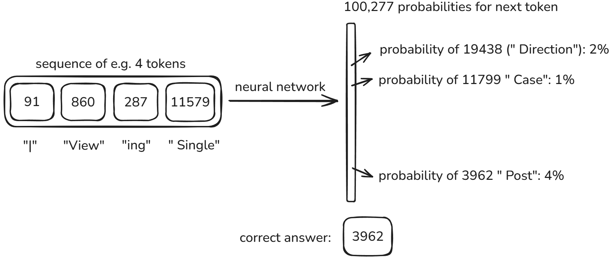
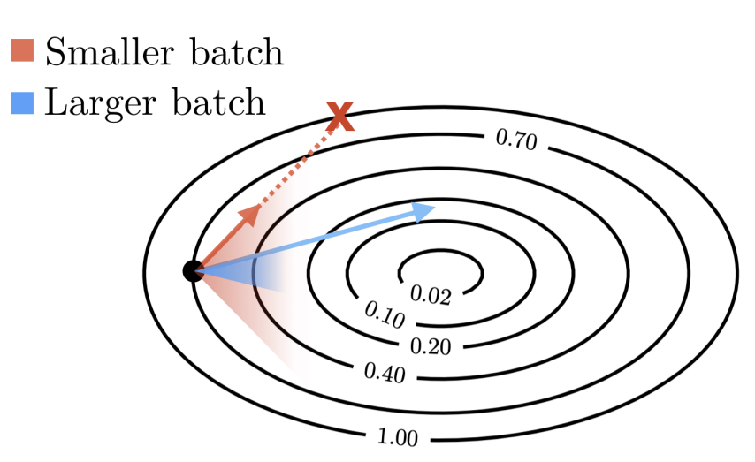
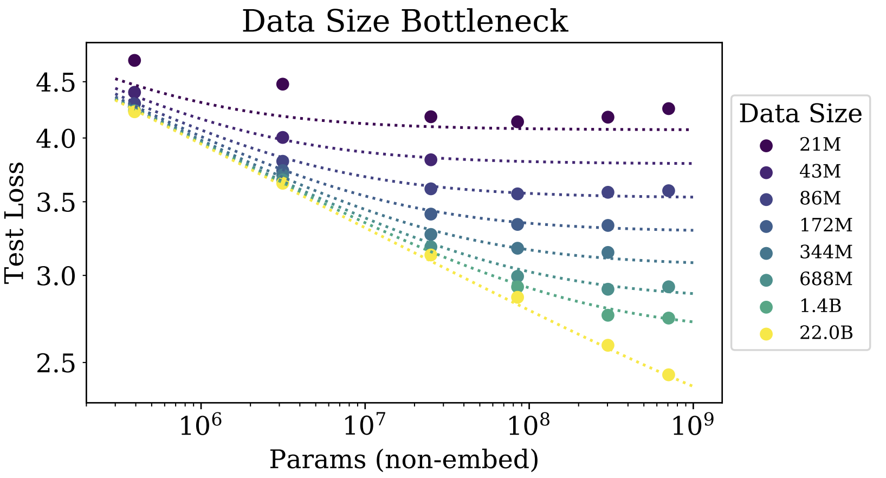
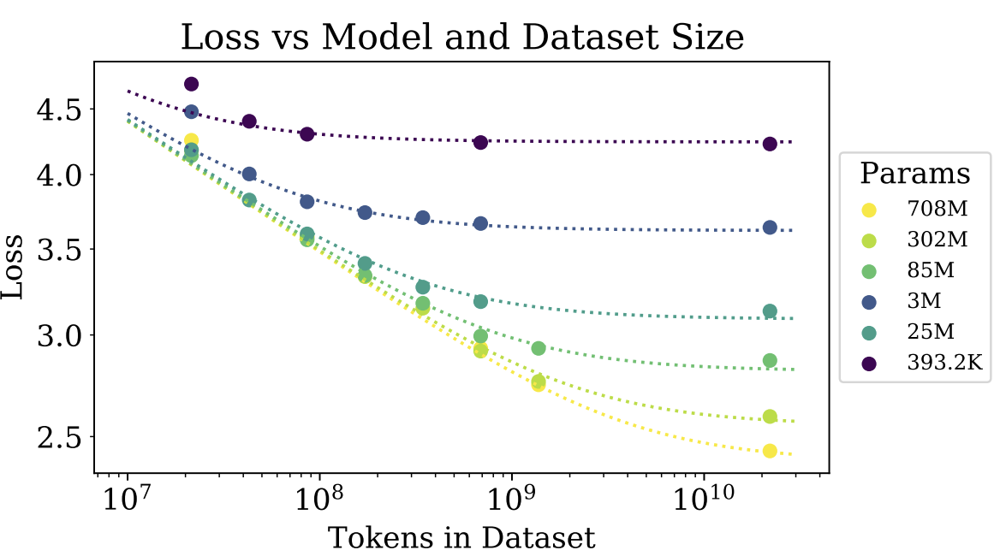
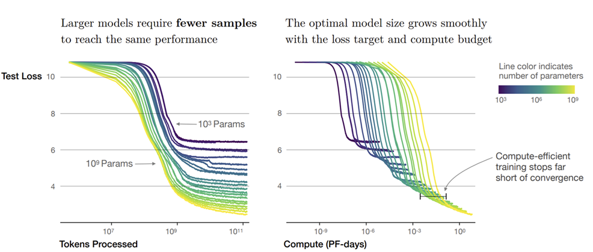
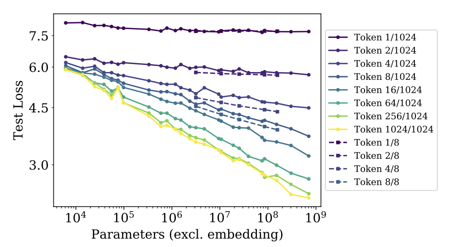
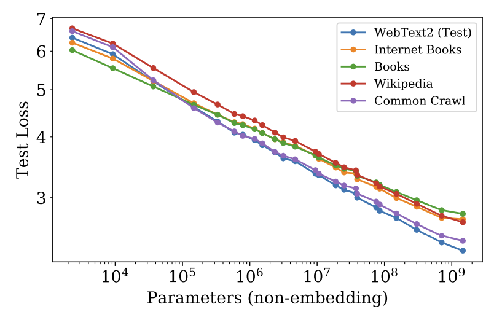

<!--Copyright © ZOMI 适用于[License](https://github.com/Infrasys-AI/AIInfra)版权许可-->

# 02.大模型 Scaling Law

Author by：侯宇博

本节将以 OpenAI 的 [Scaling Laws for Neural Language Models](https://arxiv.org/abs/2001.08361) 这篇论文为主，探讨 Transformer 在大语言模型中损失值 Loss 对模型架构、模型大小、算力资源以及用于训练过程的数据这些因素的依赖关系。结尾将会辅以其他研究成果，介绍影响 LLM 预训练效果的重要因素。

## 1. 什么是 Scaling Law

在预训练阶段，LLM 通常采用自监督学习方式进行训练。自监督意味着不需要对数据进行标注，即可用于训练模型。对于主流的自回归语言模型，预训练的核心任务是根据给定的文本序列，预测下一个可能出现的 token。

例如，下图中模型的输入是四个 tokens："I", "View", "ing" 和 "Single"。模型会输出下一个 token 的概率分布，这个分布展示了所有可能 token 作为下一个 token 的概率。最终，模型会选择概率最高的 token 作为输出。

在这一阶段，模型性能的核心衡量指标是交叉熵损失。交叉熵损失量化了模型预测与真实标签之间的差异，其数值越低，表示模型预测的准确性越高，性能越好。它量化了模型学习真实语言分布的情况，一定程度反映了模型理解和生成语言的能力。

那么，我们如何才能训练出更强的模型？Scaling Law 给出了一个清晰的答案：堆资源。

模型的性能和三个关键因素是直接挂钩的，即：模型规模、数据量、计算量。只要持续增加这三者的投入，模型的性能就会可预测地变好。这让我们能提前计算出，要达到某个性能水平，大概需要多大的模型、多少数据和算力，从而为巨大的训练投入提供了明确的指导和信心。

## 2. 预训练 Scaling Law

OpenAI 的 Kaplan et al.于 2020 年发表的论文[Scaling Laws for Neural Language Models](https://arxiv.org/pdf/2001.08361)是 LLM 缩放定律领域的奠基性工作。该研究通过在 WebText2 数据集上训练 Transformer 模型，首次系统性地揭示了语言模型性能与模型规模、数据集大小和计算量之间的精确幂律关系。

该研究的三大核心发现如下：

### 2.1 数据集大小

上图第二张子图展示了 loss 与数据集大小的关系。如同所示，在不受其他因素限制下，性能随数据集大小 $D$ 的增加而幂律提升。

$$
L(D) \approx \left( \frac{D_c}{D} \right)^{\alpha_D}
$$  

其中， $\alpha_D \approx 0.095, D_c=5.4*10^{13}$ 。

### 2.2 模型参数规模

上图第三张子图展示了 loss 与数据集大小的关系。如同所示，在不受其他因素限制下，语言模型性能随非嵌入参数数量 $N$ 的增加而幂律提升。非嵌入参数是排除了词汇和位置嵌入的模型参数，是真正在训练中用于学习数据分布的参数。

$$
L(N) \approx \left( \frac{N_c}{N} \right)^{\alpha_N}
$$  

其中， $\alpha_N \approx 0.076, N_c=8.8*10^{13}$ 。

### 2.3 训练计算量

上图第一张子图展示了 loss 与数据集大小的关系。如同所示，在不受其他因素限制下，性能随优化分配的训练计算量 $C_{\text{min}}$ 的增加而幂律提升，  

$$
L(C_{\text{min}}) \approx \left( \frac{C_c}{C_{\text{min}}} \right)^{\alpha_C}
$$

其中， $\alpha_C \approx 0.050，C_c=2.3*10^8$ 。

计算量 $C \approx 6NBS$ 。其中 $B$ 表示 batch size， $S$ 表示训练步长。 $L(C_{\text{min}})$ 的图与其他两个图的不同在于，其是由多个曲线的最低点相连得出的。

多个曲线就是不同 batch size 下，模型随训练步长的变化。这里在展示的是要让模型到达指定性能需要最少投入的计算资源。从另一面看， $L(C_{\text{min}})$ 展示了在计算资源固定的前提下，模型性能能收敛到哪里。

在模型规模 $N$ 确定的前提下，$C$ 由 batch size $B$ 和训练步长 $S$ 影响。增大 batch size 能有效降低梯度估计中的随机噪声，使优化路径更为稳定且接近理论最优方向。

下图清楚地展示了一个现象：从黑点朝向中心点（目标）移动时，较大的 batch size 所指示的方向更接近中心点。

研究表明存在一个关键阈值，即最优 batch size，在此阈值之下，批量规模的增长与模型收敛速度呈正相关；而一旦超过此阈值，继续扩大批量带来的性能提升则趋于边际化。

因此，为最大化计算资源利用效率和训练时间价值，应当优先采用接近最优 batch size 的配置。

此外，如下图所示，在充分大 batch size 下，训练步长与模型性能间存在幂律关系，且此规律在不同参数规模的模型架构中均呈现一致性。

前面的结论成立有一个前提，就是不受其他因素限制，这在实际情况下很难成立。

在资源受限时，模型性能的持续提升依赖于模型规模 $N$ 和数据集大小 $D$ 的同步扩展。如果 $N$ 或 $D$ 固定而另一个持续增加，模型性能会在达到一定水平后呈现边际递减效应，提升速度显著减缓。

下图展示了在固定数据集大小后，模型性能随模型规模变化的关系。可以看到，在 $D$ 为 21M 时，模型规模超过 $10^7$ 后，性能就不再有显著提升。而在 $D$ 为 22B 时，模型规模直到 $10^9$ 后，性能依然在持续提升。

类似的，下图展示了在固定模型规模后，模型性能随数据集大小变化的关系。可以看到，在 $N$ 为393.2K时，训练数据超过 $10^8$ 后，性能就不再有显著提升。而在 $N$ 为708M时，训练数据超过 $10^{10}$ 后，性能依然在持续提升。

建议在给定 $C$ 时，模型与数据应符合如下比例： $N_{opt} \propto C^{0.74}, D_{opt} \propto C^{0.27}$ 。

此外，训练曲线（损失随训练步数的变化）遵循可预测的幂律，其参数大致独立于模型大小。这意味着通过外推早期训练曲线，可以大致预测模型在长时间训练后能达到的损失水平 。

另一个重要的发现是，大型模型比小型模型更具样本效率。它们能够以更少的优化步骤和更少的数据点达到相同的性能水平 。这意味着大模型能更有效地从数据中学习，从每个数据点中提取更多的信息。

如下图所示，深蓝色代表小模型，浅黄色代表大模型。可以看出，如果要达到相同的 loss，大模型比小模型需要更少的训练轮次（tokens processed）。

### 2.4 其他因素

Kaplan et al.还讨论了其他可能影响模型性能的因素，包括：学习率、模型结构、上下文长度和数据分布偏移，发现这些因素的影响有限。

#### 学习率

学习率和 batch size 是两个密切相关的超参数。通常，较大的 batch size 需要较大的学习率。
Kaplan et al.发现只要学习率不是太小且衰减不要太快，学习率对性能的影响并不强。

不过后续研究[Predictable Scale: Part I, Step Law – Optimal Hyperparameter Scaling Law in Large Language Model Pre-training](https://arxiv.org/abs/2503.04715)比较了不同的最优学习率和 batch size，并提出了自己的改进方案。

#### 模型结构

当固定模型规模时，模型性能对包括深度、宽度、注意力头和前馈维度在内的模型结构的依赖性非常轻微。

需要注意的是，上述结论源于 dense 架构 Transformer 在下一个 token 预测任务上的表现。在实际应用中，注意力头的配置对模型性能有影响；对于 Mixture of Experts (MOE) 架构，专家数量的选择也会直接影响最终效果。

#### 上下文长度

观察下图，除第一个 token 外，在不同位置的 token 的损失随模型增大而减小。这说明更大的模型在预测各个位置的 token 时都表现更好。第一个 token 的预测不遵循这一规律，可能因为缺乏前置上下文信息。

通过对比 Token 4/8 < Token 4/1024，发现在相同绝对位置上，较短上下文中的 token 损失更小。对比 Token 1024/1024 < Token 8/8，发现在相同相对位置上，较长上下文中的 token 损失更小。

#### 数据分布偏移

模型的训练数据的分布和测试数据的分布很可能是不一样的，这种情况叫数据分布偏移。此时测试数据属于域外数据。

Kaplan et al.发现模型在域外数据上的性能相比于训练集会出现固定幅度的下降，但整体表现仍大致与其在训练集上的性能成正比。如下图所示，模型是在 WebText2 上训练的，在其他数据集上测试时，loss 有一定程度的上移。

然而在真实场景下，源于分布偏移的知识缺失依然会对使用体验造成明显影响。

## 3. Chinchilla 定律

后续论文[Training Compute-Optimal Large Language Models](https://arxiv.org/abs/2203.15556)进一步扩充了模型和数据规模，提出了对最优资源分配策略的修正。其核心发现是，对于给定的计算预算，模型参数和数据集应以大致相等的比例缩放，即 $N_{opt} \propto C^{0.5}, D_{opt} \propto C^{0.5}$ ，而非 Kaplan et al. 建议的侧重模型参数。

如图所示，作者采用了三种不同方法来研究在固定的 FLOPs 预算下，应该如何权衡模型大小和训练标记数，并得出一个关键结论：当时的大型模型普遍存在训练不足的问题。这一发现也解释了为何在 2021 年，许多研究者在尝试复现 GPT-3 时未能取得理想的成果。
为了验证这一结论，作者用更多的训练数据训练了一个参数量更小的模型 Chinchilla (70B)。尽管 Chinchilla 的模型规模远小于 Gopher (280B)、GPT-3 (175B)、Jurassic-1 (178B) 和 Megatron-Turing NLG (530B) 等模型，但实验结果表明，它在众多下游任务中的表现反而更胜一筹。

### 3.1 固定模型大小，改变训练token数量

在第一种方法中，作者改变了一系列模型（参数量从 7000 万到超过 100 亿）的训练步数。

### 3.2 IsoFLOP 配置

### 3.3 拟合参数化损失函数

## 4. Emergence Law 涌现定律

!!!!!!!! 《Predicting Emergent Capabilities by Finetuning》

## 总结与思考

!!!!!!很赞，一段话简单总结本文要概述的内容。如 Chinchilla 定律和涌现定律是目前大模型领域最具影响力的量化理论，分别解决了资源分配和能力预测问题。

## 参考资料

- [Scaling Laws for Neural Language Models -Kaplan et al.](https://arxiv.org/abs/2001.08361)
- [Training Compute-Optimal Large Language Models -Hoffmann et al.](https://arxiv.org/abs/2203.15556)
- [Predictable Scale: Part I, Step Law – Optimal Hyperparameter Scaling Law in Large Language Model Pre-training -Li et al.](https://arxiv.org/abs/2503.04715)
- [Deep Dive into LLMs like ChatGPT -Andrej Karpathy](https://www.youtube.com/watch?v=7xTGNNLPyMI)
- [和张祥雨聊，多模态研究的挣扎史和未来两年的 2 个“GPT-4 时刻” -张小珺 Jùn｜商业访谈录](https://www.xiaoyuzhoufm.com/episode/683d2ceb38dcc57c641a7d0f)
