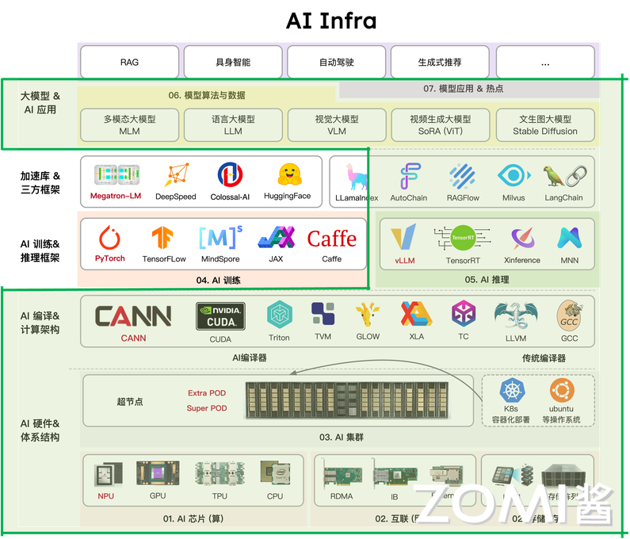
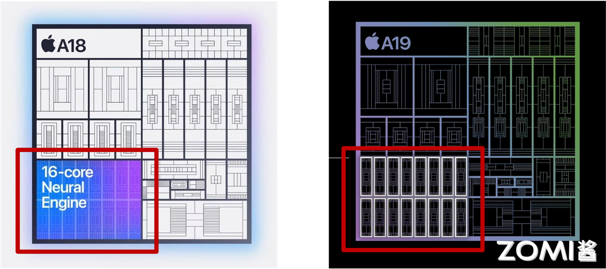
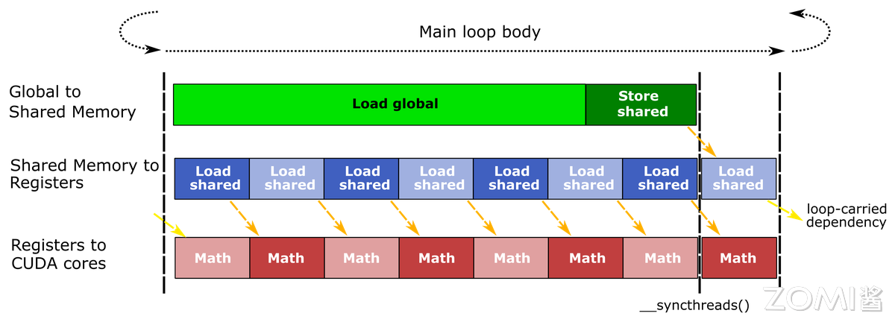
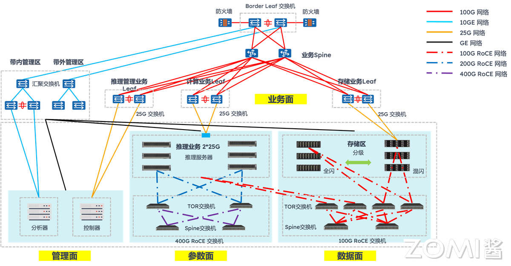
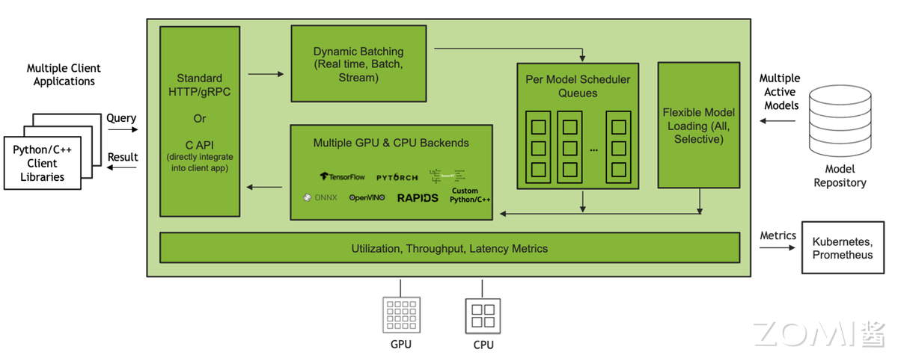
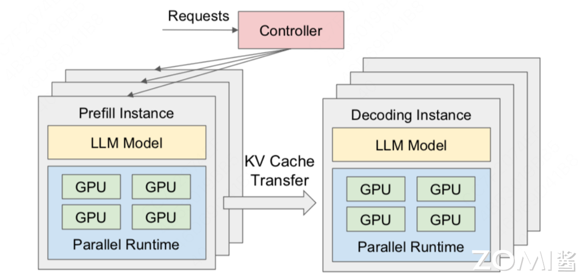

<!--Copyright © ZOMI 适用于[License](https://github.com/Infrasys-AI/AIInfra)版权许可-->

# 05.大模型推理与 AI Infra

当大模型从实验室走向产业应用，能跑通已不再是目标，**如何让模型在成本可控的前提下，以低延迟、高吞吐的姿态稳定对外提供大模型服务**，成为大模型落地成败的关键。这一转变背后，大模型推理的技术正经历深刻重构：**传统推理引擎被新一代大模型推理引擎取代，大模型推理算力向云端大算力+端侧轻算力异构延伸**。

更重要的是，大模型推理早已不是单点优化，从模型压缩到输出采样的全流程，必须与 AI Infra 的算力-软件-存储分层架构深度绑定，才能构建起大模型推理效率的护城河。接下来的内我们将会从大模型推理的全流程进行入手，深入地看看大模型推理与 AI Infra 之间的关系。

## 1. 推理与 AI Infra 关系

### 1.1 推理 AI 走向生产

当大模型走向产业界的生产场景，一个普遍的困境逐渐凸显：许多企业耗费数月、数千万资金训练出的大模型，在实际部署时却屡屡碰壁 —— 要么因推理延迟过高被用户放弃，要么因单日推理成本超百万难以承受，最终沦为只能看、不能用 的技术摆设。这一困境背后，隐藏着一个被忽视的核心事实：训练只是大模型落地的 第一步，而推理才是决定大模型能否真正走进生产的生死门槛。

从产业价值来看，大模型训练的本质是一次性投入，无论是千亿参数模型的训练，还是 PB 级数据的投喂，一旦大模型训练完成，这部分成本便已固定。但推理不同，它是持续性消耗：只要大模型在服务，每一次用户请求、每一个生成 token，都需要占用算力资源，产生实时成本。

在大模型全生命周期（1 年）的成本中，推理占比高达 70%-90%，远超训练的 10%-30%。以 OpenAI 为例，其训练 GPT-3 的成本约 4600 万美元，而上线后每日推理成本就超 300 万美元，15 天即可覆盖训练总成本。

更关键的是，推理直接面对用户体验：电商客服机器人若高峰期延迟超 300ms，用户咨询转化率会下降 20%；手机端本地对话若响应超 1 秒，用户留存率会骤降 50%。在体验与成本的双重压力，让大模型推理成为比训练更难跨越的落地关卡。

### 2.1 推理与训练差异

推理与训练的核心差异，进一步放大了这种门槛。训练的目标是追求精度上限，可以容忍高算力消耗与长耗时：训练一个千亿参数大模型，可用千卡 GPU 集群跑数周，数据处理可离线完成，无需应对动态请求；即便单次训练效率不高，只要最终模型精度达标，后续仍可通过推理复用成果。

但真正的推理的目标是平衡效率、成本与稳定性，面临三大训练无需应对的挑战：

- 动态负载，如教育类模型工作日晚上请求量是白天的 3 倍，电商模型 双 11 峰值是日常的 10 倍，需实时适配峰谷差异；
- 低延迟，训练可接受小时级耗时，而推理需毫秒级（端侧）至百毫秒级（云端）响应，否则无法满足生产场景；
- 资源约束，训练可通过暴力堆算力解决问题，而推理需在有限 GPU/TPU 资源下，最大化吞吐量与显存利用率，同样是千亿参数大模型，微调可用 8 张 H100，而推理需用 1 张 H100 支撑数百并发请求。

在大模型的推理和训练目标与场景的本质不同，决定了推理不能沿用训练的技术逻辑，必须单独构建 AI Infra 层的优化体系。

### 3.1 软硬件全栈协同

大模型推理绝非单纯优化模型或选好硬件的单点问题，而是需软硬件全栈协同的系统工程。脱离软件的硬件是 空壳：即便拥有 NVIDIA H100 GPU，若缺乏 vLLM、SGLang 等推理引擎的算子融合、动态 Batching 优化，算力释放率不足 50%，千亿参数模型推理延迟仍会超 500ms。

大模型推理中脱离硬件的软件，即便推理引擎做了极致优化，若端侧硬件不支持 INT4 量化，7B 模型仍无法实现本地实时推理；脱离存储的协同更是瓶颈重重：即便算力与引擎适配完美，若 KV Cache 存储管理不当，在长序列推理时显存溢出，仍会导致推理中断。

某企业用 H100 部署千亿参数模型，仅优化模型压缩，未适配存储层 PagedAttention 机制，当输入 token 超 2048 时，显存利用率骤降 40%，推理延迟从 200ms 飙升至 800ms；补全存储层优化后，显存利用率提升至 90%，延迟回落至 250ms。

因此，大模型的推理优化必须贯穿硬件（算力层）- 软件（引擎层）- 存储（数据层）全栈，任何一层的缺失，都会让整体性能木桶短板效应凸显。

## 2. 硬件基础

大模型推理的性能释放，本质是硬件特性与推理需求的精准匹配。训练可通过堆算力突破精度瓶颈，而推理需在低延迟、高吞吐、成本可控的三重约束下，最大化硬件资源利用率。

### 2.1. 计算芯片间差异

计算芯片是大模型推理核心动力源，其算力、显存、带宽，直接决定大模型规模、推理速度与成本。当前主流计算芯片差异精准对应云端复杂推理、特定框架高吞吐推理、端侧低功耗推理三大场景。

从**算力**看，核心差异在精度适配与场景针对性：GPU 以通用算力为主，尤其适配 Transformer 架构的复杂计算，如 NVIDIA H100 的 FP8 达 3.3 PFLOPS，INT8 算力达 8.9 TOPS，既能支撑千亿参数模型的 FP8 推理，也能兼容百亿参数模型的 INT8 量化。端测 NPU 以低功耗算力为核心，高通骁龙 8 Gen3 NPU 的 INT4 算力 40 TOPS，功耗仅 50mW，刚好满足手机、物联网设备的大模型轻量推理需求。

**显存**是推理的数据战场，容量与类型决定模型规模上限：GPU 普遍搭载高容量 HBM，H100 配备 80GB HBM3，可容纳 70B 模型的 FP8 权重与 8192 token 的 KV Cache；Google TPU 更重性价比，TPU v5e 仅配 16GB HBM2e，成本为 H100 的 1/5，适合中小模型的推理。

端测 NPU 多采用共享内存设计，如苹果 A18 Pro Neural Engine 共享手机 LPDDR5 内存，通过 INT4 量化将 7B 模型体积压缩至 3.5GB，实现本地实时响应。

当然那，显存并非越大越好，推理场景更需容量与模型规模、序列长度的适配，80GB HBM 跑 7B 模型，会造成 90%显存浪费；16GB HBM 跑千亿模型，则会因显存不足频繁中断。

**带宽**则是连接算力与显存的桥梁，直接影响数据搬运效率：GPU 的 HBM 带宽堪称顶级，H100 的 HBM3 带宽达 3.35 TB/s，能支撑 Transformer 层每秒数千次的 QKV 数据读写；TPU v5e 的 HBM2e 带宽为 1.6 TB/s，虽低于 GPU，但满足中小模型的吞吐需求；NPU 的内存带宽以够用为目标，骁龙 8 Gen3 NPU 的内存带宽达 80 GB/s，配合 INT4 量化减少数据量，可实现 7B 模型亚秒级响应。推理中带宽瓶颈比训练更突出，训练可批量预处理数据，而推理需实时加载 KV Cache 与输入数据，若带宽不足，即便算力再强，也会出现算力空转。

### 2.2. 互连对并行推理影响

当推理的大模型超单卡显存，或请求量破单卡吞吐时，需通过并行推理拆分任务到多卡/多节点，因此互连是决定并行效率关键纽带。不同互连方案的带宽、延迟、扩展性差异，直接影响 MP 与 DP 的性能。

1. NVLink

NVLink 核心优势是高带宽低延迟，专为 8 卡内近距离协同设计：H100 支持 NVLink 4.0，单链路带宽达 112.5 GB/s，8 卡互联总带宽 900 GB/s，延迟仅 10 μs。在大模型推理 TP 中，千亿参数模型需将 Transformer 层拆为 8 段分配到 8 张 H100，层间数据通过 NVLink 传输，若改用普通互连，延迟会升至 100μs 以上，整体推理延迟增加 30%。

在 DP 中，NVLink 可实现多卡显存池化，8 张 H100 的 80GB 显存整合为 640GB，支持 batch size 从 32 提升至 256，吞吐提升 6 倍。但其局限性明显：仅支持 NVIDIA GPU，且最大互联规模为 8 卡，无法满足超大规模集群需求。

2. PCIe

PCIe 是最普及的通用互连，优势是低成本高兼容性，支持 GPU、CPU、NPU 跨厂商适配：PCIe 5.0 单链路带宽 32 GB/s（x16 通道），延迟约 50μs，带宽为 NVLink 的 1/3、延迟为 5 倍，但成本仅为 NVLink 的 1/10。

在中小规模并行场景，PCIe 5.0 完全够用，如 4 张 AMD MI300 通过 PCIe 5.0 做 DP，处理 70B 大模型推理，吞吐达单卡的 3.5 倍（接近理想值 4 倍），延迟仅增加 15%。但并行规模超 8 卡时，PCIe 带宽瓶颈凸显：16 卡 PCIe 集群总带宽仅 512 GB/s，远低于 8 卡 NVLink 的 900 GB/s，推理延迟会飙升至 200μs 以上。

3. InfiniBand/RDMA

InfiniBand/RDMA 是大规模集群互连首选，核心优势是高扩展性低延迟，专为跨节点远距离协同设计：主流 InfiniBand 支持 400G/800G 带宽，延迟约 20μs，通过 RDMA 可绕过 CPU，直接实现节点间 GPU to GPU 内存数据传输。

4. Internet

以太网则凭借 RoCEv2 协议和 800G 硬件升级，成为千卡集群的新兴选择，正在重塑并行推理的成本性能曲线。传统以太网因 TCP/IP 协议栈开销大曾被认为不适合高性能计算，但 400G/800G 以太网结合 RoCEv2 技术后，实现了质的飞跃。

其核心突破在于三点：一是通过 RDMA 零拷贝传输，将端到端延迟降至 2μs 级；二是采用 UEC 1.0 规范的智能拥塞控制 CC 算法，解决了传统以太网的性能抖动问题；三是借助共封装光学（CPO），英伟达 Spectrum-XGS 交换机将每端口功耗从 30W 降至 9W，同时实现 95% 有效吞吐率。

在实际千卡集群部署中，以太网已展现出明确优势：阿里云则通过自研 HPN7.0 架构，用 51.2T 以太网交换机构建万卡级集群，其论文证实以太网方案在多模态推理场景中的性价比是 InfiniBand 的 2.3 倍。

### 2.3. 存储对模型和 Cache 影响

大模型推理的存储需求具有分层特性：实时计算的 KV Cache、频繁访问的模型权重 CKPT、长期存储的输入输出数据，对速度-容量-成本的需求差异极大。

HBM、DRAM、NVMe、对象存储构成的存储层次，正是通过分层适配平衡性能与成本，任何一层缺失都会引发木桶短板效应。

1. HBM

HBM 是存储顶层，定位高速度低容量，服务实时计算数据：HBM 直接集成在计算芯片上，速度达 TB/s 级，容量多为几十 GB，成本每 GB 约 10 美元。推理中，HBM 核心存储高频数据：一是 KV Cache，8192 token 的 KV Cache 需 20-40GB，必须存于 HBM 以保低延迟。

二是模型核心权重，如 70B 模型的 Transformer 层核心权重（约 40GB），需实时加载供计算调用。若 HBM 容量不足，会导致 KV Cache 溢出，offload 到 CPU 的 DRAM，每次计算需从 DRAM 搬运数据，延迟从 200ms 增至 500ms。

2. DRAM

CPU 中的 DRAM 是存储中层，定位中速度中容量，提供扩展存储：DRAM 速度达 GB/s 级（DDR5 带宽 100 GB/s），容量可达百 GB 级，成本约每 GB 0.5 美元。

推理中，DRAM 存储次高频数据：一是模型扩展权重，如 70B 模型的词表权重，无需实时计算但需频繁访问；二是中间计算结果，如 Transformer 层的 FFN 输出，需暂存供后续层使用；三是预处理后的输入数据，如批量文本的 Tokenize 结果。

3. NVMe
NVMe 是存储下层，定位低速度大容量，缓存冷数据与模型：NVMe 速度达 GB/s 级，容量可达 TB 级，成本约每 GB 0.1 美元。推理中，NVMe 核心作用是突破显存限制：

一是存储冷 KV Cache，32K token 推理中，早期 token 的 KV Cache 可迁移到 NVMe，需用时调回 HBM，仅牺牲 10%延迟；二是缓存低频模型，企业部署 10 个模型，可将 7 个低频模型存于 NVMe，调用时加载到 DRAM，加载时间约 10 秒。用 4TB NVMe 配合 H100，支持的最大序列长度从 8K 扩展至 32K，还可缓存 5 个千亿模型，满足多场景切换。

4. 对象存储

对象存储是存储底层，定位极低速度极大容量，用于长期存储：对象存储速度达 MB/s 级，容量可达 PB 级，成本仅每 GB 0.01 美元。推理中，对象存储主要存低频数据：一是模型权重备份，如千亿模型原始权重 CKPT，仅在部署时下载；二是输入输出归档，如用户长文本、推理报告，需长期保存；三是微调数据集，仅在模型更新时加载。其核心价值是控成本。

### 2.4. 网络与网卡

推理中的数据搬运延迟常被忽视：输入数据从存储经网络传至计算芯片，输出数据从计算芯片经网络传至用户，这一过程延迟占比可达 30%（如长文本推理中，数据搬运 150ms，计算 350ms）。

网络与 NIC 技术的优化，尤其是 NIC Offload，是降低搬运延迟、释放 CPU 资源关键。普通 NIC 依赖 CPU 处理协议，占用 10%-20% CPU 算力，而 SmartNIC 通过硬件卸载，可将 CPU 占用降至 5%以下。

传统网络与普通 NIC 的瓶颈，集中在协议开销与预处理延迟：数据传输需经对象存储→NIC→CPU→DRAM→PCIe→计算芯片链路，普通 NIC 需 CPU 处理 TCP/IP、HTTP 协议，每 GB 数据传输占用 1 个 CPU 核心的 100%算力。同时输入数据需 CPU 完成 Resize、Tokenize 后再传至 GPU，进一步增加延迟。

SmartNIC 通过硬件 Offload 突破瓶颈，实现传输-预处理-协议一体化加速：一是协议 Offload，SmartNIC 硬件支持 TCP/IP、RDMA，数据可直接从存储传至 DRAM/计算芯片，CPU 占用从 20%降至 2%——用 Mellanox ConnectX-7 SmartNIC 处理 10TB 数据，仅需 1 个 CPU 核心，节省 90%资源；二是预处理 Offload，部分 SmartNIC 集成专用单元，可直接完成图像 Resize、文本 Tokenize，如 AWS Nitro SmartNIC 将 JPEG 图像 Resize 延迟从 CPU 处理的 20ms 降至 5ms；三是压缩/加密 Offload，SmartNIC 硬件支持 GZIP 压缩、AES 加密，推理输出的万字报告可实时压缩，数据量减少 60%，传输延迟从 100ms 降至 40ms。

在端云协同的大模型推理中，SmartNIC 价值更突出：端侧设备算力有限，需将多模态数据特征上传云端，但原始数据传输量大。此时，端侧 SmartNIC 先提取特征并压缩，将 2MB 图像转化为 20KB 特征向量，数据量减少 99%，传输延迟从 50ms 降至 1ms；云端 SmartNIC 直接接收特征向量，无需 CPU 预处理，转发至 GPU 推理，整体端云协同延迟从 150ms 降至 50ms。

## 3. 运行时与推理引擎

大模型推理的软件层效率，直接决定硬件算力能否转化为实际服务能力。而运行时与推理引擎正是软件层的核心：算子加速库提供底层计算支撑，推理引擎整合全流程能力，编译优化挖掘硬件潜力，模型压缩技术则平衡性能与资源约束。这四层技术环环相扣，共同构成大模型推理的软件效率护城河。

### 3.1. 算子加速库

算子加速库是推理引擎的计算原子，负责实现最基础的矩阵运算、注意力计算等核心操作，其性能直接影响上层引擎的效率上限。当前主流算子加速库可分为通用优化型与场景专用型，分别适配不同推理需求。

cuBLAS 是英伟达官方推出的通用矩阵算子加速库，优势在于稳定性与兼容性，它针对英伟达 GPU 的 Tensor Core 做了深度优化。但 cuBLAS 的局限性也明显：针对大模型特有的注意力计算等操作，需上层框架二次封装，无法直接发挥最优性能。

cutlass 是英伟达开源的可定制算子加速库，定位灵活优化，允许开发者根据模型架构定制内核。与 cuBLAS 的黑盒调用不同，cutlass 支持手动调整线程块大小、数据布局、精度类型。针对端侧 NPU 的 INT4 量化运算，cutlass 可定制低精度数据对齐逻辑，减少数据搬运开销，使推理延迟降低 15%。

Flash Attention 则是注意力计算专用库，专为解决 Transformer 架构的访存瓶颈而生。传统注意力计算需频繁读写全局显存，Flash Attention 通过分块计算+寄存器复用，将数据优先存于 GPU 寄存器与共享内存，大幅减少显存访问。

### 3.2. 推理引擎对比

推理引擎是整合算子加速库、编译优化、调度逻辑的全流程工具，不同推理引擎的设计理念差异，决定了其在兼容性、性能、部署成本上的侧重。

vLLM 是近年来崛起的高吞吐推理引擎，核心创新是 PagedAttention 内存管理，专为生成式模型的长序列推理设计。大模型推理因 KV Cache 连续内存分配导致显存利用率低，vLLM 通过分页管理将显存利用率提升至 90%以上。

SGLang 则是 动态提示与高吞吐兼顾 的推理引擎，核心优势是高效处理结构化 Prompt 与 MCP 调用场景，填补了 vLLM 在动态交互场景的短板。借鉴了 vLLM 的 PagedAttention 机制以保证高吞吐，同时新增 Prompt-as-Code 能力，支持通过代码逻辑定义动态提示（如条件分支、循环生成、工具调用参数注入），无需频繁修改模型输入格式。但其兼容性较弱，暂不支持非英伟达硬件，且对多模态模型的适配仍在完善中，更适合智能助手、代码生成等复杂交互逻辑的生成式场景。

FasterTransformer（FT）是英伟达开源的分布式推理引擎，侧重多卡/多节点并行推理，专为千亿级以上参数模型设计。支持多种并行策略，在多节点集群中，可根据各卡负载调整任务分配，避免算力浪费。但 FT 的部署成本较高，需手动配置并行策略，更适合超大规模模型的专用集群部署，而非中小规模场景。

### 3.3 编译优化

编译优化是推理引擎的性能放大器，通过重构计算图、优化内核执行逻辑，减少数据搬运与计算冗余，将硬件算力利用率从 50%提升至 90%以上。其中，图融合、Kernel 调优、kernel 融合是最核心的三类优化手段，直接针对大模型推理的关键瓶颈。

1. 图融合

图融合的核心是合并冗余计算节点，减少计算图中的数据搬运次数。大模型的计算图包含大量独立算子，传统执行方式中，每个算子的输出需写回显存，再读取到下一个算子，数据搬运延迟占比超 40%。

编译优化通过算子依赖分析，将连续执行的算子合并为单个融合算子，例如将 Transformer 层的 QKV 投影→Attention 计算→LayerNorm→残差连接 4 个算子融合为 1 个，显存读写次数从 8 次减少至 2 次，延迟降低 30%-50%。

2. Kernel 调优

Kernel 调优是适配硬件架构的参数优化，通过调整内核执行的线程布局、内存访问模式，最大化硬件利用率。GPU 的计算能力依赖线程块（block）与线程束（warp）的高效调度，例如 H100 的每个 SM 支持最多 32 个线程块，每个线程块最多 1024 个线程，自动测试不同线程块大小（如 128、256、512）的执行性能，选择最优参数。针对端侧 NPU 的低带宽内存，Kernel 调优还会优化数据对齐方式，减少非对齐访问导致的带宽浪费。

3. kernel 融合

kernel 融合是针对特定场景的深度融合，比通用图融合更聚焦大模型的核心计算链路。例如针对 Transformer 层的多头注意力计算，普通图融合仅合并相邻算子，而 kernel 融合会重构计算逻辑：将多头拆分→每个头 Attention 计算→多头合并三步整合为单个内核，同时利用 GPU 的共享内存缓存多头参数，避免重复读取。

针对多模态模型的文本-图像特征融合，kernel 融合可将文本特征投影→图像特征归一化→交叉注意力融合。值得注意的是，kernel 融合需针对模型架构定制，通用性较弱。

### 3.4. 模型压缩

当推理资源有限时，需通过模型压缩技术降低计算量与存储占用，量化、蒸馏、结构化剪枝是当前最成熟的三类技术，分别从数据精度模型规模权重冗余三个维度实现优化，且需与推理引擎深度协同才能发挥效果。

1. 低比特量化

量化通过降低数据精度减少计算量与显存占用，是最易用的压缩技术。8bit 量化（如 INT8）适合云端场景：在保持 95%以上精度的前提下，可将模型显存占用降低 75%（FP32→INT8），计算量降低 75%。

4bit 量化则适合端侧场景：将模型显存占用再降 50%（INT8→INT4），7B 模型可压缩至 3.5GB，适配手机 8GB 内存——高通骁龙 8 Gen3 NPU 原生支持 INT4，Llama 2 经 4bit 量化后，手机端响应延迟<800ms，功耗降低 60%。

混合精度量化（如 FP8+INT4）则兼顾精度与性能：云端用 FP8 量化核心计算层，用 INT4 量化非核心层（如词表嵌入），在 H100 上实现千亿模型吞吐提升 2.5 倍，精度损失<2%。

2. 蒸馏

蒸馏是将大模型知识迁移到小模型，在降低模型规模的同时保留性能。其核心是通过教师模型指导学生模型训练，使小模型学习大模型的输出分布、注意力权重等关键信息。蒸馏需与推理引擎协同：学生模型的架构需适配引擎的算子优化，否则蒸馏后的性能提升会被引擎适配不足抵消。

3. 结构化剪枝

结构化剪枝通过移除冗余权重结构降低计算量，且不影响硬件加速。与非结构化剪枝不同，结构化剪枝移除完整注意力头整个 Transformer 层或卷积核组，保证剪枝后的模型仍能被 GPU Tensor Core、端侧 NPU 加速。

## 4. 并行与内存管理

大模型推理面临两大核心瓶颈：一是千亿级参数模型无法装入单卡显存，二是高并发请求下算力利用率不足。而并行策略解决算力分配问题，内存管理突破显存容量限制，两者协同构成大模型推理规模化落地的核心技术支撑。

### 4.1. 数据 vs MP

并行策略的核心是拆分任务以适配硬件，DP 与 MP 的选择，取决于推理场景的模型规模与请求并发量。两者并非互斥，实际落地中常结合使用以平衡性能与显存。

DP 的本质是拆分请求 batch，多卡运行相同模型：将用户请求批量分为多份，每张卡加载完整模型并处理部分 batch，最后汇总结果。其优势在于实现简单、通信开销低。

MP 则是拆分模型结构，多卡协同运行，分为 Tensor 并行与 Pipeline 并行两类，专为突破单卡显存限制设计。

**Tensor 并行**聚焦算子级拆分，将 Transformer 层的矩阵运算（如 QKV 投影、Attention 计算）拆分为多卡执行，其优势是通信开销集中在算子内部，延迟低，适合计算密集型的大模型单层推理。

**Pipeline 并行**则聚焦层级拆分，将模型的 Transformer 层按顺序分配到多卡（如 16 张卡各负责 10 层），前卡计算完后将中间结果传给后卡，形成流水线。但需解决 Bubble 延迟（部分卡等待数据空闲），通常需结合 Micro Batch 处理提升利用率，适合层数多的超大规模模型。

### 4.2. KV Cache 管理与分层存储

KV Cache 是大模型推理的显存大户——其大小随输入 token 长度线性增长。若 Cache 管理不当，长序列推理会直接导致显存溢出。高效的 KV Cache 管理与分层存储，是支撑长文本、多轮对话场景的关键。

1. KV Cache

KV Cache 管理的核心是打破连续内存依赖。传统方案为每个请求分配连续显存存储 KV Cache，导致内存碎片多、利用率仅 40% 以下；而 **PagedAttention** 机制借鉴操作系统内存分页思想，将 KV Cache 拆分为固定大小的页面，通过页表记录页面位置，实现非连续存储与动态复用。此外，部分推理引擎还支持 KV Cache 压缩，进一步降低显存压力。

2. 分层存储

分层存储则是用存储容量换显存空间，通过热冷数据分离扩展 KV Cache 存储能力。

**热数据**（最近几百个 token 的 KV Cache）需低延迟访问，保留在 HBM 中以保证计算速度；**冷数据**（早期 token 的 KV Cache）访问频率低，迁移至 DRAM 或 NVMe SSD 存储，需用时再通过高带宽链路（如 PCIe 5.0、NVLink）调回 HBM。

### 4.3. 激活 Offload 与分布式 KV

1. 激活 Offload

除 KV Cache 外，推理过程中产生的 **Activation（激活值，中间计算结果）** 也是显存占用大户，若不做优化，会与 KV Cache、模型权重争夺显存。而 Activation Offload 与分布式 KV 技术，分别从本地显存释放与跨节点存储扩展两个维度解决这一问题。

Activation Offload 的核心是计算后及时迁移：在 Activation 参与完当前层计算后，立即将其从 HBM 迁移至 DRAM 或 NVMe SSD，待后续层需要时再调回。

与 KV Cache 不同，Activation 的访问具有顺序性（仅后续层需使用），无需频繁读写，因此 Offload 开销较低。端侧场景中，高通骁龙 NPU 支持 Activation 压缩+Offload，将 7B 模型的 Activation 压缩后存于手机 RAM。

需注意的是，Activation Offload 需与算子计算同步设计，利用数据传输的间隙触发 Offload，避免增加额外延迟。

2. 分布式 KV

分布式 KV 则是跨节点扩展 KV Cache 存储，专为超大规模集群推理设计。当推理集群规模达千卡以上，单节点的 DRAM/NVMe 仍无法支撑海量请求的 KV Cache 存储，需将 KV Cache 分散存储在多节点的存储资源中，通过 RDMA 或 RoCEv2 协议实现低延迟访问。

### 4.4. MoE 路由与负载均衡

MoE 通过稀疏激活专家层降低计算量，但推理时面临两大挑战：一是**路由策略**需精准选择适配请求的专家，二是**负载均衡**需避免部分专家过载。这两点直接决定 MoE 模型的推理性能与服务稳定性。

1. MoE 路由

MoE 路由的核心是高效匹配请求与专家，主流策略分为 Top-K 路由与自适应路由。**Top-K 路由**选择与请求特征最匹配的 K 个专家，例如 GPT-4 MoE 采用 Top-2 路由，每个请求激活 2 个专家，在保证 98% 精度的前提下，计算量仅为稠密模型的 1/5；Top-1 路由激活 1 个专家，计算量更低（稠密模型的 1/10），但精度损失约 3%，适合端侧轻量 MoE 模型（如手机端 3B MoE）。

**自适应路由**则根据请求类型动态调整 K 值——例如文本生成请求用 Top-2 路由，分类请求用 Top-1 路由，字节跳动 MoE 推理框架采用该策略，使推理效率提升 15%。

2. 负载均衡

负载均衡的关键是避免部分专家过载。由于请求特征分布不均，部分专家可能被频繁选中，导致其处理延迟飙升至其他专家的 3 倍以上。

常用均衡方法包括：一是**负载感知路由**，实时统计各专家的当前负载（如待处理请求数），优先将新请求分配给负载低的专家；二是**专家容量控制**，为每个专家设置最大并发处理量，超出容量的请求暂存队列或分配给备用专家；三是**动态专家扩展**，在高峰时段临时激活备用专家，低谷时段关闭部分专家，平衡性能与成本。

## 5. 服务化与编排

当大模型推理从单卡测试走向规模化服务，仅靠硬件优化与引擎调优已不够，还需通过服务化部署整合资源、智能编排调度请求，才能解决资源浪费、延迟波动、服务不稳定等落地痛点。

### 5.1. 部署方式

部署方式的选择，核心是匹配大模型规模与业务需求，不同方式在资源利用率、部署复杂度、服务弹性上的差异，直接影响推理成本与稳定性。

**单模型单实例**是最基础的部署方式：为单个模型分配独立实例，实例间完全隔离，不会相互干扰。其优势是部署简单、故障影响范围小。但缺点是资源利用率极低，非高峰时段 GPU 利用率可能低于 20%，且无法支撑千亿参数模型，仅适合中小模型（≤13B 参数）的轻量化服务。

**多模型部署**则是共享资源、提升利用率：在同一实例上部署多个模型，通过动态调度分配 GPU 算力与显存。但需解决资源抢占问题——通常通过显存限制与算力调度实现隔离。这种方式适合多场景、中小模型的业务，如同时需要对话、分类、生成的综合大模型服务。

**Sharded Serving**专为千亿级大模型设计：将超大规模模型拆分为多个分片，每个分片部署在独立实例上，推理时通过网络协同计算。其核心价值是突破单实例显存限制。此外，Sharded Serving 还支持跨节点扩展，比如将分片部署在不同机柜的 GPU 上，通过 RoCEv2 以太网低延迟通信，实现万卡级集群的大模型服务。但部署复杂度高，需解决分片间的通信同步，适合通用大模型+高并发场景，如云端的公共 API 服务。

### 5.2. 调度策略

调度策略是平衡资源与体验的关键，通过提前储备资源、动态调整容量、优先保障核心请求，解决推理服务的冷启动延迟、峰谷资源错配、核心请求被挤兑三大痛点。

**Warm Pool（预热池）** 针对冷启动延迟：推理实例启动时需加载模型权重，若流量突增时再新建实例，会导致请求排队延迟超秒级。Warm Pool 的逻辑是提前启动备用实例，在非高峰时仅加载模型不处理请求，流量突增时直接将请求转发给备用实例，冷启动延迟从 10 分钟降至 1 秒内。

**预测伸缩**解决峰谷资源错配：传统伸缩策略存在滞后性，高峰已到但资源未扩，导致延迟飙升；低谷时资源未缩，造成浪费。预测伸缩通过历史流量+业务特征预测未来需求，提前调整实例数量。

**优先级队列**保障核心请求体验：当流量超限时，非核心请求可能挤兑核心请求（如付费用户对话），导致核心服务 SLA 失效。优先级队列的逻辑是按请求重要性分级调度，为核心请求分配高优先级，非核心请求分配低优先级，GPU 资源优先处理 P0 请求，P2 请求排队或降级处理。

### 5.3. 服务化框架对比

服务化框架是整合部署、调度、监控的工具载体，不同框架的设计理念差异，决定了其在云原生适配、性能、易用性上的侧重，选择需结合团队技术栈与业务规模。

**KServe**是云原生优先的框架，基于 Kubernetes 构建，适合大规模、多团队协同的推理服务。其核心优势是标准化与可扩展性——通过 CRD（自定义资源）定义推理服务，支持模型版本管理（灰度发布、回滚）、多模型部署、自动伸缩等云原生能力；同时兼容多种推理引擎（TensorRT、vLLM、ONNX Runtime），可通过 Transformer 组件实现输入预处理（如文本 Tokenize）与输出后处理（如结果格式化），无需额外开发服务。

**Triton Inference Server**是性能优先的框架，英伟达官方优化，适合 GPU 推理的高性能场景。其核心优势是多硬件/多引擎兼容+低延迟调度——支持 GPU、CPU、NPU 等硬件，可调用 TensorRT、vLLM、SGLang 等引擎；内置动态 Batching、模型并行、优先级调度等功能，在 H100 上运行 70B 模型时，吞吐比 KServe 高 30%，P99 延迟低 20%。此外，Triton 的模型仓库功能支持从 S3、GCS 等对象存储加载模型，无需本地存储，适配云端分布式部署。但 Triton 的云原生能力较弱，更适合聚焦性能、以 GPU 为主的推理场景。

**Ray**是分布式计算+推理编排的框架，适合复杂推理场景。其核心优势是灵活的任务编排——可将推理拆分为多个步骤，通过 Ray 的任务调度器分配到不同节点，支持跨节点的 Activation Offload、分布式 KV Cache。但 Ray 的模型管理能力较弱，更适合需要复杂流程编排的推理服务。

### 5.4. 请求路由与 SLA

请求路由决定流量如何分配到实例，SLA 保障则确保服务质量达标——两者结合是大模型推理服务稳定运行的核心，尤其 P99 延迟（99%请求的延迟上限）是衡量服务体验的关键指标，需通过技术手段针对性优化。

**请求路由**的核心是均衡负载+就近访问：一是负载均衡路由，避免部分实例过载，常用策略有轮询、最小连接数；二是地域路由，将用户请求转发至就近的推理节点，减少网络延迟；三是版本路由，支持模型灰度发布，通过路由控制实现风险可控，避免全量发布导致的服务故障。

**SLA 保障**需围绕可用性、延迟、容错构建三层防护：一是可用性保障，通过实例冗余+故障转移实现高可用；二是延迟保障，通过限流+降级防止流量超限导致延迟飙升；三是容错保障，通过重试+超时控制处理临时故障。

## 6. 推理全流程优化快速

大模型推理并非模型计算的单点行为，而是覆盖输入预处理→计算调度→输出反馈的全流程。以下从大模型推理的全流程关键环节切入，拆解实践中的核心优化逻辑。

### 6.1. 数据预处理

预处理负责将原始数据转换为大模型可识别的格式。尽管单 Step 计算量小，但预处理延迟占比可达 30%（如长文本 tokenize 耗时 15ms，计算仅 35ms），多模态场景下需协同处理多类数据，成为易被忽视的瓶颈。

文本预处理的核心是**高效 tokenize**：传统单 tokenize 在高并发场景下延迟显著，工程中需通过批量处理+硬件加速优化。此外，预处理结果缓存可进一步减少重复计算，某电商客服场景中，缓存命中率达 60%，预处理总延迟降低 40%。

图像与音频预处理需**硬件适配与特征复用**：图像预处理（Resize、归一化、通道转换）易因格式差异导致延迟，工程中常通过硬件单元卸载优化，例如苹果 A18 Pro Neural Engine 集成图像 Resize 硬件模块，将 1080P 图像预处理延迟从 20ms 降至 3ms；云端则用 GPU CUDA Core 处理图像缩放，效率比 CPU 高 8 倍。音频预处理（MFCC 特征提取、降噪）的核心是特征复用，例如语音对话场景中，将 10 秒音频的 MFCC 特征缓存，后续 1 秒内的短语音可基于缓存补全特征，预处理延迟从 12ms 降至 3ms。多模态场景下，还需解决预处理同步问题（如文本 tokenize 完成，图像仍在 Resize），工程中通过任务队列优先级调度，确保多类数据同步进入计算环节，避免某类数据等待超时。

### 6.2. PD 分离执行

生成式模型推理存在 Prefill 与 Decode 两个阶段：Prefill 阶段处理全部输入 token，属于**计算密集型**；Decode 阶段逐 token 生成输出，属于**访存密集型**，主要耗时 KV Cache 读写。若将两者混合同步执行，会导致 Prefill 时排队，Decode 时闲置。

Prefill/Decode 分离的核心是**资源隔离与任务并行**：实践中常将两类任务分配至不同 GPU，避免相互抢占资源。例如 20% GPU 实例专门处理 Prefill，80%实例处理 Decode，通过分布式调度器动态分配任务：用户输入长文本时，优先转发至 Prefill，计算完成后将 KV Cache 同步至 Decode，立即启动逐 token 生成，实现 Prefill 结束即 Decode 开始的流水线衔接。

端侧场景则通过轻量化分离适配资源约束：例如手机端推理 7B 模型时，将 Prefill 阶段的 QKV 计算拆解为 CPU 预处理+NPU 计算，CPU 先完成 tokenize 与数据对齐，NPU 专注矩阵运算；Decode 阶段则关闭 NPU 部分计算单元，优先保障 KV Cache 访存速度，满足实时对话需求。

### 6.3. 动态 Batch 与 Token 并行

Dynamic Batching 解决短序列请求的算力复用问题，Token Parallel 突破长序列的显存与调度瓶颈。

Dynamic Batching 的工程关键是**动态平衡吞吐-延迟**：并非 batch size 越大越好，需结合请求队列长度+最大等待时间动态调整。例如电商客服场景非高峰时队列短，将 batch size 设为 8、最大等待 5ms，避免单请求等待过久；高峰时队列长度超 100，将 batch size 提至 32、等待时间设为 10ms，优先提升吞吐，通过动态 Batching 策略配置，GPU 利用率从 40%提升至 70%，同时 P99 延迟控制在 250ms 内。工程中还需避免大 batch 饿死小请求，通过 batch 拆分+优先级插队，确保核心请求可打断大 batch 排队，优先进入计算。

Token Parallel 则针对**长序列推理瓶颈**：传统单卡处理长序列时，KV Cache 与计算张量占用显存超 80%，调度效率骤降。将长序列拆分为多个子序列分配至不同 GPU 并行处理，同时结合 PagedAttention 的页面复用机制，避免子序列间的显存碎片。

实际落地中，采用 Token Parallel 拆分长序列+Dynamic Batching 合并短请求：先将长序列拆分为子序列，再与短请求批量合并计算，同时兼顾长序列处理能力与短请求低延迟需求。

### 6.4. 采样加速与输出流式化

输出阶段的优化直接影响用户体验：采样环节的 beam search、top-k 虽计算量仅占 10%，但迭代式计算导致延迟占比达 20%；而全量输出（如等待 100 个 token 生成完再返回）会让用户感知延迟超秒级，成为体验短板。

采样加速的核心是**硬件算子优化与策略动态调整**：工程中优先用硬件加速采样核心步骤，如将 beam search 的候选 token 排序、累积概率计算封装为专用算子；端侧 NPU（如苹果 Neural Engine）优化 top-k 算子。文本生成场景用 beam search（beam size=4），但通过 early stopping 避免冗余迭代，延迟减少 30%。

输出流式化**降低用户感知延迟**：流式化通过 Server-Sent Events（SSE）协议，将生成的 token 逐段推送给用户。实际解决流式与采样协同，同时控制推送粒度，平衡实时性与网络效率。端侧场景则通过本地流式缓存暂存前 20 个 token，减少片内网络交互延迟。

全流程中预处理的批量加速需匹配后续计算的 batch size，PD 分离需衔接存储层的 KV Cache 管理，流式输出需同步采样策略调整。脱离场景的单点优化，无法真正提升服务体验，只有将每个环节视为整体链条的一部分，才能让推理服务既高效又易用。当然过程中还有很多优化点，我们将会在后面的内容详细展开。

## 7. 小结与思考

大模型推理的竞争，本质是推理全流程与 AI Infra 分层架构协同优化能力。从端侧 NPU 的 INT4 量化到云端 GPU 的 PD 分离，从 Trition 的动态 Batching 到 KV Cache 的分页管理，每一个优化环节都需 AI Infra 深度支撑—，脱离 AI Infra 的单点技术，无法真正解决大模型推理落地的成本与延迟问题。

过去，CUDA 生态构建了 NVIDIA 的壁垒；未来，异构兼容、端云智能协同等推理将成为 AI Infra 的核心方向。对于开发者而言，理解推理全流程的每个环节需要 AI Infra 哪一层支撑，是把握 AI 趋势的关键。大模型的价值最终要通过推理落地实现，而 AI Infra 正是让这一价值的重要引擎。

## 参考文献

- [1] OpenAI. *AI and Compute*. 2018. https://openai.com/research/ai-and-compute
- [2] Narayanan, D., et al. *Efficient Large-Scale Language Model Training on GPU Clusters Using Megatron-LM*. SC 2021. https://arxiv.org/abs/2104.04473
- [3] Google Cloud. *AI Infrastructure for Generative AI*. 2023. https://cloud.google.com/ai-infrastructure
- [4] Pope, R., et al. *Efficiently Scaling Transformer Inference*. arXiv 2022. https://arxiv.org/abs/2211.05102
- [5] NVIDIA. *Training vs. Inference: What’s the Difference?* 2021. https://blogs.nvidia.com/blog/2021/08/25/training-vs-inference-whats-the-difference
- [6] Kwon, W., et al. *vLLM: Easy, Fast, and Cheap LLM Serving with PagedAttention*. SOSP 2023. https://arxiv.org/abs/2309.06180
- [7] SGLang Team. *SGLang: A Fast Serving Framework for Large Language Models*. GitHub 2024. https://github.com/sgl-project/sglang
- [8] NVIDIA. *H100 Tensor Core GPU Architecture Whitepaper*. 2022. https://resources.nvidia.com/en-us-tensor-core
- [9] Qualcomm. *Snapdragon 8 Gen 3: AI Performance Overview*. 2023. https://www.qualcomm.com/snapdragon-8-gen-3
- [10] Google. *TPU v5e: Efficient AI Training and Inference*. 2023. https://cloud.google.com/tpu
- [11] NVIDIA. *NVLink and NVSwitch: Scaling GPU Performance*. 2022. https://www.nvidia.com/en-us/data-center/nvlink
- [12] InfiniBand Trade Association. *InfiniBand Architecture Specification Vol. 1*. 2023. https://www.infinibandta.org
- [13] Alibaba Cloud. *HPN7.0: High-Performance Ethernet for AI Clusters*. 2024. https://www.alibabacloud.com/blog
- [14] Kwon, W., et al. *PagedAttention: Memory-Efficient Serving of LLMs*. SOSP 2023. https://arxiv.org/abs/2309.06180
- [15] Intel. *NVMe SSD for AI Inference Caching*. 2023. https://www.intel.com/content/www/us/en/products/details/ssds
- [16] Microsoft. *ONNX Runtime for Large Model Inference*. 2023. https://onnxruntime.ai
- [17] NVIDIA. *FasterTransformer: Distributed Inference Library*. GitHub 2023. https://github.com/NVIDIA/FasterTransformer
- [18] AnyScale. *Ray Serve: Scalable Model Serving*. 2023. https://docs.ray.io/en/latest/serve/index.html
- [19] Frantar, E., et al. *GPTQ: Accurate Post-Training Quantization for LLMs*. ICLR 2023. https://arxiv.org/abs/2210.17323
- [20] Hinton, G., et al. *Distilling the Knowledge in a Neural Network*. NIPS 2015. https://arxiv.org/abs/1503.02531
- [21] Fedus, W., et al. *Switch Transformer: Scaling to Trillion Parameter Models*. JMLR 2022. https://arxiv.org/abs/2101.03961
- [22] ByteDance. *Adaptive Routing for MoE Inference*. 2024. https://www.bytedance.com/en/tech/blog
- [23] Kubernetes. *KServe: Kubernetes Custom Resource for Model Serving*. 2023. https://kserve.github.io/website
- [24] NVIDIA. *Triton Inference Server: Architecture and Best Practices*. 2023. https://developer.nvidia.com/triton-inference-server
- [25] Google SRE. *Monitoring Distributed Systems: The Four Golden Signals*. 2023. https://sre.google/sre-book/monitoring-distributed-systems
- [26] OWASP. *AI Security and Privacy Guide*. 2024. https://owasp.org/www-project-ai-security
- [27] Apple. *A18 Pro Neural Engine: On-Device AI Performance*. 2024. https://www.apple.com/ios/ios-18
- [28] OpenAI. *Streaming and Sampling Strategies for GPT Models*. 2023. https://platform.openai.com/docs/guides/text-generation
- [C-1] 人工智能数据工程中心.《李飞飞团队年度报告揭底大模型成本：Gemini Ultra是GPT-4的2.5倍》. 2024-04-17. https://aidc.shisu.edu.cn/c2/c1/c13626a180929/page.htm  
- [C-2] 知乎专栏.《大模型的成本和效率》. 2025-03-18. https://zhuanlan.zhihu.com/p/31033488927  
- [C-3] AIbase.《AI成本结构极端分化：训练烧钱与推理低价的商业困局》. 2025-08-23. https://www.aibase.com/zh/news/18660  
- [C-4] 搜狐科技.《打破效率与成本的权衡：数据中心中AI推理的未来》. 2025-02-13. https://www.sohu.com/a/858654161_121902920  
- [C-5] CSDN博客.《AI大模型训练成本到底有多大？》. 2024-06-06. https://blog.csdn.net/giszz/article/details/139506830  
- [C-6] AI工具箱.《AI成本结构极端分化：训练烧钱与推理低价的商业困局》. 2025-06-06. https://ai-kit.cn/14668.html

## 视频

> 这个内容还没有，非常希望您参与到这个开源项目中，B 站给 ZOMI 留言哦！