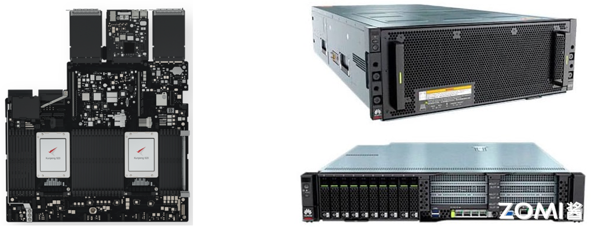
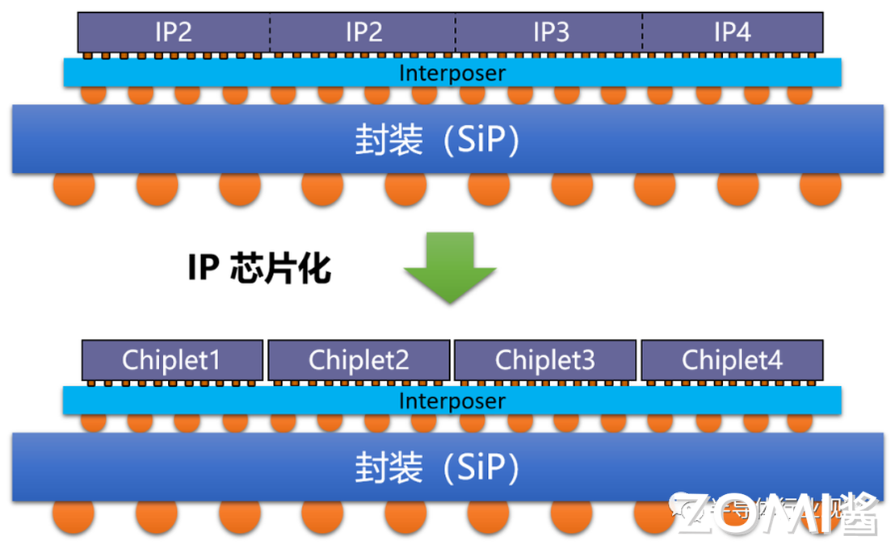
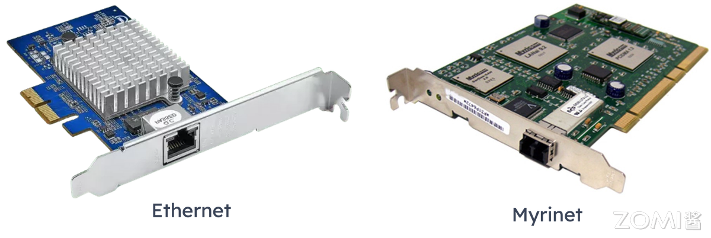
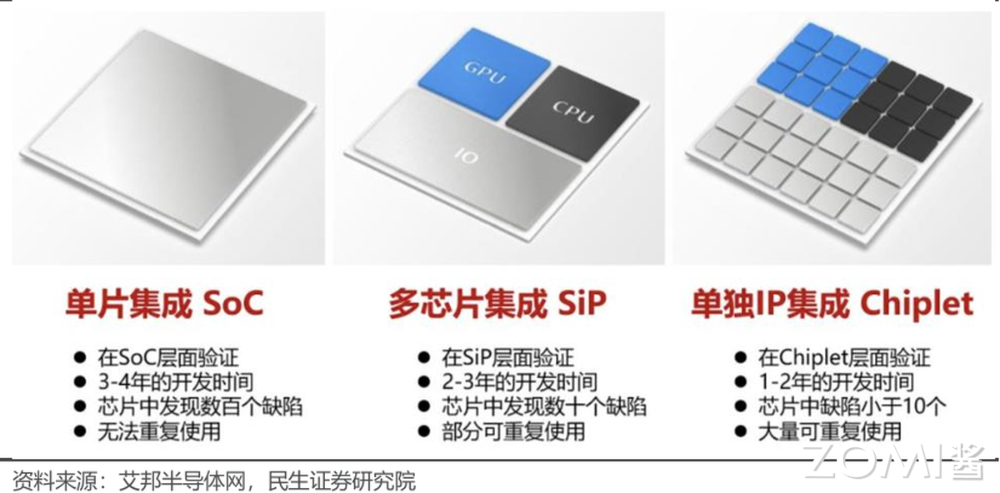

<!--Copyright © ZOMI 适用于[License](https://github.com/Infrasys-AI/AIInfra)版权许可-->

# HPC 硬件发展趋势(DONE)

!!!!!!!!!!!!!!!
很赞，我简单修改了下文字，把字数减少了，你通读下，看看有没有技术的逻辑错误。有些图片我删掉了，因为不是高清的。如果没有问题就可以删掉这行字了。

Author by: 陈悦孜

上一篇文章中，我们介绍了高性能计算（HPC）和集群的定义，本章将聚焦 HPC 的发展趋势，从核心硬件、基础软件和应用软件三个维度展开分析。其中硬件维度是 HPC 能力的核心支撑，我们将从高性能网络、处理器、服务器、存储器四个方向，梳理其发展历程与未来趋势 —— 整体演进始终围绕 “性能突破、能效优化、场景适配” 三大核心逻辑：

- 高性能处理器：从通用多核架构转向异构计算
- 高性能网络：从降低延迟向提升带宽互联演进
- 高性能存储器：从单纯容量扩展走向存算协同
- 高性能服务器：从追求单机性能转向绿色化集群

## 高性能处理器

### CPU 主导时代

早期 HPC 依赖并行 CPU 集群（如 Intel Xeon、AMD Opteron 系列），通过 “提升主频、增加核心数、优化指令集” 三路径实现性能增长，这一阶段的处理器设计是多维度系统工程。

在主频提升上，厂商通过半导体制程迭代（如从 22nm 到更先进制程）和微架构改进（如 Intel P-Core、AMD Zen 系列）突破单核效率极限，但物理定律决定高频率会导致功耗与发热指数级增长，单纯提频逐渐不可持续。

核心数量则成为提升整体吞吐量的关键：从早期双核、四核，发展到如今众核设计（如 AMD EPYC 9004 系列达 96 核、Intel Xeon Platinum 8592 + 含 64 核）。这一演进依赖先进封装技术，核心数激增让服务器能并行处理海量任务，适配云计算虚拟化、大数据分析等现代工作负载。

指令集优化方面，SIMD（单指令多数据流）扩展与专用指令集显著提升单位计算效率。例如 Intel AVX-512 指令集可让单条指令同时处理 16 个 32 位浮点数，在科学计算与 AI 推理中性能翻倍；AMD 支持的 AES-NI 指令集则通过硬件加速加密解密，提升网络安全协议处理效率。

三者协同形成现代服务器处理器设计哲学：从追求单核极致速度，转向 “给定功耗与成本下，通过架构创新实现系统计算吞吐量最大化”。

#### 主频提升达瓶颈

2000 年代初，Intel Prescott 核心尝试用 90nm 工艺提升主频，但高主频必然伴随功耗与发热增长（功耗突破 100W），出现 “高频低效” 问题，最终转向多核架构。如今工艺微缩接近物理极限，单核主频停滞在 3-4GHz，性能增长转而依赖多核并行与指令级并行（ILP）优化。

**早期代表性 HPC CPU 参数对比**

| 系列          | 代表型号               | 发布时间 | 核心数 | 主频     | 关键技术特点                    |
| ----------- | ------------------ | ---- | --- | ------ | ------------------------- |
| AMD Opteron | Opteron 6180 SE    | 2010 | 12  | 2.5GHz | 集成内存控制器，HyperTransport 总线 |
| AMD Opteron | Opteron 6166 HE    | 2010 | 12  | 1.8GHz | 低功耗设计（65W）                |
| Intel Xeon  | Xeon E5-2600 v4    | 2016 | 22  | 2.2GHz | 超线程，AVX2 指令集              |
| Intel Xeon  | Xeon Platinum 8380 | 2021 | 40  | 2.3GHz | 支持 PCIe 4.0，8 通道 DDR4     |

#### 协处理器兴起

协处理器是辅助主 CPU 的专用处理单元，可分担特定计算任务、提升运算效率。这一阶段主要有两类方向：

1.  **Intel Xeon Phi（MIC 架构）**：2012-2020 年尝试众核路线，初期型号参数如下：

| 型号        | 核心数 | 浮点性能        | 内存容量  | 内存带宽     | TDP  | 售价        |
| --------- | --- | ----------- | ----- | -------- | ---- | --------- |
| Phi 3100  | 57  | 1 TFlops    | 6 GB  | 240 GB/s | 300W | <=\$2,000 |
| Phi 5110P | 60  | 1.01 TFlops | 8 GB  | 320 GB/s | 225W | \$2,649   |
| Phi 7120  | 61  | 1.2 TFlops  | 16 GB | 352 GB/s | 300W | \$4,129   |

1.  **GPU 加速**：NV CUDA 技术革命性地将 GPU 用于通用计算，Tesla 系列成为标杆。首代 Tesla 架构（如 G80）引入统一着色器设计，将矢量计算单元拆分为标量核心（CUDA Core），支持 C 语言编程与 SIMT（单指令多线程）执行模型，使 GPU 从图形协处理器升级为通用计算引擎，奠定 “CPU+GPU” 异构标准。

#### 国产 CPU 突破

中国自主研发的申威 SW26010 处理器，凭借异构众核架构（256 个高性能计算核心 + 1 个管理核心），实现单芯片 3 TFlops（每秒 3 万亿次）峰值浮点计算能力，成为 “神威・太湖之光” 超算的核心动力。

该处理器采用完全自主的申威指令集架构（SW ISA），摆脱对国外指令集的依赖。搭载 4 万余颗 SW26010 的 “神威・太湖之光”，于 2016 年 6 月登顶 TOP500 榜单，终结美国超算 23 年榜首垄断，其 Linpack 实测性能达 93 PFlops（每秒 9.3 亿亿次），是全球首台突破 100 PFlops 的超算，标志人类迈入 E 级（百亿亿次）计算时代。

#### ARM 崛起

ARM 架构以 RISC（精简指令集）设计为核心，具备低功耗、高能效比优势，采用 IP 授权模式（苹果、华为、NVIDIA 等可定制优化），打破 x86 在服务器市场的长期垄断，其多核特性适配大规模集群横向拓展需求。

代表性服务器级 ARM 处理器包括：

- **NVIDIA Grace CPU**：基于 ARMv9 指令集，采用 LPDDR5X 内存子系统（能效提升 2 倍），通过 CPU-GPU 协同一致性缓存与 NVLink-C2C 直连，将延迟降至 1/10。

- **鲲鹏 920（Kunpeng 920）**：华为自主设计，基于 ARMv8.2 指令集，7nm 工艺，最高 64 核，通过优化分支预测、提升运算单元数量、改进内存子系统提升性能。

**传统 ARM（移动端）与 HPC 优化版（服务器级）架构对比**

| 特性   | 传统 ARM（移动端） | HPC 优化版（服务器级）                |
| ---- | ----------- | ---------------------------- |
| 指令集  | 精简指令集（RISC） | 拓展 SIMD（SVE/SVE2）            |
| 核心规模 | 多核低频（能效优先）  | 512 核以上众核架构（如 Fujitsu A64FX） |
| 内存系统 | 低带宽 LPDDR   | HBM2e（>1TB/s 带宽）             |
| 功耗管理 | 动态调频（DVFS）  | 精细功耗门控（Per-core PowerGating） |

### 处理器发展趋势

#### GPU/NPU 加速市场

NVIDIA H100/H200、AMD MI300X 成为 AI/HPC 核心算力，国产替代（寒武纪、华为昇腾）加速推进：国外 NVIDIA 凭 CUDA 生态与 NVLink 技术垄断 AI 训练市场；AMD MI300X 以异构设计与 HBM3 优势成为重要挑战者。国内华为昇腾依托达芬奇架构与昇思（MindSpore）框架，在国内智算中心快速落地；寒武纪聚焦特定领域迭代。但国产芯片仍面临 “先进封装卡脖子” 与 “软件生态成熟度不足” 两大挑战，当前形成 “国际巨头引领创新、国产在特定赛道替代” 的双轨格局。

#### Chiplet 与存算一体

1.  **Chiplet 技术**

    随着 AI 需求增长，算力芯片需更大面积、存储容量与互连速度。Chiplet（小芯粒）技术将大芯片拆分为多个功能单一、工艺优化的小裸片（如 CPU 核心、GPU 核心、缓存），各裸片用适配工艺独立制造，再通过先进封装（硅中介层、EMIB、CoWoS）集成，像 “搭乐高” 一样形成系统级芯片（SoC）。

    该技术可提升良率、降低成本、灵活复用成熟模块，AMD、Intel 均通过多芯片封装提升集成度。

1.  **存算一体技术**

    传统冯・诺依曼架构中 “计算与存储分离” 导致 “存储墙”“功耗墙”（访存带宽低、时延长、功耗高）。存算一体通过 “存储与计算融合”，结合先进封装与新型存储器件，实现计算能效数量级提升。按 “存储与计算距离”，广义存算一体分三类：

    - 近存计算：通过封装 / 板卡集成存储与计算单元，减少数据搬运（仍为存算分离，技术成熟度高）；
    - 存内处理：存算集成于同一晶粒，存储器具备基础计算能力（如 DRAM Die 内置处理单元，适配语音识别、基因匹配）；
    - 存内计算（狭义存算一体）：不区分存储 / 计算单元，利用存储介质物理特性设计电路，直接消除 “存算界限”，能效提升显著。

    另外，台积电尝试 3D Fabric 技术通过 “计算单元堆叠至存储层”，进一步突破冯・诺依曼瓶颈。

## 高性能网络

### 网络技术早期阶段 (1990s-2000s)

此阶段形成 “以太网主导 + 专有网络补充” 的格局：

- **以太网**：千兆以太网（IEEE 802.3ab/z 标准，1Gbps 速率）因成本低被广泛采用，但延迟高（>100μs）、带宽瓶颈明显，主要用于企业局域网、家庭宽带等场景。
- **专有网络**：Myrinet、Quadrics 等私有协议网络延迟约 10μs、吞吐量高，但生态封闭（依赖专属硬件与软件栈）、成本高、兼容性差，2009 年前后被 InfiniBand 与以太网 RDMA 取代。

### 网络主流技术成型（2010s 至今）

当前主流技术包括 InfiniBand、RoCE、NVLink，分别适配不同场景需求：

- **InfiniBand**：由 Mellanox 主导，通过 RDMA 技术绕开操作系统协议栈，实现 < 1μs 延迟与 400Gbps（约 50GB/s）带宽，生态开放、兼容多厂商设备，是超算与云数据中心主流互连方案。
- **RoCE**：基于以太网的 RDMA 技术，复用现有以太网设施降低成本，延迟约 10-20μs、带宽达 400Gbps，华为、阿里云等国产厂商积极布局 RoCEv2，成为突破 InfiniBand 垄断的关键路径。
- **NVLink**：NVIDIA 专为 GPU 互联设计的高速总线，替代传统 PCIe，第四代带宽达 900GB/s、延迟纳秒级，用于节点内多 GPU 数据交换，后续演进为 NV Fusion。

### 高性能网络发展趋势

AI 与超大规模数据中心推动网络向 “更低延迟、更高带宽、更智能” 演进，核心趋势包括：

1.  **InfiniBand 持续领跑超低延迟**：NVIDIA Quantum-2 支持 400Gb/s 单端口带宽，NDR 1.6Tb/s 速率将满足千卡级 AI 集群需求；
2.  **RoCE v2 + 智能网卡（DPU/IPU）重塑以太网**：DPU/IPU 卸载 CPU 的网络、存储、安全功能，结合 RoCE v2 实现类 InfiniBand 性能；
3.  **光互连突破铜缆限制**：硅光集成（低成本光器件）、共封装光学（光引擎与芯片同封装降功耗）、光学链路开关（光层动态配置路径）成为下一代网络核心；
4.  **专用协议适配异构计算**：如华为灵渠总线，专为 CPU-NPU、NPU-NPU 通信设计，优化大规模 AI 集群数据交换效率。

## 高性能存储

### 硬盘时代：SSD 取代 HDD

- **HDD（机械硬盘）**：依赖旋转磁盘与机械臂读写，速度慢（延迟 ms 级）、易出机械故障，但容量大、每 GB 成本低，希捷、西数等厂商产品难满足 HPC 需求；
- **SSD（固态硬盘）**：基于闪存芯片，无活动部件，读取速度、耐用性、能效均优于 HDD，如三星 PM1733（30TB）顺序读写达 7GB/s、延迟降至 50μs，逐步取代 HDD。

### 分布式存储与文件系统

#### 分布式文件系统

分布式文件系统（DFS）将网络中分散存储资源整合为逻辑树形结构，方便用户访问，Lustre、Ceph 等支撑 EB 级吞吐（如 Lustre 带宽突破 1TB/s）。

#### AI 驱动存储优化

LLM（大语言模型）参数量达 100B 级，传统存储因数据复制耗时导致 GPU 利用率低，全闪文件系统成为解决方案：

- 全闪文件系统专为 SSD 优化，通过 NVMe-OF+RDMA 实现高性能存储集群，NVMe-OF 时延比肩直连存储；
- 商业方案为主（weka.io、VAST，阿里云 CPFS、百度云 PFS），开源方案较少（如 Intel DAOS）。

### 新存储技术革命

#### SCM 存储级内存

SCM（如 Intel Optane 傲腾）填补 DRAM 与 SSD 的性能鸿沟，兼具内存速度与硬盘持久性。傲腾采用 3DXpoint 相变存储技术，降低读取延迟、实现断电保护，但成本高未能大规模普及（如 2017 年发布的 P4800X 固态硬盘）。

#### HBM 高带宽内存

HBM 通过硅通孔垂直堆叠 DRAM，与 GPU/NPU 封装集成，实现大容量、高位宽存储：

- 发展历程：2013 年 SK 海力士研发 HBM1，2016 年 HBM2 量产，2022 年 HBM3 规范发布（每引脚速率 6.4Gb/s，单设备带宽 819GB/s）；
- AI 场景价值：支撑大模型权重与中间数据高速交换，如 NVIDIA A100 的 40GB HBM2e 显存（带宽 1.5TB/s）可高效训练百亿参数模型。

### 高性能存储发展趋势

1.  **SCM+CPFS 3.0 实现资源池化**：CXL 3.0 协议推动 CPU/GPU 共享 SCM 资源，打破内存墙；
2.  **HBM 持续迭代成 AI 标配**：2025 年 HBM3e 带宽突破 1TB/s，HBM4 将优化 3D 堆叠；
3.  **存算一体架构重构**：计算单元嵌入存储层（如三星 HBM-PIM），减少数据搬运；
4.  **新型存算器件应用**：忆阻器、相变存储器（PCM）等支持内存计算，边缘 AI 场景能效提升 100 倍。

## 高性能服务器

### 服务器性能导向阶段（2000s）

#### 刀片服务器普及

刀片服务器是模块化 “精简版” 服务器，由刀片机箱（共享电源、冷却、网络）与刀片设备组成，核心优势是高密度：

- 2000 年：RLX System 324 在 42U 机柜集成 324 个 CPU，但采用低性能处理器；
- 2003 年：IBM BladeCenter 平衡 “计算密度与单刀片性能”；
- 2006 年：IBM BladeCenter H 提升 10 倍带宽，HP BladeSystem c-class 引入虚拟连接、能量智控技术。

#### 风冷散热瓶颈

刀片服务器机柜功率达 20kW 以上，传统风冷（适用于 <15kW 机柜，PUE>1.5）无法满足需求。且服务器需 7X24 运行，高负载下处理器发热量大，散热成为影响稳定性与能耗的关键问题。

（注：PUE = 数据中心总耗电量 / IT 设备耗电量，理想值 1.0，超算 / AI 数据中心液冷可降至 1.1 以下）

### 服务器绿色化阶段（2010s \~ 至今）

#### 散热技术突破

1.  **冷板液冷**：非接触式散热，通过液冷板将热量传递给循环液体，对服务器改动小，曙光数创 C8000 系列 PUE 低至 1.04；
2.  **浸没式液冷**：器件直接浸没在绝缘冷却液中，散热效率高、无噪音，分单相与相变两类。阿里云 “麒麟” 采用该技术，PUE 约 1.09，节省 75% 空间，冷却液无腐蚀且可循环。

#### 模块化设计

超算系统通过标准化机柜单元集成计算、存储、网络，实现快速部署与扩展。以 Frontier 超算为例：

- 74 个标准机柜，每个机柜含 64 个刀片服务器（2 个计算节点 / 刀片）；
- 采用 HPE Cray Slingshot-11 高速网络，部署于美国橡树岭国家实验室，体现异构计算与高密度集成水平。

### 高性能服务器未来趋势

#### 液冷普及

全球能效要求趋严（欧盟 2030 年 PUE≤1.3，中国 “东数西算” 枢纽节点 PUE≤1.3），液冷散热效率比风冷高 1000 倍，成为达标必选方案：Intel/AMD 商用服务器采用冷板液冷，阿里云 “麒麟”、谷歌 AI 数据中心用浸没式液冷。

#### 整机柜设计

通过系统级整合提升算力密度与能效：

- 曙光硅立方：单机柜集成计算 / 冷却 / 供电，浸没相变液冷，PUE=1.04，功率密度 160kW（较风冷提升 4-5 倍）；
- 华为昇腾 384 超节点：12 个计算柜 + 4 个总线柜，384 颗昇腾 NPU+192 颗鲲鹏 CPU 通过 MatrixLink 互联，算力 300Pflops，单卡推理吞吐量 2300 Tokens/s。

## 总结与思考

本文从处理器、网络、存储、服务器四大核心硬件维度，梳理了 HPC 的发展历程与趋势：处理器从 CPU 主导转向异构计算（GPU/ARM/ 国产芯片崛起），网络从以太网与专有网络进化到 InfiniBand/RoCE/ 光互连，存储经历 HDD 到 SSD 的迭代并向 SCM/HBM/ 存算一体突破，服务器则从性能导向转向绿色化（液冷）与模块化。整体来看，HPC 硬件始终围绕 “性能提升、能效优化、场景适配” 演进，未来将进一步通过技术融合（如 Chiplet、存算一体）与国产化替代，支撑 AI、超算等领域的算力需求。

## 本节视频

<html>
<iframe src="https://player.bilibili.com/player.html?isOutside=true&aid=114767700172746&bvid=BV16A3wzEELU&cid=30765482532&p=1&as_wide=1&high_quality=1&danmaku=0&t=30&autoplay=0" width="100%" height="500" scrolling="no" border="0" frameborder="no" framespacing="0" allowfullscreen="true"> </iframe>
</html>

## 引用与参考

- [https://www.witintech.com/upfiles/202312051029031006456460.pdf](https://www.witintech.com/upfiles/202312051029031006456460.pdf)
- [https://pdf.dfcfw.com/pdf/H3\_AP202307091592122354\_1.pdf](https://pdf.dfcfw.com/pdf/H3_AP202307091592122354_1.pdf)
- [https://www.dell.com/support/contents/zh-cn/article/product-support/self-support-knowledgebase/data-storage-backup-and-recovery/support-for-hard-disk-drive](https://www.dell.com/support/contents/zh-cn/article/product-support/self-support-knowledgebase/data-storage-backup-and-recovery/support-for-hard-disk-drive)
- [https://aws.amazon.com/cn/compare/the-difference-between-ssd-hard-drive/](https://aws.amazon.com/cn/compare/the-difference-between-ssd-hard-drive/)
- [https://post.smzdm.com/p/a90el8pp/](https://post.smzdm.com/p/a90el8pp/)
- [https://zhuanlan.zhihu.com/p/232694318](https://zhuanlan.zhihu.com/p/232694318)
- [https://zhuanlan.zhihu.com/p/597784274](https://zhuanlan.zhihu.com/p/597784274)
- [https://server.51cto.com/article/143125.html](https://server.51cto.com/article/143125.html)
- [https://dataenergy.sugon.com/c48283.jsp](https://dataenergy.sugon.com/c48283.jsp)
- [https://dataenergy.sugon.com/c81871.jsp](https://dataenergy.sugon.com/c81871.jsp)
- [https://mp.weixin.qq.com/s/ZVklrCPV7oNHvfcJpnPdJA](https://mp.weixin.qq.com/s/ZVklrCPV7oNHvfcJpnPdJA)
- [https://developer.aliyun.com/article/74471](https://developer.aliyun.com/article/74471)
- [https://www.eet-china.com/mp/a135747.html](https://www.eet-china.com/mp/a135747.html)
- [https://zh.wikipedia.org/wiki/%E5%89%8D%E6%B2%BF\_(%E8%B6%85%E7%B4%9A%E9%9B%BB%E8%85%A6)](https://zh.wikipedia.org/wiki/%E5%89%8D%E6%B2%BF_\(%E8%B6%85%E7%B4%9A%E9%9B%BB%E8%85%A6\))
- [https://www.baogaobox.com/insights/250602000011116.html](https://www.baogaobox.com/insights/250602000011116.html)
- [https://server.zol.com.cn/731/7319835.html](https://server.zol.com.cn/731/7319835.html)
- [https://baike.baidu.com/item/%E7%A1%85%E7%AB%8B%E6%96%B9/24229490?anchor=1\&fragment=1#1](https://baike.baidu.com/item/%E7%A1%85%E7%AB%8B%E6%96%B9/24229490?anchor=1\&fragment=1#1)
- [https://www.sohu.com/a/915158063\_115479?scm=10001.325\_13-325\_13.0.0.5\_32](https://www.sohu.com/a/915158063_115479?scm=10001.325_13-325_13.0.0.5_32)
- [https://www.jiuyangongshe.com/a/2g6hckcy8nz](https://www.jiuyangongshe.com/a/2g6hckcy8nz)
