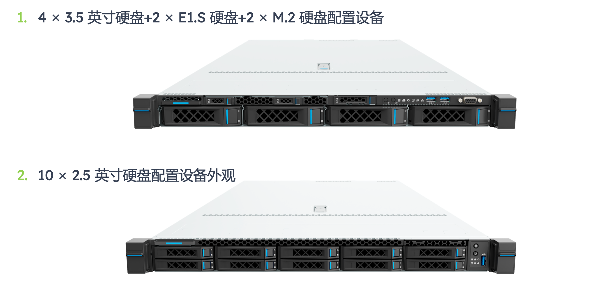
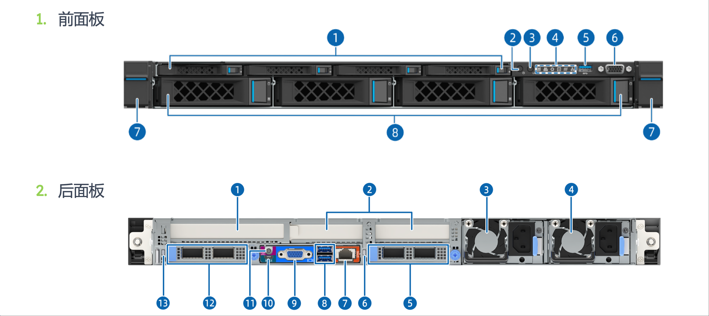
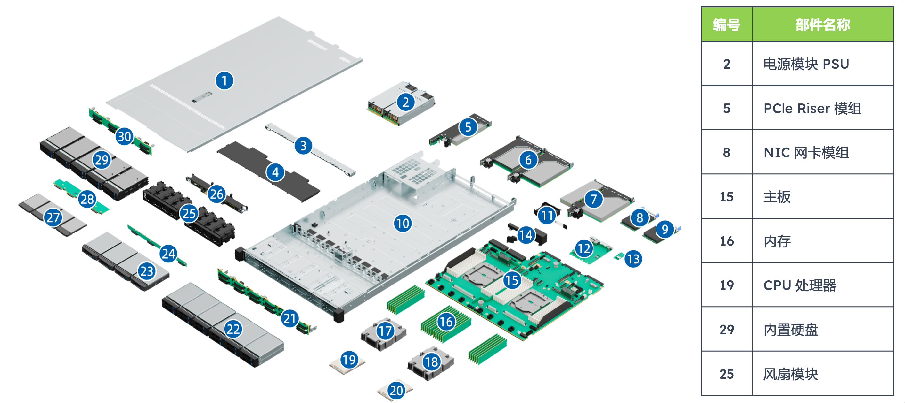

<!--Copyright © ZOMI 适用于[License](https://github.com/Infrasys-AI/AIInfra)版权许可-->

# 服务器节点初探

> Author by: ZOMI

随着深度学习对算力需求的不断增长，服务器作为核心算力载体的技术细节愈发重要。本文从服务器节点的基础认知出发，按照原文档的结构逻辑，系统梳理通用服务器、AI 服务器（包括 GPU 与 NPU 类型）以及 AI 集群的关键技术，深入探讨其硬件架构、功能特性与部署方式。

## 初识服务器节点

本节将介绍文档提出的核心问题及其背后的技术框架，帮助读者初步建立对 AI 算力载体的认识。

## 通用服务器

下面以"通用服务器：单节点形态"为核心，从形态、结构、功能三个维度展开，重点解析了"1U 2 路机架式服务器"这一主流型号，突显其"综合能力均衡"的特性。本节将详细介绍通用服务器的外观设计、内部结构及其适用场景。

### 单节点形态

通用服务器的"单节点形态"围绕实用性与扩展性设计，文档明确列出了其核心参数与外观特征：

- **尺寸与 CPU 配置**："1U 2 路"是其主要标识——"1U"指服务器高度（1U = 4.445 cm），适配标准机柜，节省空间；"2 路"表示节点内搭载 2 颗 CPU（如 AMD EPYC 9004 系列），满足多任务并发处理需求，避免单 CPU 算力瓶颈

- **存储配置方案**：文档提供了两种主流方案，分别对应不同的业务场景：
  1. **混合存储方案**：4×3.5 英寸硬盘（大容量、低成本，适合冷数据存储）+ 2×E1.S 硬盘（高密度、中速，适合热数据存储）+ 2×M.2 硬盘（高速、小容量，用于安装操作系统与核心应用），兼顾容量、速度与成本，适用于企业级通用场景
  2. **高容量存储方案**：10×2.5 英寸硬盘，通过增加硬盘数量提升总存储容量，同时减小节点内部空间占用，适合数据备份、文件存储等对容量需求极高的场景
- **前后板功能划分**：前面板集成硬盘接口、电源按钮与状态指示灯，便于运维人员快速更换硬盘和查看节点状态；后面板集中布置电源接口、网络接口（NIC 网卡模组）、VGA 接口与 USB 接口，满足节点与外部设备的连接需求，体现"运维便利性"的设计原则

### 物理结构

文档通过"编号-部件名称"表格清晰呈现了通用服务器的硬件组成，各部件功能与协同关系是理解其运行机制的关键：

| 编号 | 部件名称         | 技术功能与协同作用                                                                 |
|------|------------------|----------------------------------------------------------------------------------|
| 2    | 电源模块（PSU）  | 提供稳定直流供电，采用冗余设计（如 1+1 冗余），当某一电源故障时另一电源可无缝接管，避免节点宕机，保障业务连续性；电源模块需适配节点总功耗（300-500W），防止功率不足导致性能降频 |
| 5    | PCIe Riser 模组  | 作为 PCIe 插槽的扩展桥梁，将主板上的 PCIe 通道延伸至极节点外部，支持外接网卡、RAID 卡等扩展设备，提升服务器功能扩展性 |
| 8    | NIC 网卡模组     | 实现服务器与网络的连接，通常支持 10Gb/s 或 25Gb/s 速率，满足传统场景下的数据传输需求；部分高端型号支持 100Gb/s，适配高速局域网环境 |
| 15   | 主板             | 服务器的硬件骨架，连接 CPU、内存、硬盘、电源等所有部件，其设计需兼顾信号完整性与散热布局，确保各部件协同运行 |
| 16   | 内存             | 临时存储 CPU 运算所需的数据与指令，最大支持 极 24 条 DDR5 内存，DDR5 相比 DDR4 速率更高（最高 6400 MT/s），且支持 ECC 错误校验，提升数据可靠性 |
| 19   | CPU 处理器       | 通用服务器的计算核心，文档重点提及 AMD EPYC 9004 系列，该系列支持最多 96 个核心，具备强大的多线程处理能力，可同时运行多个并发任务 |
| 25   | 风扇模块         | 采用风冷散热，通过"前进后出"的固定风道将发热部件的热量排出节点；支持智能调速，根据硬件温度自动调整转速，平衡散热效率与能耗 |

### 逻辑结构

逻辑结构反映了硬件部件的数据流转关系，文档通过表格明确了其核心支持能力，这些参数直接决定了通用服务器的性能边界：

1.  **CPU 与互联支持**：支持 1-2 颗 AMD EPYC 9004 系列处理器，处理器间通过 4 组 xGMI 总线互连（速率 32 GT/s），实现两颗 CPU 的内存共享，避免 CPU 间数据传输瓶颈
2.  **极内存与扩展支持**：最大 24 条内存插槽（DDR5），若采用单条 64GB 内存，总容量可达 1.5TB；同时支持 3 个 PCIe 5.0 扩展插槽与 2 个 OCP 3.0 网卡专用插槽，PCIe 5.0 单通道速率 32GB/s，适配高速 NVMe SSD 阵列卡
3.  **管理接口支持**：通过 DC-SCM 板上的 AST2600 管理芯片，提供 VGA、BMC 管理网口、串口与 TF 卡接口；BMC（基板管理控制器）可实现远程开机/关机、硬件状态监控和固件升级，提升运维效率

### 长条形态的技术原因

文档专门提出"为什么服务器节点要做这么长？"，其答案围绕散热、扩展、兼容性与运维四大核心需求，这也是通用服务器形态设计的底层逻辑：

- **散热需求**：长条形态可设计线性风道，冷空气从前端均匀流过所有发热部件再从后端排出，避免短机身导致的局部热量堆积
- **扩展性要求**：长条形态能容纳更多硬盘插槽与扩展插槽，满足业务增长需求，降低升级成本
- **硬件布局与兼容性**：长条形态支持按功能分区布局硬件，避免物理冲突，同时兼容不同厂商的标准化配件
- **管理与维护便利性**：长条形态支持前后维护，前端可直接插拔硬盘，后端可更换电源与风扇，无需拆卸节点，减少业务中断时间

## AI 服务器

下面将 AI 服务器分为"NV GPU 型"与"Ascend NPU 型"两类，围绕"单节点形态、物理结构、逻辑结构"展开，突显其"CPU+加速卡"的异构架构与并行计算能力，这是与通用服务器的本质区别。本节将系统介绍两类 AI 服务器的架构特点、硬件配置及其适用场景。

### 核心差异

文档在"通用服务器 vs AI 服务器"章节中明确列出了两者的本质区别，为后续技术解析提供了对比基准：

| 对比维度      | 通用服务器                  | AI 服务器（GPU/NPU 型）       |
|---------------|-----------------------------|-----------------------------|
| 核心架构      | 同构架构（仅 CPU）           | 异构架构（CPU+GPU/NPU）     |
| 算力侧重      | 通用计算（逻辑控制、单线程任务） | 并行计算（矩阵乘法、向量运算） |
| 加速卡配置    | 无或仅 1 张入门级显卡        | 4-8 张高性能 GPU/NPU        |
| 内存/存储需求 | GB 级内存，TB 级存储         | TB 级内存，PB 级存储（NVMe SSD 为主） |
| 功耗与散热    | 300-500W，风冷即可          | 2000-5000W，需液冷/风液混合散热 |
| 典型应用      | Web 服务、数据库、办公自动化 | 大模型训练/推理、多模态生成  |

### NV GPU 型 AI 服务器

文档以技嘉 G593-ZD1-AAX1（Rev. 3.x）为样本，详细解析了 NV GPU 型 AI 服务器的技术细节，该机型是目前大模型训练的主流选择，核心适配 NVIDIA HGX H100 GPU。本小节将深入介绍其硬件配置、物理结构及运行逻辑。

#### 单节点形态

该 AI 服务器采用"4U 机架式"设计（高度约 17.78 cm），更大的内部空间用于容纳更多 GPU 与散热组件：

- **核心硬件配置**：
  - CPU：2 颗 AMD EPYC 900 极 4/9005 系列处理器，负责任务调度、数据预处理与 GPU 协同管理
  - GPU：8 张 NVIDIA HGX H100，基于 Hopper 架构，支持 FP8 精度计算，单卡 FP8 算力达 200 PFlops，8 张总算力 1.6 PFlops
  - GPU 互联：通过 NVIDIA NVLink 与 NVSwitch 实现 GPU 间高速通信，总带宽 900 GB/s
  - 内存与存储：12 通道 DDR5 RDIMM（最大 1.5 TB），8×2.5 英寸 Gen5 NVMe 热插拔硬盘（单盘速率 7.4 GB/s）
  - 电源：5+1 冗余 3000W 电源（80 PLUS Titanium 认证），总功率 15000W，满足高功耗需求

#### 物理结构

NV GPU 型 AI 服务器的物理结构以"最大化 GPU 性能"为核心，各部件功能与协同逻辑如下：

| 编号 | 部件名称         | 技术功能与协同作用                                                                 |
|------|------------------|----------------------------------------------------------------------------------|
| 6    | 系统风扇模组     | 负责 CPU、内存、硬盘的散热，采用分区散热设计，避免热气流干扰；支持温度联动调速 |
| 8    | PCIe Switch 板   | 作为 CPU 与 GPU 的数据桥梁，采用 PEX89104 型号（支持 PCIe 5.0），将 CPU 的 PCIe 通道分配给 8 张 GPU |
| 9    | 散热器 & CPU     | CPU 散热器采用热管+大面积鳍片设计，应对高功耗；CPU 负责调度 GPU 任务 |
| 10   | 内存             | DDR5 RDIMM 支持 ECC 校验，避免训练中断；通过 Infinity Fabric 总线与 CPU 连接 |
| 14   | NVIDIA HGX H100  | 算力核心，单卡集成 4 个 GPU 芯片，8 张 HGX H100 通过 NVLink 组成 GPU 集群 |
| 15   | DPU              | 数据处理单元，卸载 CPU 的网络任务，支持 RDMA，降低分布式训练延迟 |
| 18   | NIC 模组         | 支持 2×10Gb/s 或 2×25Gb/s 速率，用于连接存储集群与前端应用 |
| 22   | 风扇模组         | GPU 专属散热风扇，采用下吹式风道，确保 GPU 温度低于 85℃ |

#### 逻辑结构

逻辑结构体现了"CPU-GPU-DPU"的数据流关系：CPU 通过 PCIe Switch 将训练任务分配给 GPU，GPU 间通过 NVLink 同步参数，DP 极 U 负责节点极间通信与网络任务卸载。文档明确其核心支持能力包括 NVIDIA HGX H100 8-GPU、双 AMD EPYC 处理器、12 通道 DDR5 内存、8×NVMe 硬盘及冗余电源设计。

### Ascend NPU 型 AI 服务器

文档以华为 Atlas 800T A2 推理服务器为样本，解析国产 Ascend NPU 型 AI 服务器的技术细节，该机型适配昇腾 910 NPU，聚焦大模型推理与中小规模训练。本小节将介绍其硬件架构、部件功能及协同机制。

#### 单节点形态

该服务器同样采用 4U 设计，核心配置围绕国产硬件生态展开：

- **CPU 与 NPU 配置**：
  - CPU：4 路鲲鹏 920 处理器（ARM 架构），每路支持 8 条 DDR4 DIMM，通过"Hydra mesh"实现 Full Mesh 连接
  - NPU：2 路昇腾 910 NPU 板，每路通过 4×PCIe 4.0 x16 与 CPU 对接，FP16 极算力 256 TFlops
- **内存与存储**：4 路 CPU 共 32 条 DDR4 插槽（最大 2 TB 容量）；存储支持 SAS/SATA 硬盘与 NVMe SSD
- **通信与管理**：灵活 IO 卡支持 2×100GE 或 4×25GE 网卡；华为 Hi1711 BMC 芯片提供多种管理接口，支持远程运维

#### 物理结构

Ascend NPU 型 AI 服务器的物理结构适配鲲鹏、昇腾芯片特性，核心部件功能如下：

| 编号 | 部件名称         | 技术功能与协同作用                                                                 |
|------|------------------|----------------------------------------------------------------------------------|
| 2    | NPU 风冷散热器   | 专为昇腾 910 设计，采用均热板+鳍片结构，散热效率高，应对 300W 单卡功耗 |
| 3    | NPU 主板         | 承载昇腾 910 芯片与周边电路，支持 NPU 间 PCIe 互联，兼容华为 MindSpore 框架 |
| 7    | 风扇模块         | 采用大风量、低噪音设计，支持热插拔，保障推理服务连续性 |
| 11   | 电源模块         | 2+1 冗余 2000W 电源（80 PLUS Platinum 认证），总功率满足高功耗需求 |
| 13   | Riser 模组       | 扩展 PCIe 插槽，支持外接 NVMe 阵列卡、高速网卡，保障信号稳定性 |
| 15   | CPU 主板         | 承载 4 路鲲鹏 920，集成 Hydra mesh 互联芯片，支持 DDR4 ECC 内存 |
| 16 极 | CPU 风冷散热器   | 采用多热管+大面积鳍片设计，快速散热，确保 CPU 稳定运行 |
| 17   | DIMM（内存）     | DDR4 RDIMM 速率 3200 MT/s，最大 2 TB 容量，缓存模型参数与输入数据 |

### 超节点扩展

文档提及"昇腾 A3:超节点 384"，展现了 AI 服务器从单节点到超节点的规模化整合逻辑：

- **硬件组成**：1 个昇腾 A3 超节点包含 384 个昇腾处理器、192 个鲲鹏处理器、6912 个 400G 光模块与 3168 根 16 芯光纤，通过高速交换机实现全互联
- **协同逻辑**：软件层面通过 MindSpore 框架实现多节点任务调度，硬件层面通过光纤与交换机降低通信延迟（低于 10 微秒），整体算力利用率超 90%，可支撑万亿参数大模型的训练

## 总结

- **通用服务器**采用同构架构，以 CPU 为核心，强调计算、存储与网络的均衡能力，适用于 Web 服务、数据库等传统业务场景。其设计注重扩展性、散热与运维便利性
- **AI 服务器**采用异构架构，融合 CPU 与 GPU/NPU，突出并行计算与高吞吐数据访问能力，专为大模型训练与推理设计。其硬件配置针对高性能计算优化，依赖高速互联与先进散热技术保障稳定运行

两类服务器在 AI 基础设施中各有定位：通用服务器支撑系统基础服务与数据管理，AI 服务器提供核心算力。未来随着大模型复杂度提升，AI 服务器将进一步向高集成度、高能效与规模化集群方向发展，推动 AI 基础设施的整体演进。

## 本节视频

<iframe src="https://player.bilibili.com/player.html?isOutside=true&aid=114988018571687&bvid=BV1DktBzLEvb&cid=31551195779&p=1&danmaku=0&t=30&autoplay=0" width="100%" height="500" scrolling="no" border="0" frameborder="no" framespacing="0" allowfullscreen="true"></iframe>
