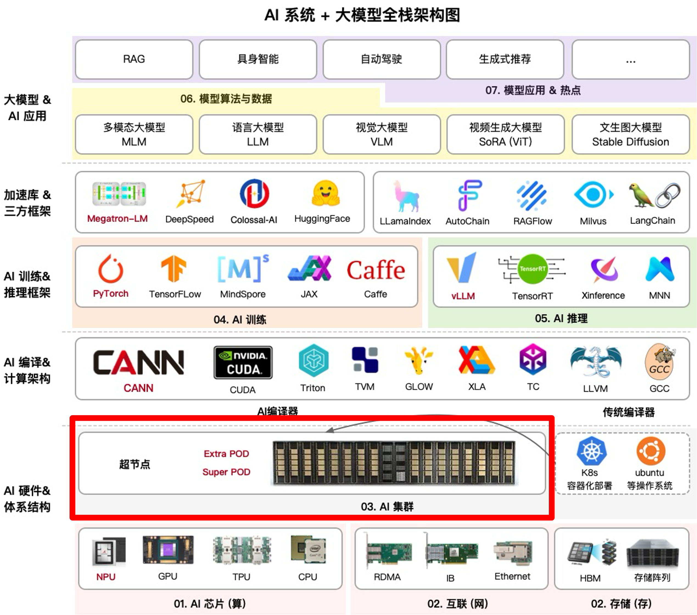

<!--Copyright © ZOMI 适用于[License](https://github.com/Infrasys-AI/AIInfra)版权许可-->

# AI 计算集群概述

本次大纲内容主要围绕计算集群展开，介绍了高性能计算的定义与发展趋势，梳理了从初代到下一代的集群发展历程，探讨了集群计算系统架构以及建设中的软硬件平台分层与挑战。同时，针对万卡 AI 集群建设方案、机房基础设施建设、超节点计算集群分析（包括国内外最新研究）、集群性能指标分析（如总算力、内存计算、能效等）以及实践应用（如精度与性能定位）等多方面进行了详细阐述，系统地展示了计算集群的理论基础、技术演进和实际应用。

## 课程位置

## 课程简介

- [**01. 计算集群之路**](./01Roadmap/)：计算集群之路将深入探讨计算集群的多个关键方面。首先，明确高性能计算（HPC）的整体定义，阐释集群计算如何通过整合多台计算机的资源来解决复杂的计算问题，并详细区分了超级计算机、人工智能和数据中心的不同功能与特点。接着，分析 HPC 硬件的发展趋势，展示了超级计算机硬件架构的演变以及这些变化对人工智能基础设施（AIInfra）未来发展的深远影响。此外，还涵盖计算集群的历史发展，从初期到近期的变化，以及 AI 集群面临的挑战和系统架构设计等内容。

- [**02. L0/L1 AI 集群基建**](./02L0L1Base/)：集群基础建设的内容涵盖了服务器节点的基础知识、散热技术的发展与实践，以及机柜和机房的供电系统。首先，介绍服务器节点的基本概念，帮助初学者对服务器组成和功能有一个初步了解。接着，深入探讨服务器风冷技术的实践和思考，分析风冷在服务器散热中应用及其面临的挑战。随后，转向服务器液冷技术的发展，讨论液冷技术优势和在 AI 智算和传统 DC 数据中心的应用前景。还会探讨液冷技术在实际应用中面临的挑战以及相应的实践思考。最后，对服务器机柜进行深度认识，包括机柜的设计、布局和管理，以及集群机房的供电系统，确保机房的稳定运行和服务器的持续供电。

- [**03 万卡 AI 集群**](./03SuperPod/)：深入探讨超大规模 AI 计算集群的建设，核心围绕“万卡 AI 集群”，从面临的存算网络协同、快速交付与紧张工期等挑战出发，详细解读从 L0 级机房布线到 L3 级上层软件的全栈建设方案，并涵盖万卡性能测试方法与真实客户场景应用。视频还将深度分析 NVIDIA Blackwell 架 构与 BG200 芯片的技术演进，研究马斯克 XAI 十万卡集群的案例实践，最终延伸至对构建十万卡级别超大规模集群的前瞻性思考。

- [**04 集群性能分析**](./04Performance/)：本系列将系统讲解​​集群性能的全方位分析与优化实践​​，涵盖以下核心内容：从硬件资源、模型效率、利用率到业务指标的集群性能评估；基于 TOP500 和 MLPerf 的算力计算方法；网络通信带宽与线性度的量化分析；大模型训练/推理的内存需求测算；MFU（模型浮点运算利用率）的评估；以及能效与成本扩展计算，构建从基础指标到成本控制的完整性能优化体系。

| 大纲 | 小节 | 链接 | 状态 |
|:--- |:---- |:-------------------- |:---- |
|:sparkling_heart:|:star2:|:sparkling_heart:| |
| 性能 实践 :computer: | CODE 01: 拆解 Transformer-Decoder | [Markdown](./04Performance/CODE01Modeling.md), [Jupyter](./04Performance/CODE01Modeling.md), [文章](https://infrasys-ai.github.io/aiinfra-docs/01AICluster04Performance/CODE01Modeling.html) | :white_check_mark: |
| 性能 实践 :computer: | CODE 02: MOE 参数量和计算量 | [Markdown](./04Performance/CODE02MOE.md), [Jupyter](./04Performance/CODE02MOE.ipynb), [文章](https://infrasys-ai.github.io/aiinfra-docs/01AICluster04Performance/CODE02MOE.html) | :white_check_mark: |
| 性能 实践 :computer: | CODE 03: MFU 模型利用率评估 | [Markdown](./04Performance/CODE03MFU.md), [Jupyter](./04Performance/CODE03MFU.ipynb), [文章](https://infrasys-ai.github.io/aiinfra-docs/01AICluster04Performance/CODE03MFU.html) | :white_check_mark: |

## 课程知识

## 备注

系列视频托管[B 站](https://space.bilibili.com/517221395)和[油管](https://www.youtube.com/@ZOMI666/playlists)，PPT 开源在[github](https://github.com/Infrasys-AI/AIInfra)，欢迎引用！

> 非常希望您参与到这个开源课程中，B 站给 ZOMI 留言哦！
>
> 欢迎发现 bug 或者勘误直接提交代码 PR 到社区哦！
