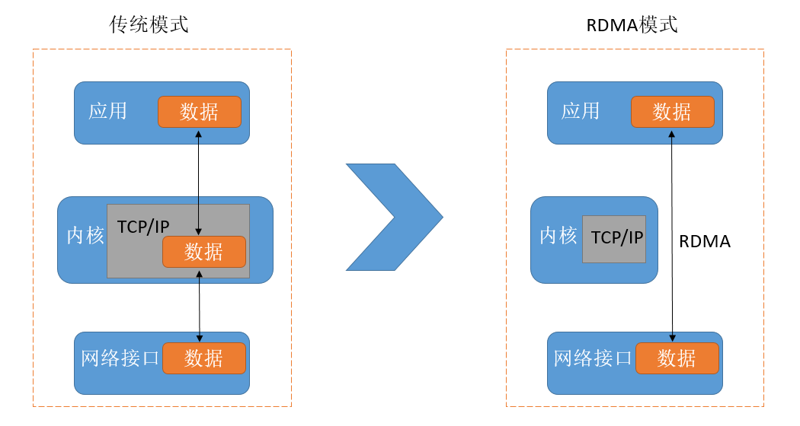
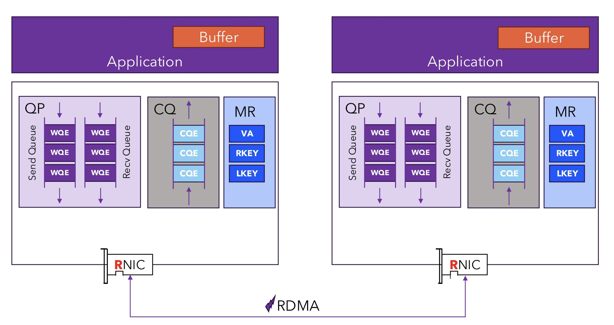
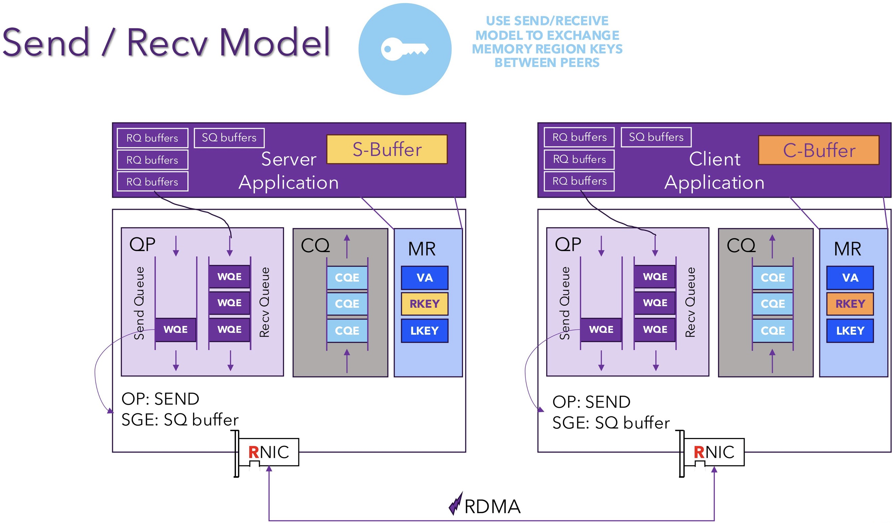
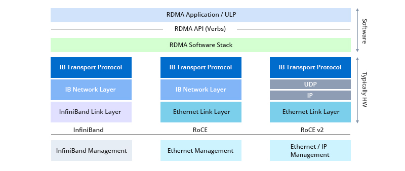

<!--Copyright © ZOMI 适用于[License](https://github.com/Infrasys-AI/AIInfra)版权许可-->

# 高速互联 RDMA

author by: 张万豪

## RDMA 基本概述

RDMA（Remote Direct Memory Access）并不是一个非常新的技术，其最早起源于 20 世纪 90 年代末的高性能计算领域，旨在通过绕过操作系统内核减少网络通信开销。随着人工智能模型特别是大型语言模型的规模和数据量迅速增长，现代计算系统正面临严重的通信瓶颈问题。传统的 TCP/IP 协议难以满足高强度通信需求，RDMA 能够将 CPU 从繁重的数据搬运工作中解放出来，专注于核心计算任务，现已成为支撑大规模 AI 训练的关键网络基础。

### 什么是 RDMA

RDMA（Remote Direct Memory Access，远程直接内存访问）是一种面向高性能计算和数据中心场景的网络通信技术。顾名思义，**它允许一台计算机直接访问另一台计算机的内存，而无需像传统通信那样依赖操作系统内核来转发和管理数据**。换句话说，RDMA 打通了一条“用户空间直达用户空间”的数据通道，**避免了内核协议栈的繁琐处理和多次拷贝操作**。

正因为具备这样的特性，RDMA 在通信性能上远远超越了传统的 TCP/IP 模式。它能够在延迟、吞吐量和 CPU 占用率等关键指标上带来数量级的提升，因此被广泛应用于高性能计算集群、分布式存储系统以及云计算平台。对于大规模数据传输和高并发通信场景而言，RDMA 已成为不可或缺的核心技术。

### RDMA 架构原理

RDMA 的高性能源于其底层架构上的根本性变革，尤其体现在**“内核旁路”（Kernel Bypass）与“零拷贝”（Zero-Copy）**这两大关键机制上。借助这两个机制，RDMA 构建出了一条几乎绕开操作系统干预、从用户空间直达网络硬件的数据通路，极大地降低了通信延迟并释放了 CPU 资源。

与传统的 TCP/IP 通信方式相比，RDMA 的数据发送路径有着本质的不同。在传统网络模型中，应用程序通过套接字 API 发起数据传输请求，操作系统会在用户空间与内核空间之间进行上下文切换，并将数据从应用缓冲区复制到内核缓冲区。随后，内核协议栈处理数据，添加 TCP/IP 头部信息，再通过网卡驱动将数据送往网络接口卡。这个过程中，数据至少会被拷贝两次，系统调用频繁触发 CPU 中断和上下文切换，整个链路严重依赖 CPU 的持续参与。

相比之下，RDMA 则显得简洁高效得多。应用程序不再通过系统调用进行通信，而是**直接调用位于用户态的 RDMA 库（通常是 Verbs API）与支持 RDMA 的网络适配器（RNIC）交互**。在数据传输发起之前，应用需将一块内存区域注册给 RNIC，使其可被网络硬件访问，并锁定在物理内存中。传输过程中，应用仅需将包含内存地址、长度等元信息的请求发送至 RNIC，数据本身并不经过 CPU。RNIC 随后通过 DMA 从用户指定的内存地址中直接读取数据并封装为 RDMA 协议数据包发出，接收端的 RNIC 同样绕开操作系统，**直接将数据写入接收方注册好的内存缓冲区**。整个通信路径从未离开用户空间，亦未涉及任何中间的数据拷贝或内核干预。

这种内核旁路机制意味着网络通信中的数据面操作完全跳过了操作系统，**大大减少了上下文切换和系统调用开销**，网络延迟从毫秒级大幅下降到微秒级。与此同时，零拷贝机制彻底消除了内核缓冲区与应用缓冲区之间的数据搬运需求，**释放了大量 CPU 和内存带宽资源**。在多个关键性能维度上，RDMA 的技术栈都对传统 TCP/IP 协议形成了压倒性的优势。它不仅大幅缩短了数据路径，降低了延迟，更在数据拷贝次数、CPU 使用率和操作系统依赖程度等方面实现了量级的性能提升。

RDMA 的高效运行依赖于精密的**软硬件协同机制**。

- **硬件层面**，RDMA 网络适配器（RNIC）本身是一种集成了强大计算能力的协处理器，能够独立完成数据传输的封装与解析、地址转换、可靠性控制等复杂任务，从而减轻主机 CPU 的负担。
- **软件层面**，RDMA 提供了一套基于 Verbs 的编程接口，支持开发者直接控制通信过程。

RDMA 架构的革新不仅体现在性能提升上，还带来了信任模型的改变。在传统网络模型中，操作系统内核是网络通信的中心控制者和安全裁判者。然而在 RDMA 架构中，数据传输路径完全绕开内核，**信任关系从内核转移至用户程序与硬件之间**，并**通过内存注册和密钥机制来控制权限**。尽管这一设计极大提高了通信效率，但也引入了新的安全风险。比如在不加密的场景中，若攻击者截获或猜测到传输过程中的 rkey，就有可能未经授权地直接访问目标主机的内存。因此，在多租户云平台等敏感场景下，RDMA 的部署必须配合专用物理网络或虚拟私有云等手段，确保网络层的强隔离，以防止潜在的恶意访问。

RDMA 技术的原理及其与 TCP/IP 架构的对比如下表所示。

| **特性**     | **传统 TCP/IP 协议栈**                | **RDMA 协议栈**                        |
| ------------ | ------------------------------------- | -------------------------------------- |
| 数据路径     | 用户空间 → 内核空间 → NIC             | 用户空间 → NIC                         |
| CPU 参与度   | 高（协议栈管理、数据拷贝）            | 极低（仅发起请求，数据处理由硬件完成） |
| 数据拷贝次数 | 多次（应用缓冲区 → 内核缓冲区 → NIC） | 零拷贝（数据从应用内存直接传输）       |
| 内核参与程度 | 深度参与每一个数据包的处理流程        | 数据平面操作完全绕过内核               |
| 通信延迟     | 毫秒级                                | 微秒级                                 |
| 常用编程接口 | Sockets API                           | Verbs API                              |

### RDMA 工作流程

上文简单介绍了 RDMA 的架构设计，本部分则详细介绍 RDMA 的工作流程，RDMA 提供了基于消息队列的点对点通信，每个应用都可以直接获取自己的消息，无需操作系统和协议栈的介入。在介绍工作流程之前，我们需要先了解 RDMA 的一些核心概念，因缩写常用，所以在每个组件介绍时这里会给出其缩写：

- **RNIC (RDMA-enabled Network Interface Card，RNIC)**：RNIC 是**支持 RDMA 功能的智能网卡**。它不仅是物理网络接口，更是一个强大的协处理器，能够独立处理 RDMA 协议、管理内存访问，并执行数据传输任务，从而将主机 CPU 解放出来。
- **QP (Queue Pair, 队列对)**：QP 是 RDMA 通信的基本单元，是应用与 RNIC 交互的逻辑端点。应用通过向 QP 中提交工作请求（Work Request，WR）来发起数据传输，每个 QP 由两个队列组成：
  - 发送队列 (Send Queue, SQ)：存放待发送的数据操作指令。
  - 接收队列 (Receive Queue, RQ)：存放用于接收数据的缓冲区描述符。
- **CQ (Completion Queue, 完成队列)**：用于接收已完成工作通知的队列。当 RNIC 完成一项工作请求（例如，数据发送完毕或接收完成）后，它会向关联的 CQ 中放置一个完成队列项（Work Completion, WC），告知应用程序操作的结果。应用通过轮询 CQ 来获知任务的完成状态。
- **MR (Memory Region, 内存区域)**：为了让 RNIC 能够直接访问主机内存，**应用程序必须先将一块内存区域“注册”给 RNIC**。注册过程会将虚拟内存地址映射到物理地址，并锁定该内存页，防止其被交换到磁盘。注册成功后，RNIC 会返回两个密钥：
  - **LKey (Local Key)**：用于本地 RNIC 访问该内存区域。
  - **RKey (Remote Key)**：发送给对端，授权对端 RNIC 访问该内存区域。
- **PD (Protection Domain, 保护域)**：一个安全隔离机制，用于将一组 RDMA 资源（如 QP、CQ、MR）聚合在一起。只有属于同一个 PD 的资源才能相互关联和操作，从而防止不同应用或进程间的非法内存访问。

了解完上面的一些 RDMA 的基本概念，下面我们来介绍 RDMA 的工作流程，RDMA 的通信模型可以根据对端 CPU 是否参与数据传输过程，分为**单边操作**和**双边操作**两大类。而无论是哪种操作，**一个典型的 RDMA 通信流程都包含以下步骤**：

1. **资源准备**：应用程序首先分配所需资源，包括保护域（PD）、完成队列（CQ）、队列对（QP），并根据需要注册内存区域（MR）。
2. **连接建立**：通信双方通过带外方式（如 TCP/IP 套接字）交换各自的 QP 信息和已注册内存的 RKey 等元数据，完成连接的建立和状态同步。
3. **数据传输**：应用向 QP 的发送队列或接收队列提交工作请求（WR）。RNIC 硬件会从队列中取出请求并执行，例如从指定的内存地址读取数据并发送，或将收到的数据写入指定的内存地址。
4. **完成通知**：操作完成后，RNIC 将一个完成项（WC）放入 CQ。应用程序通过**轮询 CQ** 来检查操作是否成功完成，并进行后续处理。
5. **资源释放**：通信结束后，应用程序销毁 QP、CQ 等资源，并注销内存区域。

#### RDMA 双边操作：Send/Receive

**双边操作**类似于传统的消息传递模型，需要通信双方的 CPU 协同工作。比如 RDMA 中的`SEND/RECEIVE`是最经典的双边操作，

- **发送方**：调用 `SEND` 操作，将数据从其本地内存缓冲区发送出去。
- **接收方**：必须提前调用 RECEIVE 操作，准备好一块用于接收数据的内存缓冲区。

当发送方的数据到达时，接收方的 RNIC 会将其存入预先准备好的缓冲区中。这种模式下**，接收方必须预知数据何时会到达并提前做好准备**，双方需要紧密同步。它本质上是一种“推送”模型，适用于流式数据传输和消息同步场景。

#### RDMA 单边操作：Read/Write

单边操作允许一端计算机在**无需远端 CPU 任何干预**的情况下，直接对远端内存进行读写。远端的 RNIC 会自动处理这些请求，整个过程对远端应用完全透明。

- **RDMA READ**：这种操作是“拉取”模型，发起方可以按需从远端服务器获取数据，非常适合需要随机访问大块数据的场景。
  - **发起方**：提交一个 `READ` 请求，请求中包含其本地内存地址（用于存放读取的数据）以及目标远程内存的地址和 RKey。
  - **远端**：远端的 RNIC 收到请求后，会直接从其主机内存中读取指定数据，并通过网络返回给发起方。

- **RDMA WRITE**：这种操作是“推送”模型，但与 SEND 不同的是，它**不需要接收方预先准备接收缓冲区，可以直接覆盖目标内存**。
  - **发起方**：提交一个 `WRITE` 请求，请求中包含其本地要发送的数据的地址，以及目标远程内存的地址和 RKey。
  - 远端：远端的 RNIC 收到数据后，会直接将其写入指定的内存地址，无需通知其主机 CPU。

**Atomic Operations (原子操作)**：

- 单边操作还支持 Fetch-and-Add 和 Compare-and-Swap 等原子操作，允许在远端内存上执行不可分割的读改写操作，这对于实现分布式锁、计数器等同步原语至关重要。

### RDMA 优劣势

RDMA 随着大模型时代的到来大放异彩，已经成为了数据中心网络支撑大模型训练推理的基础技术，前面我们介绍了 RDMA 的技术原理，现在我们总结一下其主要的优劣势有哪些。

优势：

- **低延迟、高吞吐**：提供微秒级延迟和超高带宽，是解决 LLM 训练中海量参数同步（如 All-Reduce）瓶颈的唯一有效手段，直接决定了训练速度。
- **CPU 占用率低**：繁重的网络协议处理和数据拷贝工作全部由 RNIC 硬件完成，将 CPU 从通信任务中解放出来，使其可以专注于核心的计算任务，显著提升了系统的整体计算效率。

劣势

- **编程复杂度高**：相较于简洁的 Socket API，RDMA 的 Verbs API 非常底层和复杂，开发者需要手动管理队列对、内存注册、完成通知等状态，开发门槛较高。
- **网络环境要求高**：RDMA（尤其是 RoCE）依赖于一个**无损网络**。它对丢包极其敏感，任何丢包都会导致性能急剧下降。这要求数据中心内部的交换机必须支持并开启特殊流控（如 PFC），以确保网络在拥塞时也不丢包。这种可控的、精细化管理的环境只有在数据中心才能实现。
- **成本高**：需要专用的 RDMA 网卡（RNIC）和高端的（InfiniBand 或支持 RoCE 的）数据中心交换机，成本远高于普通以太网设备，并且对网络运维的技术要求极高

## RDMA 协议实现

RDMA 本身指的是一种技术，具体协议层面，包含三种：InfiniBand、iWARP、RoCE（RoCE v1 和 RoCE v2），这三种协议都符合 RDMA 标准，使用相同的上层接口，简要介绍如下：

- **IB（InfiniBand）**：基于 InfiniBand 架构的 RDMA 技术，由 IBTA（InfiniBand Trade Association）提出。搭建基于 IB 技术的 RDMA 网络需要专用的 IB 网卡和 IB 交换机。
- **iWARP（Internet Wide Area RDMA Protocal）**：基于 TCP/IP 协议的 RDMA 技术，由 IETF 标 准定义。iWARP 支持在标准以太网基础设施上使用 RDMA 技术，但服务器需要使用支持 iWARP 的网卡。
- **RoCE（RDMA over Converged Ethernet）**：基于以太网的 RDMA 技术，也是由 IBTA 提出。RoCE 支持在标准以太网基础设施上使用 RDMA 技术，但是需要交换机支持无损以太网传输，需要服务器使用 RoCE 网卡。

三者的主要对比如下：

| 特性           | InfiniBand (IB)                         | RoCE (RDMA over Converged Ethernet)         | iWARP (Internet Wide Area RDMA Protocol)    |
| :------------- | :-------------------------------------- | :------------------------------------------ | :------------------------------------------ |
| **底层协议**   | 原生 RDMA 架构                            | 以太网 / UDP/IP (RoCEv2)                    | TCP/IP                                      |
| **性能表现**   | **最高** (延迟最低，最稳定)             | **很高** (性能接近 IB，延迟略高)             | **较高** (受 TCP/IP 协议栈影响，延迟相对最高) |
| **网络要求**   | **专用网络** (IB 网卡、IB 交换机、IB 线缆) | **无损以太网** (需要交换机支持 PFC 等 DCB 功能) | **标准以太网** (可在普通有损网络运行)       |
| **部署复杂度** | **高** (需要构建和管理一套独立网络)     | **中等** (需要精心配置交换机以保证无损)     | **低** (即插即用，无需特殊网络配置)         |
| **路由能力**   | 不支持 IP 路由 (需要网关)                 | RoCEv2 支持 IP 路由                           | 支持 IP 路由                                  |

### InfiniBand 技术

InfiniBand 是一种基于 InfiniBand 架构的 RDMA 技术，它提供了一种基于通道的点对点消息队列转发模型，每个应用都可通过创建的虚拟通道直接获取本应用的数据消息，无需其他操作系统及协议栈的介入。InfiniBand 架构的应用层采用了 RDMA 技术，可以提供远程节点间 RDMA 读写访问，完全卸载 CPU 工作负载；网络传输采用了高带宽的传输；链路层设置特定的重传机制保证服务质量，不需要数据缓冲。

### iWARP 技术

iWARP 是基于以太网和 TCP/IP 协议的 RDMA 技术，可以运行在标准的以太网基础设施上。iWARP 并没有指定物理层信息，所以能够工作在任何使用 TCP/IP 协议的网络上层。iWARP 允许很多传输类型来共享相同的物理连接，如网络、I/O、文件系统、块存储和处理器之间的消息通讯。iWARP 协议栈，iWARP 由 MPA、DDP、RDMAP 三层子协议组成：

- RDMAP 层协议负责 RDMA 读、写操作和 RDMA 消息的转换，并将 RDMA 消息转发到 DDP 层。
- DDP 层协议负责将过长的 RDMA 消息分片分装成 DDP 数据包继续转发到 MPA 层。
- MPA 层在 DDP 数据段的固定标识位置增加转发后向标识、数据报文的长度以及 CRC 校验数据等字段构成 MPA 数据段交由 TCP 传输。

iWARP 技术特点，iWARP 从以下几个方面降低了主机侧网络负载：

- TCP/IP 处理流程从 CPU 卸载到 RDMA 网卡处理，降低了 CPU 负载。
- 消除内存拷贝：应用程序可以直接将数据传输到对端应用程序内存中，显著降低 CPU 负载。
- 减少应用程序上、下文切换：应用程序可以绕过操作系统，直接在用户空间对 RDMA 网卡下发命令，降低了开销，显著降低了应用程序上、下文切换造成的延迟。

由于 TCP 协议能够提供流量控制和拥塞管理，因此 iWARP 不需要以太网支持无损传输，仅通过普通以太网交换机和 iWARP 网卡即可实现，因此能够在广域网上应用，具有较好的扩展性。

### RoCE 技术

RoCE 技术支持在以太网上承载 IB 协议，实现 RDMA over Ethernet。RoCE 与 InfiniBand 技术有相同的软件应用层及传输控制层，仅网络层及以太网链路层存在差异。

RoCE 协议分为两个版本：

- RoCE v1 协议：基于以太网承载 RDMA，只能部署于二层网络，它的报文结构是在原有的 IB 架构的报文上增加二层以太网的报文头，通过 Ethertype 0x8915 标识 RoCE 报文。
- RoCE v2 协议：基于 UDP/IP 协议承载 RDMA，可部署于三层网络，它的报文结构是在原有的 IB 架构的报文上增加 UDP 头、IP 头和二层以太网报文头，通过 UDP 目的端口号 4791 标 识 RoCE 报文。RoCE v2 支持基于源端口号 hash，采用 ECMP 实现负载分担，提高了网络的利用率。

RoCE 使得基于以太网的数据传输能够：提高数据传输吞吐量、 减少网络延时、降低 CPU 负载。RoCE 技术可通过**普通以太网交换机**实现，但**服务器需要支持 RoCE 网卡**，网络侧需要支持无损以太网络，这是由于 IB 的丢包处理机制中，任意一个报文的丢失都会造成大量的重传，严重影响数据传输性能。

## RDMA 硬件厂商

RDMA的硬件主要包括：**以太网适配器、智能网卡（SmartNICs）、数据处理器（DPU）以及交换机芯片**。这里主要介绍一些国外和国内的主流厂商，需要注意的是，不同的厂商对 RDMA 协议的支持也有所侧重。国外的主要玩家有：**英伟达、英特尔、博通、美满电子、AMD**；国内的RDMA硬件厂商主要有：**华为、浪潮、中兴、锐捷网络**，此外国内的腾讯、阿里、字节等大厂也在**自研RDMA**。下面分别介绍各家的RDMA产品。

**英伟达**

英伟达的RDMA硬件主要分为**网络适配器、数据处理器（DPU）和交换机**三大类，协同构成了完整的端到端RDMA网络解决方案。

英伟达的RDMA网络适配器主要包括**ConnectX系列智能网卡**和专为AI优化的**BlueField SuperNIC**。ConnectX系列智能网卡 (ConnectX SmartNICs)是英伟达最核心的网络产品线，目前已发展到ConnectX-7等先进型号，支持**InfiniBand协议、RoCE v1和v2协议**。

**BlueField DPU**将ConnectX网卡的功能与Arm处理器核心以及可编程的加速引擎集成在一颗芯片上，能够独立于服务器主CPU运行网络、存储和安全等基础设施服务，实现了数据中心控制平面与数据平面的隔离，提升了安全性和效率，与ConnectX系列一致，全面支持 **InfiniBand** 和 **RoCE**

英伟达提供**两种主要的交换机产品线**，分别对应InfiniBand和以太网生态系统。**Quantum系列 InfiniBand交换机**是为InfiniBand网络设计的专用交换机，如NVIDIA Quantum-2平台，提供极高的端口速率（如NDR 400Gb/s）。**Spectrum系列以太网交换机**是专为数据中心以太网设计的高性能交换机，如Spectrum-4。它们是NVIDIA Spectrum-X平台的核心组件。

| 硬件类别   | 主要产品系列                | 核心特点                                                | 主要支持的RDMA协议 |
| ---------- | --------------------------- | ------------------------------------------------------- | ------------------ |
| 网络适配器 | ConnectX SmartNICs          | 高性能、硬件卸载、GPUDirect RDMA                        | InfiniBand 和 RoCE |
| 数据处理器 | BlueField DPUs              | 基础设施卸载与隔离、软件定义、继承ConnectX所有功能      | InfiniBand 和 RoCE |
| 交换机     | Quantum InfiniBand Switches | 超低延迟、网络内计算 (In-Network Computing)、自适应路由 | InfiniBand         |
| 交换机     | Spectrum Ethernet Switches  | 为AI优化的以太网、高级RoCE优化、开放可编程              | RoCE               |

**英特尔**

**博通**

**美满电子**

**AMD**

国外：

- **NVIDIA（英伟达）**：在 2019 年收购了 Mellanox，Mellanox 长期以来是 InfiniBand 技术的代名词。同时，NVIDIA 也大力支持基于以太网的 RDMA 技术（RoCE），其产品线全面覆盖**InfiniBand 和 RoCE**，提供从网卡、交换机到电缆和软件的端到端解决方案。
- **Intel（英特尔）**：其 E810 系列等产品同时支持**iWARP 和 RoCEv2**两种主流的 RDMA over Ethernet 协议
- **Broadcom （博通）**: NetXtreme 系列以太网适配器广泛支持 RoCE
- **Marvell（美满电子）**：收购了 QLogic 和 Cavium，其 FastLinQ 系列以太网适配器能够同时支持 RoCE 和 iWARP

国内

- **华为**：其产品鲲鹏920芯片支持RoCEv2
- **浪潮信息**：推出了AI服务器产品（如NF5488A5），同时支持**InfiniBand**和**RoCEv2**
- **中兴**：“定海”系列DPU芯片，在RDMA领域主要围绕**RoCEv2**技术，
- **锐捷网络**：数据中心交换机产品线（如RG-N18000系列）支持构建**RoCEv2**所需的无损网络

## 总结与思考

RDMA 并非在大模型兴起之后才出现的新技术，它早已在高性能计算领域发展多年。然而，随着大模型训练与推理对数据中心网络延迟、带宽和 CPU 效率提出了超高要求，传统 TCP/IP 协议栈已然成为瓶颈，RDMA 因此被推到了台前，成为了支撑 AI 算力基础设施的关键支柱。RDMA 的本质是将部分网络通信的“计算”任务（协议处理、数据校验、内存管理）从主机 CPU 卸载（Offload）到专用的 RNIC 硬件上。这说明未来计算与网络的融合是一种趋势，网络不再是单纯的数据管道，而是具备了计算能力的智能基础设施。

## 参考

- [RDMA 技术梳理](https://www.meemx.com/p/everything-about-rdma/)
- [SNIC 研讨会 PPT](https://www.meemx.com/files/Everything-You-Wanted-to-Know-About-RDMA-But-Were-Too-Proud-to-Ask-Final-v2.pdf)
- [详谈 RDMA 技术原理和三种实现方式](https://zhuanlan.zhihu.com/p/549434847)
- [RDMA 之 iWARP & Soft-iWARP](https://zhuanlan.zhihu.com/p/449189540)
- [RDMA 产业链投资机会全面深度梳理](https://mp.weixin.qq.com/s?__biz=MzkxMDQxMjM4MQ==&mid=2247491379&idx=1&sn=d2253ec7246ccab54449150b0035018b&chksm=c04c7d268f481aeb6586dfaed434484eec60f95ce0841cce62e62a311b3dbe6a5eea335f8251#rd)
- [RDMA 概述](https://zhuanlan.zhihu.com/p/138874738)