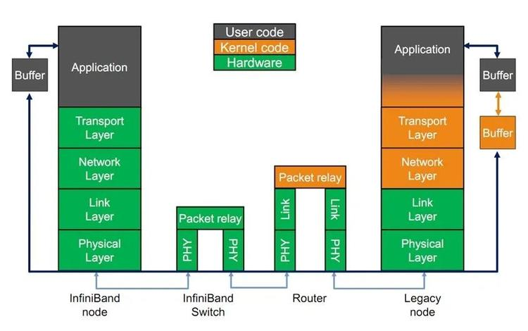

# RDMA 技术介绍

## 背景与挑战

随着人工智能模型特别是大型语言模型（LLM）的规模和数据量迅速增长，现代计算系统正面临严重的通信瓶颈问题。在由数百甚至上千个 GPU 组成的分布式训练集群中，限制性能的关键不再是计算能力，而是节点间的数据交换效率。频繁的梯度、参数和激活值传输导致 GPU 核心长时间等待数据，显著降低了资源利用率并延长了任务完成时间。

传统的 TCP/IP 协议难以满足这种高强度通信需求。多次内存拷贝和用户态与内核态之间的频繁切换不仅消耗大量 CPU 资源，还导致延迟上升和带宽利用不足，尤其在 100GbE 或更高速网络中尤为明显。

为突破这一瓶颈，远程直接内存访问（RDMA）技术应运而生。**RDMA 允许一台机器直接访问另一台机器的内存，绕过操作系统和 CPU，从而大幅降低延迟并释放计算资源。**这一源自高性能计算领域的技术，现已成为支撑大规模 AI 训练任务的关键网络基础。

## 技术原理

### 核心架构机制

RDMA（Remote Direct Memory Access）的高性能源于其底层架构上的根本性变革，尤其体现在"内核旁路"（Kernel Bypass）与"零拷贝"（Zero-Copy）这两大关键机制上。借助这两个机制，RDMA 构建出了一条几乎绕开操作系统干预、从用户空间直达网络硬件的数据通路，极大地降低了通信延迟并释放了 CPU 资源。

与传统的 TCP/IP 通信方式相比，RDMA 的数据发送路径有着本质的不同。在传统网络模型中，应用程序通过套接字 API 发起数据传输请求，操作系统会在用户空间与内核空间之间进行上下文切换，并将数据从应用缓冲区复制到内核缓冲区。随后，内核协议栈处理数据，添加 TCP/IP 头部信息，再通过网卡驱动将数据送往网络接口卡。这个过程中，数据至少会被拷贝两次，系统调用频繁触发 CPU 中断和上下文切换，整个链路严重依赖 CPU 的持续参与。

相比之下，RDMA 则显得简洁高效得多。应用程序不再通过系统调用进行通信，而是直接调用位于用户态的 RDMA 库（通常是 Verbs API）与支持 RDMA 的网络适配器（rNIC）交互。在数据传输发起之前，应用需将一块内存区域注册给 rNIC，使其可被网络硬件访问，并锁定在物理内存中。传输过程中，应用仅需将包含内存地址、长度等元信息的请求发送至 rNIC，数据本身并不经过 CPU。rNIC 随后通过 DMA 从用户指定的内存地址中直接读取数据并封装为 RDMA 协议数据包发出，接收端的 rNIC 同样绕开操作系统，直接将数据写入接收方注册好的内存缓冲区。整个通信路径从未离开用户空间，亦未涉及任何中间的数据拷贝或内核干预。

### 性能优势与安全考虑

这种内核旁路机制意味着网络通信中的数据面操作完全跳过了操作系统，大大减少了上下文切换和系统调用开销，网络延迟从毫秒级大幅下降到微秒级。与此同时，零拷贝机制彻底消除了内核缓冲区与应用缓冲区之间的数据搬运需求，释放了大量 CPU 和内存带宽资源。在多个关键性能维度上，RDMA 的技术栈都对传统 TCP/IP 协议形成了压倒性的优势。它不仅大幅缩短了数据路径，降低了延迟，更在数据拷贝次数、CPU 使用率和操作系统依赖程度等方面实现了量级的性能提升。

RDMA 的高效运行依赖于精密的软硬件协同机制。硬件层面，RDMA 网络适配器（rNIC）本身是一种集成了强大计算能力的协处理器，能够独立完成数据传输的封装与解析、地址转换、可靠性控制等复杂任务，从而减轻主机 CPU 的负担。软件层面，RDMA 提供了一套基于 Verbs 的编程接口，支持开发者直接控制通信过程。

RDMA 架构的革新不仅体现在性能提升上，还带来了信任模型的改变。在传统网络模型中，操作系统内核是网络通信的中心控制者和安全裁判者。然而在 RDMA 架构中，数据传输路径完全绕开内核，信任关系从内核转移至用户程序与硬件之间，并通过内存注册和密钥机制来控制权限。尽管这一设计极大提高了通信效率，但也引入了新的安全风险。比如在不加密的场景中，若攻击者截获或猜测到传输过程中的 rkey，就有可能未经授权地直接访问目标主机的内存。因此，在多租户云平台等敏感场景下，RDMA 的部署必须配合专用物理网络或虚拟私有云等手段，确保网络层的强隔离，以防止潜在的恶意访问。

### RDMA与TCP/IP对比

RDMA 技术的原理及其与 TCP/IP 架构的对比如下图所示：

| **特性**     | **传统 TCP/IP 协议栈**                | **RDMA 协议栈**                        |
| ------------ | ------------------------------------- | -------------------------------------- |
| 数据路径     | 用户空间 → 内核空间 → NIC             | 用户空间 → NIC                         |
| CPU 参与度   | 高（协议栈管理、数据拷贝）            | 极低（仅发起请求，数据处理由硬件完成） |
| 数据拷贝次数 | 多次（应用缓冲区 → 内核缓冲区 → NIC） | 零拷贝（数据从应用内存直接传输）       |
| 内核参与程度 | 深度参与每一个数据包的处理流程        | 数据平面操作完全绕过内核               |
| 通信延迟     | 毫秒级                                | 微秒级                                 |
| 常用编程接口 | Sockets API                           | Verbs API                              |

## RDMA 技术实现方案

RDMA 技术主要包括三种实现方案：

- **IB（InfiniBand）**：直译为“无限带宽”技术，缩写为IB，是一个用于高性能计算的计算机网络通信标准，它具有极高的吞吐量和极低的延迟，用于计算机与计算机之间的数据互连。InfiniBand也用作服务器与存储系统之间的直接或交换互连，以及存储系统之间的互连。
- **iWARP（Internet Wide Area RDMA Protocol）**：基于 TCP/IP 协议的 RDMA 技术，由 IETF 标准定义。iWARP 支持在标准以太网基础设施上使用 RDMA 技术，但服务器需要使用支持 iWARP 的网卡
- **RoCE（RDMA over Converged Ethernet）**：基于以太网的 RDMA 技术，也是由 IBTA 提出。RoCE 支持在标准以太网基础设施上使用 RDMA 技术，但是需要交换机支持无损以太网传输，需要服务器使用 RoCE 网卡

### InfiniBand（IB）

 InfiniBand 是一种专为高性能计算（HPC）和数据中心设计的网络互联技术。它的核心优势在于能够实现 RDMA (远程直接内存访问)，这是一种革命性的数据传输方式。

与传统的网络协议不同，InfiniBand 允许应用程序直接访问远程计算机的内存，完全绕过操作系统内核和协议栈。这就像是两台计算机之间开通了一条“高速直达通道”。通过这种方式，数据传输的时延极低，吞吐量极高，同时大幅降低了 CPU 的占用率。

随着人工智能和深度学习的蓬勃发展，**InfiniBand 成为了连接 GPU 服务器的首选网络互联技术**。深度学习模型训练需要处理海量数据，并要求多个 GPU 之间进行频繁、快速的数据同步。传统的以太网很难满足这种极端苛刻的低时延和大带宽需求，而 InfiniBand 的 RDMA 技术恰好能完美解决这一痛点。

- **物理层**：定义了在线路上如何将比特信号组成符号，然后再组成帧、数据符号以及包之间的数据填充等，详细说明了构建有效包的信令协议等。
- **链路层**：定义了数据包的格式以及数据包操作的协议，如：流控、 路由选择、编码、解码等。
- **网络层**：通过在数据包上添加一个40字节的全局的路由报头（Global Route Header, GRH）来进行路由的选择，对数据进行转发。在转发的过程中，路由器仅仅进行可变的CRC校验，这样就保证了端到端的数据传输的完整性。

###  iWARP 技术简介

iWARP 是**基于以太网和 TCP/IP 协议的 RDMA 技术**，可以运行在标准的以太网基础设施上。iWARP 并没有指定物理层信息，所以能够工作在任何使用 TCP/IP 协议的网络上层。iWARP 允许很多传输类型来共享相同的物理连接，如网络、I/O、文件系统、块存储和处理器之间的消息通讯。

 iWARP 协议栈，iWARP 由 MPA、DDP、RDMAP 三层子协议组成： 

- **基于 TCP/IP 的可靠传输**：iWARP 并没有重新发明轮子，而是充分利用了现有的 TCP 协议。它将 RDMA 的数据传输封装在标准的 TCP 连接之上。这意味着它可以在任何支持 TCP/IP 协议的以太网网络上运行，而不需要特殊的硬件或交换机支持。TCP 负责处理数据包的可靠传输、乱序重排和流量控制，为 iWARP 提供了坚实的基础。

- **DDP (Direct Data Placement) 协议**：DDP 是 iWARP 的核心，它定义了如何将数据直接放置到应用程序指定的内存地址中。在传统的网络通信中，数据会从网卡经过操作系统的协议栈，再拷贝到应用程序的内存。而在 iWARP 中，DDP 协议通过在数据包头部添加元数据（如内存地址、数据长度等），告诉接收端的网卡（支持 RDMA 功能的 NIC）直接将数据写入到指定的内存区域，完全跳过了操作系统内核的拷贝过程。

- **MPA (Marker PDU Aligned) 协议**：MPA 协议在 DDP 协议之上工作，主要解决 TCP 流式传输和 RDMA 数据块对齐的问题。TCP 是一个流协议，没有数据块边界的概念，而 RDMA 需要精确地知道每个数据块的起始和结束位置。MPA 通过在数据块的开头和结尾插入特殊标记，确保接收端能够正确地识别和解析每个 RDMA 数据单元，保证了数据在内存中精确的对齐和放置。

iWARP 从以下几个方面降低了主机侧网络负载：

- TCP/IP 处理流程从 CPU 卸载到 RDMA 网卡处理，降低了 CPU 负载。
- 消除内存拷贝：应用程序可以直接将数据传输到对端应用程序内存中，显著降低 CPU 负载。

- 减少应用程序上、下文切换：应用程序可以绕过操作系统，直接在用户空间对 RDMA 网卡下发命令，降低了开销，显著降低了应用程序上、下文切换造成的延迟。

 由于 TCP 协议能够提供流量控制和拥塞管理，因此 iWARP 不需要以太网支持无损传输，仅通过普通以太网交换机和 iWARP 网卡即可实现，因此能够在广域网上应用，具有较好的扩展性。

###  RoCE 技术简介

**RoCE (RDMA over Converged Ethernet)** 是一种技术，它使得原本用于高性能计算领域的 **RDMA (远程直接内存访问)** 能力可以在标准的以太网（Ethernet）上实现。这意味着你不需要专用的 InfiniBand 网络设备，就可以获得类似 InfiniBand 的高性能数据传输效果。

RoCE 的核心思想是**将 InfiniBand 协议的软件层直接映射到以太网协议上**。它共享 InfiniBand 的上层软件应用和传输控制层，但将其网络层和链路层替换成了以太网协议。这种结合带来的好处主要包括：

* **提升吞吐量和降低延迟**：数据绕过操作系统内核直接在网卡之间传输，显著减少了数据拷贝和 CPU 负担。
* **降低 CPU 负载**：释放了 CPU 资源，让它们可以专注于运行应用程序，而不是处理网络通信。
* **兼容性**：RoCE 可以在现有的以太网基础设施上运行，大大降低了部署成本。

##### RoCE 的两个版本：RoCE v1 与 RoCE v2

RoCE 协议分为两个主要版本，以适应不同的网络拓扑：

#### **RoCE v1**

* **工作在二层网络**：RoCE v1 是一种链路层协议，只能在同一个二层网络（即同一个广播域或 VLAN）内工作。
* **报文结构**：它在 InfiniBand 报文的基础上，直接加上以太网的报文头，并通过特定的 **Ethertype (0x8915)** 来标识 RoCE 报文，从而让网卡能够识别并处理它。

#### **RoCE v2**

* **工作在三层网络**：RoCE v2 是对 v1 的重大改进。它可以在三层网络上运行，这意味着数据包可以跨越路由器进行传输，从而实现更大规模的网络互联。
* **报文结构**：RoCE v2 的报文结构更为复杂，它在 InfiniBand 报文上增加了 **UDP 头、IP 头**，再封装以太网报文头。它使用特定的 **UDP 端口号 (4791)** 来标识 RoCE v2 流量。
* **路由与负载均衡**：RoCE v2 支持三层路由，可以利用 IP 网络的特性，例如 **ECMP (Equal-Cost Multi-Path)** 来实现负载分担，进一步提高网络的利用率和弹性。

虽然 RoCE 可以在普通以太网设备上运行，但为了确保其性能，网络必须是**无损的（lossless）**。这是因为 InfiniBand 的设计是基于无损网络的，它的丢包处理机制效率很低。只要有一个数据包丢失，就会导致大量的重传，严重影响数据传输性能。

为了实现无损以太网，网络交换机通常需要支持一些特定的技术，例如 **PFC (Priority Flow Control)**，来防止拥塞和丢包，从而为 RoCE 提供稳定可靠的传输环境。因此，尽管 RoCE 降低了硬件成本，但对网络配置的精细化要求也相对较高。

## 参考文献

* [InfiniBand，到底是个啥？](https://www.eefocus.com/article/1580068.html)
* [解析RDMA 网卡两种协议： iWARP 和 RoCE](https://www.unicaca.com/info/detail/336.html)
* [A Software iWARP Driver for OpenFabrics](https://www.openfabrics.org/downloads/Media/Sonoma2009/Sonoma_2009_Mon_softiwrp.pdf)
* [RDMA技术详解 - 知乎专栏](https://zhuanlan.zhihu.com/p/549434847)
* [RDMA Networking and AI - 650 Group](https://650group.com/wp-content/uploads/2024/06/650-Group-IBTA-RDMA-White-Paper-June-2024.pdf)
* [enhancing data transfer efficiency in gpu computing utilizing gpu direct technology with intel® ethernet network adapters](https://cdrdv2-public.intel.com/826151/SMCI_Whitepaper_GPUDirect_DataTransferEfficiency%20with%20Intel%20Ethernet%20Adapter%20V7_May%202024.pdf)
* [The Basics of Remote Direct Memory Access (RDMA) in vSphere - VMware](https://www.vmware.com/docs/the-basics-of-remote-direct-memory-access-rdma-in-vsphere)
* [What are the key differences between TCP and RDMA in terms of data transfer protocols for distributed deep learning? - Massed Compute](https://massedcompute.com/faq-answers/?question=What+are+the+key+differences+between+TCP+and+RDMA+in+terms+of+data+transfer+protocols+for+distributed+deep+learning%3F)
* [An In-Depth Understanding of RDMA Interaction Mechanism between Software and Hardware - Alibaba Cloud](https://www.alibabacloud.com/blog/601598)
* [What is Remote Direct Memory Access (RDMA)? - GreenCloud](https://blog.greencloudvps.com/what-is-remote-direct-memory-access-rdma.php)
* [Can you explain the difference between RDMA and TCP/IP for GPU communication and which one is better for deep learning workloads? - Massed Compute](https://massedcompute.com/faq-answers/?question=Can%20you%20explain%20the%20difference%20between%20RDMA%20and%20TCP/IP%20for%20GPU%20communication%20and%20which%20one%20is%20better%20for%20deep%20learning%20workloads?)