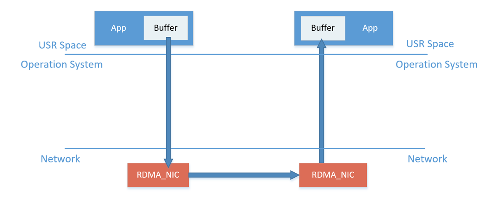
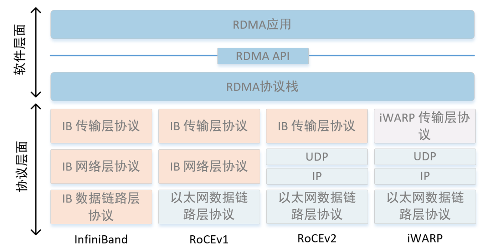

# Scale out and Scale up

## 概述

大模型训练（推理）集群组网，或智算中心网络，通常分为“两张网”，即：**Scale out** 和 **Scale up**。Scale out 即 Scale horizontally，水平扩展，通常涉及以太网技术或 RDMA 技术的 GPU 远程互联，用于满足扩大计算规模的需求。Scale up 指 Scale vertically，水平扩展，通常涉及 GPU 之间高速互连，用于满足稠密通信的需求。

在大模型的训练过程中，两张网的核心都是维护 GPU 之间的通信可达，二者本质上的区别是：**时延**。网络时延可以分为：静态时延与动态时延，静态时延是只网络设备转发、交换过程固有的时延，是网络硬件的固有属性，动态时延与当前网络状态有关，主要指标为吞吐率，带宽，利用率等，受流量控制，负载均衡等机制的影响。

### scale-up 需要纳秒级的时延

scale-up 网络，也有称为总线域网络的，是一个极致性能的网络。在这个域中，GPU 可以视其它 GPU 的存储器为本地存储区，直接进行读写，这时候时延就非常的重要了。假如 GPU 的主频在 1GHz 以上，时钟周期小于 1 纳秒，内存访问为例，本地内存访问的典型时延通常低于 100 纳秒。因此，在通过网络进行内存访问时，为了匹配这一速度，时延需要控制在 1 微秒以下。为达到这样的需求，在网络设计的时候，通常需要与特定业务紧密耦合，并且不包含传统网络中的传输层和网络层。同时，并通过信用机制（Credit）和链路层的重传机制来解决可靠性问题，而不能是传统网络的基于数据包的重传。

### scale-out 网络的时延可达到 ms 级

在 scale-out 网络中，传统网络通常采用分层架构，例如 OSI 模型，具有清晰定义的传输层和网络层，以支持更加灵活的通讯和数据传输方式。这种分层架构也带来了时延不可控的代价。传统数据中心网络所支持的业务相对固定，用户体验直接受到带宽的影响。例如，图像和音频的质量、视频的清晰度、文件下载速度等指标都与带宽密切相关。带宽越高，网络能够承载的业务量就越大，并且能够提供更好的用户体验。为了确保用户感受到系统的即时响应，端到端的网络时延应低至 1 至 10 毫秒的范围内，以确保整体时延不超过 100 毫秒。这个上限是基于人的感知能力，超出此范围可能会让用户感觉到系统迟缓或不响应。

面向 AI/HPC 的计算网络业务特征与传统数据中心网络业务特征相似，例如：单业务流带宽远低于接口或管道带宽；流级负载均衡提升网络利用率并避免乱序；业务流之间的相关性相对较弱，采用异步和准同步通信方式； 聚合后的流量在长时间周期内可能呈现一定的规律；不要求极致低时延；端侧传输层保证可靠性。考虑到成本和技术上的相似性，scale-out 网络会“借用”传统网络的产业链，包括交换机和光模块。在此基础上进行性能优化，例如 UEC 和 GSE 等。这种优化主要是为了降低网络的动态时延。而基于传统网络设计的静态时延依然很大。同时，为了实现超大规模的集群并提升技术能力，scale-out 网络会通过多级交换机组成的网络进行连接，这样也会使得整个网络的时延达到亚毫秒级，甚至毫秒级。

### 为什么要区分两个网络
既然 scale up 网络性能优越，为什么不能只维护 scale up 网络呢？诚然对于大模型工程师来说，最理想的网络就是“没有网络”，即模型训练在一张 superchip GPU 里，无需并行切分的开销，但摩尔定律的加倍效应逐渐放缓的事实在物理层面上限制了处理器上限，同时 scaling-law 定律认为大模型性能会随着参数量的膨胀而“上不封顶”，因此我们不得不引入了 scale out 网络，以及分布式并行策略来扩大网络规模，缓解单计算节点存储、算力瓶颈。

将有高频度进行数据交互需求的节点（例如张量并行和专家并行）放置到超高带宽，超低时延互连的网络中进行处理，降低通信开销成本，即 scale up 网络。将相对独立并行处理数据（例如流水线并行和数据并行）的节点放入 scale-out 网络，或消息语义网络，这个网络可以利用目前现有的技术体系，例如以太网体系，当然，在此基础上再稍作改造，即可以实现在低成本的情况，更好的满足性能的要求。

scale-out 网络和 scale-up 网络代表了两种截然不同的发展方向，它们在设计理念和应用目标上存在根本差异，因此不会融合。scale-out 网络继承了传统的数据中心网络，而 scale-up 网络则强调通过增加单一设备的性能来提升整体系统的能力。

## Scale out 技术概述

在 scale-out 网络中，主要完成的工作是 RDMA。RDMA(RemoteDirect Memory Access)技术，远程直接内存访问，就是为了解决网络传输中服务器端数据处理的延迟而产生的。它将数据直接从一台计算机的内存传输到另一台计算机，无需双方操作系统的介入。这允许高吞吐、低延迟的网络通信，尤其适合在大规模并行计算机集群中使用。

### RDMA

传统的 TCP/IP 网络通信，数据从本地用户空间发送到远程机器的用户空间需要通过一系列多层网络协议的数据包处理工作，如图所示数据从用户应用空间 Buffer 复制到内核空间的 Socket Buffer 中。然后 Kernel 空间中添加数据包头，进行数据封装。通过一系列多层网络协议的数据包处理工作，这些协议包括传输控制协议（TCP）、用户数据报协议（UDP）、互联网协议（IP）以及互联网控制消息协议（ICMP）等，数据才被输送到 NIC(网卡)中的 Buffer 进行网络传输，到达对端 NIC 后需要再次重复上述过程进行数据解析工作，数据移动和复制操作开销大。在高速网络条件下与网络 I/O 相关的主机处理开销限制机器通信带宽，因此传统的 TPC/IP 主要存在 I/O bottleneck 瓶颈问题。

RDMA 就是为了解决网络传输数据处理的动态网络延迟而产生的。如图所示，RDMA 通过网络将数据从本地用户空间的存储快速移动到远端机器的存储器中，而不对操作系统造成任何影响，这样就不需要用到多少计算机的处理功能。

其中：
- Remote：应用程序通过网络与远程主机通信
- Direct：没有操作系统参与，发送传输所有内容都卸载到网卡上
- Memory：在用户空间虚拟内存与 RNIC 直接进行数据传输不涉及到系统内核，没有额外的数据移动和复制
- Access：verbs 操作

RMDA 具有以下技术特点：
- CPU Offload：应用程序可以远程访问主机的内存且不调动其 CPU 资源，主机内存可以被读取而不需要进程（或主机 CPU）参与。
- Kernel Bypass：提供专有的 Verbs interface 建立数据路径，使应用程序可直接在用户态传输数据，不需要在内核态与用户态做上下文切换
- Zero Copy：数据能够被直接发送到缓冲区或者能够直接从缓冲区里接收，而不需要被复制到网络层

目前 RDMA 有三种不同的硬件实现。分别是 InfiniBand、iWarp（internet Wide Area RDMA Protocol）、RoCE(RDMA over Converged Ethernet)。
其中，Infiniband 是一种专为 RDMA 设计的网络，从硬件级别保证可靠传输，而 RoCE 和 iWARP 都是基于以太网的 RDMA 技术，支持相应的 verbs 接口，如图所示。从图中不难发现，RoCE 协议存在 RoCEv1 和 RoCEv2 两个版本，主要区别 RoCEv1 是基于以太网链路层实现的 RDMA 协议(交换机需要支持 PFC 等流控技术，在物理层保证可靠传输)，而 RoCEv2 是以太网 TCP/IP 协议中 UDP 层实现。

从性能上，很明显 Infiniband 网络最好，但网卡和交换机是价格也很高，然而 RoCEv2 和 iWARP 仅需使用特殊的网卡就可以了，价格也相对便宜很多。Infiniband，支持 RDMA 的新一代网络协议。 由于这是一种新的网络技术，因此需要支持该技术的 NIC（网卡）和交换机。

RoCE，一个允许在以太网上执行 RDMA 的网络协议。 其较低的网络标头是以太网标头，其较高的网络标头（包括数据）是 InfiniBand 标头。 这支持在标准以太网基础设施（交换机）上使用 RDMA。 只有网卡应该是特殊的，支持 RoCE。

iWARP，一个允许在 TCP 上执行 RDMA 的网络协议。 IB 和 RoCE 中存在的功能在 iWARP 中不受支持。 这支持在标准以太网基础设施（交换机）上使用 RDMA。 只有网卡应该是特殊的，并且支持 iWARP（如果使用 CPU 卸载），否则所有 iWARP 堆栈都可以在 SW 中实现，并且丧失了大部分 RDMA 性能优势。

## Scale up 技术概述

### NvLink

### PCIe

### UB-mesh

## 参考

https://zhuanlan.zhihu.com/p/712479090
https://blog.csdn.net/bandaoyu/article/details/116047080

