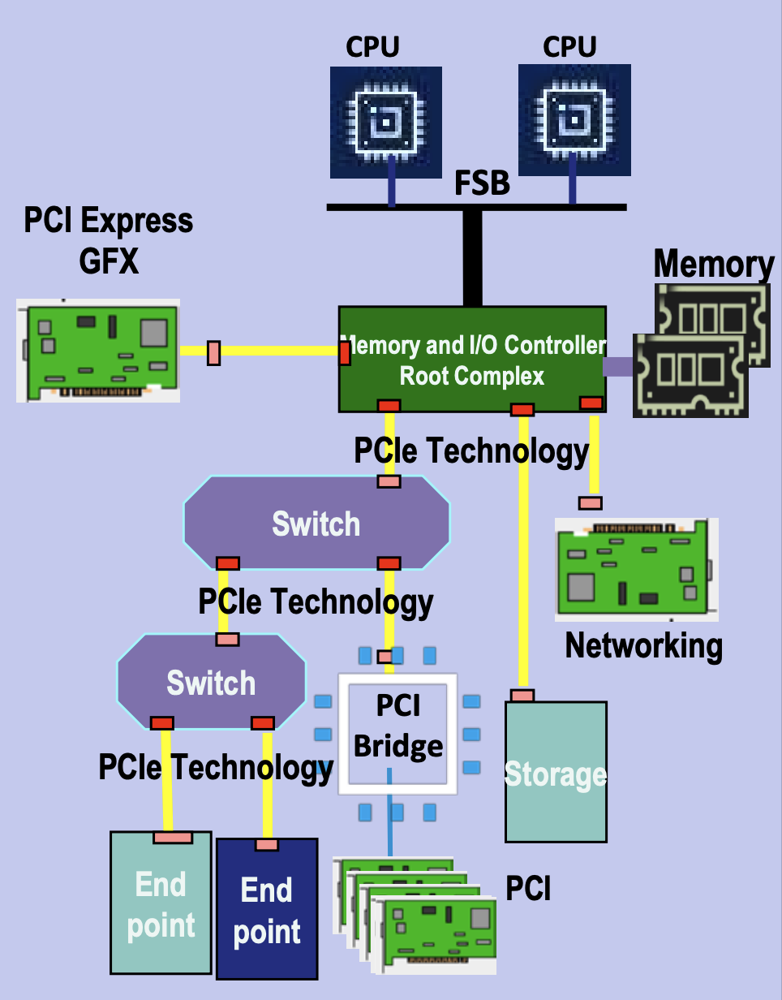

<!--Copyright © ZOMI 适用于[License](https://github.com/Infrasys-AI/AIInfra)版权许可-->

# 07.大模型集群互联技术

Author by: SingularityKChen

本章是集合通信的最后一个部分的内容，将介绍 XPU （GPU/NPU）卡间互联与 Scale-Up、节点间互联与 Scale-Out 的相关概念以及产业界 Scale-Up 和 Scale-Out 的诸多通信协议的纷争。

## Scale-Up 和 Scale-Out 的背景

随着大模型参数规模不断增加，其对算力和内存的需求也与日俱增，对算力集群的规模需求也在不断增加：从千卡到十万卡到百万卡规模。而构建这样巨大的算力集群，将各算力和存储池化，则需要通过 scale-up 和 scale-out 实现。

## XPU 卡间互联与 Scale-Up

Scale-Up fabric 有以下要求：超低延迟和抖动、访存保序、非阻塞、带宽利用率高、无损、零软件开销等需求。

### PCIe 诞生的背景

在上世纪90 年代末，计算机 I/O 总线的发展遇到了瓶颈：传统 PCI（Peripheral Component Interconnect）总线采用并行架构，带宽在多设备共享下容易发生争用，而且随着频率提升，时钟同步和布线的复杂度急剧增加，PCI 2.0 最高 66 MHz 的频率仅能提供 533 MB/s 的带宽；与此同时，AGP（Accelerated Graphics Port）虽然为显卡带来了更高带宽，但它只服务于 GPU，无法统一所有 I/O 需求。

那时，行业亟需一种统一的高速点对点互联方式，为每个设备提供独立链路，避免带宽争用，同时利用串行化（SerDes）替代并行总线以便提升速率，并支持热插拔和可扩展的 lane 设计（x1/x4/x8/x16），从而在灵活性和扩展性上满足未来的发展需求。

当时，硬件基本上都是围绕 Intel x86 CPU 进行构建。为了能让计算机内部能够更好地传输数据，Intel 牵头设计了PCIe总线，在 2003 年推出 PCI Express (PCIe 1.0)，作为 PCI/AGP 的继任者。它采用高速串行点对点架构，可横向扩展 lane 数，逐渐成为统一的互联标准。

(image from [PCI-SIG®](https://pcisig.com/sites/default/files/files/30%20Years%20of%20PCI-SIG%20Innovation%20Webinar_Final%20Slides.pdf))

从 2003 年至今（2025 年），PCIe 已经发布了 7 个版本，带宽每三年增长一倍，已从 PCIe 1.0 最高双向 8 GB/s 跃升为 PCIe 7.0 512 GB/s。

(image from [PCI-SIG®](https://pcisig.com/sites/default/files/files/PCI-SIG%2025%20Anniversary%20Infographic.pdf))

按照这个趋势，PCIe 8.0/9.0/10.0 标准将会在 2028 年、2031 年和 2034 年公布，其带宽将会增加到最高 4 TB/s。

| PCI 版本     | 年份 | 传输速率 | 编码方式   | x1 单向带宽 | x16 双向总带宽 |
| ------------ | ---- | -------- | ---------- | ----------- | -------------- |
| **PCI**      | 1992 | 33 MHz   | 32b/34b    | 113 MB/s    | --             |
| **PCI 2.0**  | 1993 | 66 MHz   | 64b/66b    | 533 MB/s    | --             |
| **PCIe 1.0** | 2003 | 2.5 GT/s | 8b/10b     | 256 MB/s    | 8 GB/s         |
| **PCIe 2.0** | 2007 | 5.0 GT/s | 8b/10b     | 512 MB/s    | 16 GB/s        |
| **PCIe 3.0** | 2010 | 8.0 GT/s | 128b/130b  | 1 GB/s      | 32 GB/s        |
| **PCIe 4.0** | 2017 | 16 GT/s  | 128b/130b  | 2 GB/s      | 64 GB/s        |
| **PCIe 5.0** | 2019 | 32 GT/s  | 128b/130b  | 4 GB/s      | 128 GB/s       |
| **PCIe 6.0** | 2022 | 64 GT/s  | PAM4 + FEC | 8 GB/s      | 256 GB/s       |
| **PCIe 7.0** | 2025 | 128 GT/s | PAM4 + FEC | 16 GB/s     | 512 GB/s       |
| **PCIe 8.0** | 2028 | 256 GT/s | PAM16      | 32 GB/s     | 1 TB/s         |

### NVLink 诞生的背景

随着深度学习和高性能计算在 2010 年前后迅速发展，GPU 已经成为并行计算的核心加速器，但传统的 PCIe 互联逐渐暴露出带宽不足和延迟过高的问题。以 PCIe 3.0 为例，单向带宽仅约 16 GB/s（x16 通道），而当时 GPU 内部的显存带宽已超过数百 GB/s，GPU-GPU 之间的数据交换成为性能瓶颈。

为了解决这一矛盾，NVIDIA 在 2014 年首次公布了 NVLink，采用高速差分信号和多链路聚合的方式为 GPU 与 GPU、GPU 与 CPU 之间提供更高带宽、更低延迟的互联通道，其目标是突破 PCIe 的限制，把多 GPU 之间、GPU 与 CPU 之间做成更接近同一内存域的高带宽、低延迟互联，使多 GPU 系统能够像单 GPU 一样高效协同工作。

2016 年，Pascal P100 首次把 NVLink 带到量产平台，支持多条链路成组以叠加带宽，这一做法直接奠定了后续各代 NVLink 以更多链路和更快带宽扩展规模的路线图。Volta 实现与 IBM POWER9 做到 GPU 与 CPU 直连，在当时的 Power 系统里绕开了 GPU 与 CPU 间的 PCIe 限速；同时，首次亮相的 NVLink Switch 把多条 NVLink 聚合成非阻塞交叉互联，让 16 卡 V100 的 DGX-2 能在单机内实现全互联，这是 NVLink 从点对点走向交换网络的关键转折。Ampere 时代引入第三代 NVLink，DGX A100 机内用 6 颗第二代 NVSwitch 把 8 卡 A100 做成全互联拓扑；这一代的变化不在更大的 GPU 域，而在更干净的机内全互联与更高端口速率的工程化落地。

NVLink 原本只用于机箱内部通信。2022 年，Hopper 实现跨机箱的域：推出 **NVLink Switch System**，把 NVLink 从机内/机箱级扩展到跨节点、跨机箱的域，可将多达 256 块 H100组成一个 NVLink 域；与此同时，**NVLink-C2C** 作为片间（die/package）一致性互联用于 Grace-Hopper 等形态，把 CPU 大容量内存纳入可寻址空间，这两项共同把 NVLink 从机内总线升级为“机柜-级域内网络”的角色。Blackwell 进入第五代 NVLink，NVL72 单柜把 72×Blackwell 组成一个超高带宽 NVLink 域、GPU 与 GPU 互通总带宽达 130 TB/s；单一 NVLink 域可扩展到 576 GPU 的上限。

2022年，英伟达推出 **NVLink Switch System**，将 NVSwitch 芯片独立出来，变成了 NVLink 交换机，用于连接服务器之间的 GPU 设备。这意味着，节点已经不再仅限于1台服务器了，而是可以由多台服务器和网络设备共同组成。

这些设备处于同一个 HBD（High Bandwidth Domain，超带宽域）。 英伟达将这种以超大带宽互联16卡以上GPU-GPU的Scale Up系统，称为超节点（SuperPod）。

> NVLink 从“多链路点对点”的板间直连起步，经由 **NVSwitch** 完成机内全互联，再以 **NVLink Switch System** 扩展到跨机箱的 **域内网络**；期间通过 **NVLink-C2C** 把 CPU 的大容量内存纳入可寻址空间，最终 Blackwell 把 NVLink 域做成“机柜为基本单元、可拼成数百 GPU 的统一加速器”。这也是其从单机 Scale-Up 向“机柜级 Scale-Up”的关键跨越。

下表总结了 NVLink 从诞生至今的时间线、性能指标和对应的 GPU 型号：

| NVLink 代际 | 年份   | 单链路速率 | 最大链路数 | GPU 总带宽 | 对应 GPU 架构 / 型号 | NVSwitch 世代             | 关键改变 / 重新定位                                                                                 |
| ----------- | ------ | ---------- | ---------- | ---------- | -------------------- | ------------------------- | --------------------------------------------------------------------------------------------------- |
| NVLink 1    | 2016   | 20 GB/s    | 4          | 80 GB/s    | Pascal P100          | 无（仅点对点）            | 首次量产化；支持链路成组叠带宽，确立“多链路聚合”范式                                                |
| NVLink 2    | 2017   | 25 GB/s    | 6          | 300 GB/s   | Volta V100           | NVSwitch v1（实验性）     | 与 IBM POWER9 实现 CPU↔GPU 直连；NVSwitch 首秀，把 NVLink 从点对点扩展为交换网络                   |
| NVLink 3    | 2020   | 50 GB/s    | 12         | 600 GB/s   | Ampere A100          | NVSwitch v2，8 GPU 全互联 | 机内全互联工程化：6×NVSwitch 连接 8×A100，提升端口速率与拓扑整洁度                                  |
| NVLink 4    | 2022   | 100 GB/s   | 18         | 900 GB/s   | Hopper H100          | NVSwitch v3，256 GPU      | NVLink Switch System 把域扩展到跨节点/机箱，最多 256×H100；引入 NVLink-C2C 实现 CPU↔GPU 片间一致性 |
| NVLink 5    | 2024   | 200 GB/s   | 18         | 1.8 TB/s   | Blackwell B100       | NVSwitch v4，576 GPU      | 进入机柜级“单域”常态化：NVL72 单柜 72 GPU、域内 130 TB/s，总规模可达 576 GPU                        |
| NVLink 6    | \~2026 | 400 GB/s\* | 18+        | 3.6 TB/s\* | Rubin（计划）        | NVSwitch v5（预期）       |                                                                                                     |
| NVLink 7    | \~2028 | 800 GB/s\* | 18+        | 7.2 TB/s\* | Vera（计划）         | NVSwitch v6（预期）       |                                                                                                     |

### 其他 Scale-Up 协议

除了 NVLink 之前，目前业内还有 ETH-X、OISA、SUE、UALink、UB 等协议。

## 节点间互联与 Scale-Out

## 本节视频

<html>
<iframe src="https://player.bilibili.com/player.html?aid=1356081426&bvid=BV1Wz421q7SV&cid=1602896751&page=1&as_wide=1&high_quality=1&danmaku=0&autoplay=0" width="100%" height="500" scrolling="no" border="0" frameborder="no" framespacing="0" allowfullscreen="true"></iframe>
</html>

## 引用

- [一文看懂英伟达的NVLink技术, 鲜枣课堂, 20250520](https://mp.weixin.qq.com/s/gkm23FxWCTR4UFZYJ3onEw?poc_token=HGKQLmijVfsZp_r8vUDpiC8N_5C0mhuAhZV9LXx2)
- [The Path Is Set For PCI-Express 7.0 In 2025](https://www.nextplatform.com/2022/06/23/the-path-is-set-for-pci-express-7-0-in-2025/)