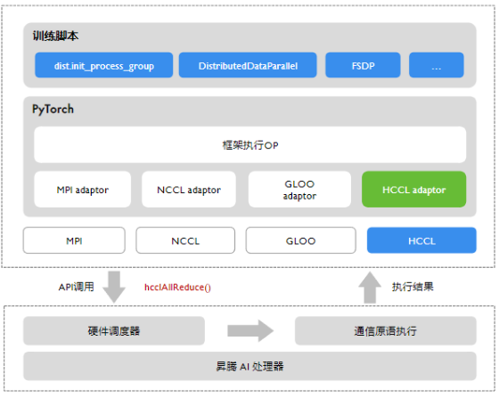
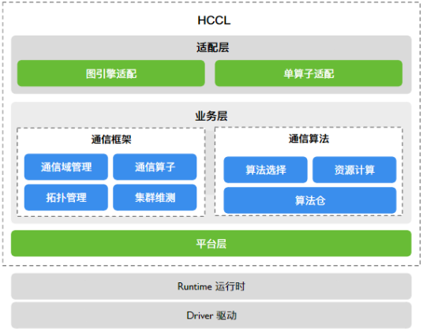
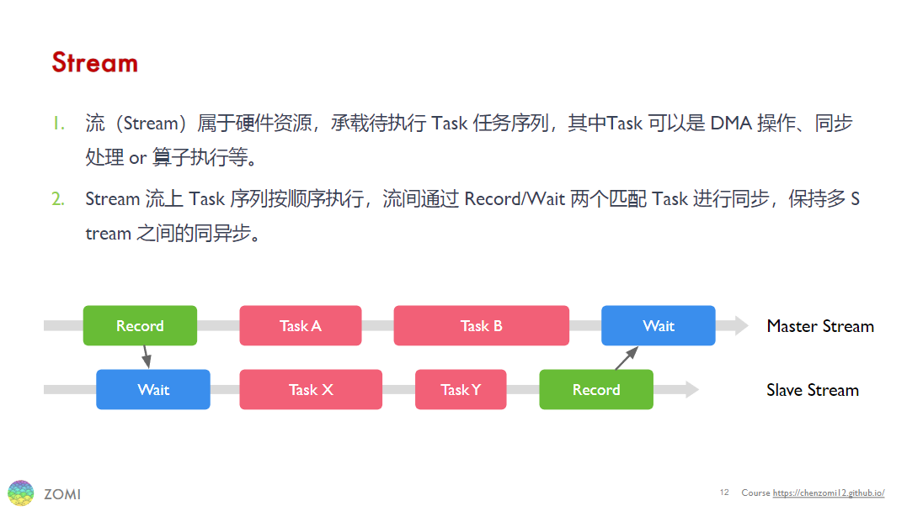
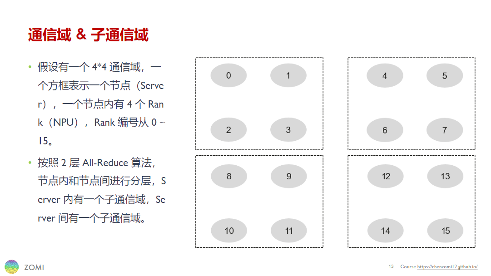
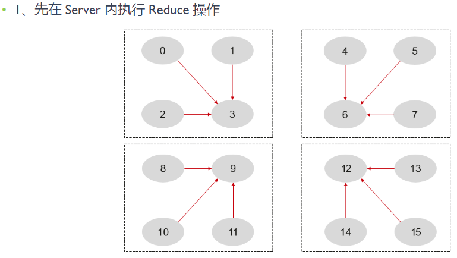
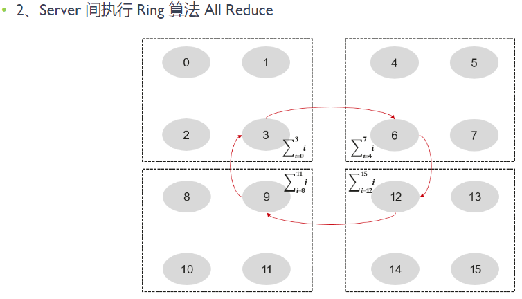
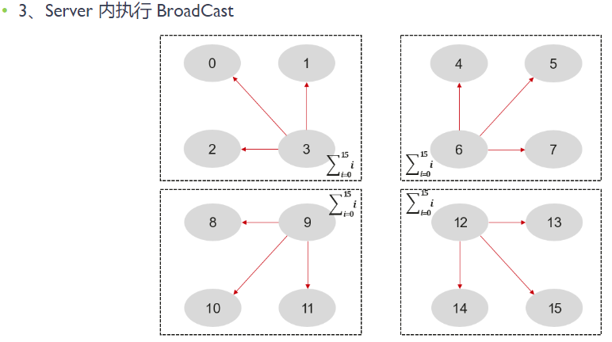

<!--Copyright © ZOMI 适用于[License](https://github.com/Infrasys-AI/AIInfra)版权许可-->

# 08.华为HCCL架构介绍

作者：陈彦伯

本节简单介绍**华为的 HCCL 架构**，包括：

1) HCCL的基本介绍；
2) HCCL通信的基础概念；
3) HCCL开发流程。

这几部分。

注意，本节以前置课程[NCCL 基本介绍](./04NCCLIntro.md)与[NCCL API 解读](./05NCCLAPI.md)为基础。建议读者在阅读本节之前，先大致了解 NCCL，以便更好地体会 HCCL 与 NCCL 的异同。

## HCCL的基本介绍

HCCL（Huawei Collective Communication Library）是华为自研的基于昇腾 AI 处理器的高性能集合通信库，支持AllReduce、Broadcast、AllGather、ReduceScatter、AlltoAll等通信原语，Ring、Mesh、Halving-Doubling（HD）等通信算法，基于HCCS、RoCE和PCIe高速链路实现集合通信。
HCCL 可以被归类为前置教程[XCCL 通信库](./02XCCL.md)中提到过的“围绕 NCCL 衍生出的通信库”，在核心算法与接口的诸多层面上都体现出与 NCCL 的相似性。
本节主要关注 HCCL 相较 NCCL 的特色之处。

### HCCL 在 AI 系统中的位置

就像 NCCL 之于英伟达 GPU，HCCL 与昇腾 NPU 及其配套软硬件也是高度耦合的。HCCL 赋能昇腾 NPU 之间的直接通信：由于省去了数据在 device-host 间搬运以及经 host 侧处理这两个环节，因此性能极高。这种 NPU 间直接通信的特性需要硬件层面的支持，因此 HCCL 只兼容某些特定型号的昇腾 NPU。目前 HCCL 支持大部分 Atlas 训练系列产品，但对推理和边缘设备（如 310P 和 310B 系列芯片）的支持尚不全面。软件层面，HCCL 的定位是昇腾 AI 训练加速库（即 CANN）的底层通信库，属于 CANN 的核心组件。下图展示了 CANN 的架构，HCCL 位于 Runtime 与 Driver 之上，AI框架之下。

从应用层面看，HCCL 既可以直接在 PyTorch 或 MindSpore 等框架中以通信后端的形式被调用，也可以用于开发一些自定义功能。
本节将主要围绕 HCCL 作为通信后端的应用展开。
如下图所示，PyTorch 支持的通信后端包括 NCCL、HCCL、Gloo 与 MPI 等。
这些后端以 adaptor 的形式被接入到各种框架中。
开发者直接在 PyTorch 函数（如下图中“训练脚本”层所展示的 dist.init_process_group、DistributedDataParallel、FSDP 等）中以参数的形式选择后端，无须关心底层通信库的实现。
一些基于 PyTorch 的更高抽象级的框架，如 DeepSpeed 与 Megatron 等，则直接继承 PyTorch 中的通信接口，原理类似，这里不过多讨论。

总而言之，HCCL 向下适配硬件接口，向上为框架提供后端能力，在 AI 系统中属于一个偏辅助的定位，为昇腾 NPU 集群提供高性能的通信能力。对 AI 开发者而言，主要通过通信后端的形式被调用。
对昇腾 NPU 集群而言，HCCL 是最高效的通信后端选择，在一些对通信延迟要求极高的场景（如 TP 并行等，参考前置课程[集合通信关键作用](../03CollectComm/02CCOverview.md)中对几种并行方式的介绍），HCCL 的性能优势尤为明显。

### HCCL 的架构

目前，HCCL 开源了除 Runtime 和 Driver 之外的上层模块。如下图所示，HCCL 的开源部分可以大致分为适配层、业务层与平台层这三个抽象层级。

+ 适配层主要面向 AI 框架，其主要功能是为不同框架提供易用的通信域管理和通信算子接口。上图中，“单算子适配”与“图引擎适配”分别对应 PyTorch、MindSpore 等框架的单算子模式（又叫即时执行模式，即 eager mode）与图模式。在一些对性能需求较高的深度优化场景中，预先构建好的计算图在执行时仍可使用 HCCL 来进行高效通信。

+ HCCL 的主要通信框架与通信算法被包含在业务层。在前置课程[集合通信操作/原语/算子](../03CollectComm/03CCPrimtive.md)中曾经提到，XCCL 中通信原语（如 Reduce、Gather 等）的实现一般需要明确通信域信息。换句话说，同一通信原语在不同条件（如设备数量、网络拓扑、并行方式等）下采用的具体算法可能是不同的。因此，业务层又可以细分为两个模块：
  + 通信框架：主要负责管理并维护通信域信息，包括创建、销毁通信域、设置通信域的通信参数、实现通信任务下发等。
  + 通信算法：根据通信域信息完成通信任务编排。HCCL 算法仓为不同通信域实现了对应的通信算法，并根据场景自动执行算法选择。

+ 平台层主要提供 NPU 之上与集合通信关联的资源抽象，并提供相应的维护、测试能力。

## HCCL 通信的基础概念

总的来说，HCCL 通信的基础概念与 NCCL 类似。出于内容完整性考虑，这里只简单介绍流（Stream）与通信域（Communication Domain）这两个概念。

在 HCCL 中，流（Stream）是通信的基本单位。
这里我们可以简单地把数据理解成水，而所谓“流”则是数据通过不同容器（存储）、管道（通信）并接受不同处理（计算）的过程。
如下图所示，流可以分为主流（Master Stream）和从流（Slave Stream），这与通信域中的主从 Rank 概念相对应。
在数据处理过程中，原始数据输入主 Rank 上，成为主流。被发送至从 Rank 上则变成从流，而在从 Rank 上经过处理的从流在发送回主 Rank 后又将汇入主流。

通信域对应上述水流比喻中不同的容器与管道。下图展示了一个由4机16卡组成的 4*4 通信域，其中一个虚线方框表示一个节点（Server），一个灰色椭圆表示一个 Rank （AI 加速卡）。每个节点内部包含四个 Rank，构成一个子通信域。注意，下图中未画出网络拓扑，真实场景也会比这复杂很多。

基于上述流和通信域的概念，我们再来看一下集合通信的一般流程。在分布式场景中，集合通信往往需要经历以下几个阶段：

1. 在任务开始之前，根据设备信息配置通信参数并初始化通信域。
2. 基于集群信息与网络拓扑实现 NPU 建链。如果建链超时则报错并退出进程。
3. 执行通信算法：HCCL会将通信算法编排、内存访问等任务通过 Runtime 下发给昇腾设备的任务调度器，设备根据编排信息调度并执行具体的通信算法。在此阶段，通信域中的不同 Rank 执行不同的任务。
4. 所有通信任务执行完成后，销毁通信域，释放资源。

最后，我们以 2 层 Ring AllReduce 为例来看一下通信算法的执行过程。下图展示了不同 Rank 在 Ring AllReduce 过程中的数据流动情况。首先，同一节点内执行 Reduce 操作，各 Rank 将数据发送到节点的主 Rank 上（对应图中第 3、6、9、12 个 Rank）。然后，主 Rank 将执行一个 Ring AllReduce 操作，使得每一个节点都有一份完整的数据备份。最后，每个节点的主 Rank 再执行一次 Boardcast 操作，将数据广播给其他 Rank，完成一次完整的 AllReduce 操作。

## HCCL 开发流程

## 内容参考

1. 昇腾 CANN 官方网站：[https://www.hiascend.com/cann](https://www.hiascend.com/cann)
2. HCCL 官方文档（基于 CANN 8.2.RC1 版本）：[https://www.hiascend.com/document/detail/zh/canncommercial/82RC1/hccl/hcclug/hcclug_000001.html](https://www.hiascend.com/document/detail/zh/canncommercial/82RC1/hccl/hcclug/hcclug_000001.html) 

