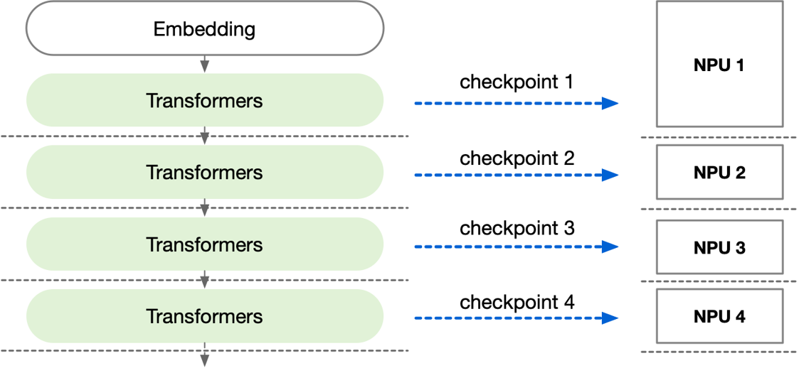
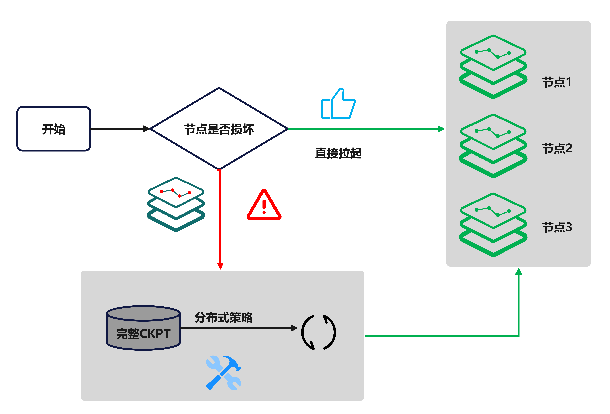
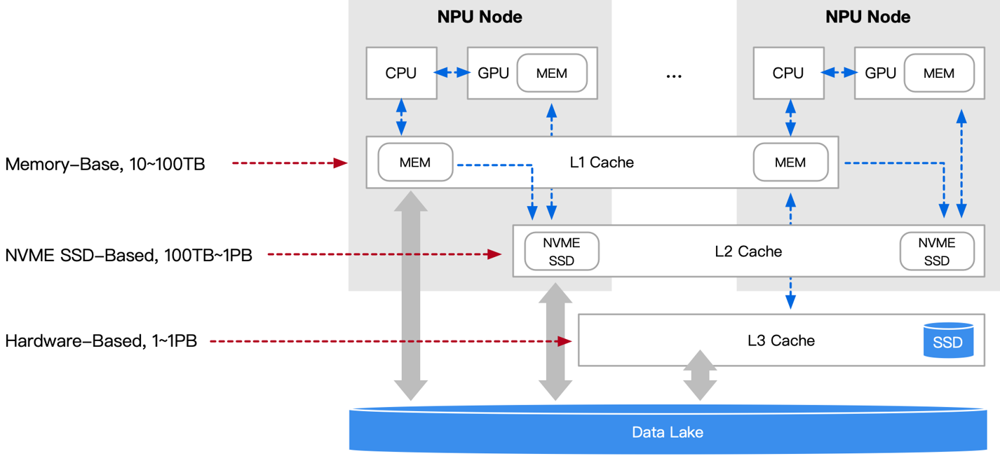

<!--Copyright © ZOMI 适用于[License](https://github.com/chenzomi12/AIInfra)版权许可-->

# 大模型 CKPT 优化手段

## 简介

大模型保存模型权重参数（Checkpoint，CKPT）是大模型训练中，在面对硬件故障、系统崩溃、网络断联、冷却不均等问题时，千卡 AI 集群会出现中断导致大模型训练难以持续进行，因此需要通过定期保存模型权重参数来保存和恢复进度。
对于百/千亿参数 LLMs 大模型，CKPT 时间开销从分钟级到小时级不等（CKPT 存储 read/write 耗时与模型大小成正比） 。保存 CKPT 时大模型训练任务需要暂停。

如图，一旦大模型训练过程出现中断，之前迭代的 Epoch 次数在恢复时需要重新计算，通常会花费数小时的时间。大模型训练过程一般使用千卡规模 AI 集群，因此总体损失数千个 NPU 卡时间。

大模型训练过程频繁保存和加载 CKPT 都是个灾难，因此 CKPT 配置的频率，决定了 AI 集群中故障恢复后的重训成本。

## 原理分析

### 大模型参数量大
大模型参数分为：模型架构参数、优化器参数、损失函数参数等等。
#### 模型架构参数
模型架构参数指的是模型的基本构成和组成，决定了模型如何处理输入数据并生成输出，主要包括：
- **神经元数量：**
在神经网络中，每个神经元都是一个处理单元，负责接收输入、进行计算并产生输出。神经元的数量直接影响模型的复杂度和学习能力。
- **层类型：**
神经网络由多个层组成，不同类型的层（如卷积层、全连接层、池化层等）具有不同的功能和特性。层类型的选择对模型的性能有重要影响。
- **激活函数：**
激活函数用于在神经网络中引入非线性因素，使得模型能够学习复杂的非线性关系。常见的激活函数包括 ReLU、Sigmoid、Tanh 等。
- **隐藏层大小和宽度：**
隐藏层是神经网络中位于输入层和输出层之间的层，其大小和宽度（即神经元数量）决定了模型能够学习到的数据内在关系的复杂程度。
- **注意力数量：**
在基于 Transformer 的大模型中，注意力头是一种并行注意力机制，用于捕捉更多的并行化关系。注意力头的数量越多，模型能够同时关注的信息就越多。

#### 优化器参数
优化器是一种调整模型权重的算法。其参数决定了优化器如何根据损失函数来更新权重。主要包括：
- **学习率：**
学习率决定了权重更新的步长，过大的学习率可能导致模型无法收敛，而过小的学习率则可能导致训练过程过于缓慢。
- **动量：**
动量是一种加速梯度下降的策略，它模拟了物理中的动量概念，帮助模型在相关方向上加速收敛，并抑制震荡。

#### 损失函数参数
损失函数用于衡量模型预测与真实值之间的差距，其参数决定了大模型的训练速度和性能。主要包括：
- **权重:**
在某些损失函数中，可以对不同类型的误差赋予不同的权重，以强调某些方面的性能。
- **温度参数：**
在交叉熵损失等函数中，温度参数可以控制模型预测分布的平滑程度，影响模型对不确定性的处理能力。

### 保存时机不同导致不同策略带来的时间消耗不同
以上参数，对于业界正在流行的大模型来说，均是 B 级别（Billion，百万）级别。因此参数需要切分到不同 NPU，每个 NPU 有独立的模型权重参数。如图过程如下。

- **保存：**
保存一次完整 CKPT 需要聚合所有 NPU 的权重信息，然后再回传对象存储服务器。
- **写入：**
加载一次 CKPT 需要把聚合后的模型权重按照 AI 集群分布进行切分，逐个 NPU 加载。
- **切分与恢复：**
如图，数据湖保存分片的 CKPT 和完整的 CKPT。程序定期保存分片 CKPT，定期汇聚分片 CKPT。如果没有节点坏掉，中断恢复直接拉起分片存储的 CKPT，便于加载；如果节点坏掉，使用完整的 CKPT 根据新的分布式策略进行切分后重新拉起。

## 优化方案
如图展示了常规大模型训练计算与存储之间关系，这就造成了资源的闲置。现有如下优化方案。

### 1.存储 CKPT 至数据湖中

- 单节点：每个训练节点使用更快的NVME SSD代替HDD进行存储，再分层回传数据湖；
- 多节点：一个节点挂了，其CKPT被其他节点代替继续进行训练；
优点：大容量、高吞吐、数据可共享

### 2.CKPT 的保存过程从同步改成异步

- 方式：将 save() 过程与下一轮的训练迭代并行，计算掩盖存储耗时。
- 问题：系统崩溃、节点挂掉时需要处理数据部分写入逻辑。
- 方案：CKPT 添加 success 标记位便于恢复

### 3.CKPT 的流式分块存储

- 方式：流式和分块上传，无需等 Checkpoint 全部写完到 Memory/SSD 就开始向数据湖上传。
- 问题：系统崩溃、节点挂掉时需要处理数据部分写入逻辑。
- 方案：CKPT 添加 success 标记位便于恢复。

### 4.多文件加速聚合

torch.save() 将多个 tensor 分别写入各自文件 idx，对meta data要求高，写入开销大。
重写 torch.save()/load() 方法定义数据存储流程，聚合多个 tensor 数据文件；为了 load 过程中数据读取，保留每份数据的索引 index。

### 5.本地内存缓存，同步写内存

对于 Latest Checkpoint 采用异步写的同时，CKPT save() 时驻留在 CPU 内存，当训练需要恢复时 load() 直接读取，再从数据湖中读取备份到内存，解决 Checkpoint 快速加载问题

### 6.数据拷贝过程使用零拷贝

通过操作系统的内核技术，实现用户 buffer 间的数据传递，达到数据零拷贝、内存节省的目的。此时 CKPT 数据要求存放在节点内存中

### 7.量化压缩
如图，这是包含量化压缩过程的保存模型权重参数的流程图。

首先，在接到保存 CKPT 的需求时，量化配置管理器执行分布式搜索以识别最佳量化配置。接下来，量化器使用识别的配置压缩模型。评估器将试验结果回传至量化配置管理器中，然后管理器继续序列化配置回传至量化器中迭代，得到量化模型，Delta编码器利用感知量化的增量压缩技术进行无损压缩，然后将 CKPT 存储起来。最后，增量编码器处理CPU内存中的压缩检查点。

量化器：给定特定的量化配置，它能将所有模型参数相应地分为三类：修剪（如果低于修剪阈值，则设置为零）、保护（如果高于保护阈值，则保持完全精度）或量化（应用非均匀量化）。主要使用一种非均匀量化方案，主要使用敏感度感知的近似 K-Means 聚类，其中量化粒度由 K-Means 确定。与传统方法相比，该方法提供了更好的量化模型，并且减少了运行时开销，并允许任意数量的量化，灵活度很高从。

Delta 编码：利用连续检查点之间的相似性，使用感知量化的增量压缩来执行无损压缩，。增量编码器采用了一种新颖的参数重排技术，实现了有效的行程编码，将存储开销减少了高达两个数量级。在增量压缩和运行长度编码之后，以组合字节流格式对模型参数进行编码。

