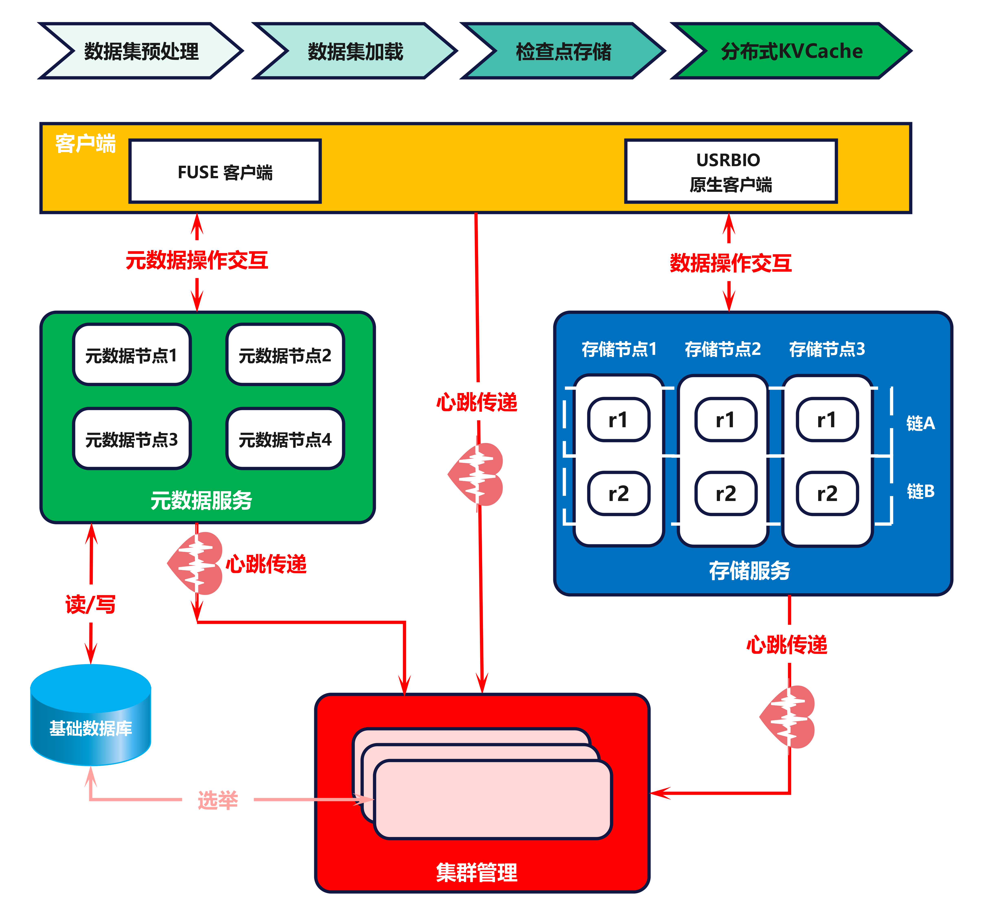
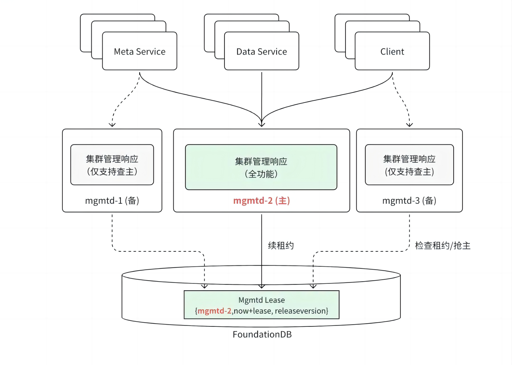
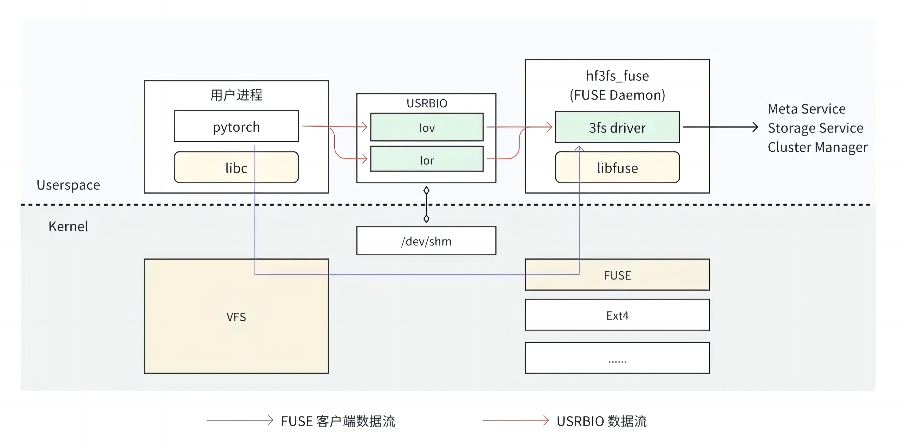
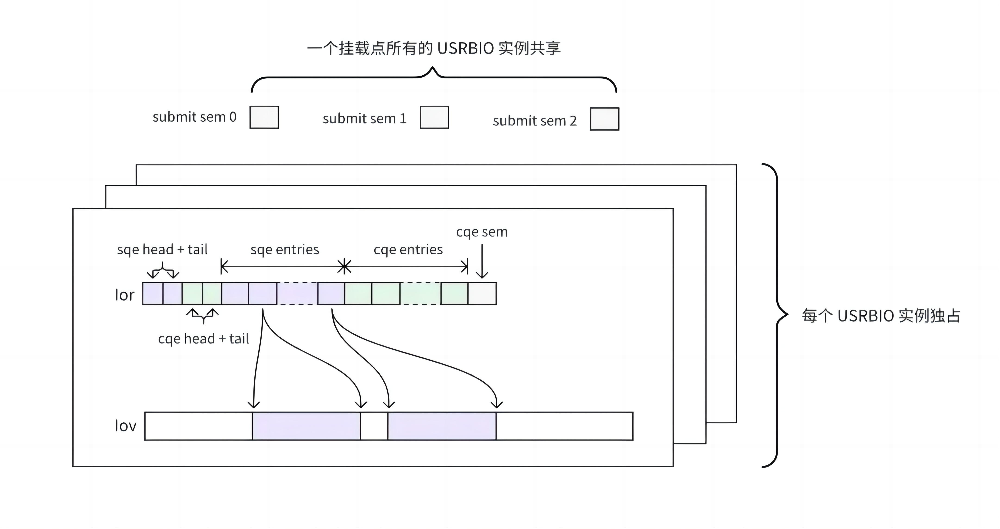
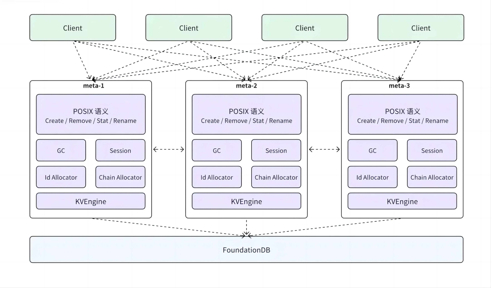
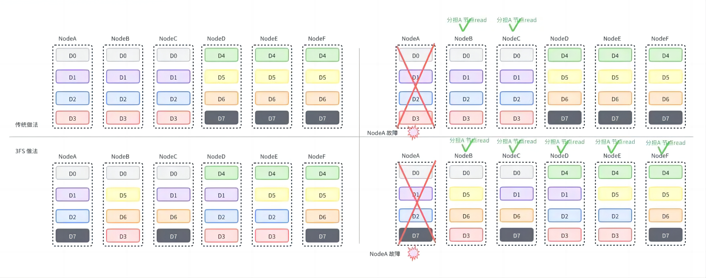
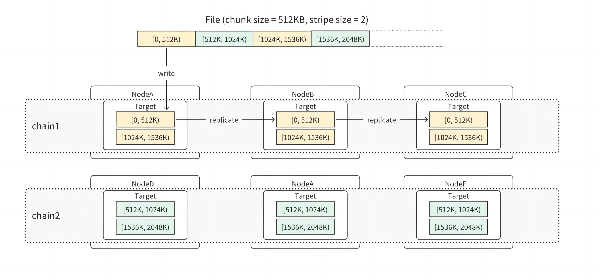
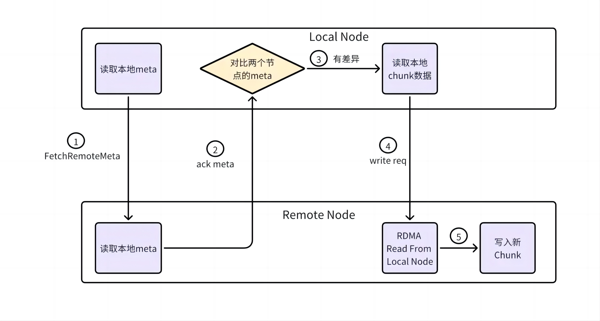

<!--Copyright © ZOMI 适用于[License](https://github.com/chenzomi12/AI Infra)版权许可-->

# DeepSeek 3FS 架构解析

author by: 吴冠霆

DeepSeek 3FS 是一个基于深度学习的文件系统，旨在提供高效的文件访问和处理能力。它采用了分布式存储和计算架构，能够支持大规模数据处理和分析任务。

!!!!!!!!!!!!!!!
内容太多太杂，要精简现在字数太多，多些文字少些列表，多些图和介绍

DeepSeek 3FS 具有以下特点：

- 分布式存储：采用分布式文件系统架构，支持多节点存储和访问。
- 深度学习支持：支持 AI 模型的训练和推理。
- 高效性能：采用了优化的存储和计算算法，提供快速的文件访问和处理速度。
- 可扩展性：支持水平扩展，能够适应不同规模的文件系统需求。
- 安全性：提供安全的文件访问和处理机制。
- 易用性：提供简单易用的接口和工具，方便用户进行文件系统管理和操作。
- 可扩展性：支持水平扩展，能够适应不同规模的文件系统需求。

!!!!!!!!!!!!!!!
下面图片没有解释

## 架构概览

3FS 整个系统由四个部分组成，分别是**集群管理（Cluster Manager）、客户端（Client）、元数据服务（Meta Service）、存储服务（Storage Service）**。所有组件均接入 RDMA 网络实现高速互联，DeepSeek 内部实际使用的是 InfiniBand。

!!!!!!!!!!!!!!!
下面的内容感觉是大模型生成的，不要用这种方式，看得不清楚

1. Cluster Manager 是整个集群的中控，承担节点管理的职责：

- 采用多节点热备份的方式解决自身的高可用问题，选主机制复用 Meta Service 依赖的 FoundationDB 实现；
- Meta Service 和 Storage Service 的所有节点，均通过周期性心跳机制维持在线状态，一旦这些节点状态有变化，由 Cluster Manager 负责通知到整个集群；

2. Client 同样通过心跳向 Cluster Manager 汇报在线状态，如果失联，由 Cluster Manager 帮助回收该 Client 上的文件写打开状态。Client 可以通过两种方式接入 3FS：

- FUSE 客户端 hf3fs_fuse 方便易用，提供了对常见 POSIX 接口的支持，可快速对接各类应用，但性能不是最优的；
- 原生客户端 USRBIO 提供的是 SDK 接入方式，应用需要改造代码才能使用，但性能相比 FUSE 客户端可提升 3-5 倍。

3. Meta Service 提供元数据服务，采用存算分离设计：

- 元数据持久化存储到 FoundationDB 中，FoundationDB 同时提供事务机制支撑上层实现文件系统目录树语义；
- Meta Service 的节点本身是无状态、可横向扩展的，负责将 POSIX 定义的目录树操作翻译成 FoundationDB 的读写事务来执行。

4. Storage Service 提供数据存储服务，采用存算一体设计：

- 每个存储节点管理本地 SSD 存储资源，提供读写能力；
- 每份数据 3 副本存储，采用的链式复制协议 CRAQ（Chain Replication with Apportioned Queries）提供 write-all-read-any 语义，对读更友好；
- 系统将数据进行分块，尽可能打散到多个节点的 SSD 上进行数据和负载均摊。

## 1. 集群管理

### 整体架构

3FS 集群可以部署单个或多个管理服务节点 mgmtd。这些 mgmtd 中只有一个主节点，承接所有的集群管理响应诉求，其它均为备节点仅对外提供查询主的响应。其它角色节点都需要定期向主 mgmtd 汇报心跳保持在线状态才能提供服务。

### 节点管理

每个节点启动后，需要向主 mgmtd 上报必要的信息建立租约。mgmtd 将收到的节点信息持久化到 FoundationDB 中，以保证切主后这些信息不会丢失。节点信息包括节点 ID、主机名、服务地址、节点类别、节点状态、最后心跳的时间戳、配置信息、标签、软件版本等。

租约建立之后，节点需要向主 mgmtd 周期发送心跳对租约进行续租。租约双方根据以下规则判断租约是否有效：

- 如果节点超过 T 秒（可配置，默认 60s）没有上报心跳，主 mgmtd 判断节点租约失效；
- 如果节点与主 mgmtd 超过 T/2  秒未能续上租约，本节点自动退出。

对于元数据节点和客户端，租约有效意味着服务是可用的。但对于存储服务节点，情况要复杂一些。一个存储节点上会有多个 CRAQ 的 Target，每个 Target 是否可服务的状态是不一致的，节点可服务不能代表一个 Target 可服务。因此，Target 的服务状态会进一步细分为以下几种：

表 1 Target 服务状态分类 

| **状态** | **可读** | **可写** | **说明** |
| :---: | :---: | :---: | :---: |
| serving | 是 | 是 | 服务在线，可以响应客户端请求 |
| syncing | 否 | 是 | 服务在线，正在进行数据恢复 |
| waiting | 否 | 否 | 服务在线，数据恢复尚未启动 |
| lastsrv | 否 | 否 | 服务离线，且是 CRAQ 最后一个可以提供服务的 Target |
| offline | 否 | 否 | 服务离线或磁盘介质损坏 |

元数据和存储节点（包括其上的 Target）的信息，以及下文会描述的 CRAQ 复制链表信息，共同组成了集群的路由信息（RoutingInfo）。路由信息由主 mgmtd 广播到所有的节点，每个节点在需要的时候通过它找到其它节点。

### 选主机制

mgmtd 的选主机制基于租约和 FoundationDB 读写事务实现。租约信息 LeaseInfo 记录在 FoundationDB 中，包括节点 ID、租约失效时间、软件版本信息。如果租约有效，节点 ID 记录的节点即是当前的主。每个 mgmtd 每 10s 执行一次 FoundationDB 读写事务进行租约检查，具体流程如下图所示。

- 通过周期性续租，读取 LeaseInfo 中的租约信息，判断当前是否有主节点；
- 如果有主节点，检查主节点的租约是否有效；
- 如果主节点的租约有效，直接返回；
- 如果主节点的租约无效，通过 FoundationDB 读写事务，尝试将 LeaseInfo 中的节点 ID 替换为当前节点 ID，以建立新的租约；
- 如果替换成功，当前节点成为主节点，返回；
- 如果替换失败，当前节点继续等待。

选主机制的正确性

- LeaseInfo 的读取和写入在同一个 FoundationDB 读写事务里完成，FoundationDB 读写事务确保了即使多个 mgmtd 并发进行租约检查，执行过程也是串行一个一个的，避免了多个 mgmtd 交织处理分别认为自己成为主的情况。
- 发生切主之后新主会静默 120s 才提供服务，远大于租约有效时长 60s，这个时间差可以保证老主上的在运行任务有充足的时间处理完，避免出现新主、老主并发处理的情况。

## 2. 客户端服务

### 整体架构

3FS 提供了 FUSE 客户端 hf3fs_fuse 和原生客户端 USRBIO：

- FUSE 客户端适配门槛较低，开箱即用。在 FUSE 客户端中，用户进程每个请求都需要经过内核 VFS、FUSE 转发给用户态 FUSE Daemon 进行处理，存在 4 次“内核 - 用户态”上下文切换，数据经过 1-2 次拷贝。这些上下文切换和数据拷贝开销导致 FUSE 客户端的性能存在瓶颈；
- USRBIO 是一套用户态、异步、零拷贝 API，使用时需要业务修改源代码来适配，使用门槛高。每个读写请求直接从用户进程发送给 FUSE Daemon，消除了上下文切换和数据拷贝开销，从而实现了极致的性能。

### FUSE 客户端

UFUSE 客户端基于 libfuse lowlevel api 实现，要求 libfuse 3.16.1 及以上版本。和其它业界实现相比，最大的特色是使用了 C++20 协程，其它方面大同小异。具体见表 2。

!!!!!!!!!!!!!!!!
内容太复杂了，下面的表格没法看，用文字和图表示

表 2 FUSE 客户端特点分析 

| **分类** | **实现** | **分析** |
| :---: | :---: | :---: |
| POSIX 兼容性 | 不支持文件锁、xattr，其他主流操作均支持 | 文件锁功能对于有多机强一致性要求的业务（如数据库）比较重要。 |
| 目录遍历 | 实现了 readdirplus 版本的接口。  一次完整的目录遍历会包含一次 opendir、一次 closedir、多次 readdirplus 调用，其中 opendir 和 closedir 会分别触发一次 FUSE 请求，readdirplus 会触发多次 FUSE 请求。  第一次调用 readdirplus 时，3FS 分批从 Meta Service 获取到完整的文件列表（不包含文件属性），缓存到内存中。这个缓存会在 closedir 的时候释放。  每次 readdirplus 时，从缓存中拿到本次要返回的文件列表，向 Meta Service 发送一次 RPC 批量获取到这些文件的属性。 | 该实现对文件属性的获取优化如下： 1. 相比 readdir 版本，readdirplus 版本会将文件属性信息一并待会给内核缓存，可以有效减少接下来一段时间的 stat 调用。 2. 在获取属性的时候采取了批量方式，比并行多个操作更高效。 这个实现对于有着千万级及以上文件的巨型目录不够友好： 1. 第一次 readdirplus 调用会卡住非常长时间。 2. 缓存住全部文件列表需要的内存较多。 以上缺点可通过业务侧的合理控制目录大小来规避。 |
| 预读 | FUSE readahead 参数默认调整到 16MB。 | 16MB readahead 参数对于顺序读场景（如模型加载）比较友好。 |
| 读写缓存 | dio 写直接落到后端。 buffered IO 启用了 page cache。 每个文件的写只有单路并发，会维护一个 1MB（可调整） write bufffer，顺序写积累到某一阈值再往下刷写。 | write buffer 的设计是一个面向写吞吐优化的设计，对顺序写比较友好。 |
| 文件长度延迟更新 | 数据下刷后不会马上向 Meta Service 更新文件 size，而是由后台任务周期（默认 30s ）或者 close、fsync 触发更新。 | 该设计是可降低 Meta Service 的写压力，但是相对地松懈了写数据的一致性。 |
| 异步 close | close 操作会立即返回，不会等待数据落盘。 | 该设计是为了提高写性能，但是会降低写数据的一致性。 |
| 写打开文件延迟删除 | 文件以写模式打开时，会和 Meta Service 建立 session，可以保护文件在使用过程中不被删除。 文件以读模式打开时无此保护，在读的时候文件如果被删除会报错。 | 分开处理读写模式在语义和效率之间取得一定平衡。 |
| 递归删除目录 | 提供了定制的 rm -rf 能力，将目录直接发送到 Meta Service 后台处理，客户侧直接返回结果。 | rm -rf 在现实中是非常高频的使用方式，但是大目录执行会非常慢，因为 POSIX 标准并没有定义递归删除目录的接口，会以“递归遍历所有目录 + 单并发删除”的方式模拟。 3FS 的实现方式借鉴了 HDFS 的实现方式，在实现效率和用户体验上都会有大幅提升。 |

### USRBIO 客户端

基于共享内存 RingBuffer 的通信机制被广泛应用在高性能存储、网络领域，在 DPDK、io_uring 中均有相关实现，一般采用无锁、零拷贝设计，相比其它通信机制有明显的性能提升。3FS 借鉴了此思路实现了 USRBIO 客户端，和原有的 FUSE 实现相比，有以下几个优化点：

- 整个执行路径非常精简，完全在用户态实现，不再需要陷入内核经过 VFS、FUSE 内核模块处理。
- 读写数据的 buffer 和 RDMA 打通，整个处理过程没有拷贝开销。
- 只加速最关键的读写操作，其他操作复用 FUSE 现有逻辑，在效率和兼容性之间取得了很好的平衡。此点和 GPU Direct Storage 的设计思路有异曲同工之处。

!!!!!!!!!!!!!!!!
用文字，不要大模型的列表方式，比较难理解

在实现上，USRBIO 使用了多个共享内存文件：

- 每个 USRBIO 实例使用一个 lov 文件和一个 lor 文件
  - lov 文件用来存放读写数据的 buffer。
    - 用户提前规划好需要使用的总容量。
    - 文件创建之后 FUSE Daemon 将其注册成 RDMA memory buffer，进而实现整个链路的零拷贝。
- lor 文件用来实现 loRing
  - 用户提前规划好并发度，创建多个 lor 文件，每个文件对应一个 loRing。
  - 在整个文件上抽象出了提交队列（sqe entries）和完成队列（cqe entries）。
  - 文件的尾部是提交完成队列的信号量， FUSE Daemon 在处理完 IO 后通过此信号量通知到用户进程。
- 一个挂载点的所有 USRBIO 共享 3 个 submit sem 文件
  - 此 3 个文件作为 IO 提交事件的信号量（submit sem），每一个文件代表一个优先级。
  - 一旦某个 USRBIO 实例有 IO 提交，会通过该信号量通知到 FUSE Daemon。///（就会将其对应的 submit sem 文件减 1，FUSE Daemon 会在处理完 IO 后将其加 1。）
- 所有共享内存文件在挂载点 3fs-virt/iovs/ 目录下均建有 symlink，指向 /dev/shm 下的对应文件。
  
lov、lor 共享内存文件通过 symlink 注册给 FUSE Daemon。下一章节将会进一步描述。

symlink 黑魔法

通常一个文件系统如果想实现一些非标准化的功能，采用在 ioctl 接口上集成是一个较为标准的做法。3FS 里除了用到此种方式外，对于 USRBIO、递归删除目录、禁用回收站的 rename、修改 conf 等功能，采用了在 symlink 接口上集成的非常规做法。

3FS 采用此做法原因推测如下：

- ioctl 需要提供专门的工具或写代码来使用，但 symlink 只要有挂载点就可以直接使用。
- 和其他接口相比，symlink 相对低频，可传递的参数更多。

symlink 的完整处理逻辑如下：

- 当目标目录为挂载点 3fs-virt 的 rm-rf、iovs、set-conf 目录时：
  - rm-rf：将 link 路径递归删除，请求发送给元数据服务处理；
  - iovs：建立 lov 或 lor， 根据 target 文件后缀判定是否 ior；
  - set-conf：设置 config 为 target 文件中的配置。
- 当 link 路径以 mv：开头，rename 紧跟其后的 link 文件路径到 target 路径，禁用回收站。
- 其他 symlink 请求 Meta Service 进行处理。

FFRecord

3FS 没有对小文件做调优，直接存取大量小文件性能会比较差。为了弥补这个短板，3FS 专门设计了 FFRecord（Fire Flyer Record） 文件格式，将小文件进行合并，减少文件数量，充分发挥系统的大 IO 读写能力。

FFRecord 文件格式具有以下特点：

- 合并多个小文件，减少了训练时打开大量小文件的开销；
- 支持随机批量读取，提升读取速度；
- 包含数据校验，保证读取的数据完整可靠。

以下是 FFRecord 文件格式的存储布局：

如图所示，在 FFRecord 文件格式中，每一条样本的数据会进行序列化按顺序写入，同时文件头部包含了每一条样本在文件中的偏移量和 crc32 校验和，方便做随机读取和数据校验。

## 3. 元数据服务

### 整体架构

业界基于分布式高性能 KV 存储系统，构建大规模文件系统元数据组件已成共识，如 Google Colossus、Microsoft ADLS 等。3FS 元数据服务使用相同设计思路，底层基于支持事务的分布式 KV 存储系统，上层元数据代理负责对外提供 POSIX 语义接口。总体来说，支持了大部分 POSIX 接口，并提供通用元数据处理能力：inode、dentry 元数据管理，支持按目录继承 chain 策略、后台数据垃圾回收等特性。

3FS 选择使用 FoundationDB 作为底层的 KV 存储系统。FoundationDB 是一个具有事务语义的分布式 KV 存储，提供了 NoSQL 的高扩展，高可用和灵活性，同时保证了可序列化（serializable）的强 ACID 语义。该架构简化了元数据整体设计，将可靠性、扩展性等分布式系统通用能力下沉到分布式 KV 存储，元数据服务节点只是充当文件存储元数据的代理（Proxy），负责语义解析。

利用 FoundationDB SSI 隔离级别的事务能力，目录树操作串行化，冲突处理、一致性问题等都交由 FoundationDB 解决。元数据服务只用在事务内实现元数据操作语义到 KV 操作的转换，降低了语义实现复杂度。

存算分离架构下，各元数据服务节点无状态，客户端请求可打到任意节点。但元数据服务内部通过 inode id hash，保证同目录下创建、同一文件更新等请求转发到固定元数据节点上累积批量处理，以减少事务冲突，提升吞吐。计算、存储具备独立扩展能力。

### 数据模型

元数据服务采用 inode 和 dentry 分离的设计思路，两种数据结构有不同的 schema 定义。具体实现时，采用了“将主键编码成 key，并添加不同前缀”的方式模拟出两张逻辑表，除主键外的其它的字段存放到 value 中。

表 3 数据模型逻辑表分析

| **逻辑表名** | **key** | **value** | **分析** |
| :---: | :---: | :---: | :--- |
| Dentry Table | "DENT" + parent inode_id + dentry_name | parent_id，name，inode_type，dirAcl，uuid，gcInfo | Inode 和 Dentry 编码到两张逻辑表，且 FoundationDB 按照范围分片，全局有序，从而将不同类型数据从物理上隔离开，对 Readdir 场景遍历 dentry 友好。   Dentry Table 的 key 把父目录 innode id 作为了前缀，同一目录下的 dentry 物理上时连续放置的，Readdir 请求可通过扫描（scan）连续读取。 |
| Inode Table | "INODE" + inode_id | 基本属性： user, group, permissions; access/modificaition/change times;  附加属性： 1. File: file length, chunk size; 2. Directory: parent innode_id, 子目录/文件默认布局配置（链表、块大小、条带大小）; 3. Symlink: 目标路径。 | inode_id 小端存储，利用 inode id 连续分配和 FoundationDB 全局有序的特性，可以将 inode 散列到 FoundationDB 侧的不同数据分片上，点读（GetAttr）请求集群内分布更加均衡，提升系统吞吐；  同一文件的 inode 和 dentry 并没有做数据亲和性处理，dentry 和 inode 可能散布在 FoundationDB 不同的数据分片上，搜索时需要跨分片多读取一次 inode。 |

### 语义实现

在定义好的 inode、entry 结构之上，如何通过 FoundationDB 的读写事务正确实现各类 POSIX 元数据操作，是元数据服务中最重要的问题。但 POSIX 元数据操作有很多种，因此我们从这些操作中抽取了几种比较有代表性的常见操作来展开说明。

表 4 常见元数据操作实现

| **分类** | **实现** | **分析** |
| :---: | :--- | :--- |
| 文件创建 | 同一个读写事务内：写目标文件的 dentry、inode、file session（写打开创建）；将父目录 inode、目标 dentry 加入读冲突列表。  创建文件时，根据父目录配置的条带（stripe）配置，从 chain table 中选取复制链（replication chains）。创建目录时则继承自父目录的条带配置。  1. 孤儿节点 文件创建和父目录删除并发的场景，可能导致孤儿节点的产生。3FS 通过在同一读写事务中把父目录 inode 加入读写冲突列表（addConflictRange），避免父目录被删除导致孤儿节点产生；  2. inode_id 分配 元数据服务以积累批量处理（一次 4096 个）的方式分配 inode_id，并通过拆解 key（默认 32），进一步减少事务冲突。 | 1. 元数据内部通过 parent inode_id hash 保证同目录下创建请求发到固定的元数据节点上，并在元数据点上对这些请求进行合并处理，减少事务冲突和提高吞吐量；  2. 依靠 FoundationDB 的事务能力使文件创建操作变得简单，但没有元数据缓存，每次都需要先从底层读取父目录 inode 信息，不能进一步减少延迟；  3. 标准的 POSIX 语义创建文件、目录时是需要更新父目录的属性（nlink、atime/ctime）的，3FS 为了减少冲突，并没有更新父目录属性，这样的裁剪型做法，更偏向于特定场景的性能极致优化，忽略通用文件语义的需求；  4. 每个节点批量分配 inode_id，提升了文件创建性能。 | 

## 4. 存储服务

### 整体架构

3FS 面向高吞吐能力设计，系统吞吐能力跟随 SSD 和网络带宽线性扩展，即使个别 SSD 等存储介质发生故障，也能依旧提供很高的吞吐能力。3FS 采用分摊查询的链式复制 CRAQ 来保证数据的可靠性，CRAQ 的 write-all-read-any 特性对于重读场景非常友好。

如图所示，每个数据节点通过 ext4 或者 XFS 文件系统管理其分配的多块 NVME DISK，对内部模块提供标准的 POSIX 接口。数据节点包含几个关键模块：

- Chunk Engine 提供 chunk 分配管理；
- MetaStore 负责记录分配管理信息并将其持久化到 RocksDB 中；
- 主 IO Handle 提供正常的读写操作。

各个数据节点间组成不同的链式复制组，节点之间有复制链间写 IO，数据恢复 sync 写 IO。

### CRAQ

链式复制是将多个数据接几点组成一条链 chain，写从链首开始，传播到链尾，链尾写完后，逐级向前发送确认信息。标准 CRAQ 的读全部由链尾处理，因为尾部才是完全写完的数据。

多条链组成 chain table，存放在元数据节点，client 和数据节点通过心跳机制，从元数据节点获取到最新的 chain table 并缓存。一个集群可以有多个 chain table，用于隔离故障域，以及隔离不同类型的任务（如离线和线上任务）。

3FS 的写采用全链路 RDMA，链的后继节点采用单边 RDMA 从前序节点读取数据，相比前序节点通过 RDMA 发送数据，少了数据切包（即在 Rocev2 协议中，RDMA 从应用层获取的数据切割成大小相同的数据段，每个数据段封装为 UDP/IP/Ethernet 数据包，传输至网络中）等操作，性能更高。而 3FS 的读，可以向多个数据节点同时发送读请求，数据节点通过比较 commit version 和 update version 来读取已经提交的数据，多节点读相比标准 CRAQ 的尾节点读，显著提高了吞吐。

### 数据打散

传统的链式复制以固定节点形成 chain table。

如图所示，节点（Node）A 只与 节点（Node）B、C 形成链（chain）。如果节点 A 故障，只能节点 B、C 分担读的压力。

3FS 采用了分摊式的打散方法。一个节点承担多个链，多个链的数据在集群内多个节点进行数据分摊。如图所示，节点 A 可与节点 B-F 组成多个链。如果节点 A 发生故障，节点 B-F 更多节点分担读的压力，从而避免因节点 A 产生的节点读瓶颈。

### 文件创建流程

- 步骤 1: 分配基础数据库读写事务；
- 步骤 2: 事务内写目标文件的 dentry、inode；创建文件是继承父目录布局，根据 stripe size 选取多条链，并记录在 inode 中；写打开创建场景，还会写入对应的文件 session；
- 步骤 3: 事务内将父目录 inode、目标 dentry 加入读冲突列表，保证父目录未被删除及检查目标文件已存在的场景。
- 步骤 4: 提交读写事务，分配成功。

### 读写流程

**1.写数据流程：**

如图所示，步骤如下：

- 步骤 1: 客户端（Client）获取数据的目标链（chain），并向链首节点 A 发送写请求；
- 步骤 2: 节点 A 检查链的版本（version），并锁住 chunk，保证对同一 chunk 的串行写，再用单边 RDMA 从 client 读取数据，写入本地 chunk，记录更新版本（updateVer）；
- 步骤 3: 节点 A 将写请求传播到节点 B 和节点 C，节点 B、C 的处理流程和节点 A 一致；
- 步骤 4: 链的尾节点 C 写完数据后，将回复传播到节点 B，节点 B 更新 commitVer 为 updateVer；
- 步骤 5: 节点 B 将回复传播到节点 A，节点 A 处理流程与节点 B 一致；
- 步骤 6: 节点 A 回复客户端写完成。
  
**2.读数据流程：**

如图所示，步骤如下：

- 步骤 1: 客户端（Client）获取数据的目标链（chain），并向链的某个节点 X 发送读请求；
- 步骤 2: 节点 X 检查本地版本（commitVer）和 更新版本（updateVer）是否一致；
  - 步骤 2.1: 如果不一致，说明有其他正在传输的写请求，通知客户端重试；
  - 步骤 2.2：如果一致，则从本地 chunk 读取数据，并通过 RDMA 写给客户端；

**3.文件布局：**

如图所示，一个文件在创建时，会按照父目录配置的布局规则，包括 chain table 以及 stripe size，从对应的 chain table 中选择多个 chain 来存储和并行写入文件数据。chain range 的信息会记录到 inode 元数据中，包括起始 chain id 以及 seed 信息（用来随机分摊打散）等。在这个基础上，文件数据被进一步按照父目录布局中配置的 chunk size 均分成固定大小的 chunk（官方推荐 64KB、512KB、4MB 3 个设置，默认 512KB），每个 chunk 根据 index 被分配到文件的一个链上，chunk id 由 inode id + track + chunk index 构成。当前 track 始终为 0，后续会支持多 track 功能，主要给未来实现链动态扩展用。

访问数据时用户只需要访问 Meta Service 一次就能获得链的信息和文件长度，之后根据读写的字节范围就可以计算出由哪些链进行处理。

假设一个文件的 chunk size 是 512KB，stripe size 是 200，对应的会从 chain table 里分配 200 条链用来存储这个文件的所有 chunk。在文件写满 100MB（512KB * 200）之前，其实并不是所有的 chain 都会有 chunk 存储。在一些需要和存储服务交互的操作中，比如计算文件长度（需要获得所有链上最后一个 chunk 的长度）、或者 Trucate 操作，需要向所有潜在可能存放 chunk 的存储服务发起请求。但是对不满 100MB（不满 stripe size 个 chunk）的小文件来说，向 200 个 chain 的存储服务都发起网络请求无疑将会带来不必要的网络延时开销。

为了优化这种场景，3FS 引入了动态（Dynamic Stripe Size）的机制。其主要作用是维护可能放有 chunk 的链的数量，类似于 C++ vector 的扩容策略，每次 *2 来扩容，在达到 stripe size 之后就不再扩容。这个值的作用主要针对小文件，缩小存放有这个文件数据的链的数量，减少需要和存储服务通信的数量。

通过固定切分 chunk 的方式，能够有效规避数据读写过程中与元数据服务交互的次数，降低元数据服务的压力，但也相应的引入另一个弊端，即对写容错不够友好，当前写入过程中，如果一个 chunk 写失败，是不支持切入下一个 chunk 的继续写入的，只能在失败的 chunk 上反复重试直至成功或者超时失败。

**4.单机引擎：**

Chunk Engine 由 chunk data files、Allocator、LevelDB/RocksDB 组成。其中 chunk data file 为数据文件；Allocator 负责 chunk 的分配和回收；LevelDB/RocksDB 负责记录本地元数据信息，默认使用 LevelDB。

为确保查询性能高效，内存中全量保留一份元数据，同时提供线程级安全的访问机制，API 包括：

 表 5 内存元数据接口 

| **API 接口** | **作用** |
| :---: | :---: |
| Open/Close | 初始化 Engine，从 RocksDB 中加载元数据 |
| Get | 通过 hash map cache 获取元数据引用计数 |
| Update | 采用 Copy On Write（COW） 机制，以整块的方式进行更新，旧块可读，知道无引用才释放回收 |
| Commit | 批量提交的方式写入 RocksDB/LevelDB |

**5.Chunk 相关：**

Chunk 大小范围为 64KiB - 64MiB，按照 2 的幂次递增，共 11 种，Allocator 会选择最接近实际空间大小的物理块进行分配。

对于每种物理块大小，以 256 个物理块组成一个资源池（Resource Pool），通过 Bitmap 标识空间状态，为 0 代表空间可回收状态，分配的时候优先分配空闲可回收的物理块。

其写入流程如下：

- 修改写：采用 Copy On Write 机制，Allocator 优先分配新的物理块，系统读取已存在的 Chunk Data 到内存，然后填充更新数据，拼装完成后写入新分配的物理块；
- 尾部追加写：数据直接写入已存在的 block，会新生成一份元数据，包括新写入的 location 信息和已经存在的 chunk 元数据信息，原子性地写入到 LevelDB/RocksDB 中去，以避免覆盖写带来的写放大问题。

### 数据恢复流程

**1.数据恢复：**

存储服务崩溃、重启、介质故障，对应的存储 Target 不参与数据写操作，会被移动到链的末尾。当服务重新启动的时候，offline 节点上对应存储 Target 的数据为老数据，需要与正常节点的数据进行补齐，才能保证数据一致性。offline 的节点周期性的从集群管理拉取最新的 chain table 信息，直到该节点上所有的存储 Target 在 chain table 中都被标记为 offline 以后，才开始发送心跳。

这样可以保证该节点上的所有存储 Target 各自独立进入恢复流程。数据恢复采用了一种 full-chunk-replace 写的方式，支持边写边恢复，即上游节点发现下游的 offline 节点恢复，开始通过链式复制把写请求转发给下游节点，此时，哪怕客户端只是写了部分数据，也会直接把完整的 chunk 复制给下游，实现 chunk 数据的恢复。

**2.流程：**

数据恢复过程整体分成为两个大步骤：**取回远端元数据（Fetch Remote Meta）**、**同步数据（Sync Data）**。其中 Local node 代表前继正常节点，Remote node 为恢复节点。

如图所示，取回远端元数据流程如下：

- 步骤 1：Local Node 向 Remote Node 发起元数据获取，Remote Node 读取本地元数据；
- 步骤 2：Remote Node 向 Local Node 返回元数据信息，Local Node 对比数据差异；
- 步骤 3：若数据有差异，Local Node 读取本地 chunk 数据到内存；
- 步骤 4：Remote Node 单边读取 Local Node chunk 内存数据；
- 步骤 5：Remote Node 申请新 chunk， 并把数据写入新 chunk。

同步数据的原则：

- 如果 chunk Local Node 存在 Remote Node 不存在时，需要同步；
- 如果 Remto Node 存在 Local Node 不存在时，需要删除；
- 如果 Local Node 的链版本（chain version）大于 Remote Node 的链版本，需要同步；
- 如果 Local Node 的链版本（chain version）与 Remote Node 的链版本相同，但是提交版本（commit version）不同，需要同步；
- 其他情况，包括完全相同的数据，或者正在写入的请求数据，不需要同步。

## 总结与思考

!!!!!!!!!!!!!!!
加总结

## 参考与引用

!!!!!!!!!!!!!!!
加引用的材料
