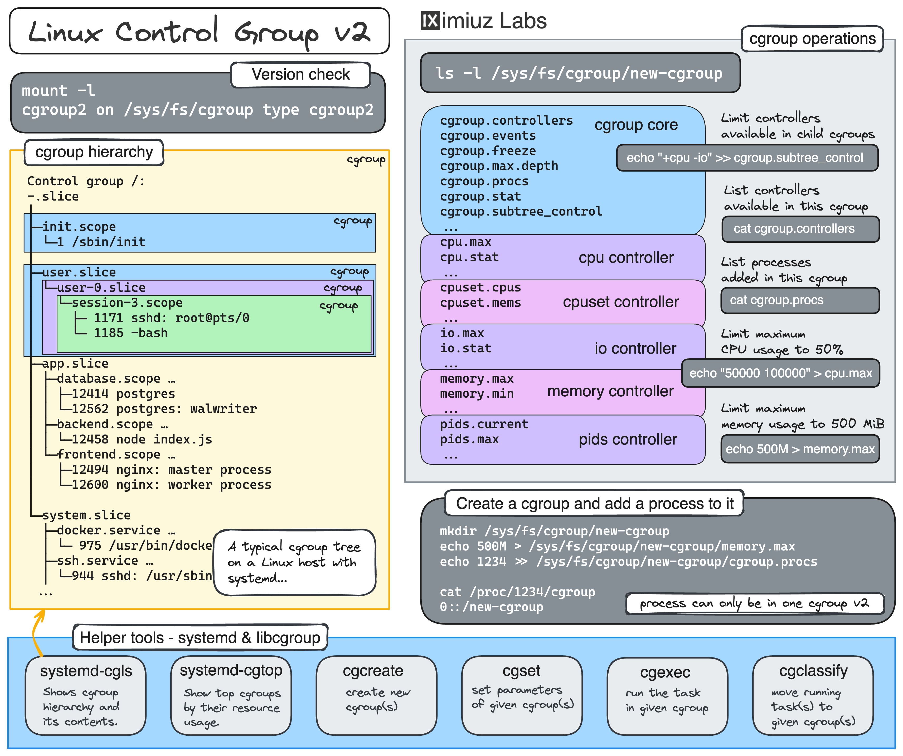

<!--Copyright © ZOMI 适用于[License](https://github.com/Infrasys-AI/AIInfra)版权许可-->

# 资源的限制

Author by: 张柯帆

> 注：以下讨论基于 Linux

在上一篇文章中，我详细介绍了容器中用来实现“隔离”的其中一种技术手段：Namespace。现在你应该已经明白，Namespace 技术的原理就是修改进程的视图，让进程只能“看到”操作系统一部分的内容。但视图的遮盖终究只是障眼法，对于宿主机来说，这些“隔离”进程与其他进程并没有什么不同。为了实现完整的资源隔离，我们还需要限制容器对 CPU、内存、磁盘资源的访问，否则当其中一个容器将宿主机的资源消耗光了，就会影响到宿主机上的其他容器。


如果你还记得上面这张图，仔细观察会发现只有虚拟机方案才有 Hypervisor 这个组件。这是因为 Hypervisor 主要负责创建虚拟化的硬件，在这个步骤里也间接地完成了资源访问的限制。而 Container Engine 并没有 Hypervisor 这样的功能，所以需要另寻他法进行资源限制，幸好 Linux 操作系统也为我们提供了这样的能力——Cgroups。

## 什么是 Cgroups？

Cgroups（Control Groups 的缩写）是 Linux 内核提供的一种机制，它可以将一系列系统任务及其子任务整合（或分隔）到按资源划分等级的不同组内，从而为系统资源管理提供一个统一的框架。 简单来说，Cgroups 可以限制、记录和隔离进程组所使用的物理资源，例如 CPU 时间、内存、磁盘 I/O 和网络带宽等。

这个功能最初由 Google 的工程师在 2006 年发起，当时被称为“进程容器”（process containers），并在 2008 年被合并到 Linux 2.6.24 内核中，正式更名为 Cgroups。 目前，Cgroups 已经成为众多容器化技术（如 Docker、Kubernetes）以及 systemd 的基础。

Cgroups 主要提供以下四大功能：

*   **资源限制 (Resource Limiting)**：可以对进程组使用的资源总量进行限制，例如设定内存使用上限，一旦超出该限制，系统将触发 OOM (Out of Memory) Killer。
*   **优先级控制 (Prioritization)**：可以控制进程组的资源使用优先级，例如分配更多的 CPU 时间片或更高的磁盘 I/O 优先级。
*   **审计与统计 (Accounting)**：可以统计进程组的资源使用情况，生成资源使用报告，方便进行计量和监控。
*   **进程控制 (Control)**：可以对进程组中的所有进程执行挂起、恢复等操作。

## Cgroups 的两大版本：v1 与 v2

与许多 Linux 内核特性一样，Cgroups 也经历了一个发展的过程，目前主要存在 v1 和 v2 两个版本。

*   **Cgroups v1**：是 Cgroups 的第一个稳定版本，也是目前 Docker 等容器技术中仍然广泛使用的版本。它的设计思路是为每一种需要控制的资源都创建一个独立的层级（Hierarchy）。例如 `/sys/fs/cgroup/cpu/GROUPNAME` 和 `/sys/fs/cgroup/memory/GROUPNAME`，其中 `cpu` 和 `memory` 的控制是分别在不同的层级中进行的。这种设计虽然在某些场景下足够灵活，但也带来了一些问题，比如层级管理混乱，以及无法对不同资源进行统一的协调控制。

*   **Cgroups v2**：为了解决 v1 中存在的问题，Cgroups v2 进行了重新设计。v2 最大的特点是采用了单一的、统一的层级结构。 这意味着所有的资源控制器（Controller）都挂载在同一个层级下，从而简化了管理，并能够更好地协调不同资源之间的限制关系：`/sys/fs/cgroup/GROUPNAME` 中的树，如果进程 `x` 加入 `/sys/fs/cgroup/GROUPNAME`，则 `GROUPNAME` 的每个控制器都将控制进程 `x`。此外，v2 还提供了一些新的特性，比如更可靠的进程追踪和更细粒度的资源控制。

虽然 Cgroups v2 在功能和设计上都优于 v1，但由于历史原因和生态兼容性问题，目前 v1 仍然被广泛使用。不过，随着时间的推移，Cgroups v2 必将成为主流。



## Cgroups 的核心概念

要理解 Cgroups 的工作原理，我们需要先了解它的三个核心概念：子系统（Subsystem）、控制组（Control Group）和层级（Hierarchy）。

*   **子系统 (Subsystem)**：一个子系统就是一个资源控制器，负责控制某一类特定的资源。 例如，`cpu` 子系统负责限制 CPU 的使用，`memory` 子系统负责限制内存的使用。
*   **控制组 (Cgroup)**：一个控制组是 Cgroups 中的基本单位，它是一组按照某种资源控制标准划分的进程集合。一个 Cgroup 可以包含多个进程，并且可以关联一个或多个子系统。
*   **层级 (Hierarchy)**：层级由一系列 Cgroup 以树状结构排列而成，每个层级可以附加一个或多个子系统。 子 Cgroup 会继承其父 Cgroup 的属性。

### 子系统（Subsystem）

Cgroups 的强大功能是通过其丰富的子系统（也称为控制器）来实现的。每个子系统负责一种特定资源的控制。 下面我们介绍几个在容器技术中至关重要的子系统：

*   **`cpu` 子系统**：
    *   `cpu.shares`: 设置一个相对的 CPU 使用权重。如果一个 Cgroup 的 `cpu.shares` 设置为 1024，另一个设置为 512，那么前者获得的 CPU 时间将是后者的两倍（在 CPU 资源紧张的情况下）。
    *   `cpu.cfs_period_us` 和 `cpu.cfs_quota_us`: 这两个参数配合使用，可以精确地限制 Cgroup 在一个周期（`cpu.cfs_period_us`，单位微秒）内最多能使用多少 CPU 时间（`cpu.cfs_quota_us`，单位微秒）。 例如，将 `cpu.cfs_period_us` 设置为 100000（100毫秒），`cpu.cfs_quota_us` 设置为 50000（50毫秒），就意味着该 Cgroup 在每 100 毫秒内最多只能使用 50 毫秒的 CPU 时间，相当于限制其使用 0.5 个 CPU 核心。

*   **`memory` 子系统**：
    *   `memory.limit_in_bytes`: 这是最常用的参数，直接限制了 Cgroup 中所有进程能够使用的最大内存量。 一旦进程的内存使用量超过这个限制，系统就会触发 OOM (Out of Memory) Killer，杀死该进程。
    *   `memory.soft_limit_in_bytes`: 设置一个内存使用的软限制。当系统内存充足时，进程可以超过这个限制。只有在系统内存紧张时，内核才会开始回收超过软限制的内存。

*   **`blkio` 子系统**：
    *   用于限制对块设备（如硬盘、SSD）的 I/O 访问。
    *   `blkio.throttle.read_bps_device` 和 `blkio.throttle.write_bps_device`: 分别用来限制读取和写入指定设备的速度，单位是字节/秒。
    *   `blkio.throttle.read_iops_device` 和 `blkio.throttle.write_iops_device`: 分别用来限制读取和写入指定设备的 IOPS (Input/Output Operations Per Second)。

*   **`pids` 子系统**：
    *   `pids.max`: 限制一个 Cgroup 内可以创建的进程（或线程）的最大数量。这对于防止 "fork bomb" 等恶意攻击非常有效。

## 如何使用 Cgroups？

在 Linux 系统中，Cgroups 是通过一个特殊的文件系统（cgroupfs）来暴露给用户空间的。 我们可以像操作普通文件一样，通过读写这些文件来配置 Cgroups。

通常，Cgroups 的挂载点位于 `/sys/fs/cgroup` 目录下。 在这个目录下，你会看到以各个子系统命名的文件夹。

**以 `memory` 子系统为例：**

1.  **创建一个新的 Cgroup**：
    ```bash
    cd /sys/fs/cgroup/memory
    sudo mkdir my-container
    ```
    执行 `mkdir` 命令后，系统会自动在 `my-container` 目录下创建一系列与 `memory` 子系统相关的文件。

2.  **设置资源限制**：
    ```bash
    # 限制内存使用为 512MB
    echo 512M | sudo tee my-container/memory.limit_in_bytes
    ```

3.  **将进程加入 Cgroup**：
    ```bash
    # 将当前 shell 进程加入该 Cgroup
    echo $$ | sudo tee my-container/tasks
    ```
    `$$` 是一个特殊的 shell 变量，代表当前进程的 PID。将一个进程的 PID 写入 `tasks` 文件，就意味着将该进程加入了这个 Cgroup。 此后，该进程及其所有子进程都将受到这个 Cgroup 的资源限制。

当然，在实际的容器化场景中，我们很少会直接手动操作这些文件。像 Docker 这样的容器引擎已经为我们封装好了对 Cgroups 的操作。例如，在使用 `docker run` 命令时，我们可以通过参数来方便地设置容器的资源限制：

```bash
docker run -d --name my-app \
  --cpus=".5" \       # 限制使用 0.5 个 CPU 核心
  -m "512m" \       # 限制内存为 512MB
  --pids-limit 100 \  # 限制最多 100 个进程
  nginx
```

这条命令会创建一个 Nginx 容器，并通过 Cgroups 将其 CPU、内存和进程数量都限制在了一个合理的范围内。

## Cgroups 与网络控制

Cgroups v2 对整个 Cgroups 架构进行了简化和统一。 在 v2 中，所有的控制器都挂载在同一个统一的层级下。 对于网络控制，Cgroups v2 不再使用 `net_cls` 子系统，而是通过 eBPF (extended Berkeley Packet Filter) 与 `iptables` 结合的方式来实现更灵活和高效的网络控制。

你可以编写 eBPF 程序，挂载到 Cgroup v2 的路径上，从而对该 Cgroup 中的网络流量进行精细化的过滤、修改或重定向。这种方式提供了比 `net_cls` 更强大的功能和更好的性能。

## Cgroups 与 Namespace 的协同工作

现在我们再回过头来看容器的隔离机制。Namespace 解决了“看”的问题，让容器内的进程只能看到自己的一亩三分地。而 Cgroups 则解决了“用”的问题，为容器的资源使用量设定了上限。 两者协同工作，才最终构建出了一个看似“独立”的容器环境。

可以说，没有 Namespace，容器就无法实现视图隔离；而没有 Cgroups，容器的资源隔离就无从谈起，也就失去了其在多租户、高密度部署等场景下的核心价值。

## 总结

Cgroups 作为 Linux 内核提供的强大功能，为实现容器等场景下的资源隔离和限制提供了坚实的基础。通过其灵活的子系统机制，我们可以对 CPU、内存、磁盘 I/O 等多种资源进行精细化的控制。而在网络方面，虽然 Cgroups 不直接进行流量控制，但它通过与 `tc`、`iptables` 和 eBPF 等内核模块的协同工作，同样实现了强大的网络资源管理能力。

## 参考与引用

- https://labs.iximiuz.com/tutorials/controlling-process-resources-with-cgroups
- https://segmentfault.com/a/1190000045052990
