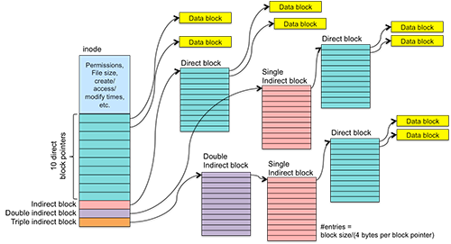

<!--Copyright © ZOMI 适用于[License](https://github.com/Infrasys-AI/AIInfra)版权许可-->

# 容器镜像文件系统(DONE)

Author by: 张柯帆

> 注：以下讨论基于 Linux

在深入探讨了实现“隔离”的 Namespace 和实现“限制”的 Cgroups 之后，我们终于触及了构成现代容器技术的第三根、也是最后一根关键支柱：**文件系统**。如果说 Namespace 和 Cgroups 定义了容器进程的**运行时边界**，那么一个高效、分层的文件系统则定义了容器的**静态构建块**，也就是我们所熟知的“镜像”。

## 1. Union File Systems

我们先从一个看似简单的问题开始：Docker 如何存储和管理镜像？一个典型的应用镜像，比如 `ubuntu:latest`，可能包含数百 MB 的文件。如果我们每创建一个容器，都完整地复制一份基础镜像，那么磁盘空间将很快被耗尽，容器的启动速度也会变得无法接受。这显然不是一个可行的方案。

真正的需求是：实现镜像文件的最大化复用，同时为每个容器提供一个看似独立、可写的根文件系统。

这个需求的解决方案，正是 **Union File Systems (UFS)**，也称为联合文件系统。其核心思想，就是将多个不同的目录（我们称之为**分支 branch** 或**层 layer**）的内容，在同一个挂载点（mount point）下进行“叠加”，形成一个单一、统一的视图。

想象一下，我们有多个只读的目录层（lower directories）和一个可写的目录层（upper directory）。UFS 会将它们“堆叠”起来：

- **读取文件**：UFS 会从最上层的可写层开始查找。如果找到，则直接返回。如果找不到，则逐层向下到只读层查找。
- **修改文件**：如果文件位于下层的只读层，UFS 会触发写时复制 (Copy-on-Write, CoW)机制。它会先将只读文件**复制**到最上层的可写层，然后再对这个副本进行修改。原始的只读文件保持不变。
- **删除文件**：如果文件位于下层，由于下层是只读的，无法真正删除它。UFS 会在可写层创建一个特殊的“白障”(whiteout) 文件，用来“遮挡”下层的文件，使其在统一视图中不可见。
- **创建文件**：新文件会直接被创建在最上层的可写层中。

这种机制的精妙之处在于，所有容器都可以共享只读的基础镜像层，只有当容器需要修改数据时，才会产生增量写入。这不仅极大地节省了磁盘空间，还使得容器的创建和销毁变得极其迅速，因为我们无需进行大规模的文件复制。

## 2 AUFS

AUFS (Another Union File System)，作为 UnionFS 的一个重要分支和重新实现，是早期 Docker 能够迅速崛起的关键技术功臣。尽管它从未被正式合入 Linux 内核主线，但这并不妨碍我们对其设计思想和实现细节进行深入探讨。

### 2.1. 架构与原理

AUFS 的核心是“分支”（Branches）。它可以将多达 127 个分支（目录）联合挂载到一个挂载点上。这些分支被赋予不同的权限，通常是一个可写分支（writable branch）和多个只读分支（read-only branches）。

当挂载时，AUFS 会构建一个内存中的视图，该视图包含了所有分支的文件和目录信息。其 CoW 机制堪称经典：当一个进程试图修改一个来自只读分支的文件时，AUFS 内核模块会拦截这个写操作。它首先在可写分支中创建一个与目标文件路径完全相同的空文件，然后将只读分支中的数据**按需**复制到这个新创建的文件中，最后才将写操作应用到这个副本上。这个过程被称为“copy-up”。

### 2.2. 关键技术与实现

1.  **Inode 的处理**：AUFS 在处理 inode 时面临一个挑战。由于不同分支上的文件是独立的，它们拥有不同的 inode。当它们被联合到同一个视图时，AUFS 必须在内部维护一个 inode 映射表，以确保从用户空间的视角来看，同一个文件路径始终对应一个稳定的 inode。这增加了其实现的复杂性。

2.  **删除操作与 Whiteouts**：AUFS 的 Whiteout 机制非常直观。当用户在联合视图中删除一个来自只读分支的文件（例如 `/app/config.ini`）时，AUFS 会在可写分支中创建一个名为 `.wh.config.ini` 的特殊文件。当 AUFS 遍历目录时，一旦遇到 `.wh.` 前缀的文件，它就会将对应的原始文件从联合视图中“隐藏”起来。这种基于文件名的标记方式简单有效，但也带来了一定的性能开销，因为每次 `readdir` 都需要进行额外的检查。

3.  **强大的分支管理**：AUFS 的一个显著特点是其灵活的分支管理能力。它不仅支持在运行时动态地添加或删除分支，甚至支持拥有多个可写分支。虽然这个特性在容器场景中不常用，但它展示了 AUFS 设计的灵活性。

### 2.3. 衰落的原因

AUFS 最大的问题，也是其最终被 OverlayFS 取代的根本原因，是**它从未被合并到 Linux 内核主线**。这意味着要使用 AUFS，发行版厂商需要手动为内核打上 AUFS 的补丁。这不仅增加了维护成本，也带来了稳定性和安全性的隐忧。其代码实现异常复杂，包含了大量的“黑魔法”，这让内核社区的维护者们望而却步。

尽管如此，AUFS 作为先行者，为后续的 UFS 技术（尤其是 OverlayFS）提供了宝贵的实践经验和教训。

## 2. OverlayFS

随着内核社区对容器技术的需求日益增长，一个更简洁、更高效且能够被主线接纳的 UFS 实现变得至关重要。OverlayFS 应运而生，并迅速演进到了其第二个、也是目前作为事实标准的版本——**overlay2**。

OverlayFS 的设计哲学与 AUFS 有显著不同，它更加贴近 VFS（虚拟文件系统）的通用模型，实现也更为简洁优雅。

### 2.1. 架构与核心组件

Overlay2 的架构由四个关键目录组成：

- `lowerdir`： 一个或多个只读层（镜像层）。多个 `lowerdir` 时，越左边的层越底层（基础层）。这实现了真正的多层镜像支持（例如：`lowerdir=/layer1:/layer2:/layer3`）。
- `upperdir`： 一个可写层。对应容器运行时产生的读写层，所有的写入操作最终都会反映在这里。
- `workdir`： 一个必需的**工作目录**，用于准备文件操作，必须与 `upperdir` 位于同一文件系统。它对于保证原子性操作（如 copy-up）至关重要。
- `merged`： 最终的**统一视图**，也就是容器的挂载点。它将 `upperdir` 叠加在 `lowerdir` 之上，为用户提供合并后的文件系统视角。

### 2.2. 关键技术与实现

1.  **高效的 Copy-Up 与 Inode 共享**：Overlay2 的 copy-up 操作通常比 AUFS 更快。更重要的是，对于未被修改的文件，Overlay2 使得 `merged` 视图中的文件可以直接共享 `lowerdir` 中对应文件的 inode。这意味着在执行 `stat` 等元数据操作时，内核无需进行额外的转换或查找，性能接近原生文件系统。只有当文件被 copy-up 到 `upperdir` 后，它才会在 `upperdir` 中获得一个新的 inode。

2.  **目录修改与 `redirect_dir`**：当需要修改一个来自 `lowerdir` 的目录元数据时（例如修改权限 `chmod`），Overlay2 会在 `upperdir` 中复制这个目录，并在其扩展属性（xattr）中设置一个名为 `trusted.overlay.redirect` 的标记，指向 `lowerdir` 中原始目录的路径。这样，当访问这个目录时，虽然元数据来自 `upperdir`，但其内容仍然可以高效地从 `lowerdir` 读取。

3.  **硬链接 (Hard Link) 的处理**：硬链接是 UFS 实现中的一个经典难题。在 OverlayFS 中，如果一个文件在 `lowerdir` 中有多个硬链接，当这个文件被 copy-up 时，OverlayFS 必须保证在 `upperdir` 中也维持这种硬链接关系。Overlay2 通过在 `upperdir` 的根目录维护一个索引（`index` 目录）来追踪被复制过的文件的原始 `lowerdir` 路径和 inode，确保 copy-up 操作的幂等性和硬链接的正确性。

4.  **删除操作与字符设备 Whiteout**：与 AUFS 使用特殊文件名的 Whiteout 不同，OverlayFS 采用了一种更高效的方式。当删除一个来自 `lowerdir` 的文件时，它会在 `upperdir` 中创建一个同名的字符设备文件（character device），其设备号为 0/0。VFS 层在解析目录时，看到这种特殊的字符设备，就会理解为这是一个 Whiteout 标记，从而隐藏 `lowerdir` 中的对应文件。这种方式比解析文件名要高效。

## 3. AUFS 与 OverlayFS 对比

在容器文件系统的演进中，AUFS 和 Overlay2（OverlayFS v2）是两种关键实现，二者在核心能力上的差异，直接决定了它们在容器生态中的适用性。下面将按核心特性逐一对比，结合简洁表格与文字解析，清晰呈现两者的优劣势。

### 3.1 内核集成

内核集成度是文件系统能否大规模应用的基础——它直接影响维护成本、稳定性与社区支持。这一特性上，AUFS 与 Overlay2 存在根本性差异：

| 特性       | AUFS                  | Overlay2              | 优胜者 |
|------------|-----------------------|-----------------------|--------|
| 内核集成   | 内核之外（需打补丁）  | 内核主线（Linux 3.18+）| Overlay2 |

Overlay2 的压倒性优势在于“内核主线集成”：无需依赖第三方补丁，发行版可直接支持，能同步获得内核的稳定性更新与安全修复；而 AUFS 需手动打补丁，不仅维护成本高，还可能因补丁与内核版本不兼容导致故障，这也是它逐渐被淘汰的核心原因。

### 3.2 Inode 使用

Inode 是文件系统中标识文件的唯一ID，Inode 利用率直接关系到容器集群的高密度部署能力——若 Inode 快速耗尽，将无法创建新文件。

| 特性       | AUFS                  | Overlay2              | 优胜者 |
|------------|-----------------------|-----------------------|--------|
| Inode 使用 | 每层文件独立 Inode，易耗尽 | 共享 lowerdir Inode，copy-up 后新建 | Overlay2 |

AUFS 中，同一文件在不同层会生成独立 Inode，多层镜像叠加时易出现 Inode 耗尽问题；而 Overlay2 未修改的文件直接共享只读层（lowerdir）的 Inode，仅当文件被 copy-up 到可写层（upperdir）时才生成新 Inode，利用率更高，尤其适合大规模容器集群。

### 3.3 性能

容器的文件操作性能（如读写、目录遍历）直接影响应用响应速度，这一特性上两者的差异主要体现在 copy-up 与元数据操作上：

| 特性       | AUFS                  | Overlay2              | 优胜者 |
|------------|-----------------------|-----------------------|--------|
| 性能表现   | copy-up 慢，readdir 有额外开销 | copy-up 快，元数据操作接近原生 | Overlay2 |

AUFS 的 copy-up 流程复杂，且目录遍历（readdir）时需检查 `.wh.` 前缀的白障文件，额外开销大；而 Overlay2 简化了 copy-up 逻辑，且元数据操作（如 `stat`）因共享 Inode 无需额外转换，性能更接近原生文件系统，尤其适合文件修改频繁的场景。

### 3.4 实现复杂度

文件系统的实现复杂度，决定了内核社区的维护难度与故障排查效率——简洁的设计往往更易保障稳定性。

| 特性       | AUFS                  | Overlay2              | 优胜者 |
|------------|-----------------------|-----------------------|--------|
| 实现复杂度 | 代码复杂，难维护      | 设计简洁，符合 VFS 模型 | Overlay2 |

AUFS 代码包含大量“特殊处理逻辑”，可读性差，内核社区难以维护；而 Overlay2 贴合 Linux 虚拟文件系统（VFS）的通用模型，代码简洁易理解，不仅降低了故障概率，也更易适配新内核特性。

### 3.5 Whiteout 机制

Whiteout 机制用于“逻辑删除”只读层文件（无法物理删除），其设计直接影响目录遍历效率：

| 特性       | AUFS                  | Overlay2              | 优胜者 |
|------------|-----------------------|-----------------------|--------|
| Whiteout 机制 | 基于 `.wh.` 前缀文件名 | 基于 0/0 字符设备      | Overlay2 |

AUFS 通过创建 `.wh.` 前缀文件遮挡只读层文件，目录遍历时需逐个解析文件名，效率低；而 Overlay2 用设备号为 0/0 的字符设备作为标记，VFS 层可直接识别，无需额外解析，对 readdir 操作更友好。

### 3.6 内存使用

内核内存消耗直接影响宿主机可承载的容器数量，尤其在高密度部署场景中至关重要：

| 特性       | AUFS                  | Overlay2              | 优胜者 |
|------------|-----------------------|-----------------------|--------|
| 内存消耗   | 内核内存消耗较高      | 内存效率更高          | Overlay2 |

AUFS 需维护复杂的层间映射关系，内核内存消耗较大；而 Overlay2 设计简洁，内存占用更低，在同一台宿主机上可承载更多容器，资源利用率更高。

## 总结与思考

至此，我们完成了容器技术三大支柱的探索之旅。

- **Namespaces** 欺骗了进程的“眼睛”，构建了隔离的视图。
- **Cgroups** 给进程戴上了“镣铐”，限制了资源的滥用。
- **Union File Systems** 保证了容器的一致性和轻便性，使得容器的分发、存储和实例化变得轻盈而高效。

从 AUFS 的大胆探索，到 Overlay2 的成熟稳健，我们看到了开源社区如何在实践中不断迭代，最终打造出符合内核哲学、兼具性能与稳定性的卓越技术。可以说，没有 Overlay2 这样稳定高效的 UFS 实现，就不可能有今天云原生生态的繁荣。

## 参考与引用

https://docker-docs.uclv.cu/storage/storagedriver/aufs-driver/（Docker AUFS 驱动官方文档）
https://blog.csdn.net/luckyapple1028/article/details/77916194（OverlayFS 技术细节解析）
https://www.kernel.org/doc/Documentation/filesystems/overlayfs.txt（Linux 内核 OverlayFS 官方文档）
