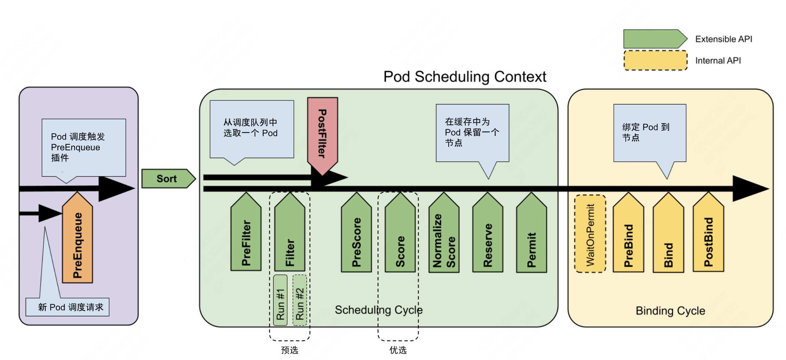
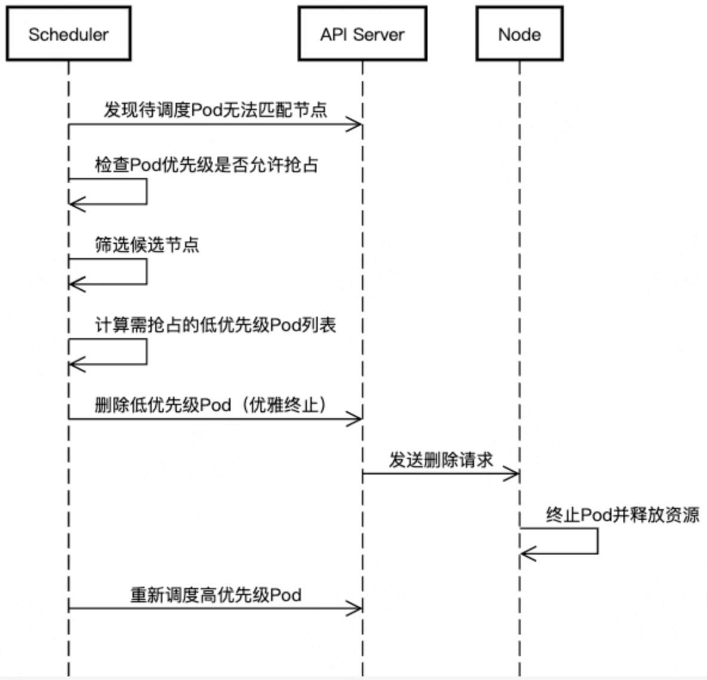

# Kubernetes资源管理与作业调度
Kubernetes 的作业调度与资源管理系统如同集群的"智能大脑"和"资源管家"：
- 调度器是决策中枢：通过智能算法将工作负载精准分配到最佳位置。
- 资源管理是保障系统：确保每个应用获得所需资源而不相互干扰。

## 资源管理
### 资源类型
在K8S中，CPU和内存是最主要的两种资源类型，统称为计算资源。CPU的单位是Kubernetes CPU，内存单位是字节。不同于API资源，计算资源是可以被请求、分配和消耗的。

CPU资源的限制和请求以CPU为单位，1CPU等于1个物理CPU或者1个虚拟核，取决于运行在物理主机还是虚拟机上。当然也可以使用带小数的CPU请求，比如0.1CPU，等价于100 millicpu。

值得注意的是，CPU资源的值是绝对数量，不是相对数量。即无论运行在单核、双核或更高配置的机器上，500mCPU表示的是相同的算力。
memory的请求以字节为单位，单位有E、P、T、G、M、k。

CPU资源被称为可压缩资源，当资源不足时，Pod只会饥饿，不会退出。内存资源被称为不可压缩资源，当压缩资源不足时，Pod会被Kill掉。

### 资源请求与限制
针对每个Pod都可以指定其资源限制与请求，示例如下：
> spec.containers[].resources.limits.cpu
> spec.containers[].resources.limits.memory
> spec.containers[].resources.requests.cpu
> spec.containers[].resources.requests.memory

在调度时按照requests的值进行计算，真正设置Cgroups限制的时候，kubelet会按照limits的值来进行设置。Kubenetes对CPU和内存的限额设计，参考了goole的Borg设计，即设置的资源边界不一定是调度系统必须严格遵守的，实际场景中，大多数作业使用到的资源其实远小于它所请求的资源限额。

Borg在作业提交后，会主动减小它的资源限额配置，以便容纳更多的作业。当作业资源使用量增加到一定阈值时，会通过快速恢复，还原作业原始资源限额。

Kubenetes中的requests+limits的思想是类似的，requests可以设置一个相对较小的值，真正给容器设置的是一个相对较大的值。

### QoS模型
QoS中设计了三种类型：Guaranteed、Burstable和BestEffort。
当requests=limits，这个Pod就属于Guaranteed类型，当Pods仅设置了limits，没有设置requests，这个Pod也属于Guaranteed。当至少有一个Container设置了requests，那么这个Pod属于Burstable。如果一个Pod都没有设置，那么这个Pod被划分为BestEffort。

为什么会设置这三种类别呢？
> 主要应用于宿主机资源紧张的时候，kubelet对Pod进行资源回收。比如宿主机上不可压缩资源短缺时，就有可能触发Eviction。

当Eviction发生的时候，就会根据QoS类别挑选一些Pod进行删除操作。首先就是删除BestEffort类别的Pod，其实是Burstable类别、并且饥饿的资源使用量超出了requests的Pod。最后才是Guaranteed类别的Pod资源。

## 作业调度
Kubernetes 调度系统的核心由两个独立协同的控制循环构成，共同实现高效的资源编排：

Kubernetes 调度系统的核心由两个独立协同的控制循环构成，共同实现高效的资源编排：
- “Informer 循环”：启动多个Informer 来监听API资源（主要是Pod 和 Node）状态的变化。一旦资源发生变化，Informer 会触发回调函数进行进一步处理。
- “Scheduling 循环”：从调度队列（PriorityQueue）中不断出队一个 Pod，并触发两个核心的调度阶段：Predicates和Priority。

K8S中主要通过Predicates和Priorities两个调度策略发生作用，K8S中默认策略可分为四种。


### GeneralPredicates
该策略负责基础调度策略，比如PodFitsResources计算的是宿主机的CPU和内存资源是否足够，但是该调度器并没有适配GPU等硬件资源，统一用一种Extended Resource、K-V格式的扩展字段来描述。

比如申请4个NVIDA的GPU，可以在request中写入以下值：alpha.kubernetes.io/nvidia-gpu=4.

在PodFitsResources中，调度器直接根据key进行匹配，根据value进行计算。

### Volume过滤规则
这一组过滤规则负责Volume相关的调度策略，根据Pod请求的卷和已挂载的卷，检查Pod是否合适于某个Node (例如Pod要挂载/data到容器中，Node上/data/已经被其它Pod挂载，那么此Pod则不适合此Node)。

### 宿主机相关的过滤规则
该组规则主要判断Pod是否满足Node某些条件。比如PodToleratesNodeTaints：检查Pod的容忍度是否能承受被打上污点的Node。只有当Pod 的 Toleration 字段与 Node 的 Taint 字段能够匹配的时候，这个 Pod 才能被调度到该节点上。NodeMemoryPressurePredicate检查当前节点的内存是否充足，如果不充足，那么待调度Pod就不能被调度到该节点上。

### Pod相关过滤规则
该组规则很大一部分和GeneralPredicates重合，其中比较特别的是PodAffinity。用于实现Pod亲和性与反亲和性（Pod Affinity/Anti-Affinity）的核心预选（Predicate）策略之一。它通过分析Pod之间的拓扑关系，决定新 Pod 能否调度到某个节点。
- Pod亲和性：将新Pod调度到与指定Pod所在节点相同或相近的节点。
- Pod反亲和性：避免将新Pod调度到与指定Pod所在节点相同的节点。适用场景：高可用部署（如避免单点故障）。适用场景：需要紧密协作的服务（如数据库与缓存）。

规则配置示例如下所示：

```yaml
affinity:
  podAffinity:
    requiredDuringSchedulingIgnoredDuringExecution:  # 硬性要求
    - labelSelector:
        matchExpressions:
        - key: app
          operator: In
          values: [web]
      topologyKey: kubernetes.io/hostname  # 拓扑域（如节点、机架）
  podAntiAffinity:
    preferredDuringSchedulingIgnoredDuringExecution:  # 软性偏好
    - weight: 100
      podAffinityTerm:
        labelSelector:
          matchExpressions:
          - key: app
            operator: In
            values: [cache]
        topologyKey: topology.kubernetes.io/zone

```

### 调度器的优先级和抢占机制
该机制在K8S 1.10版本后进行支持，使用该机制，需要在K8S中定义PriorityClass，示例如下：
```yaml
apiVersion: scheduling.k8s.io/v1
kind: PriorityClass
metadata:
  name: high-priority  # 优先级类名称（必填）
value: 1000000         # 优先级数值（必填，越大优先级越高）
globalDefault: false   # 是否作为集群默认优先级类（可选，默认false）
description: "用于关键业务 Pod 的高优先级"  # 描述信息（可选）
preemptionPolicy: PreemptLowerPriority  # 抢占策略（可选，默认PreemptLowerPriority）
```
其中Priority的value是一个32bit的整数，值越大优先级越高。超出10亿的值分配给系统Pod使用，确保系统Pod不会被用户抢占。

调度器中维护着一个调度队列，高优先级的Pod优先出队。同时，当优先级高的Pod调度失败时，抢占机器开始发挥作用。调度器尝试从集群中删除低优先级的Pod，从而使高优先级Pod可以被调度到该节点。



抢占细节如下：
- 抢占候选选择：调度器选择优先级最低且资源释放后能满足需求的Pod。
优先抢占与高优先级Pod资源需求重叠度低的Pod（如占用 CPU 但新Pod需要内存）。
- 优雅终止：被抢占的Pod会收到SIGTERM信号，进入 Terminating状态。默认30秒后强制终止（可通过Pod的 terminationGracePeriodSeconds 调整）。
- 不可抢占的Pod：优先级 ≥ 高优先级Pod的Pod。
具有 preemptionPolicy: Never的Pod。系统关键Pod（如 kube-system命名空间下的kube-dns）。


## 参考文档
https://www.thebyte.com.cn/container/kube-scheduler.html
