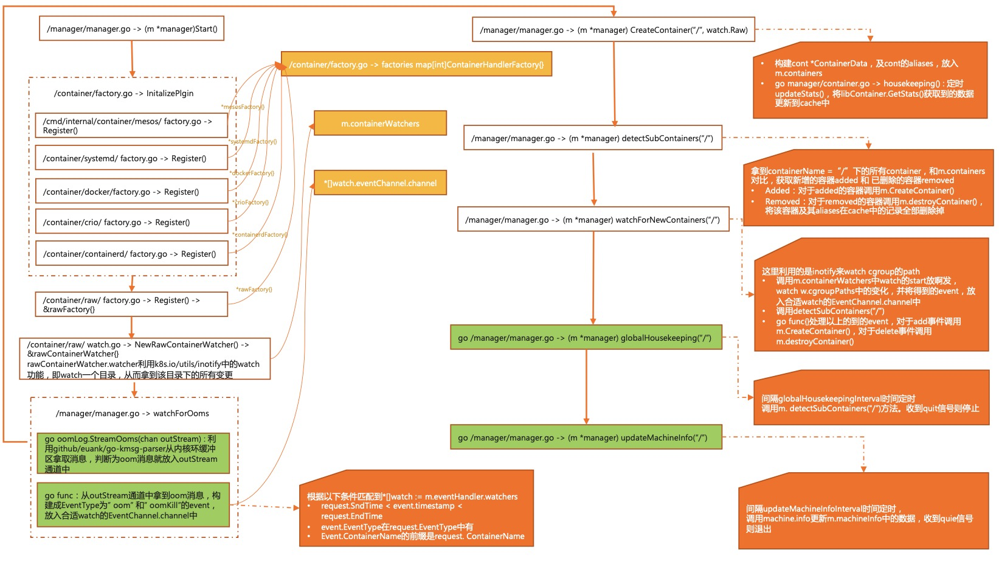

# Kubernetes 容器监控与日志

## 为什么需要监控组件？
一个系统想要保障服务的稳定性，提升用户体验，必须具备完善的监控体系。一个好的监控体系就像一个”健康仪表盘“，能够帮助我们及时掌握系统健康度，未雨绸缪，提前发现问题，解决问题。

### Kubenetes 监控有哪些目标？
- 资源利用率监控：实时跟踪 CPU、内存、磁盘、网络等资源使用情况。
- 应用健康检查：确保容器进程存活、服务可达性、响应延迟可控。
- 故障诊断与根因分析：快速定位性能瓶颈（如内存泄漏、CPU 争抢）。
- 自动化运维支持：为 HPA（自动扩缩容）、VPA（垂直扩缩容）提供数据依据。

### Kubenetes 监控指标
#### 应用层（Application）
由应用层自定义上传相关监控指标，比如常见的请求时延、数据库 CRUD 的耗时、错误数等。

#### Node 层
关注指标主要包括以下指标：
- CPU 使用率：node_cpu_seconds_total
- 内存使用量：node_memory_MemTotal_bytes、node_memory_MemAvailable_bytes
- 磁盘 I/O：node_disk_io_time_seconds
- 网络流量：node_network_receive_bytes_total

#### 容器层(Pod/Container)
容器层关注的指标和 Node 层类似，除了一些基础指标外，还关注一些容器的特有指标：
- 容器 CPU 使用率
- 容器内存使用量
- 容器重启次数
- 容器网络流量

### 数据采集工具 cAdvisor
cAdvisor 由 Goole 开发的容器监控工具，默认集成在 kubelet 中，为容器化提供基础监控能力。

#### 主要功能
资源监控：
- CPU：使用时间、利用率、限制。
- 内存：工作集（Working Set）、缓存（Cache）、交换（Swap）。
- 文件系统：磁盘 I/O、存储使用量。
- 网络：接口流量、错误计数。
容器层级统计：
- 支持容器、Pod、节点多级视图。
- 提供历史数据（默认存储最近 1 分钟的数据）。
事件记录：
- 容器启动、停止、OOM（内存溢出）等事件。

#### 数据采集
数据采集主要包括两个部分：machineInfo 和 containerInfo。
machine 相关的数据主要读取机器的系统文件数据，然后由一个周期任务，更新本地 cache。具体读的文件数据见下图。


获取容器相关的数据，主要是监控 cgroupPath 目录下的变更，拿到该目录下的增删改查事件，然后更新 cache 中的数据。
<!--  -->

#### 数据存储
监控数据不仅能放在本地，还能存储到第三方存储介质中。支持 bigquery、es、influxdb、kafka、redis 等组件。

执行过程如下所示：
- 1. 首先通过 memory 接口，将数据存在本地。
- 2. 将新写入的监控数据根据时间戳，进行聚合处理。
- 3. 调用各介质的 AddStats 方法，将数据存入第三方存储介质。


### 监控工具 Prometheus
Prometheus 是一个 CNCF 工具，是 Kubernetes 中主流的监控工具，原生的支持对 K8S 中各个组件进行监控。

#### 主要模块
其主要包括以下几个模块：

Prometheus Server：
- 抓取器（Retriever）：定期从配置的目标（如 Exporters、应用端点）拉取指标。
- 时序数据库（TSDB）：高效存储时间序列数据。
- HTTP Server：提供查询接口（PromQL）和 Web UI。

Exporters：
- 节点导出器（Node Exporter）：采集主机资源指标（CPU、内存、磁盘）。
- 应用导出器（如 JMX Exporter）：将应用指标转换为 Prometheus 格式。

Pushgateway：
- 用于短期任务或批处理作业的指标暂存（Prometheus 默认拉取模型不适用）。

Alertmanager：
- 处理 Prometheus 的告警通知，支持去重、分组、静默和路由到不同渠道（Email、Slack 等）。

Grafana：
- 可视化工具，通过 Prometheus 数据源创建仪表盘。


#### 指标类型
- Counter：计数器，单调递增的累计值，比如请求个数等。
- Gauge：仪表盘，可增可减的瞬时值，如 CPU、内存等。
- Histogram：直方图，采样观测值的分布，比如请求的响应时间，小于 10ms 有多少个，小于 50ms 有多少个等。
- Summary：类似直方图，只是表现形式不同，比如请求响应时间，70%小于 10ms，90%小于 50ms。

#### 使用示例
使用 Helm 部署（推荐）
第一步：安装 helm
```
# 安装 Helm CLI
curl https://raw.githubusercontent.com/helm/helm/main/scripts/get-helm-3 | bash
```

第二步：添加 Prometheus Helm 仓库
```
# 安装 Helm CLI
curl https://raw.githubusercontent.com/helm/helm/main/scripts/get-helm-3 | bash
```

第三步：部署 Prometheus
```
# 创建命名空间
kubectl create ns monitoring
# 安装 Prometheus Stack（包含 Prometheus + Grafana + Alertmanager）
helm install prometheus prometheus-community/kube-prometheus-stack \
  --namespace monitoring \
  --set prometheus.prometheusSpec.storageSpec.volumeClaimTemplate.spec.storageClassName="<your-storage-class>" \
  --set prometheus.prometheusSpec.storageSpec.volumeClaimTemplate.spec.resources.requests.storage="50Gi"
```

第四步：验证部署
```
kubectl get pods -n monitoring
```

第五步：访问服务
```
kubectl port-forward -n monitoring svc/prometheus-prometheus-oper-prometheus 9090
# 访问 http://localhost:9090
```

#### 告警配置示例
比如监控 api-server 服务的请求延迟，当 5 分钟平均延迟持续 10 分钟超过 0.5 秒时，触发严重告警。
```yaml
groups:
- name: example
  rules:
  - alert: HighRequestLatency
    expr: job:http_request_duration_seconds:mean5m{job="api-server"} > 0.5
    for: 10m
    labels:
      severity: critical
    annotations:
      summary: "High request latency on {{ $labels.instance }}"
```
## 容器日志

## 参考文档
https://www.cnblogs.com/chenqionghe/p/11718365.html
https://www.cnblogs.com/cheyunhua/p/17126430.html
https://www.cnblogs.com/evescn/p/18256900
https://www.cnblogs.com/vinsent/p/15830271.html