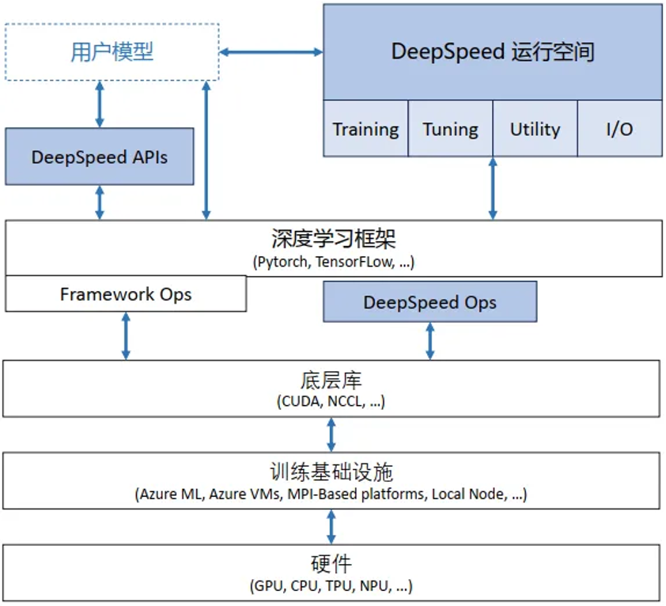
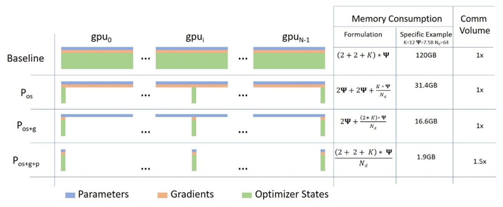
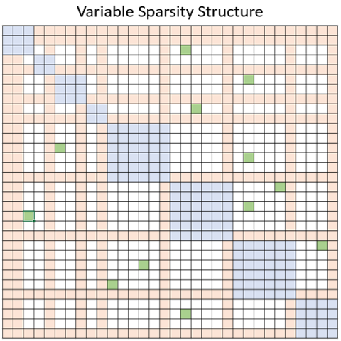
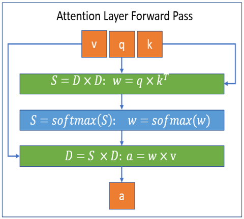
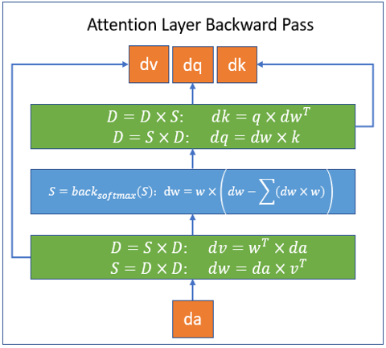

<!--Copyright © ZOMI 适用于[License](https://github.com/Infrasys-AI/AIInfra)版权许可-->

# DeepSpeed介绍

Author by: Ferman Yang

随着chatgpt等模型引发人工智能领域的浪潮，越来越多的公司和团体想要快速、方便地训练和部署自己的类chatgpt模型。但是随着训练模型的大小和训练数据的规模越来越大，训练成本也随之增加，往往需要大规模的集群和数百上千的训练卡用于模型训练，并且具备相对较高的机器利用率和更好的吞吐,而传统训练的方法则面临内存限制和计算瓶颈等挑战。基于这样的现状，微软研发并开源了一个高效且易于使用的开源系统，这就是我们所熟知的DeepSpeed框架，目前已经成为大模型训练的主流框架。

DeepSpeed助力于打造全球最强大的语言模型,例如[MT-530B](https://www.microsoft.com/en-us/research/blog/using-deepspeed-and-megatron-to-train-megatron-turing-nlg-530b-the-worlds-largest-and-most-powerful-generative-language-model/)和[BLOOM](https://huggingface.co/blog/bloom-megatron-deepspeed).作为一款易于使用的深度学习优化的软件套件,DeepSpeed提供以下核心支持:

* 支持数十亿,甚至千亿参数规模的稠密或者稀疏模型的训练和推理
* 能够实现优异的系统吞吐,并且可以高效扩展到数千个GPU
* 即使在资源受限的GPU系统上,也可以进行训练和推理
* 在推理上实现超低的延迟和超高的推理
* 以较低的成本实现极致的压缩,带来超高推理延迟优化和模型尺寸的大幅减小

DeepSpeed主要包含以下四个核心的创新支持


* Training: DeepSpeed为了使大模型训练更加高效,提供了一系列的系统性创新,同时显著提升了易用性.这些创新主要包括Zero, 3D并行,DeepSpeed-MoE, ZeRO-Infinity等.更多关于DeepSpeed的训练创新可以通过以下链接了解详情: [DeepSpeed-Training](https://www.deepspeed.ai/training/)
* Inference: DeepSpeed提供了张量并行,流水线并行,专家并行以及Zero等并行技术,并且与一系列定制的高性能推理kernel,通信优化以及异构内存技术相结合,从而实现了更大的推理规模,更高的系统吞吐以及极低的延迟和推理成本.更多关于DeepSpeed的推理创新可以通过以下链接了解详情: [DeepSeep-Inference](https://www.deepspeed.ai/inference)
* Compression: 为了进一步提升推理效率,DeepSpeed为研究人员和相关的从业人员提供了易于使用并且可以灵活组合的压缩技术,用于压缩模型,实现了更快的速度,更小的模型尺寸并且显著降低了压缩成本.比如ZeroQuant,XTC等先进的创新方法都被包含其中.更多关于DeepSpeed的压缩创新可以通过以下链接了解详情: [DeepSpeed-Compression](https://www.deepspeed.ai/compression)
* DeepSpeed4Science: DeepSpeed团队同时还推出了一项名为DeepSpeed4Science的新计划,旨在通过AI技术的系统创兴,帮助相关领域的专家解决当前一些重大的科学谜团.更多关于DeepSpeed4Science的内容可以通过以下链接了解详情: [DeepSpeed4Science Tutorials](https://www.deepspeed.ai/deepspeed4science/)

在本节中,我们主要聚焦于DeepSpeed的training部分.本章后续章节对于DeepSpeed的解读和介绍,相关代码主要参考[DeepSpeed v0.17.5版本](https://github.com/deepspeedai/DeepSpeed/tree/v0.17.5)

## DeepSpeed软件架构

DeepSpeed整体软件架构如图:



这种架构可以在训练框架上进行训练和推理的独立优化,并且相较于紧密耦合的其他架构,这种架构可以更快捷地集成到外部生态,快速适配外部生态的更新迭代. 此外,这种架构设计也与基础硬件和配置无关,用户可以自由选择喜欢的平台进行DeepSpeed的调用.


DeepSpeed主要包含以下三部分：

* apis: DeepSpeed提供易用的api接口. 训练模型和推理模型只需要简单调用几个接口即可。其中最重要的是initialize接口，用来初始化DeepSpeed引擎.配置参数一般保存在ds_config.json文件中,在其中配置训练参数及优化技术等。

* runtime: DeepSpeed运行时组件，是DeepSpeed管理、执行和性能优化的核心组件。如部署训练任务到分布式设备、数据分区、模型分区、系统优化、微调、故障检测、checkpoints保存和加载等。该组件使用python语言实现。

* ops: DeepSpeed用c++和cuda实现的底层内核，用于优化计算和通信，例如Ultra-fast dense transformer kernels,稀疏attention kernels以及1-bit Adam, 0/1 Adam 和1-bit LAMB等优化器.默认情况下，所有这些ops将使用torch的JIT C++扩展加载器进行即时构建(JIT),该加载器依赖ninja在运行时进行动态链接.

## DeepSpeed训练核心技术
下面介绍deepspeed的一些核心技术，并且阐述DeepSpeed如何实现通过这些技术实现高效且高扩展性的大规模分布式训练。

### ZeRO(零冗余优化器)
零冗余优化器（Zero Redundancy Optimizer,缩写为Zero）是一种用于大规模分布式深度学习的内存优化技术, 是DeepSpeed优化创新中的核心技术.使用DeepSpeed ZeRO技术能够有效训练包含数万亿参数的大型模型,与其他用于训练大型模型的模型并行方法相比，使用DeepSpeed ZeRO的另一个主要优势在于无需修改模型代码。ZeRO作为DeepSpeed的一部分，显著提高了大规模模型训练过程中的显存效率和计算效率。

ZeRO技术可以克服数据并行和模型并行的局限性，同时实现两者的优点。通过在数据并行的进程之间划分模型的优化器状态参数、梯度和模型参数来消除数据并行进程中的显存冗余。同时,ZeRO在训练期间使用动态通信调度在分布式设备之间共享必要的状态，以保持数据并行的计算粒度和通信量。同时Zero的实现是一种增量优化的分阶段实现,也就是说低层次的优化同样应用在高层次的优化中.具体而言,Zero优化包含以下三阶段:

* Stage 1: 在所有的dp进程之间切分优化器状态(比如,对于大模型训练中最常用的Adam优化器,包含32-bit的模型权重以及一阶动量,二阶动量), 此时,所有的进程只需要处理自己那份状态分片.

* Stage 2: 用于更新模型参数的16-bit的参数提低也会被进一步在dp group之间的进程进行切分,此时,所有的进程只需要保留对应自己的参数状态分片的梯度分片.

* Stage 3: 16-bit的模型参数会被进一步在dp group之间的进程切分,这样在模型进行前向操作时,就需要收集模型参数执行前向操作,而且执行前向操作之后,模型参数则会恢复切分的状态,节省显存.结合前面两个Stage,优化器只用更新当前dp进程上的16-bit的模型参数.

可以通过以下示意图进行直观的理解:



图中的$P_{os}$, $P_{os+g}$, $P_{os+g+p}$就是分别对应Zero Stage 1, Stage 2和Stage 3.

此外, Zero-Stage-3还包含"显存卸载引擎"来组成Zero-Infinity([Zero-Infinity论文](https://arxiv.org/abs/2104.07857)),通过把显存卸载到CPU和NVME上进一步节省显存消耗.

Zero系列优化是DeepSpeed训练中最为核心的技术,我们将在下一章节进行更加详细的分析.

### 流水线并行

DeepSpeed自v0.3版本后,引入了对流水线并行的支持.流水线并行将模型的各个参数层切分成不同的阶段,实现各个流水线阶段的并行执行.在如今以经典的Transformer-Decoder结构为主导的大规模模型训练中,流水线并行具有极高的拓展性,并且以相对较小的通信量带来了更低的参数显存占用和更高的计算效率.DeepSpeed的流水线训练引擎`PipelineEngine`支持混合的数据并行和流水线并行,并且可以进一步和Megatron-LM的模型并行相结合.下图展示了使用DeepSpeed进行3D并行训练的数据流.根据DeepSpeed的实验数据[deepspeed-extreme-scale-model-training-for-everyone](https://www.microsoft.com/en-us/research/blog/deepspeed-extreme-scale-model-training-for-everyone/),在DeepSpeed使能下的3D并行可以支持1T参数的模型训练.


DeepSpeed使用梯度累积的机制来使能流水线并行. 每个训练的batch会被分成多个micro-batch进行训练,microbatch之间进行多次梯度累积来等效整个大batch的训练.多个micro-batch在执行阶段可以被多个流水线阶段并行处理,以此来使能流水线并行的并行优势,增大训练吞吐.当一个流水线阶段完成一个micro-batch的前向流程时,激活值就会被传递给流水线的下一个阶段,此时,当前流水线阶段就可以处理下一个micro-batch. 与此类似,当下一个流水线阶段完成一个micro-batch的反向时,对应输入的激活值的梯度则会被传给上一个流水线阶段.每个micro-batch的反向都会进行梯度的累积.在所有micro-batch的前反向执行结束后,所有的数据并行组再进行参数梯度的规约,最后,optimizer进行模型参数的更新.


上图是DeepSpeed使用混合的数据并行和流水线并行的训练示意图.其中,一个完整的训练batch有完整的8个micro-batch,数据并行和流水线并行的大小都是2. GPU0和GPU2共同组成了一个流水线上的两个阶段,交替执行训练的前反向阶段(分别用F和B进行标识). 分别执行完当前流水线上的4个microbatch之后,GPU0和GPU2再分别和GPU1以及GPU3进行梯度规约(用AR进行标识),GPU1和GPU3同理. 最后,所有的训练进程再进行参数的更新. 

可以看到,虽然GPU2和GPU3作为流水线并行的后一个阶段,相对于GPU0和GPU1更早地完成梯度规约的操作,仍然需要等待GPU0和GPU1执行完最后一个micro-batch的反向以及梯度规约后再同时进行模型参数更新.这是因为,通常我们需要在最后的模型参数更新中检测所有的参数更新梯度中是否有`NaN`和`Inf`等异常值,由此来判断是否跳过这一步的训练.并且在大部分的大模型训练中,也需要获取全局的`grad norm`值来进行梯度裁剪,所以这里需要有不同流水线阶段的同步.虽然近期有一些工作([zero_bubble](https://arxiv.org/pdf/2401.10241)),通过回滚的方式绕过这里的同步,并且保持optimizer参数更新的同步语义,但是并未被大规模应用在现有的流水线并行的实现中.

### DeepSpeed Sparse Attention

像Transformer这种基于注意力机制的深度学习模型可以高效地捕捉输入序列中的token之间关系,所以这种注意力机制也被广泛应用于文本,图像以及语音的数据.然而,尽管注意力机制可以有效地捕捉长距离的依赖关系,在具体实践中,注意力机制的应用往往会被计算和显存的限制所约束.这主要是因为注意力系数的计算是随着输入序列的长度$n$呈现二次方的增长趋势,即$O(n^2)$关系.

为了解决这个问题,DeepSpeed提供了一系列稀疏注意力内核(sparse attention kernel).这种稀疏注意力内核通过块稀疏(block-sparse)计算技术将注意力系数计算的计算量和显存需求降低了几个数量级. 这些内核不仅缓解了注意力计算的显存消耗瓶颈,而且可以高效地执行稀疏计算.此外,这些计算内核的API可以和任意基于Transformer结构的模型进行集成. 除了提供广泛的稀疏结构外,这些稀疏注意力内核还可以灵活地处理任意用户自定义的块稀疏结构.具体而言,稀疏注意力主要通过计算相邻token之间的局部注意力,或者通过用局部注意力计算的token来规约出全局注意力. 此外,稀疏注意力还支持随机的注意力,或者局部注意力,全局注意力以及随机注意力的任意组合.




以上图为例,蓝色,橙色和绿色块分别代表局部,全局以及随机注意力.因此,稀疏注意力机制可以将显存占用减少到$O(wn)$,其中$1<w<n$,$w$是一个参数,其值取决于具体的注意力结构.

DeepSpeed实现的这一系列稀疏注意力内核基于PyTorch,并且通过Triton进行开发. 由于这些内核并非基于CUDA进行开发,后续可以快速支持CPU/OpenCL/Vulkan等架构. 下图描述了DeepSpeed使用块稀疏计算执行注意力层的前向和反向过程.其中,$S$代表块稀疏矩阵,而$D$代表稠密矩阵.





DeepSpeed通过稀疏注意力机制,可以让BERT-base和BERT-large处理的序列长度提升10倍和16倍. 此外,与稠密实现相比,稀疏注意力可以减少总计算量,并且提高训练速度,在BERT-base上,随着序列长度增加,DeepSpeed稀疏注意力最高可以带来6.3倍的性能提升.

除了以上三个核心技术外,DeepSpeed还集成了很多训练优化,比如基于Transformer结构,高度定制的计算内核,适用于各种训练配置以及高度优化的Adam优化器以及自v0.5引入的对于混合专家(MoE)的支持以及优化等.在此就不一一赘述,可以翻阅[DeepSpee Trainning Features](https://www.deepspeed.ai/training/#features)进行进一步了解.

## DeepSpeed使用方法

DeepSpeed除了包含大量的系统优化外,还提供了极其方便的api和丰富的训练配置用于快速集成到大规模大模型训练中.此外,DeepSpeed也已经被直接继承进`HuggingFace Transformers`和`PyTorch Lightning`

### DeepSpeed安装

使用DeepSpeed最为快捷的方法便是使用`pip`.

```
pip install deepspeed
```

这种方式安装不依赖特定的PyTorch版本以及CUDA版本.DeepSpeed包含多个C++/CUDA扩展,这些扩展会通过PyTorch的JIT进行即时编译和构建. 在安装之后,可以通过执行`ds_report`或者`python -m deepspeed.env_report`来验证安装是否正确以及算子兼容性.这个操作在排查DeepSpeed安装和兼容性问题上非常有效. 此外,也可以通过执行

```
DS_BUILD_OPS=1 pip install deepspeed
```

来预编译在当前机器环境中支持的DeepSpeed算子.

此外,还可以通过从DeepSpeed官方仓库下载最新的源码来进行编译,具体细节以及相关的问题可以参考[DeepSpeed-Installation](https://www.deepspeed.ai/tutorials/advanced-install/)

### DeepSpeed训练集成

#### 构建DeepSpeed模型

DeepSpeed训练的训练使用DeepSpeed引擎(DeepSpeedEngine)完成.该引擎可以封装任意继承自`torch.nn.module`,并且实现了一组用于训练和检查点的模型.DeepSpeed通过以下示例进行DeepSpeed引擎的初始化:

```
model_engine, optimizer, _, _ = deepspeed.initialize(args=cmd_args,
                                                     model=model,
                                                     model_parameters=params)
```

通过调用`deepspeed.initialize`, 所有对于数据并行以及混合精度训练所必须的操作都会被正确执行.除了对model进行封装外,DeepSpeed还会基于传递给函数调用的模型参数以及DeepSpeed的配置文件,来构造训练的优化器,数据加载器以及学习率调度器. DeepSpeed引擎会在每个训练步自动执行学习率更新.

如果是在分布式环境中进行训练,则需要使用DeepSpeed的分布式环境初始化接口进行分布式环境初始化.DeepSpeed默认使用`NCCL`作为后端进行集合通信.

```
deepspeed.init_distributed()
```

#### 构建训练流程

在DeepSpeed引擎初始化之后,可以通过3个简单的API来分别执行前向传播,反向传播以及模型的参数更新来完成模型训练,示例如下:

```
for step, batch in enumerate(data_loader):
    #forward() method
    loss = model_engine(batch)

    #runs backpropagation
    model_engine.backward(loss)

    #weight update
    model_engine.step()
```

在这个过程中,DeepSpeed会自动完成一系列必要的操作,比如**梯度平均**,**loss缩放**,**学习率调整**等

#### 模型检查点

在训练过程中,通常需要保存和加载模型.这两个操作主要通过DeepSpeed的`save_checkpoint`和`load_checkpoint`两个API调用实现. 这两个函数主要涉及两个参数:

* ckpt_dir: 检查点保存的文件夹目录
* ckpt_id: 用于唯一标识目录中的检查点的标识符.在下述代码示例中,使用loss值作为检查点的标识符.

```
#load checkpoint
_, client_sd = model_engine.load_checkpoint(args.load_dir, args.ckpt_id)
step = client_sd['step']

#advance data loader to ckpt step
dataloader_to_step(data_loader, step + 1)

for step, batch in enumerate(data_loader):

    #forward() method
    loss = model_engine(batch)

    #runs backpropagation
    model_engine.backward(loss)

    #weight update
    model_engine.step()

    #save checkpoint
    if step % args.save_interval:
        client_sd['step'] = step
        ckpt_id = loss.item()
        model_engine.save_checkpoint(args.save_dir, ckpt_id, client_sd = client_sd)
```

DeepSpeed支持自动保存和恢复模型,优化器状态以及学习率调度器的状态,这些细节对用户透明.如果用户希望保存模型训练过程中的其他数据,则可以通过`client_sd`在`save_checkpoint`时保存一个字典,在`load_checkpoint`时会被作为返回值返回.

### DeepSpeed配置

DeepSpeed的核心功能的开启,关闭以及配置都是通过一个`JSON`文件进行配置.这个配置文件通过`args.deepspeed_config`进行指定. 

以下是一个DeepSpeed config使用zero1的config示例:

```

{
  "train_batch_size": 8,
  "gradient_accumulation_steps": 1,
  "optimizer": {
    "type": "Adam",
    "params": {
      "lr": 0.00015
    }
  },
  "fp16": {
    "enabled": true
  },
  "zero_optimization": {
        "stage": 1,
        "reduce_bucket_size": 5e8
    }
}

```
如果想要开始zero3优化,则将zero_optimization换成如下配置
```
{
    "zero_optimization": {
        "stage": 3,
        "contiguous_gradients": true,
        "stage3_max_live_parameters": 1e9,
        "stage3_max_reuse_distance": 1e9,
        "stage3_prefetch_bucket_size": 1e7,
        "stage3_param_persistence_threshold": 1e5,
        "reduce_bucket_size": 1e7,
        "sub_group_size": 1e9,
        "offload_optimizer": {
            "device": "cpu"
         },
        "offload_param": {
            "device": "cpu"
       }
   }
}
```

更多关于DeepSpeed config的配置项可以参考[DeepSpeed Config](https://www.deepspeed.ai/docs/config-json/)

### 启动DeepSpeed训练

DeepSeep使用已经安装的`deepspeed`作为入口程序启动训练.假设我们已经将DeepSpeed集成进我们的模型训练,使用`client_entry.py`作为入口脚本,并且`client args`和`ds_config.json`分别是命令参数和DeepSpeed的配置文件.以下演示如何在多机器上启动DeepSpeed分布式训练.

DeepSpeed使用与OpenMPI兼容的主机文件来配置多节点资源.主机文件由一系列主机名以及卡数组成,其中每一台主机可以通过无密码ssh访问,卡数用于指定主机上可用的GPU数量.例如:

```
worker-1 slots=4
worker-2 slots=4
```

分别指定名为worker-1和worker-2的两台机器各有四个 GPU用于训练。

主机文件通过命令行选项`--hostfile`指定.如果未指定主机文件，DeepSpeed将试图查找/job/hostfile文件。如果也未找到主机文件，DeepSpeed 将查询本地计算机上的 GPU数量，作为启动的设备数.

以下示例用于通过`myhostfile`指定所有参与训练的设备资源,使用DeepSpeed启动训练任务.

```
deepspeed --hostfile=myhostfile <client_entry.py> <client args> \
  --deepspeed --deepspeed_config ds_config.json
```


## reference
* https://arxiv.org/abs/1910.02054
* https://www.deepspeed.ai/training/
* https://github.com/deepspeedai/DeepSpeed
* https://zhuanlan.zhihu.com/p/624412809