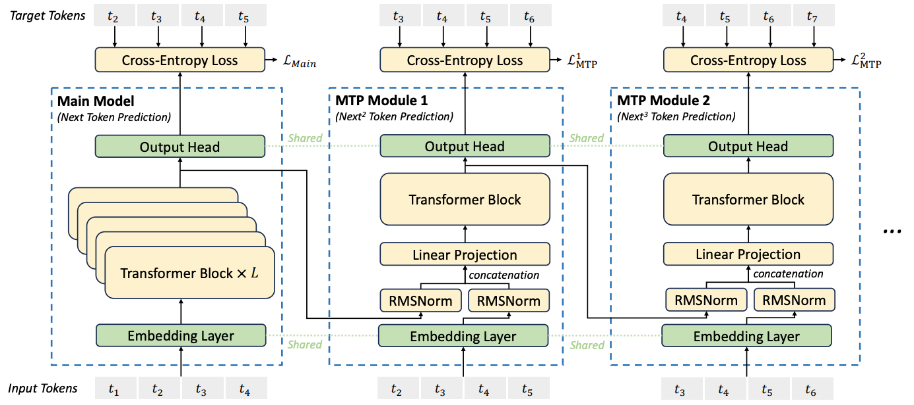
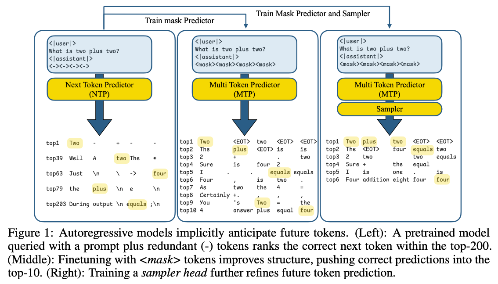
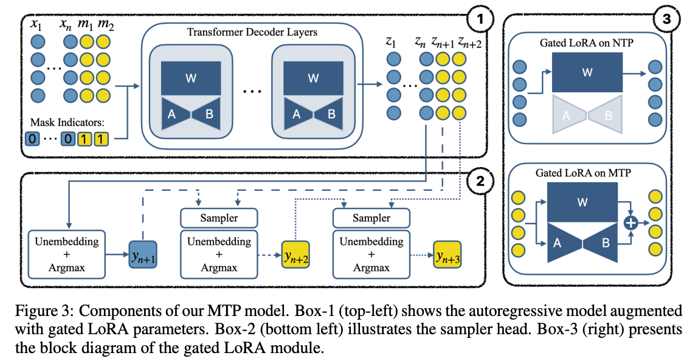
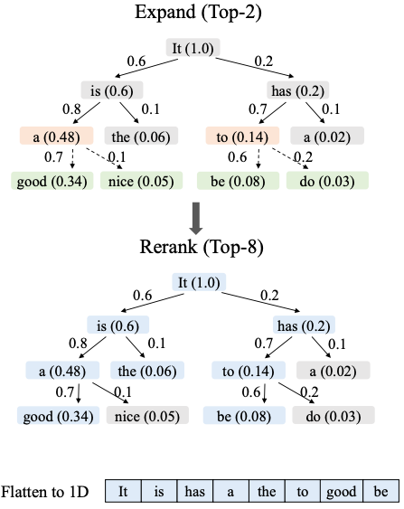
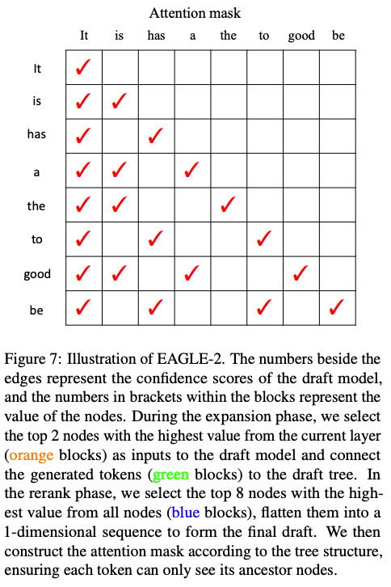
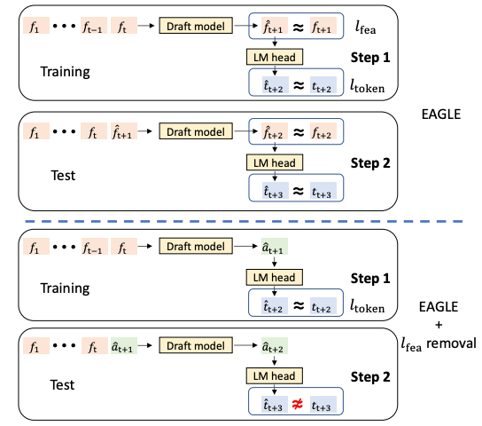
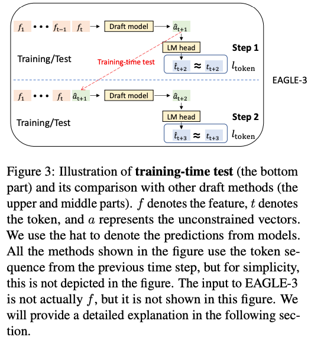

# 多 Token 推理与生成(DONE)

- Author by: 管弘毅

大语言模型（LLM）的标准范式是基于自回归的、逐Token的生成方式。这一过程的内在顺序性使其推理速度缓慢且计算成本高昂，尤其是在模型规模持续扩大、推理任务需要更长生成序列的背景下，这一问题愈发突出。推理延迟主要是由内存带宽限制造成的，因为每生成一个Token，都必须访问模型的全部参数。这种低效率严重阻碍了实时应用的部署，并显著增加了运营成本。

为了突破这一瓶颈，学术界和工业界的研究重心开始转向超越单Token预测的范式。这一努力形成了两条主要的技术路线：

- 第一条路线是在模型训练阶段，通过引入 Multi-Token Prediction（MTP）来增强模型内在的、对更长序列进行推理和预测的能力。
- 第二条路线则聚焦于优化推理过程本身，通过推测式解码等技术，在单次前向传播中生成多个Token，同时保持与原始模型一致的输出质量。

本文将系统性地介绍这两类技术路线的核心原理、架构设计和最新进展，帮助读者理解多Token生成技术如何有效提升大模型的训练效率和推理速度。

## MTP 架构与方法

在这一部分，我们将深入探讨多Token预测（MTP）技术，它通过修改模型的训练目标来增强模型的预测能力，从而在训练阶段就为模型赋予生成多Token的能力。MTP技术主要分为三种实现方式：核心并行MTP架构、序列式MTP以及掩码输入式MTP，每种方法都有其独特的优势和适用场景。

### Native MTP

MTP 基础架构在 [《Better & Faster Large Language Models via Multi-token Prediction》](https://arxiv.org/abs/2404.19737) 一文中被提出，其核心思想是让模型在训练时一次性预测未来的多个Token，共享主干与并行头。下图展示了文章设计的架构。

> 注：图中 Shared 部分代表 embedding 和多层 Transformer，Head 部分代表用于推理的单层 Transformer。

- **训练**：
  - 该架构由一个共享的Transformer主干网络和多个独立的并行输出头（prediction heads）组成。共享主干为普通的Transformer结构，而每个输出头则被专门训练用于预测未来的一个特定Token（例如，Head 1预测`t+1`时刻的Token，Head 2预测`t+2`时刻的Token，以此类推）。其训练目标是所有输出头预测的交叉熵损失之和。

- **推理**：
  - 在计算完多层Transformer模型后，使用多个Head并行预测后续Token。

这种并行MTP架构是追求速度优先的直接方法，它最大化了训练信号和并行度，但其固有的独立预测机制（连续预测得到的Token之间没有消息交互）也带来了潜在的连贯性问题。

### 序列式 MTP

并行MTP架构的一个主要局限在于，由于每个输出头是独立进行预测的，导致对`t+2`时刻Token的预测并未以`t+1`时刻的预测为条件，这可能导致生成的文本序列缺乏连贯性。

DeepSeek-V3模型在 [《DeepSeek-V3 Technical Report》](https://arxiv.org/abs/2412.19437) 中通过引入一种序列式MTP架构解决了这一问题。模型结构如下图所示。

图中的 Main Model 为传统多层 Transformer，其输出结果为 `t5`；后续的 MTP Module [x] 是单层Transformer，用于串行预测后续 Token，它们的参数也是单独训练的。

相对于之前的方法，DeepSeek 的实现为每个预测的 Token 之间添加了串行连接关系。此外，在训练过程中，DeepSeek 直接使用了样本中的 ground truth 作为输入，将其与上一层的输出合并后进行计算，这样有助于减少在训练过程中的错误累加问题，从而提升训练效果。

在推理过程中，需要将训练过程中的 ground truth 替换为 Main Model 的输出 `t5'`，经过 embedding 后与中间结果进行合并后用于计算。

这种链式结构重建了Token之间的因果依赖关系，显著提升了生成文本的逻辑连贯性。值得注意的是，这些MTP模块主要用于增强训练效果，在推理阶段可以被丢弃以节省计算资源，或者被重新利用于推测式解码以加速生成。

- **MTP 对主模型训练的帮助**
  - **稳定训练**：MTP 提供更密集的监督信号，缓解仅依赖单 token loss 时学习信号稀疏的问题。如图所示，除了主模型外，MTP Module 也产生了额外的损失。
  - **提高泛化能力**：训练过程中模型必须在隐藏表示中编码更全局的语义信息，以便预测多个未来 token。
  - **缓解 exposure bias**：自回归训练仅基于上一步真实标签，而推理时依赖模型自身输出，容易累积错误；MTP 让模型“更习惯”多步预测，有助于提升鲁棒性。

总结来说：**MTP 是一种训练技巧，本质是为骨干网络（backbone）增加辅助任务，以提升主模型的表征能力和收敛效率。在推理阶段可以完全不依赖该模块。**

### 掩码输入式 MTP

掩码输入式 MTP 提供了一种不同于传统MTP的实现思路，它将多Token预测重新定义为掩码预测任务。这种方法不需要对模型架构进行大幅改动，而是通过微调已有模型实现多Token生成能力。

前文的两种方案都是通过增加额外的 Head 或 Module 来预测后续多个 Token。而来自 Apple 公司的研究者提出了一种新的视角：将 MTP 重新定义为一个掩码填充任务。

论文 [Your LLM Knows the Future: Uncovering Its Multi-Token Prediction Potential](https://arxiv.org/abs/2507.11851v1) 基于一个关键洞察：**利用自回归模型中已有的“未来信息”，通过 mask 预测和一个轻量采样模块，把这种潜力转化为更明确、更连贯的未来 token 生成能力。** 我们可以通过下图的例子进行说明：

- **左图**：在 prompt 后插入占位符 `<->`，发现模型对这些位置的预测中，未来正确词经常出现在较高排名的位置（如 top-200）
- **中图**：既然模型已经“知道”一些未来信息，作者尝试**显式地利用这种潜力**：在 prompt 后加入 **mask token**，让模型直接预测这些 mask 对应的未来词。经过微调（Fine-Tuning）后，模型在这些 mask 的预测上更准确，正确答案能排到 **top-10 logits**。
- **右图**：为了让预测的多个未来词不只是“独立猜测”，而是能**连贯生成**：引入一个轻量的 **采样模块**（two-layer MLP），它在生成时让每个预测的词依赖之前已经预测出的词。

从描述中可以看到，本方案不需要从头训练一个全新的模型，而是只需要对一个已有的模型进行 Fine-Tuning 即可。这一部分被作者称为 **Gated LoRA**，即只在 **Mask** 对应的部分启用 LoRA 参数计算，而在自回归推理时保持关闭，因此不会影响原有模型的功能和精度，这是一个巧妙的设计。下图展示了本设计对应的模块图：

本图充分展示了几个设计重点：

- **左上角**：包含 Mask 和 Gated LoRA 的模型推理流程
- **左下角**：多个连续的预测得到的 Token 之间使用 Sampler 产生串行依赖，生成语言上更连续的输出
- **右图**：Gated LoRA 在 NTP（Next Token Prediction） 和 MTP 的开关状态

作者在训练设计中的一个关键创新是引入了 **潜在一致性匹配（Latent Consistency Loss，LCM）**：要求模型在一次性预测未来第三个词时，其结果应尽可能接近“一步一步”预测到第三个词的结果。这使得多词预测的结果更接近传统、严谨的单步自回归预测，从而提升预测的准确率和可靠性。

## Speculative Decoding 架构与方法

Speculative Decoding（推测式解码）是一种纯粹的推理时优化技术，与MTP不同，它不改变模型本身，而是在推理过程中通过“草稿-验证”机制加速Token生成。本部分将详细解析推测式解码的核心原理、实现方式以及EAGLE系列框架的演进过程。

### Draft-then-Verify 范式

Draft-then-Verify（草稿-验证）是推测式解码的核心机制，它通过引入一个小模型来加速大模型的推理过程。这一范式巧妙地解决了推理速度与生成质量之间的平衡问题。

推测式解码的核心机制是“草稿-then-验证”（draft-then-verify）。该过程通常涉及两个模型：

1. **草稿模型（Draft Model）**：一个规模较小、速度更快的模型，负责根据当前上下文生成一个候选 Token 序列（即“草稿”）。
2. **目标模型（Target Model）**：原始的、规模较大、能力更强的模型，负责对草稿模型生成的整个序列进行一次并行的前向传播验证。

验证过程如下：目标模型会逐一检查草稿序列中的每个 Token。只要目标模型为某个 Token 分配的概率高于草稿模型，该 Token 就会被接受。一旦出现不匹配（即目标模型认为有更好的选择），该 Token 及其后的所有草稿 Token 都会被拒绝。随后，目标模型会自行生成一个正确的 Token，然后整个“草稿-then-验证”循环重新开始。这一机制通过一个严谨的概率接受准则，确保最终输出的文本与完全由目标模型逐 Token 自回归生成所得到的文本，在概率分布上完全一致。

投机采样过程如下：

1. 用**草稿模型**做自回归采样，连续生成 k 个 tokens。
2. 将生成的 k 个 tokens 与原始前缀拼接，送入**目标模型**执行一次前向传播（forward）。
3. 使用目标模型和草稿模型的 logits 结果进行比对，如果发现某个 token 在草稿模型中生成的质量不佳，则需要重新采样该 token。重复步骤1。
4. 如果所有生成的 token 均被接受，则用**目标模型**采样下一个 token。重复步骤1。

### EAGLE 框架演进

EAGLE框架是推测式解码领域最具代表性的工作之一，其从EAGLE-1到EAGLE-3的演进，深刻反映了研究社区对该技术理解的深化。本节将详细介绍EAGLE系列框架的技术演进和创新点。

#### EAGLE-1

EAGLE-1是该系列的开创性工作，首次将推测式解码引入特征层面进行自回归预测，突破了传统Token层面预测的局限。

最初的 [EAGLE: Speculative Sampling Requires Rethinking Feature Uncertainty](https://arxiv.org/abs/2401.15077) 框架引入了一项关键创新：它在 **特征层面** 而非Token层面进行自回归预测。

具体来说，草稿模型的目标不是直接预测下一个 Token，而是预测目标模型倒数第二层的隐藏状态（即特征向量）。然后，这个预测出的特征向量被输入到目标模型的最后一个 LM 头中，以生成草稿 Token。这种方法旨在利用特征空间中更丰富的语义信息，从而生成比直接预测Token更准确的草稿。

**EAGLE-1** 的核心工作流程：

1. **草稿生成**：利用一个预先定义好的 **静态草稿树** 结构，快速生成多个候选的文本续写路径。这种“先验方式”保证了生成过程的稳定和高效。
2. **并行验证**：借用并优化了 **Medusa 的树状注意力机制**，将整个草稿树一次性提交给主模型进行批量验证。这极大地利用了现代硬件的并行计算能力，避免了传统模型逐词元生成的瓶颈，从而显著提升了语言模型的推理速度。

#### EAGLE-2

EAGLE-2在EAGLE-1的基础上引入了动态草稿树机制，根据上下文的可预测性动态调整草稿生成策略，进一步提升了验证效率。

[EAGLE-2: Faster Inference of Language Models with Dynamic Draft Trees](https://arxiv.org/abs/2406.16858) 在 EAGLE-1 基础上进行了改进，引入了基于草稿模型置信度得分的动态可调整草稿树结构。这使得模型能够根据上下文的可预测性，动态地生成更多或更少的候选 Token，从而提高验证的效率。

  

如上图所示，EAGLE-2 的机制为：

- **构建草稿树**：首先，系统通过不断选择当前层最可信的**两个节点**来扩展，生成一个包含多种可能续写路径的树状结构。
- **筛选最终草稿**：接着，系统会从整个树中挑选出价值最高的**八个节点**，并将它们排列成一个单一序列，形成最终提交的草稿。
- **并行验证**：最后，在验证时，一个特殊的注意力掩码会确保每个词元只关注其原始路径上的祖先词元，从而实现所有路径的高效并行处理。

#### EAGLE-3

EAGLE-3代表了推测式解码技术的最新进展，它摒弃了前代版本中核心的特征预测约束，转而采用更灵活的直接Token预测和多层特征融合策略。

在先前工作中引入的 EAGLE 框架，通过重用目标模型的顶层特征，开创了特征级自回归。然而，EAGLE 面临着以下关键限制：

1. **特征预测限制**：草稿模型被限制在语言模型头部之前预测下一个特征，限制了其表达能力。
2. **误差累积**：当草稿模型的预测结果用作后续步骤的输入时，微小误差会迅速累积，导致较长序列的接受率较低。
3. **信息利用有限**：仅依赖顶层特征可能无法为准确的多步预测提供足够的上下文信息。

[EAGLE-3: Scaling up Inference Acceleration of Large Language Models via Training-Time Test](https://arxiv.org/abs/2503.01840) 标志着一个重要的转折点，它摒弃了前代版本中核心的**特征预测约束**，因为研究发现这一约束成为了性能瓶颈。EAGLE-3 的两大架构突破在于：

1. **基于“训练时测试”的直接 Token 预测**：
   1. 通过“训练时测试”机制消除了特征预测限制。草稿模型现在不再预测受限特征，而是生成“无约束向量”，这些向量直接输入到目标模型的语言模型头部。
   2. 训练时测试通过在训练期间模拟多步推理过程来解决误差累积问题。训练不再总是使用目标模型的真实特征，而是包含草稿模型自身先前生成的输出作为后续预测输入的实例。这迫使草稿模型学习对其自身近似值的鲁棒性。
   3. 论文中的下图反映了：
      1. 左半部分展示了训练和测试条件的不一致，会导致模型在实际应用中表现不佳，因为在训练时它从未学习过如何处理自己可能产生的错误。中间的 `EAGLE + lfea removal` 图示更是强调了这一点：如果简单地移除特征匹配(`lfea`)，模型生成的`â`质量会很差，导致测试时出现严重错误（`t̂ ≠ t`）。
      2. 右半部分展示了模型会 **同时** 将它在路径一中自己生成的预测特征 `â`，再次输入到 LM Head 中，进行第二次词元预测。这个过程完全 **模拟了测试时的真实情况**——即依赖自己的预测进行下一步生成。

  

2. **多层特征融合**：为了给草稿模型提供更丰富的上下文信息，EAGLE-3 不再仅仅依赖于目标模型的顶层特征。取而代之的是，它将目标模型在最后一次前向传播中产生的低、中、高层特征进行融合，并将这个融合后的特征向量作为草稿模型的输入。这为生成高质量的草稿提供了远比单一顶层特征更全面的信号。

#### EAGLE 框架对比

EAGLE系列框架的演进反映了推测式解码技术的快速发展。本节将对EAGLE-1到EAGLE-3进行系统对比，帮助读者理解各版本的技术特点和性能差异。

| 特性 / 技术点          | EAGLE-1            | EAGLE-2                   | EAGLE-3                       |
| ----------------- | ------------------ | ------------------------- | ----------------------------- |
| **预测目标**          | Feature（第二高层特征）    | 同 EAGLE-1                 | Token（直接预测）                   |
| **结构**            | 静态草稿树              | 动态草稿树（基于上下文与置信度）          | 使用 training-time test，更灵活     |
| **特征利用**          | Top-layer features | 同 EAGLE-1                 | 多层特征融合（低／中／高层）                |
| **生成质量一致性**       | Lossless（无损）       | Lossless（无损）              | 继续保持一致性                       |
| **性能加速比**         | ≈ 2.7×–3.5×        | ≈ 3.05×–4.26×（提升 20%–40%） | 最多 ≈ 6.5×，相较 EAGLE-2 提升约 1.4× |
| **吞吐提升（高 Batch）** | —                  | —                         | ≈ 1.38× 吞吐提升                  |

## 多 Token 策略综合对比

下表对各类多Token生成策略进行了系统对比，包括MTP系列和推测式解码技术，帮助读者根据实际应用场景选择合适的技术方案。

| 技术           | 核心机制               | 应用阶段   | 关键创新               | 优势               | 局限性            | 代表性示例                                                                                 |
| ------------ | ------------------ | ------ | ------------------ | ---------------- | -------------- | ------------------------------------------------------------------------------------- |
| **并行MTP**    | 共享主干网络 + 多个并行输出头   | 训练时    | 在训练目标中引入多未来Token预测 | 训练信号强，适合自推测解码    | 独立预测可能导致输出不连贯  | "Better & Faster LLMs"                                                                |
| **序列式MTP**   | 链式MTP模块，维持因果依赖     | 训练时    | 解决了并行MTP的连贯性问题     | 生成质量更高，逻辑性更强     | 牺牲了部分并行性       | DeepSeek-V3                                                                           |
| **掩码输入式MTP** | 将MTP转化为掩码填充任务      | 训练/微调时 | 使用LoRA，可附加到任意预训练模型 | 模块化，高效微调，不损害原模型  | 依赖轻量级采样器来保证连贯性 | Apple Research                                                                        |
| **标准推测式解码**  | "草稿-验证"循环          | 推理时    | 使用小模型为大模型生成草稿      | 无损加速，保证输出分布一致    | 需要合适的、兼容的草稿模型  | [Google Research](https://research.google/blog/looking-back-at-speculative-decoding/) |
| **EAGLE-3**  | 直接Token预测 + 多层特征融合 | 训练+推理  | "训练时测试"方法，发现缩放定律   | 极高的加速比，可从数据规模中获益 | 训练草稿模型过程相对复杂   | EAGLE-3                                                                               |

## 总结与思考

多Token生成技术代表了大模型推理优化的重要方向，通过MTP和Speculative Decoding两类主要技术路线，有效突破了传统自回归生成的性能瓶颈。MTP技术在训练阶段增强模型的多步预测能力，通过并行架构、序列式连接或掩码预测等方式，提高了模型的训练效率和泛化能力；而Speculative Decoding则在推理阶段通过“草稿-验证”机制，利用小模型加速大模型的推理过程，实现了无损的推理加速。

随着EAGLE系列框架的演进，推测式解码技术已经从简单的特征预测发展到动态草稿树和多层特征融合，加速比从最初的2.7-3.5倍提升到最高6.5倍。这些技术不仅显著提高了大模型的推理效率，降低了部署成本，还为未来大模型的实用化铺平了道路。

在实际应用中，选择哪种技术取决于具体场景需求：若追求训练效率和模型质量，MTP系列技术更为适合；若关注推理速度和资源消耗，Speculative Decoding则是更好的选择。随着技术的不断演进，这两类方法也可能进一步融合，为大模型的高效部署提供更强大的支持。

## 参考资料

- [探秘 Transformer系列之（33）--- DeepSeek MTP](https://www.cnblogs.com/rossiXYZ/p/18880573)
- [deepseek技术解读(2)-MTP（Multi-Token Prediction）的前世今生](https://zhuanlan.zhihu.com/p/18056041194)
- [大模型推理妙招—投机采样（Speculative Decoding）](https://zhuanlan.zhihu.com/p/651359908)
- [[LLM 投机推理] 超越 Medusa 的投机采样—— EAGLE 1/2 论文解读](https://zhuanlan.zhihu.com/p/716344354)
