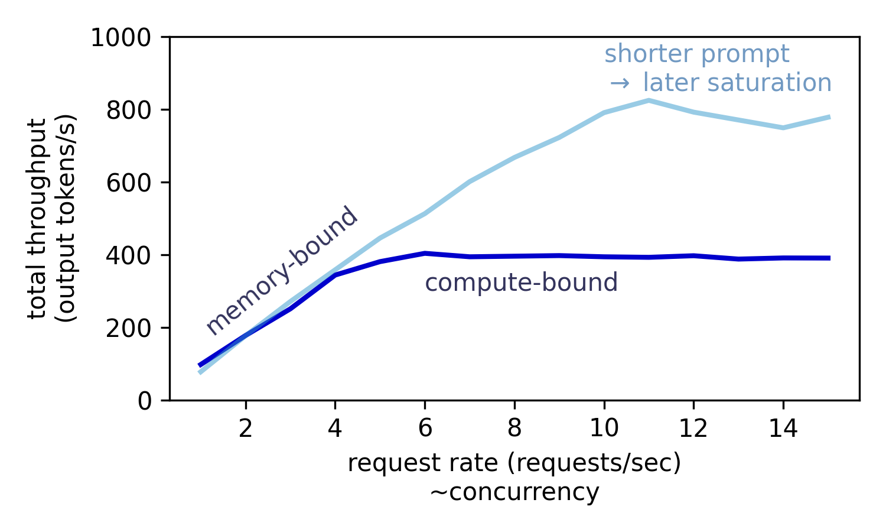
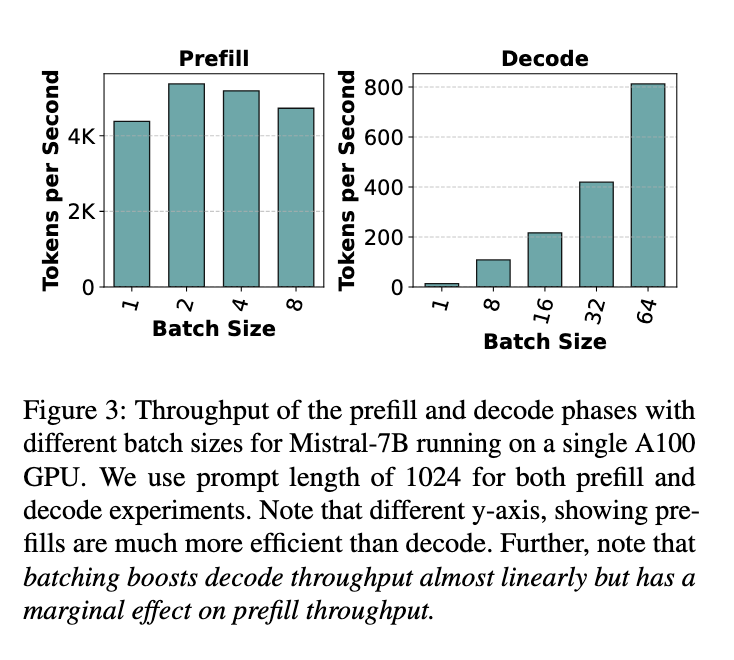
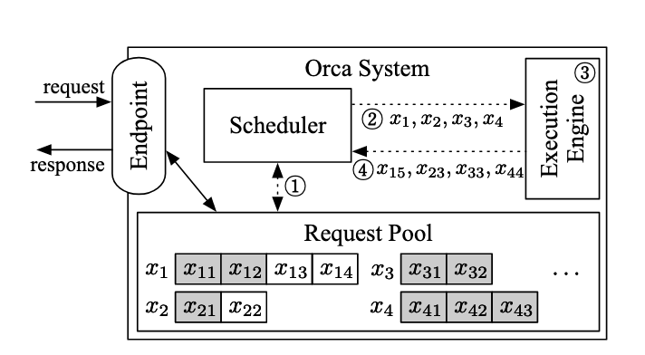
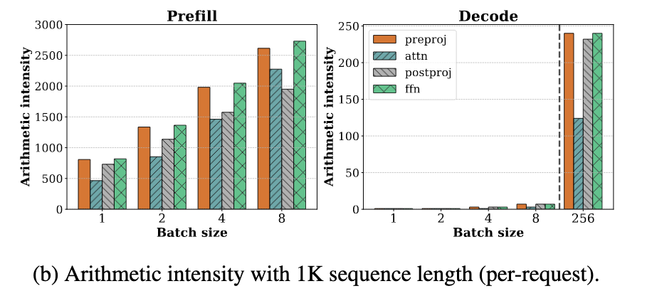
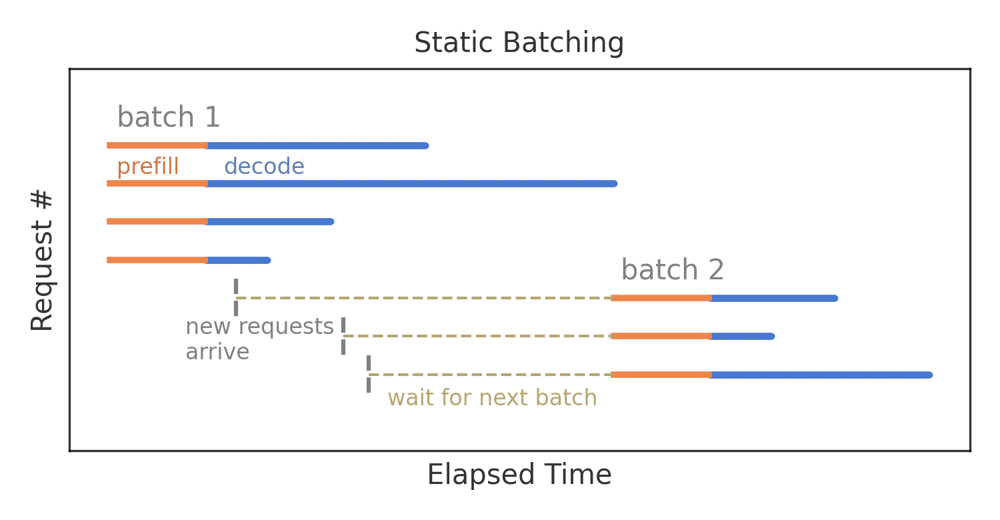
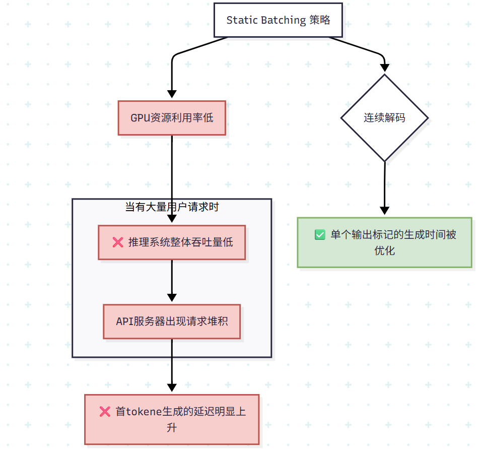

<!--Copyright © ZOMI 适用于[License](https://github.com/Infrasys-AI/AIInfra)版权许可-->

# Continous Batching原理

Author by: 陈宇航，程治玮

## 从训练到推理：Batching技术的演进

Batching技术并不是推理引擎独有的，在训练的过程中需要对训练样本进行batching操作，提升GPU的利用率，最终提高训练吞吐，加速大模型的训练过程，Batching技术可以看作是在硬件层面为了提升GPU利用率而一定会使用的技术。

在推理系统的设计中，并行处理来自多个用户的负载对于LLM应用的性能至关重要。在训练的过程中，是对一整个Batch的数据同时进行计算，得到Batch中每一条数据中的每一个token位置的预测。这样的计算模型可以看作是对整个批次的输入数据进行“批量推断”，得出“批量预测”的过程。

## 推理过程负载特性带来的问题：Prefill和Decode

而推理的过程中，由于Transformer架构下模型自回归输出的本质，整个计算过程会分成Prefill和Decode两个阶段。**在Prefill阶段，所有输入标记的计算可以并行执行，而在Decode阶段，单个请求层面无法实现并行化**。

### 阶段一：Prefill（预处理阶段）
- **计算特性**：高度并行化，能够充分利用GPU的计算核心
- **处理内容**：对所有输入token进行并行计算
- **性能瓶颈**：计算密集型任务，主要受限于GPU算力

### 阶段二：Decode（解码阶段）
- **计算特性**：串行执行，每次只能生成一个token
- **处理内容**：逐步生成输出序列
- **性能瓶颈**：内存带宽密集型，需要频繁读写庞大的KV缓存

这种根本性的差异导致了传统静态批处理（Static Batching）的失效。

### 静态批处理的困境：性能"气泡"的形成
图中黄色区域代表Prefill阶段，蓝色区域代表Decode阶段。两阶段的计算特性差异表明：

在一个批次的请求中，当所有请求都完成了计算密集型的Prefill阶段后，会集体进入访存密集型的Decode阶段。这意味着GPU的计算单元会从接近满载的繁忙状态，突然转为大部分时间都在等待从显存中读取KV Cache的空闲状态。这导致了GPU计算利用率的“断崖式”下跌，在整个服务过程中形成了巨大的性能“气泡”（Bubble），严重影响了系统的总吞吐量。

所要考虑的Token吞吐量与GPU利用率直接相关，只要GPU算力未饱和，吞吐量便有提升空间。在大模型推理的两个阶段中：

- **Prefill阶段**：计算密集，单个长序列请求就可能使GPU达到算力瓶颈。
- **Decode阶段**： 访存密集，单次计算量小，通常需要通过批处理（Batching）多个并发请求来充分利用GPU资源。

如图所示，当以并发请求数为变量时，系统吞吐量在低并发区几乎呈线性增长。这是因为在访存受限的Decode阶段，增大批处理规模能有效提升GPU利用率。然而，一旦GPU利用率饱和，系统进入计算受限状态，即使再增加并发数，整体吞吐量也将趋于平稳，达到性能上限。

由于两阶段推理特性的不同，针对不同阶段的最佳Batch大小应该是不同的，这也意味着需要针对Prefill和Decode分别进行Batch策略。**这种阶段感知的批处理思想，正是Continuous Batching技术的核心所在**。

## 吞吐量 VS 有效吞吐量
最大化推理的吞吐确实可以用来衡量整个推理系统的服务成本。针对推理系统，只考虑吞吐是远远不够的。在大模型推理的各个下游应用中。根据用户体验的延迟要求，对用户的request需要满足一系列性能服务水平目标（SLO），最常用的SLO指标如下：

- **首Token生成时间** (TTFT - Time To First Token)：指大语言模型从接收用户输入到生成并返回第一个文本标记（Token）的全部耗时。这项指标主要反映了模型处理提示（Prefill阶段）的速度。

- **单个输出标记时间** (TPOT - Time Per Output Token)：指在首个标记生成后，模型输出每个后续标记的平均耗ت时。这项指标直接反映了模型逐字生成（Decode阶段）的推理性能。

吞吐量衡量的是所有用户和请求完成的请求数或标记数，因此忽略了这些延迟要求。可以将用户单个请求的端到端延迟看作是Prefill和decode过程的总延迟。

**因此推理系统中的Batching策略应该在满足这些不同的SLO延迟指标的情况下，尽可能提升系统的推理吞吐。**

## 调度器和请求队列：Batching技术和推理引擎融合的接口

### 调度器的抽象：实现批处理调度的核心
此前的分析将推理引擎作为一个黑盒模型进行了整体性考量。但是，当我们深入到批处理策略的细节，特别是权衡系统吞吐量与请求延迟时，这种宏观视角便显现出其局限性。为了精准地建模和优化请求处理流程，我们必须将系统的功能解耦，**将其显式地抽象为两大模块：负责请求接收、排序和批次构建决策的调度器，以及负责执行底层模型计算的推理引擎**。

例如前文提到的Static Batching：每次从请求队列中取出固定的一组请求组成一个batch，发送给执行推理的引擎。直到这组请求完全推理结束后，调度器才会开始处理下一轮batch。

### 高效请求队列：优化推理性能

在 GPU 上进行批量计算比单独处理每个请求更加高效和资源节约。使用后端请求队列才能使调度器能够选择多个请求并将它们放在同一个批次中进行处理。可以这样理解，一旦请求加入到推理引擎中，就无法再改变其顺序。因此需要在用户请求和推理引擎之间创建一个中间过程，在这个中间过程中，我们对所有的请求是可以控制的。因此，**用户不会直接将请求发送到推理引擎后端，而是发送到一个 API 服务器（LLM-Server），在API服务器层面可以对队列部分进行设计来实现一些优先级划分，更优的批处理策略等**。

## Continous Batching：神之一笔但扔在不断改进

### Orca: 从 Request-level 到 Iteration-level的调度策略

意识到传统Batching方法效率低下的问题。OSDI ’22 上发表的Orca论文，这是首个系统性解决该问题的工作，引入了 iteration-level scheduling，也就是常说的Continous Batching方法。**针对推理中每个Request的Decode长度不同的特性，这种调度策略中不再等待 batch 中所有序列生成完成，而是每轮迭代动态决定 batch 大小**。这样一来，batch 中的某个序列一旦完成生成，就可以立即被替换为新的请求，从而相比 Static Batching 显著提升了 GPU 的利用率。

上面的示意图非常直观地展示了新的调度策略，接下来稍微深入探讨一下实现上的问题。Ocra提出了两个设计思路：Iteration-level Batching和Selective Batching。

- **Iteration-level Batching**：在每一次迭代时，调度器都会通过从待处理请求队列中进行选择，来动态地创建一个新的批次。这个批次可以包含正在进行中的请求的Decode步骤，以及至关重要的新请求的Prefill步骤。

- **Selective Batching**：在一个Iteration中，调度器会同时处理处于Prefill和Decode阶段的多个请求，这些请求的批次大小和序列长度是动态变化的。为了应对这种复杂性，Orca提出了Selective Batching机制。该机制识别出Transformer模型中不同计算操作对批处理的适应性差异

    **对于像矩阵乘法这样易于通过填充（Padding）来高效批处理的操作，它会将所有请求合并计算。**

    **而对于像Attention这样因序列长度不同而难以高效批处理的操作，则放弃批处理，将每个请求拆分出来，串行执行。**通过这种“选择性”地应用批处理的策略，Orca在提升GPU利用率的同时，避免了在关键操作上的计算浪费

从本质上来看除了Attention操作，其余的Linear和Norm部分都是token level的计算，因此很自然可以将Batch和Seq_len维度进行合并为一个维度进行计算。

而Self-Attention的本质是“序列级”的。它的核心就是在序列内部的Token之间建立关系。要计算一个Token的输出，必须将它与同一序列中所有其他Token的Key进行点积运算，然后通过Softmax进行归一化。这意味着，序列中的任何一个Token的计算都依赖于整个序列。**因此每个请求的 mask、KV cache 和 token 位置可能不同，导致其张量形状不一致，无法直接合并处理。**

### Continous Batching提升计算效率的本质：对两种阶段 GPU 资源的利用方式的互补

Continous Batching混合了Prefill和Decode阶段进行批处理，其优势在于：**用一种任务填补另一种任务的资源空闲时间，在调度阶段人为混合了这两种计算阶段的流水线！**

- Prefill 阶段可以搭载在 Decode 阶段未被充分利用的算力上，提升整体算力利用率。

- Decode 阶段可以和 Prefill 阶段共享一次权重读取，减少内存带宽压力，提高带宽利用率。

这样，GPU 的计算单元和内存带宽都能被更充分利用，整体吞吐和 QPS 明显提升

下图展示了 prefill 和 decode 阶段中各个操作的算术强度（arithmetic intensity）。如下图所示，在 prefill 阶段，即使 batch size 为 1，所有操作的算术强度依然很高。而在 decode 阶段，这些操作的算术强度下降了两个数量级以上，只有在 batch size 达到 256 这种极大值时，decode 阶段才开始变得计算密集。

然而，将 batch size 扩展到如此之高在实际中几乎无法实现，因为每条请求的 KV cache 占用非常大。 例如，在 LLaMA-13B 模型上，使用 A6000 GPU，在序列长度为 1K 的情况下，最多只能容纳 18 条请求的 batch。因此，在当前可行的 batch size 范围内，decode 阶段仍然是内存瓶颈。

### Prefill first调度策略：在Decode作为瓶颈下的调度选择
通过上面的分析，由于KV Cache的限制，我们无法通过简单地增加批次大小来让Decode阶段摆脱内存瓶颈。这意味着，如果一个系统只处理Decode任务，必然会浪费掉GPU宝贵的计算资源。为了不浪费这些资源，我们必须找到一种方法来填补这些“计算空窗期”。计算密集的Prefill任务是完美的“填充物”。

**我们再回头审视一下Static Batching策略对单个Request延迟的影响。其实针对单个Request，由于Static Batching是连续解码的，可以看作是优化了每个输出标记的时间的，但是GPU资源的利用率很低，导致推理系统的吞吐低。因此在有大量用户请求的情况下，API服务器的请求队列更有可能会造成请求堆积。一旦请求堆积了，那么单个Request的整体延迟就会明显上升。**

为了减少单个请求的等待时间，推理引擎（如 vLLM 和 TGI）会在新请求到达并能放入当前批处理时，立即调度其预填充（prefill）阶段。 并行执行新请求的预填充（prefill）与所有先前请求的单次解码（decode）步骤，但由于所有操作都在同一 GPU 操作中执行，其持续时间主要由预填充决定，因此在每个请求的解码阶段，只能在该时间内生成一个输出标记。因此，这种优先处理预填充的策略虽然最小化了首个标记的生成时间，但却中断了已运行请求的解码过程。

### Selective Batching存在的问题：忽略了Requet长度的影响

## 推理引擎中的Continous Batching变种

## 引用与参考
- https://huggingface.co/blog/tngtech/llm-performance-prefill-decode-concurrent-requests
- https://hao-ai-lab.github.io/blogs/distserve/
- https://zhuanlan.zhihu.com/p/676109470
- https://github.com/cr7258/ai-infra-learning/tree/main/lesson/05-chunked-prefills
- https://huggingface.co/blog/tngtech/llm-performance-request-queueing
- https://www.databricks.com/blog/llm-inference-performance-engineering-best-practices

### 参考论文
- https://www.usenix.org/conference/osdi22/presentation/yu
- https://arxiv.org/abs/2403.02310
- 