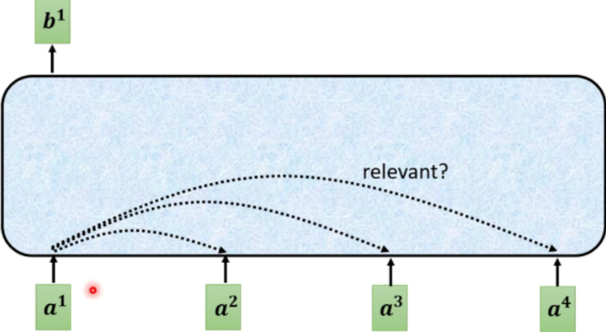

<!--Copyright © ZOMI 适用于[License](https://github.com/Infrasys-AI/AIInfra)版权许可-->

# 04.Attention 注意力机制

Author by: 张志达

## 1. Attention机制要解决的问题

在传统的序列建模中，如RNN和LSTM，模型需要逐步处理序列中的每个元素，这导致了几个关键问题：

### 1.1 长距离依赖问题
- **问题**：RNN在处理长序列时，信息传递会逐渐衰减，难以捕捉远距离元素之间的关系
- **影响**：对于长文本或长序列，模型性能显著下降

### 1.2 并行化困难
- **问题**：RNN的序列依赖特性使得计算无法并行化
- **影响**：训练速度慢，计算效率低

Attention机制通过直接建模序列中任意两个位置之间的关系，有效解决了这些问题。

## 2. Self-Attention 自注意力机制


Self-Attention是Transformer的核心组件，它允许序列中的每个位置直接关注到序列中的所有其他位置。

### 2.1 基本原理



对于每个输入向量a, 经过蓝色部分self-attention之后都输出一个向量b, **这个向量b是考虑所有输入向量对a1产生的影响**才得到, 

### 2.2 Attention计算的公式

Self-Attention通过三个关键矩阵（Query、Key、Value）来计算注意力权重：

```
Attention(Q, K, V) = softmax(QK^T / √d_k)V
```

其中：
- Q (Query): 查询矩阵，表示"我想要什么信息"
- K (Key): 键矩阵，表示"我有什么信息"  
- V (Value): 值矩阵，表示"实际的信息内容"
- d_k: Key向量的维度，用于缩放

### 2.3 Attention计算具体步骤

计算两个向量的相关度， 也叫attention 的score. 根据输入Embedding向量an... 得到向量bn...

1. 将输入向量分别乘以不同的两矩阵(Wq，Wk)，得到向量(Aq, Ak)
2. 将步骤1得到的向量(Aq, Ak)做点积, 得到结果。
3. 得到的结果就代表两个向量相关度, 也叫Attention score.(计算不同向量间的相关度 使用的Wq与wk为同一个)
4. 计算输入向量a 与其他所有向量的 上述计算结果, 使用Aq * Xk(Xk代表其他向量乘以Wk得到的)
5. 对 Attention score进行缩放(得到的结果 除以固定值(eg:64) 让模型梯度更稳定)和归一化, 得到softmax Sore(输入一个soft-max(也可用relu等激活函数))
6. 将输入向量乘以新的矩阵Wv得到新的向量v
7. 将得到的每个向量都乘以Attention Score, 再将其加起来得 得到结果 attention 向量b

#### 重点步骤

- 上述中Wq,Wk,Wv(也较query, key, value) 是三个未知量 通过训练得出
- softmax计算为 计算当前向量与其他向量关系的 attention score 进行归一化

### 2.2 实现伪代码

```python
def self_attention(X, W_q, W_k, W_v):
    """
    Self-Attention实现
    X: 输入序列 [seq_len, d_model]
    W_q, W_k, W_v: 可学习的权重矩阵
    """
    # 计算Q, K, V
    Q = X @ W_q  # [seq_len, d_k]
    K = X @ W_k  # [seq_len, d_k] 
    V = X @ W_v  # [seq_len, d_v]
    
    # 计算注意力分数
    scores = Q @ K.T  # [seq_len, seq_len]
    scores = scores / sqrt(d_k)  # 缩放
    
    # 应用softmax得到注意力权重
    attention_weights = softmax(scores)  # [seq_len, seq_len]
    
    # 加权求和得到输出
    output = attention_weights @ V  # [seq_len, d_v]
    
    return output, attention_weights
```


## 3. Multi-Head Attention 多头注意力

多头注意力机制允许模型在不同位置上关注不同的信息。具体, **输入的特征向量 会被分成多个"头",** 每个头独立的计算注意力权重, 然后将这些结果合并起来得到最终输出

### 3.1 设计思想

- **并行处理**：同时计算多个注意力头
- **不同视角**：每个头关注不同的特征子空间
- **信息融合**：将多个头的输出拼接后通过线性变换融合

### 3.2 数学表示

#### 数学表示

$$
\begin{align*}
\text{MultiHead}(Q, K, V) &= \text{Concat}(\text{head}_1, \ldots, \text{head}_h) W^O \\
\text{其中}\quad \text{head}_i &= \text{Attention}(Q W_i^Q, K W_i^K, V W_i^V) \\
\text{Attention}(Q, K, V) &= \text{softmax}\left(\frac{Q K^T}{\sqrt{d_k}}\right) V
\end{align*}
$$

- $Q, K, V$：分别为输入的 Query、Key、Value 矩阵
- $W_i^Q, W_i^K, W_i^V$：第 $i$ 个头的可学习权重矩阵
- $\text{head}_i$：第 $i$ 个注意力头的输出
- num_heads：注意力头的数量
- $\text{Concat}(\cdot)$：将所有头的输出在特征维度拼接
- $W^O$：输出的线性变换权重矩阵
- $d_k$：每个头的 Key/Query 的维度
- $\text{softmax}$：对每一行进行 softmax 归一化
- d_model: 隐藏层的总维度，通常是**模型的输入特征维度**

> 在多头注意力中, $d_{model}$ 通常会被 均等地分配每个注意力头。具体来说, $d_{model}$ 会被分成份, 每份的维度就是$d_k$

```math
d_{model} = num\_heads \times d_k
```

### 3.3 实现伪代码

```python
def multi_head_attention(X, num_heads, d_model):
    """
    Multi-Head Attention实现
    X: 输入序列 [seq_len, d_model]
    num_heads: 注意力头数量
    d_model: 模型维度
    """
    d_k = d_model // num_heads
    
    # 为每个头创建Q, K, V的权重矩阵
    W_q = [random_matrix(d_model, d_k) for _ in range(num_heads)]
    W_k = [random_matrix(d_model, d_k) for _ in range(num_heads)]
    W_v = [random_matrix(d_model, d_k) for _ in range(num_heads)]
    
    heads = []
    for i in range(num_heads):
        # 计算第i个头的输出
        head_i, _ = self_attention(X, W_q[i], W_k[i], W_v[i])
        heads.append(head_i)
    
    # 拼接所有头的输出
    concat_heads = concatenate(heads, axis=-1)  # [seq_len, d_model]
    
    # 最终线性变换
    W_o = random_matrix(d_model, d_model)
    output = concat_heads @ W_o
    
    return output
```

### 3.4 多头注意力优势

1. **捕捉多种特征子空间的信息**  
   多头机制允许模型在不同的子空间中并行地学习不同的注意力表示，每个头可以关注输入的不同部分或不同的特征组合，从而提升模型的表达能力。

2. **增强模型的表示能力**  
   单一注意力头可能受限于其维度，难以捕捉复杂的依赖关系。多头注意力通过并行多个头的方式，能够综合多种视角的信息，提升对序列内部复杂关系的建模能力。

3. **提升训练的稳定性**  
   多头机制有助于分散每个头的学习压力，降低单一头过拟合或学习失败的风险，使整体训练过程更加稳定和高效。

4. **并行计算高效**  
   多头注意力可以在硬件上高效并行实现，充分利用现代计算资源，加快模型的训练和推理速度。

5. **适应不同任务和场景**  
   不同的注意力头可以自动学习到对不同任务或输入特征的关注模式，使模型更具泛化能力和适应性。


## 4. Masked Attention 掩码注意力

Masked Attention主要用于，**确保在生成序列时只能看到当前位置之前的信息。**

### 4.1 应用场景

- **语言建模**：预测下一个词时不能看到未来的词
- **序列生成**：自回归生成过程中保持因果性
- **训练效率**：并行训练时保持正确的依赖关系

### 4.2 掩码机制

```python
def masked_attention(Q, K, V, mask=None):
    """
    Masked Self-Attention实现
    mask: 掩码矩阵，True表示需要屏蔽的位置
    """
    # 计算注意力分数
    scores = Q @ K.T / sqrt(d_k)
    
    # 应用掩码
    if mask is not None:
        scores = scores.masked_fill(mask, -1e9)
    
    # Softmax归一化
    attention_weights = softmax(scores)
    
    # 加权求和
    output = attention_weights @ V
    
    return output, attention_weights

def create_causal_mask(seq_len):
    """
    创建因果掩码矩阵
    """
    mask = torch.triu(torch.ones(seq_len, seq_len), diagonal=1)
    return mask.bool()
```

### 4.3 掩码效果


图中显示，掩码确保每个位置只能关注到它之前的位置，保持了生成过程的因果性。

## 5. 三种注意力机制的区别

| 特性 | Self-Attention | Multi-Head Attention | Masked Attention |
|------|----------------|---------------------|------------------|
| **计算复杂度** | O(n²) | O(n²) | O(n²) |
| **并行化** | 完全并行 | 完全并行 | 完全并行 |
| **信息访问** | 全局访问 | 全局访问 | 因果访问 |
| **参数量** | 3×d_model² | 4×d_model² | 3×d_model² |
| **应用场景** | 编码器 | 编码器/解码器 | 解码器 |

### 5.1 计算复杂度分析

```python
def complexity_analysis(seq_len, d_model, num_heads):
    """
    计算复杂度分析
    """
    # Self-Attention: O(seq_len² × d_model)
    self_attn_ops = seq_len * seq_len * d_model
    
    # Multi-Head Attention: O(seq_len² × d_model) 
    # 虽然头数增加，但每个头的维度减少
    multi_head_ops = seq_len * seq_len * d_model
    
    # 空间复杂度: O(seq_len²) 用于存储注意力矩阵
    space_complexity = seq_len * seq_len
    
    return {
        'time_complexity': self_attn_ops,
        'space_complexity': space_complexity
    }
```

## 6. 总结

Attention机制是Transformer架构的核心创新，它通过以下方式解决了传统序列建模的问题：

1. **Self-Attention**：建立了序列中任意位置间的直接连接
2. **Multi-Head Attention**：从多个子空间捕获不同类型的关系
3. **Masked Attention**：在生成任务中保持因果性约束

这些机制的结合使得Transformer能够：
- 高效处理长序列
- 完全并行化计算
- 捕获复杂的序列依赖关系

Attention机制的设计体现了深度学习中对"关注重要信息"这一人类认知机制的数学建模，为后续的大语言模型发展奠定了坚实基础。


## 本节视频

<html>
<iframe src="https://player.bilibili.com/player.html?isOutside=true&aid=114665426262438&bvid=BV11AMHzuEet&cid=30444554230&p=1&as_wide=1&high_quality=1&danmaku=0&t=30&autoplay=0" width="100%" height="500" scrolling="no" border="0" frameborder="no" framespacing="0" allowfullscreen="true"> </iframe>
</html>