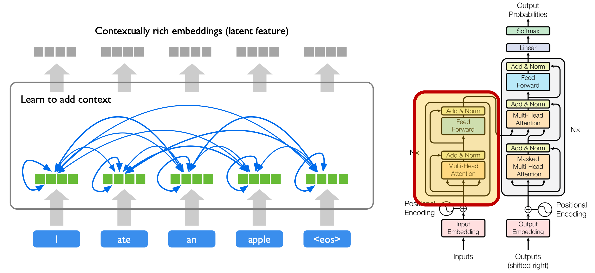

<!--Copyright © ZOMI 适用于[License](https://github.com/Infrasys-AI/AIInfra  )版权许可-->

# 搭建迷你 Transformer(DONE)

Author by: lwh & ZOMI

## Transformer 知识原理

本节将从Transformer的核心定位出发，先介绍其与传统序列模型（如RNN、LSTM）的核心差异，再拆解编码器的关键模块及各模块的设计目的——帮助读者建立“为什么需要这些模块”的认知，为后续代码实现奠定原理基础。

Transformer 是一种基于 自注意力机制（Self-Attention）的深度学习模型结构，用于处理序列数据（如文本、语音、时间序列等）。相较于传统的循环神经网络（RNN、LSTM），Transformer 有以下几个核心优势：

- 并行计算能力强：抛弃了序列依赖的结构，使训练更快。这是因为RNN类模型需按序列逐步计算，每个时间步的输出依赖前一步结果，而Transformer的自注意力机制可一次性处理整个序列，不存在时序依赖关系，能充分利用GPU的并行算力；
- 长距离依赖建模能力强：自注意力机制可以直接建模任意位置间的关系。RNN/LSTM需通过时序传递间接捕捉长距离关联，易出现信息衰减，而自注意力通过计算任意位置对的注意力权重，可直接捕捉远距离token的依赖；
- 结构模块化：由多层编码器和解码器堆叠构成，易于扩展和修改。每个模块（如注意力、前馈网络）功能独立，可按需调整（如增加注意力头数、修改前馈网络维度）。

在本实验中，仅关注编码器（Encoder）部分的精简实现，其结构主要由以下模块组成：

1. 词嵌入（Embedding）：将输入的 token 序列（如词索引）映射为稠密向量，形成初始特征表示。该过程将离散的符号（如“猫”对应索引5）转化为连续的向量空间表示，使模型能通过向量运算捕捉语义关联；
2. 位置编码（Positional Encoding）：由于 Transformer 完全抛弃了循环结构，无法像RNN那样通过时序顺序感知位置，因此需要手动注入位置信息。本实验使用论文提出的正余弦位置编码，其核心优势在于周期性和泛化性——通过不同频率的三角函数，模型可区分不同位置的相对关系，且能自然适配训练时未见过的更长序列（因位置pos+k的编码可通过pos的编码推导，无需额外参数学习）；
3. 自注意力机制（Self-Attention）：通过计算每个位置之间的关系（注意力权重），让模型自主学习哪些位置更重要。其本质是对序列的不同部分进行加权组合：对每个token（Query），计算它与所有token（Key）的匹配度，再用该匹配度对token的信息（Value）加权求和，最终得到融合全局上下文的新表示；
4. 残差连接 + 层归一化（Residual + LayerNorm）：为了解决深层网络中梯度消失和训练不稳定的问题，在注意力层和前馈网络后分别添加残差连接与 LayerNorm。残差连接提供梯度传播“捷径”，避免梯度在深层传递中衰减；LayerNorm通过对每个样本的特征维度做归一化（均值0、方差1），防止数据分布偏移，两者配合大幅提升模型的训练稳定性和表达能力；
5. 前馈网络（Feed-Forward Network）：对每个位置的表示分别通过两层全连接网络，进一步提取特征并引入非线性表达。由于自注意力层是“全局关联”操作，前馈网络则聚焦于“单个位置的局部特征细化”，两者分工协作，让模型既懂全局关系，又能捕捉局部细节。



最终，编码器的每个模块都以“子层 → 残差连接 → 层归一化”的方式组成结构块，构成了一个可堆叠的 Transformer 编码器框架——堆叠层数越多，模型捕捉复杂模式的能力越强（但训练成本也越高）。

## Transformer 编码实现

本节将基于PyTorch逐步实现迷你Transformer编码器，从基础工具库导入开始，依次实现位置编码、缩放点积注意力、编码器类，并通过假数据测试模型功能。每段代码都会结合原理解释“为什么这么写”，帮助读者将代码与理论对应。

首先导入所需的 PyTorch 和数学库：PyTorch 提供张量操作和神经网络模块，math库用于计算缩放因子等数学操作，这是实现后续模块的基础依赖。

```python
import torch
import torch.nn as nn
import math
```

与论文一致使用固定的正余弦位置编码方式。注意编码维度必须为偶数——这是因为编码需将维度平分为两部分，分别填充正弦（sin）和余弦（cos）值，确保每个位置的编码在不同维度上有差异化的频率特征，从而精准区分序列中不同位置的token。

```python
def sinusoidal_pos_encoding(seq_len: int, d_model: int) -> torch.Tensor:
    if d_model % 2 != 0:
        raise ValueError("d_model 必须为偶数")

    # 生成位置向量和维度向量：pos对应序列中每个token的位置（0到seq_len-1），i对应编码的维度索引（0到d_model//2-1）
    pos = torch.arange(0, seq_len).unsqueeze(1).float() # shape: (seq_len, 1)，增加维度以便后续广播
    i = torch.arange(0, d_model // 2).float() # shape: (d_model/2,)，对应sin/cos的频率参数

    # 计算频率除数项：10000^(2i/d_model)，频率随维度索引i增大而降低（高频对应短距离位置区分，低频对应长距离）
    denom = torch.pow(10000, 2 * i / d_model) # shape: (d_model/2,)
    angle = pos / denom # shape: (seq_len, d_model/2)，通过广播实现每个位置与每个频率的组合

    # 初始化编码矩阵：最终输出为(seq_len, d_model)，每个位置对应d_model维的编码
    pe = torch.zeros(seq_len, d_model)

    # 填入 sin 和 cos：偶数维度用sin（捕捉位置的“快速变化”特征），奇数维度用cos（捕捉位置的“缓慢变化”特征）
    pe[:, 0::2] = torch.sin(angle)  # 偶数维度（0,2,4...）
    pe[:, 1::2] = torch.cos(angle)  # 奇数维度（1,3,5...）

    return pe
```

这个函数返回一个 `(seq_len, d_model)` 的位置编码张量，用于为输入序列添加位置信息。该位置编码函数完成后，就可以进入 Transformer 的核心：注意力机制的实现。

这里实现的是点积注意力机制，它会使用三个输入张量：

- `q`（Query）：表示当前 token 想“关注什么”（如当前token的特征向量）；
- `k`（Key）：表示序列中每个位置的“关键词”（如每个token的特征向量，用于与Query匹配）；
- `v`（Value）：表示每个位置实际携带的“信息内容”（如每个token的详细特征，将根据注意力权重被加权）。

注意力机制的核心逻辑是：计算 `q` 与所有 `k` 的匹配程度（打分），通过softmax将打分转化为注意力权重（权重和为1，代表每个位置的重要性占比），最后用权重对 `v` 加权求和，得到融合了全局上下文的新表示。

```python
def scaled_dot_product_attention(q, k, v):

    # 计算注意力打分矩阵：q 与 k 的转置点积（捕捉q与每个k的匹配度），然后除以 sqrt(d_k) 进行缩放
    # d_k是q/k的最后一维维度，缩放的目的是：当d_k较大时，点积结果方差会增大，导致softmax输出过于陡峭（梯度消失）
    # 除以sqrt(d_k)可将方差稳定在1左右，保障注意力权重的合理分布
    scores = q @ k.transpose(-2, -1) / math.sqrt(q.size(-1))  # shape: (..., seq_len_q, seq_len_k)

    # 对打分矩阵使用 softmax，得到注意力权重：权重在seq_len_k维度求和为1，代表每个k对当前q的重要性
    weights = torch.softmax(scores, dim=-1)  # shape: (..., seq_len_q, seq_len_k)

    # 使用注意力权重加权求和 v，得到注意力输出：融合了所有k位置的信息，且突出了重要位置
    return weights @ v  # shape: (..., seq_len_q, d_v)
```

接下来构建一个迷你版的 Transformer 编码器类 `MiniTransformerEncoder`，它整合了前面实现的核心模块，形成一个完整的编码器单元。该类包含以下核心模块：

- 嵌入层（Embedding）：将输入的token索引映射为d_model维向量，是模型的初始特征输入；
- 注意力层（Self-Attention）：通过线性层将嵌入向量映射为q、k、v，再调用缩放点积注意力，提取全局上下文关联；
- 前馈网络（Feedforward）：采用“升维-非线性-降维”结构，对每个位置的特征独立细化（与注意力层的“全局关联”形成互补）；
- 层归一化（LayerNorm）：分别应用在注意力子层和前馈子层之后，配合残差连接缓解梯度消失，保障训练稳定。


此外，为每个位置添加了固定的正余弦位置编码（Positional Encoding），使模型可以识别 token 的先后顺序。需要注意：直接对词嵌入张量 `x_embed` 与位置编码 `pe` 使用加法（`x = x_embed + pe`），这是因为：

- `x_embed` 的形状是 `(batch_size, seq_len, d_model)`（本实验中batch_size=1）；
- `pe` 的形状是 `(seq_len, d_model)`；
- PyTorch 的广播机制会自动将 `pe` 扩展为 `(batch_size, seq_len, d_model)`，确保两者维度匹配后逐元素相加。

```python
class MiniTransformerEncoder(nn.Module):
    def __init__(self, vocab_size, d_model):
        super().__init__()
        self.embedding = nn.Embedding(vocab_size, d_model)  # 词嵌入层：将vocab_size个token映射为d_model维向量
        self.linear_q = nn.Linear(d_model, d_model)         # Q 映射层：将嵌入向量转化为Query（适配注意力计算）
        self.linear_k = nn.Linear(d_model, d_model)         # K 映射层：将嵌入向量转化为Key
        self.linear_v = nn.Linear(d_model, d_model)         # V 映射层：将嵌入向量转化为Value
        self.attn_output = nn.Linear(d_model, d_model)      # 注意力输出映射：将注意力结果投影回d_model维（增强表达能力）
        self.norm1 = nn.LayerNorm(d_model)                  # 第一个 LayerNorm：用于注意力子层后的归一化

        # 前馈网络：两层全连接+ReLU激活，中间维度设为d_model*2（升维以捕捉更复杂特征）
        self.ffn = nn.Sequential(                           
            nn.Linear(d_model, d_model * 2),  # 升维：从d_model到d_model*2
            nn.ReLU(),                        # 非线性激活：引入非线性，提升模型拟合能力
            nn.Linear(d_model * 2, d_model)   # 降维：回到d_model，与残差连接维度匹配
        )
        self.norm2 = nn.LayerNorm(d_model)                  # 第二个 LayerNorm：用于前馈子层后的归一化

    def forward(self, x):
        seq_len = x.size(1)  # 获取序列长度（x形状为(batch_size, seq_len)）
        x_embed = self.embedding(x)  # 词嵌入：(batch_size, seq_len) → (batch_size, seq_len, d_model)
        # 生成位置编码并添加到嵌入向量：注入位置信息
        pe = sinusoidal_pos_encoding(seq_len, x_embed.size(-1))
        x = x_embed + pe  # (batch_size, seq_len, d_model)

        # 自注意力子层：计算全局上下文关联
        q = self.linear_q(x)  # Query映射：(batch_size, seq_len, d_model) → (batch_size, seq_len, d_model)
        k = self.linear_k(x)  # Key映射
        v = self.linear_v(x)  # Value映射
        attn = scaled_dot_product_attention(q, k, v)  # 注意力计算：(batch_size, seq_len, d_model)
        # 残差连接 + LayerNorm：x（原始输入）与注意力结果相加，再归一化（缓解梯度消失）
        x = self.norm1(x + self.attn_output(attn))

        # 前馈子层：细化每个位置的局部特征
        ff = self.ffn(x)  # 前馈计算：(batch_size, seq_len, d_model) → (batch_size, seq_len, d_model)
        # 残差连接 + LayerNorm：再次通过残差和归一化稳定训练
        x = self.norm2(x + ff)
        return x  # 输出：(batch_size, seq_len, d_model)，每个位置的上下文特征向量
```

这一结构就是一个基本的 Transformer 编码器块，具备捕捉上下文关联、感知位置信息、细化局部特征的核心能力，是更复杂Transformer模型（如BERT、GPT）的基础单元。

为了测试模型输出是否符合预期，我们用一个假输入 `[3, 1, 7]`（代表序列长度为3的token索引）来运行前向传播。这里 batch_size=1（单条样本），模型会输出每个token的上下文特征向量，我们通过打印输出验证模型功能是否正常。

```python
# 初始化模型：词汇表大小50（假设包含50个不同token），模型维度d_model=16（小维度便于测试）
model = MiniTransformerEncoder(vocab_size=50, d_model=16)
# 假输入：shape为[1, 3] → (batch_size=1, seq_len=3)
dummy_input = torch.tensor([[3, 1, 7]])  
# 前向传播：获取模型输出
output = model(dummy_input)
print("=== 输出 ===")
print(output.detach().numpy())  #  detach() 脱离计算图，避免梯度干扰，转为numpy便于查看
print("=== 结束 ===")
```

    === 输出 ===
    [[[-1.5413152   1.6801366   0.05804453  0.24212095 -1.0774754
        0.02384599 -0.12485133 -0.6640581  -0.88564116  1.0022273
       -1.7447253  -0.11834528 -0.32912147  0.8888434   1.3979812
        1.1923339 ]
      [ 0.7319907   0.89123964  0.20003487 -0.07367807 -1.0843173
        0.2291747  -1.023271    0.09876721 -0.5554284   0.05615921
       -0.26637512 -1.0664971   0.01956824  1.8496377  -1.9267299
        1.9197246 ]
      [ 1.0861049  -0.38979262  1.8310152   0.47594324 -0.07559342
       -0.44681358 -1.166736    1.6186275  -1.5705074  -0.19102472
        0.40794823  1.0515163  -1.3678914  -0.19411024 -1.1033916
        0.03470579]]]
    === 结束 ===

从输出结果可见，模型成功输出了形状为 `(1, 3, 16)` 的张量（对应 `batch_size=1, seq_len=3, d_model=16`），每个token都得到了16维的上下文特征向量——这表明迷你编码器的所有模块都正常工作，实现了预期功能。至此完成了一个最小的 Transformer 编码器搭建。它结构清晰、功能完整，非常适合用作 Transformer 学习的入门代码框架。

## 总结与思考

本实验通过“原理拆解→代码实现→功能验证”的流程，完成了迷你Transformer编码器的搭建。明确了Transformer编码器的核心模块分工——词嵌入负责“离散转连续”，位置编码解决“时序感知”，自注意力捕捉“全局关联”，残差+LayerNorm保障“训练稳定”，前馈网络细化“局部特征”，各模块协同实现序列建模。
