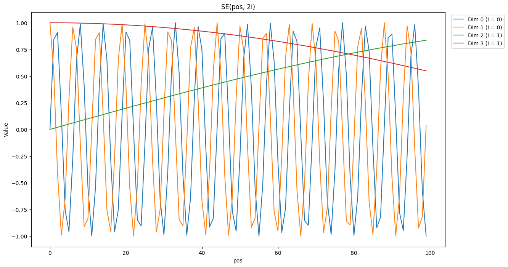

<!--Copyright © ZOMI 适用于[License](https://github.com/Infrasys-AI/AIInfra)版权许可-->

# 手把手实现核心机制 Sinusoidal 编码(DONE)

Author by: lwh & ZOMI

## 1. Sinusoidal 绝对位置编码原理

在 Transformer 模型中，由于缺乏循环结构或卷积结构，模型本身不具备处理序列中位置信息的能力。为了解决这一问题，论文《Attention is All You Need》中引入了 Sinusoidal（正弦函数）位置编码，它将序列中每个位置编码成一个具有特定模式的向量，并加到输入的词向量中，从而注入位置信息。  

Sinusoidal 绝对位置编码具有以下几个特点：

- 编码方式不依赖训练（即是固定的，不需要学习的）；
- 每个位置使用一组不同频率的正余弦函数；
- 不同位置之间的编码具有良好的相对位置可区分性；
- 编码具有一定的平移不变性，便于模型学习相对位置信息。



给定一个位置 `pos` 和一个维度索引 `i`，位置编码向量中第 `i` 个维度的值由如下公式给出：

$$
PE_{(pos, 2i)} = \sin\left( \frac{pos}{10000^{\frac{2i}{d_{\text{model}}}}} \right)
$$

$$
PE_{(pos, 2i+1)} = \cos\left( \frac{pos}{10000^{\frac{2i}{d_{\text{model}}}}} \right)
$$

其中：

- $pos$：表示序列中当前的位置；
- $i$：表示当前维度索引（从 0 开始）；
- $d_{\text{model}}$：表示位置编码的维度大小；
- $PE_{(pos, k)}$：表示位置 $pos$ 在第 $k$ 维的编码值。

## 2. Sinusoidal 绝对位置编码实现

下面我们来实现一种非常经典的位置编码方式：正余弦位置编码（Sinusoidal Positional Encoding），它被广泛应用于 Transformer 模型中，为没有时序感知能力的结构显式引入位置信息。

首先，我们导入 torch 和 math 库，用于张量操作和数学计算：


```python
import torch
import math
```

然后我们定义一个函数 `sinusoidal_pos_encoding()`，这个函数接收两个参数：

- max_len：表示序列的最大长度（也就是你输入句子的最大长度）
- d_model：编码维度（也就是每个位置要映射成多长的向量）

`sinusoidal_pos_encoding()` 输出是一个形状为 (max_len, d_model) 的张量，表示从位置 0 到位置 max_len - 1 的所有位置的编码值。

运行过程中，首先函数内部先检查 d_model 是否为偶数，然后构造位置索引和维度索引，计算每个位置在不同频率下的角度值，分别用正弦函数填入偶数维度、余弦函数填入奇数维度。最终返回一个形状为 (max_len, d_model) 的张量，表示每个位置的唯一编码，使模型在没有循环结构的情况下能够捕捉到位置信息。

下面是具体实现代码：


```python
def sinusoidal_pos_encoding(seq_len: int, d_model: int) -> torch.Tensor:
    if d_model % 2 != 0:
        raise ValueError("d_model 必须为偶数")

    # 生成位置向量和维度向量
    pos = torch.arange(0, seq_len).unsqueeze(1).float()        # shape: (seq_len, 1)
    i = torch.arange(0, d_model // 2).float()                  # shape: (d_model/2,)

    # 计算频率除数项
    denom = torch.pow(10000, 2 * i / d_model)                  # shape: (d_model/2,)
    angle = pos / denom                                        # shape: (seq_len, d_model/2)

    # 初始化编码矩阵
    pe = torch.zeros(seq_len, d_model)

    # 填入 sin 和 cos
    pe[:, 0::2] = torch.sin(angle)  # 偶数维度
    pe[:, 1::2] = torch.cos(angle)  # 奇数维度

    return pe
```

在代码的主程序部分，调用 `sinusoidal_pos_encoding(seq_len=3, d_model=4)` 来生成一个长度为 3，每个位置编码为 4 维的正弦位置编码矩阵，并将其保存在变量 pe 中。

## 3. Sinusoidal 结果输出

接着通过 `print()` 语句输出编码结果，方便观察每个位置对应的编码值。打印信息前后分别加上“开始输出”和“结束”标记，用于清晰地划分输出区域，下面是代码部分:


```python
pe = sinusoidal_pos_encoding(seq_len=3, d_model=4)
print("=== 开始位置编码输出 ===")
print(pe)
print("=== 结束 ===")
```

    === 开始位置编码输出 ===
    tensor([[ 0.0000,  1.0000,  0.0000,  1.0000],
            [ 0.8415,  0.5403,  0.0100,  0.9999],
            [ 0.9093, -0.4161,  0.0200,  0.9998]])
    === 结束 ===

运行该脚本后，程序首先输出提示信息，表明 `sinusoidal_test.py` 已开始执行。

随后，函数 `sinusoidal_pos_encoding(seq_len=3, d_model=4)` 返回了一个形状为 `(3, 4)` 的张量，其中每一行表示一个位置的编码，每一列对应一个特定频率下的正弦或余弦值。

## 4 总结与思考

本文围绕 Transformer 的 Sinusoidal 位置编码，其设计巧思在于相对位置可通过绝对编码推导、频率分层适配不同位置区分需求，虽无需训练且泛化性强，但灵活性不足、长序列高频维度易衰减，更适合中小数据集与适中序列长度任务，而在长序列或个性化需求场景下，需与可学习位置编码等方案权衡选择。
