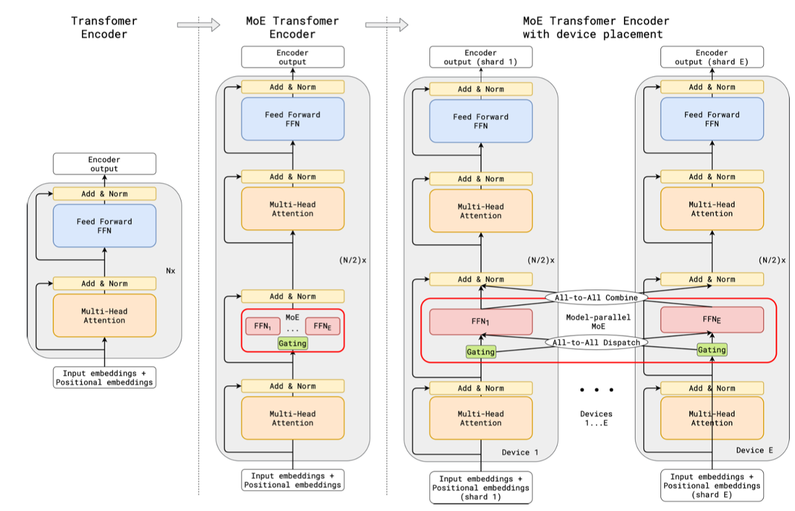

<!--Copyright © ZOMI 适用于[License](https://github.com/Infrasys-AI/AIInfra)版权许可-->

# 05.GShard MOE 解读

Author by: 张晓天

2018年，Transformer架构的兴起奠定了现代大语言模型的基础，但其密集特性也导致了训练与推理成本的急剧攀升。为解决此根本性挑战，条件计算（Conditional Computation）尤其是混合专家（Mixture of Experts, MoE）模型，被视为突破参数规模瓶颈的关键路径。2020年6月，Google发布论文《GShard: Scaling Giant Models with Conditional Computation and Automatic Sharding》，首次成功地将MoE结构大规模、高效地应用于Encoder-Decoder架构的Transformer模型，并训练出参数量高达6000亿（600B）的稀疏激活模型。

本节将深入解析GShard的核心思想、算法创新与工程哲学，探讨其如何为后续如Switch Transformer、GLaM等巨型模型奠定坚实的基础。

## 背景与核心问题

传统的密集Transformer模型在缩放（Scaling）时，所有参数都会参与每个输入样本的处理，计算成本随参数规模线性增长。MoE模型的核心思想是**稀疏激活**：模型的总参数量可以极其庞大，但对于任何单个输入，仅激活其中的一个子集（即“专家”，通常为前馈网络FFN）进行计算。

GShard要解决的核心问题可归纳为三点：

1. **模型规模化**：如何突破硬件内存限制，稳定训练参数量远超单个设备显存容量的模型（如从十亿级到万亿级）。
2. **计算高效性**：如何在引入稀疏性的同时，确保计算和通信效率，避免因动态路由带来的系统瓶颈。
3. **负载均衡**：如何将输入令牌（Tokens）公平地分配给各专家，防止某些专家过载（成为热点）而其他专家未被充分利用（饥饿）。

## 模型设计

GShard基于**Encoder-Decoder结构的Transformer**。其关键设计在于MoE层的插入位置：**在编码器（Encoder）和解码器（Decoder）中，每隔一层（即每两个Transformer层）将一个普通的FFN层替换为一个MoE层**。每两层只激活 2 个 expert，但 expert 数可以飙到 2048，从而把参数撑到 600B，而计算量几乎不变。

对于一个总层数为N的模型，其中包含N/2个MoE层。这种设计在引入大量稀疏参数（主要存在于MoE-FFN中）的同时，保留了足够多的共享稠密层（如注意力层、剩余的FFN层），保证了模型的表示能力和稳定性。

### 专家结构与门控网络

**专家（Expert）**：每个专家本身就是一个标准的FFN（如具有扩展维度的两层全连接网络）。模型总参数量随专家数量（E）线性增长。

**门控函数（Gating Function）**：对于每个输入令牌，门控网络`GATE(x)`计算其与所有专家匹配的权重，并据此进行路由。GShard的门控函数设计遵循两大原则：**负载均衡**与**高效扩展**。

GShard在门控函数的设计上提出了两个要求：

（1）负载均衡

（2）高效扩展。

负载均衡和前面讲的一样，很好理解。而为什么要高效扩展，因为如果要对N个token分别进行E个expert的分配，在N能达到百万甚至千万级别，而E也有几百上千的情况下，就需要一个高效的分布式实现，以免其他计算资源等待门控函数。

### **Top-2路由与随机路由机制**

GShard采用**Top-2门控**。即每个令牌`x`会选择权重最高的前两位专家（`expert1, expert2`），而非仅选择Top-1。这样做有两个好处：

* **增加冗余与鲁棒性**：为模型提供一定的容错能力，即使某个专家表现不佳，仍有另一个专家作为补充。
* **便于负载均衡**：通过调整两个专家的流量，更容易实现均衡分配。

然而，并非所有Top-2专家都会被无条件激活。GShard引入了一项精妙的**随机路由（Random Routing）** 机制：

* Top-1专家总是被激活。
* Top-2专家是否被激活，则依概率进行。具体而言，以第二个专家的门控权重`g2`为概率来决定是否激活它。如果`g2`很小，则它很可能被忽略。
  这种机制在保持模型容量的同时，**显著降低了计算和通信开销**，因为它有效地减少了需要实际处理的专家数量，尤其避免了为大量权重极低的专家分配计算资源。

## 专家容量与分组负载均衡

这是GShard解决负载均衡和系统效率问题的核心方案。

### 专家容量（Expert Capacity）

为了绝对防止单个专家过载，GShard设定了一个硬性限制：**每个专家最多能处理的令牌数量上限**，即专家容量（Capacity），记为`C`。论文中将其设置为`C = (2 * N) / E`，其中N是批次中的令牌总数，E是专家总数。这意味着即使负载极端不均衡，系统也最多允许专家处理两倍于平均负载的令牌量。

**令牌缓冲机制**：门控网络为每个专家维护一个计数器。当一个令牌被路由至某个专家时，该专家的计数器加1。如果该专家当前已处理的令牌数已达到其容量`C`，则即使该令牌的门控权重很高，也会被**拒绝**。这些被拒绝的令牌不会由该MoE层中的任何专家处理，而是直接通过**残差连接**绕过该层，传递至下一层。这确保了前向传播的顺利进行。

### 分组（Grouping）与自动分片（Automatic Sharding）

这是GShard工程实现的精髓，也是其名称的由来。

* **分组**：将输入的一个大批次（Large Batch）的令牌在序列维度上划分为`G`个更小的组（Groups）。每个组独立地进行门控计算和专家分配。**每个组内的专家容量相应地变为`(2 * N) / (E * G)`。
* **好处**：
  * **降低通信开销**：最重要的好处在于，后续所需的All-to-All通信（用于将不同令牌发送到其对应专家所在的设备）只需在每个组内部进行。通信量从全局规模降至组内规模，极大地提升了扩展性。
  * **兼容梯度累积**：在反向传播时，这些组可以合并起来一起计算梯度，这等价于进行了梯度累积（Gradient Accumulation），保持了训练的有效批次大小（Effective Batch Size）不变。

通过“分组”和“专家容量”这两个设计，GShard将动态且不可预测的稀疏计算，转换为了一个**具有已知且固定计算与通信预算**的准静态操作，从而使得大规模分布式训练成为可能。

## 小结

GShard是一项里程碑式的工作，它不仅在算法层面创新地提出了Top-2随机路由、专家容量等机制，更在工程层面通过分组（Grouping）和自动分片技术，首次实现了在通用硬件上高效训练万亿参数级别的稀疏模型。

其影响深远：

1. **技术路线**：它奠定了现代MoE Transformer的基础架构和设计范式，后续的如Switch Transformer（采用更极端的Top-1路由）、GLaM等模型均直接受其启发。
2. **工程范式**：它证明了通过精巧的系统设计与算法协同优化，可以突破硬件的绝对限制，开启了一个“规模远超内存”的模型训练新纪元。
3. GShard清晰地指出：未来的AI发展不仅是算法的革新，更是算法与系统工程**深度协同设计（Co-Design）** 的胜利。

## 本节视频

<html>
<iframe src="https://player.bilibili.com/player.html?isOutside=true&aid=114036666537158&bvid=BV1r8ApeaEyW&cid=28491909875&p=1&as_wide=1&high_quality=1&danmaku=0&t=30&autoplay=0" width="100%" height="500" scrolling="no" border="0" frameborder="no" framespacing="0" allowfullscreen="true"> </iframe>
</html>
