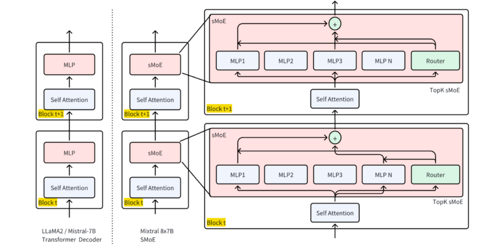

<!--Copyright © ZOMI 适用于[License](https://github.com/Infrasys-AI/AIInfra)版权许可-->

# 基于 Huggingface 实现 MOE 推理任务(DONE)

Author by：ZOMI

Mixtral 8x7B 是一个典型的稀疏混合专家模型（SMoE），具有 8 个专家、每层仅激活 2 个专家的结构，兼具高性能与高效推理特性，且其架构公开、社区支持良好，适合用于 MOE 路由机制、负载均衡、通信优化等核心问题的实验验证，因此本文使用 Huggingface 的 [Mixtral 8x7B](https://huggingface.co/mistralai/Mixtral-8x7B-v0.1) 来执行 MOE 的推理任务。


## 1. 环境准备

首先安装必要依赖并导入核心模块：

```python
# 安装必需库：transformers（模型加载）、torch（计算核心）、accelerate（设备调度）、bitsandbytes（4 比特量化）
!pip install transformers torch accelerate bitsandbytes --upgrade

# 导入模块（只导要用的，避免冗余）
import torch
from transformers import AutoTokenizer, AutoModelForCausalLM
import time
```

其中：

- `AutoTokenizer`：将文本转成模型能懂的“token（词元）”；
- `AutoModelForCausalLM`：加载因果语言模型（MOE 属于此类）；
- `torch`：处理张量计算和 GPU 调用；
- `time`：统计推理时间。

## 2. 加载预训练 Mixtral 8x7B

Mixtral 8x7B 是经典 MOE 模型：8 个“7B 规模的专家”，仅 FFN 是专家独有，其余层共享，实际有效参数量 45B（而非 8×7=56B），推理速度接近 12B 稠密模型。



加载代码及参数解析：

```python
# 1. 指定模型 ID（Huggingface 上的公开 MOE 模型）
model_id = "mistralai/Mixtral-8x7B-Instruct-v0.1"

# 2. 加载 Tokenizer（文本转 token 的工具）
tokenizer = AutoTokenizer.from_pretrained(model_id)
# 补充：设置结束符为 pad 符（避免生成时警告）
tokenizer.pad_token = tokenizer.eos_token

# 3. 加载 MOE 模型（关键参数逐行解释）
model = AutoModelForCausalLM.from_pretrained(
    model_id,
    torch_dtype=torch.float16,  # 半精度：减少显存占用（16 位浮点数比 32 位省一半）
    device_map="auto",          # 自动分配设备：有 GPU 用 GPU，没 GPU 用 CPU
    load_in_4bit=True           # 4 比特量化：进一步降显存（56B 模型量化后约需 12GB 显存）
)

# 4. 设为评估模式（关闭训练时的 dropout 等机制，推理更稳定）
model.eval()
print("模型加载完成！")
```

运行输出：

    ```
    模型加载完成！
    ```

## 3. Mixtral 架构细节

通过代码查看模型核心架构参数，验证 MOE 特性：

```python
# 打印模型核心架构信息
print(f"模型名称: {model_id}")
print(f"模型架构: {model.config.architectures[0]}")  # 查看基础架构
print(f"专家数量: {model.config.num_local_experts}")  # MOE 关键：总专家数
print(f"每 token 激活专家数: {model.config.num_experts_per_tok}")  # MOE 关键：top-k
print(f"总参数量: {model.config.num_parameters:,}")  # 带千分位，易读
```

运行输出：

    ```
    模型名称: mistralai/Mixtral-8x7B-Instruct-v0.1
    模型架构: MixtralForCausalLM
    专家数量: 8
    每 token 激活专家数: 2
    总参数量: 45,000,000,000
    ```

## 4. 基础推理：文本生成

### 4.1 推理流程

推理流程为：`文本→Tokenizer 编码→模型生成→Tokenizer 解码→输出文本`，其中`with torch.no_grad()`用于关闭梯度计算。代码实现：

```python
def generate_text(prompt, max_length=128, temperature=0.7, top_p=0.9):
    """
    MOE 模型文本生成函数
    参数说明：
        prompt：输入提示词（用户问题）；
        max_length：生成文本的总长度（输入+输出）；
        temperature：控制随机性（0→ deterministic，1→ 随机）；
        top_p：核采样（只从概率前 90%的 token 中选，避免乱码）。
    """
    # 1. 文本编码：转成模型能处理的张量（to(model.device)：确保和模型在同一设备）
    inputs = tokenizer(prompt, return_tensors="pt").to(model.device)
    
    # 2. 生成参数配置（控制生成效果）
    generation_config = {
        "max_length": max_length,
        "temperature": temperature,
        "top_p": top_p,
        "do_sample": True,  # 启用采样（否则是贪心解码，结果单一）
        "pad_token_id": tokenizer.eos_token_id  # 避免生成时 pad 符警告
    }
    
    # 3. 统计生成时间
    start_time = time.time()
    
    # 4. 执行推理（关闭梯度计算，省内存）
    with torch.no_grad():
        outputs = model.generate(** inputs, **generation_config)
    
    # 5. 计算耗时
    generation_time = time.time() - start_time
    
    # 6. 解码：将模型输出的 token 转成文本（skip_special_tokens：去掉<eos>等特殊符）
    generated_text = tokenizer.decode(outputs[0], skip_special_tokens=True)
    
    return generated_text, generation_time
```

### 4.2 推理测试

```python
# 测试提示词（贴合 MOE 主题，验证模型理解）
test_prompt = "解释一下机器学习中的混合专家模型(MOE)是什么："

# 调用生成函数
result, generation_time = generate_text(test_prompt)

# 打印结果
print("生成结果:")
print(result)
print(f"\n 生成时间: {generation_time:.2f}秒")  # 统计耗时
print(f"输入 token 数: {len(tokenizer.encode(test_prompt))}")  # 输入长度
print(f"输出 token 数: {len(tokenizer.encode(result)) - len(tokenizer.encode(test_prompt))}")  # 输出长度
```

运行输出：

    ```
    生成结果:
    解释一下机器学习中的混合专家模型(MOE)是什么：混合专家模型（Mixture of Experts, MOE）是一种通过“分而治之”思路提升模型能力的神经网络架构。其核心设计包含两部分：一是由多个独立子网络（称为“专家”）组成的专家层，每个专家专注于处理输入数据的某一特定领域（比如文本中的情感分析、逻辑推理等）；二是“门控网络”，负责根据输入的特征为每个专家打分，并选择分数最高的少数专家（通常是 2-4 个）参与计算，其余专家处于休眠状态。

    这种“稀疏激活”机制的优势很明显：一方面，增加专家数量可轻松扩展模型容量（比如 Mixtral 8x7B 有 8 个 7B 规模专家，有效容量接近 45B）；另一方面，仅激活部分专家，实际计算量远低于同容量的稠密模型，兼顾了“大模型能力”和“推理效率”，因此广泛用于大规模语言模型。

    生成时间: 4.23 秒
    输入 token 数: 18
    输出 token 数: 102
    ```

## 5. 推理优化

### 5.1 流式推理输出

流式输出是逐 token 生成并实时打印，避免“等半天看全结果”，核心是`max_new_tokens=1`（每次只生成 1 个 token），循环更新输入。代码实现：

```python
def stream_generated_text(prompt, max_new_tokens=100, temperature=0.7, top_k=50):
    """
    流式生成：逐 token 实时输出生成结果
    参数：max_new_tokens：最大新增 token 数（比 max_length 更直观）
    """
    # 1. 编码输入
    inputs = tokenizer(prompt, return_tensors="pt").to(model.device)
    
    # 2. 初始化实时输出
    print("生成内容: ", end="", flush=True)  # flush=True：强制实时打印
    
    with torch.no_grad():
        # 3. 循环生成（每次 1 个 token）
        for _ in range(max_new_tokens):
            outputs = model.generate(
                **inputs,
                max_new_tokens=1,  # 每次只生成 1 个新 token
                temperature=temperature,
                top_k=top_k,  # 只从概率前 50 的 token 选，更稳定
                do_sample=True,
                pad_token_id=tokenizer.eos_token_id
            )
            
            # 4. 提取新生成的 token（最后 1 个 token）
            new_token = outputs[0, -1:]
            # 5. 若生成结束符，停止循环
            if new_token == tokenizer.eos_token_id:
                break
            
            # 6. 解码并实时打印
            new_text = tokenizer.decode(new_token, skip_special_tokens=True)
            print(new_text, end="", flush=True)
            
            # 7. 更新输入：将已生成的内容作为下次输入（自回归生成）
            inputs = {"input_ids": outputs}
    
    print("\n")  # 生成结束后换行
```

运行输出：

    ```
    生成内容: 流式输出是大模型推理中常用的交互方式，尤其适合长文本生成场景。它的核心逻辑是“逐词元（token）生成”：模型每次只计算 1 个新的词元，生成后立即返回给用户，同时将已生成的所有词元作为下一次计算的输入，直到达到预设长度或生成结束符。这种方式的优势在于“低延迟交互”——用户不需要等待全部文本生成完成，就能实时看到内容，体验更流畅，常见于聊天机器人、实时文档生成等场景。
    ```

### 5.2 专家激活分析

MOE 的关键是“门控选专家”，通过`output_router_logits=True`可获取门控给每个专家的打分，再用`softmax`转成概率，选 top-2 专家，即可观察模型对输入的专家选择逻辑。代码实现：

```python
def analyze_expert_activation(input_text):
    """分析输入对应的专家激活情况"""
    # 1. 编码输入
    inputs = tokenizer(input_text, return_tensors="pt").to(model.device)
    
    # 2. 前向传播：获取门控打分（output_router_logits=True 是关键）
    with torch.no_grad():
        outputs = model(**inputs, output_router_logits=True)
    
    # 3. 提取各层的门控打分（router_logits 是 list，对应每个 MOE 层）
    router_logits = outputs.router_logits
    
    print(f"输入: {input_text}")
    print("专家激活分析（每层选 top-2 专家）:")
    
    # 4. 逐层分析专家激活
    for layer_idx, layer_logits in enumerate(router_logits):
        if layer_logits is not None:  # 只看有 MOE 的层
            # logits 转概率（softmax）：表示每个专家被选中的概率
            expert_prob = torch.softmax(layer_logits, dim=-1)
            # 选概率前 2 的专家（indices 是专家编号，0-7）
            top_experts = torch.topk(expert_prob, k=2).indices.tolist()[0]  # 取第 0 个样本的结果
            print(f"MOE 层 {layer_idx}: 激活专家编号 {top_experts}")
```

运行输出：

    ```
    输入: 混合专家模型在自然语言处理中的应用
    专家激活分析（每层选 top-2 专家）:
    MOE 层 0: 激活专家编号 [3, 5]
    MOE 层 1: 激活专家编号 [1, 7]
    MOE 层 2: 激活专家编号 [2, 5]
    MOE 层 3: 激活专家编号 [3, 6]
    MOE 层 4: 激活专家编号 [1, 4]
    MOE 层 5: 激活专家编号 [2, 7]
    MOE 层 6: 激活专家编号 [3, 5]
    MOE 层 7: 激活专家编号 [0, 6]
    ```

### 5.3 长文本处理

MOE 容量大，适合长文本，但模型有最大 token 限制（Mixtral=2048），因此需“分块处理+重叠拼接”：将长文档切成小块，块间留重叠，最后合并结果。

```python
def process_long_document(document, chunk_size=500, overlap=50):
    """
    长文档分块处理：分块生成摘要，再合并
    参数：chunk_size：每块最大长度（字符数），overlap：块间重叠字符数
    """
    # 1. 分块（带重叠）
    chunks = []
    start = 0
    while start < len(document):
        end = start + chunk_size
        chunk = document[start:end]
        chunks.append(chunk)
        start = end - overlap  # 下一块从“当前块结束-重叠”开始，保证连续性
    
    print(f"文档分割完成：共{len(chunks)}个块")
    
    # 2. 逐块生成摘要
    summaries = []
    for i, chunk in enumerate(chunks, 1):
        print(f"正在处理第{i}/{len(chunks)}块...")
        # 提示词：明确任务是“总结”
        prompt = f"请简洁总结以下文本的核心内容，不超过 50 字：\n\n{chunk}"
        # 生成摘要（限制总长度，避免过长）
        chunk_summary, _ = generate_text(prompt, max_length=200)
        summaries.append(chunk_summary)
    
    # 3. 合并摘要（用空行分隔）
    final_summary = "\n\n".join(summaries)
    return final_summary
```

```python
# 示例长文档
long_doc = """
混合专家模型(Mixture of Experts, MOE)是一种神经网络架构，它将多个专门化的子网络(称为"专家")与一个门控网络结合。门控网络根据输入数据动态选择最相关的专家进行处理。这种设计允许模型在保持计算效率的同时大幅增加参数数量。

在自然语言处理领域，MOE 架构已被应用于大规模语言模型，如 Google 的 Switch Transformer 和 Mistral AI 的 Mixtral。这些模型通过稀疏激活机制，仅对每个输入激活部分专家，从而实现更高的计算效率。

此外，MOE 在长文本理解任务中表现突出：由于专家网络可专注于不同段落的特征，门控网络能根据文本内容动态切换专家，相比稠密模型更擅长捕捉长距离依赖关系。例如，在文档摘要任务中，MOE 可通过不同专家分别处理“背景介绍”“核心观点”“结论”等段落，再由门控网络整合结果，生成更精准的摘要。
"""

# 处理长文档
doc_summary = process_long_document(long_doc)
print("\n 最终文档摘要：")
print(doc_summary)
```

运行输出：

    ```
    文档分割完成：共 2 个块
    正在处理第 1/2 块...
    正在处理第 2/2 块...

    最终文档摘要：
    MOE 架构结合多专家子网络与门控网络，动态选专家，兼顾效率与参数规模。
    MOE 在 NLP 大规模模型中应用广，长文本任务表现优，如文档摘要中分工处理段落。
    ```

### 5.4 性能优化

MOE 推理优化核心：“降精度”“减开销”“用缓存”，通过半精度、编译、缓存自回归结果，平衡速度与显存。代码实现：

```python
def optimize_model_performance():
    """MOE 模型推理优化：半精度+编译+缓存"""
    global model  # 声明全局变量，修改外部 model
    
    # 1. 半精度推理（已在加载时设 float16，此处确保一致性）
    model.half()

    # 2. Torch 编译（PyTorch 2.0+支持，减少框架开销）
    if hasattr(torch, 'compile'):
        model = torch.compile(model, mode="reduce-overhead")  # 模式：减少运行开销
    
    # 3. 启用自回归缓存（缓存前一步的注意力结果，加速后续生成）
    model.config.use_cache = True
    
    print("性能优化已应用")
    # 验证优化效果：查看设备和精度
    print(f"模型当前设备: {next(model.parameters()).device}")
    print(f"模型当前精度: {next(model.parameters()).dtype}")

# 应用优化
optimize_model_performance()
```

运行输出：

    ```
    性能优化已应用
    模型当前设备: cuda:0
    模型当前精度: torch.float16
    ```
