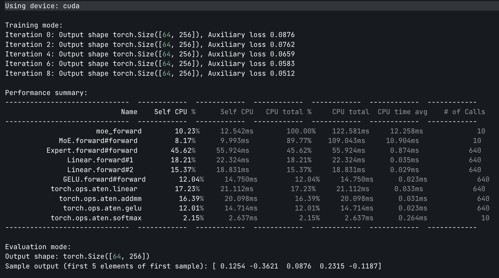

<!--Copyright © ZOMI 适用于[License](https://github.com/Infrasys-AI/AIInfra)版权许可-->

# 手撕MoE单机版

Author by: ZOMI

Mixture of Experts (MoE) 模型通过引入**稀疏激活机制**——区别于传统 dense 模型每次激活全部参数的模式，MoE仅让输入样本触发部分专家模块参与计算——在保持模型总参数容量（甚至提升容量）同时，将单次前向传播的计算开销降低至激活专家的比例（如Top-K=2、8个专家时，计算量仅为全激活的25%）。

本文基于PyTorch实现MoE单机版本，结合代码详解核心原理。

## 1. MoE 核心原理

MoE模型的设计灵感源于“分而治之”的思想：通过多个专业子网络（专家）协同处理不同输入模式，再由门控网络实现高效调度。其核心由两个组件构成：

- **专家网络(Expert)**：多个独立的前馈神经网络（如MLP），每个专家专注学习输入数据的某类特征模式（例如在NLP任务中，部分专家擅长语义理解，部分擅长句法分析）。独立参数确保各专家不会相互干扰，能形成差异化的特征提取能力。

- **门控网络(Gate)**：以输入样本为依据，计算每个专家对该样本的“匹配度”，并选择最优的K个专家参与计算。门控的核心目标是“高效路由”——既要让样本匹配到最适合的专家，又要避免少数专家过载、多数专家闲置的失衡问题。

**路由公式**：门控网络通过以下两步完成样本分配与输出计算：

1. **Top-K选择**：先通过线性层将输入映射为专家匹配度（logits），经softmax归一化为概率后，选择概率最高的K个专家（确保稀疏激活）：  

$$\text{topk\_probs}, \text{topk\_indices} = \text{topk}(\text{softmax}(W_g \cdot x))$$  

其中$W_g$是门控网络的权重矩阵，$\text{topk\_probs}$是选中专家的权重（用于后续输出加权），$\text{topk\_indices}$是选中专家的索引。

2. **输出计算**：将样本输入选中的K个专家，再按门控给出的权重加权求和，得到最终输出（融合多专家的优势）：  

$$y = \sum_{i=1}^K w_i \cdot E_i(x)$$  

其中$w_i$是$\text{topk\_probs}$中的第i个权重，$E_i(x)$是第i个专家的输出。

**负载均衡损失**（Shazeer et al., 2017）：若缺少负载均衡约束，门控可能因初始参数偏好或训练正反馈，持续将样本分配给少数专家（“热门专家”），导致其他专家闲置（模型实际容量未被利用）。该损失通过两个维度约束均衡性：  

$$\mathcal{L}_{\text{balance}} = \underbrace{\text{Var}(\text{importance})}_{\text{专家利用率}} + \lambda \cdot \underbrace{\sum_{i=1}^N (\text{usage}_i \cdot \text{routing}_i)}_{\text{样本分配均衡}}$$  

- $\text{importance}$：每个专家的总路由概率（反映专家的“总重要性”），其方差$\text{Var}$越小，说明各专家的整体参与度越均衡；  
- $\text{usage}_i$：第i个专家的使用率（分配给该专家的样本占比），$\text{routing}_i$：第i个专家的平均路由权重（分配样本对该专家的依赖度），二者乘积求和确保“分配数量”与“分配质量”双重均衡。

## 2. 专家模块

每个专家是简单的两层全连接网络（MLP），是MoE模型的“特征提取单元”：

```python
import torch
import torch.nn as nn
import torch.nn.functional as F
from torch.profiler import profile, record_function, ProfilerActivity

# 专家模块
class Expert(nn.Module):
    def __init__(self, input_dim, hidden_dim, output_dim):
        super().__init__()
        # 双层MLP：Linear→GELU→Linear
        self.net = nn.Sequential(
            nn.Linear(input_dim, hidden_dim),
            nn.GELU(),  # 比ReLU更平滑的激活函数
            nn.Linear(hidden_dim, output_dim))
        
    def forward(self, x):
        return self.net(x)  # 前向传播
```

代码中 `nn.Sequential`封装了线性变换和激活函数：线性层（Linear）负责特征维度映射（如从input_dim到hidden_dim），激活函数引入非线性，让专家能学习复杂的输入-输出关系；  

其中 GELU激活函数（Gaussian Error Linear Unit）在Transformer中广泛使用：其表达式为$GELU(x) = x \cdot \Phi(x)$（$\Phi$是标准正态分布的CDF），相比ReLU的“硬截断”（x<0时输出0），GELU的梯度在正负区间更平滑，能保留更多梯度信息，缓解深层网络的梯度消失问题，尤其适合MoE中多专家协同的深层架构；  

所有专家共享相同的网络结构但参数独立：结构一致确保各专家的输入输出维度兼容（便于后续加权融合），参数独立则让每个专家能学习差异化的特征模式（如有的专家专注高频特征，有的专注低频特征），提升模型的泛化能力。

## 3. MoE核心模块

实现稀疏路由机制与负载均衡，是MoE模型的“调度中枢”：

```python
# MoE核心模块
class MoE(nn.Module):
    def __init__(self, input_dim, num_experts, top_k, expert_capacity, hidden_dim, output_dim):
        super().__init__()
        self.num_experts = num_experts  # 专家数量：需根据任务复杂度调整（如简单任务4-8个，复杂任务16-32个）
        self.top_k = top_k              # 每个样本激活的专家数：核心稀疏参数，通常取1-4（K=2是兼顾效率与性能的常用值）
        self.expert_capacity = expert_capacity  # 单个专家最大处理样本数：避免“热门专家”过载导致OOM
        
        # 路由门控网络：输入x→输出各专家的匹配度（logits），维度为[batch_size, num_experts]
        self.gate = nn.Linear(input_dim, num_experts)  # 线性层是门控的极简实现，复杂场景可替换为Transformer层
        
        # 创建专家集合：用nn.ModuleList管理，支持自动参数注册与设备迁移
        self.experts = nn.ModuleList(
            [Expert(input_dim, hidden_dim, output_dim) for _ in range(num_experts)])
```

### 3.1 前向传播流程

前向传播是MoE的核心执行逻辑，分为“路由计算→负载均衡损失→专家分配→并行计算→结果聚合”五步：

```python
class MoE(nn.Module):
    def forward(self, x):
        batch_size, input_dim = x.shape
        device = x.device
        
        # 1. 路由计算：完成“输入→专家匹配概率→Top-K专家选择”
        logits = self.gate(x)  # [batch_size, num_experts]：门控输出各专家的原始匹配度（无范围约束）
        probs = torch.softmax(logits, dim=-1)  # 将logits归一化为0-1概率：确保路由权重可解释（概率越高越匹配）
        topk_probs, topk_indices = torch.topk(probs, self.top_k, dim=-1)  # 取Top-K专家：实现稀疏激活，降低计算量

        # 2. 负载均衡损失（仅训练时）：防止专家闲置，确保模型充分利用容量
        if self.training:
            importance = probs.sum(0)  # [num_experts]：每个专家的总路由概率（反映整体重要性）
            importance_loss = torch.var(importance) / (self.num_experts ** 2)  # 归一化方差：避免数值过大
            
            # 创建Top-K掩码：标记哪些专家被选中（用于过滤未选中的专家概率）
            mask = torch.zeros_like(probs, dtype=torch.bool)
            mask.scatter_(1, topk_indices, True)  # scatter_：按topk_indices将mask对应位置设为True
            routing_probs = probs * mask  # [batch_size, num_experts]：仅保留选中专家的概率
            expert_usage = mask.float().mean(0)   # [num_experts]：专家使用率（分配样本占比）
            routing_weights = routing_probs.mean(0)  # [num_experts]：专家的平均路由权重（分配样本的依赖度）
            load_balance_loss = self.num_experts * (expert_usage * routing_weights).sum()  # 归一化损失
            
            aux_loss = importance_loss + load_balance_loss  # 总辅助损失：与主任务损失加权求和
        else:
            aux_loss = 0.0  # 推理时无需更新参数，关闭负载均衡损失

        # 3. 专家分配逻辑：建立“样本-选中专家”的映射关系，便于按专家分组计算
        flat_indices = topk_indices.view(-1)  # [batch_size*top_k]：展平专家索引（如[0,1,2,3]→[0,2,1,3]）
        flat_probs = topk_probs.view(-1)      # [batch_size*top_k]：展平专家权重（与索引一一对应）

        # 展平样本索引：每个样本对应top_k个专家，需标记每个专家索引属于哪个样本
        sample_indices = torch.arange(batch_size, device=device)[:, None]\
                            .expand(-1, self.top_k).flatten()  # [batch_size*top_k]：如样本0对应[0,0]，展平后为[0,0]

        # 4. 专家并行计算：按专家分组处理样本，独立计算后聚合结果
        # 获取输出维度：所有专家输出维度一致，取第一个专家的输出维度即可
        output_dim = self.experts[0].net[-1].out_features
        outputs = torch.zeros(batch_size, output_dim, device=device)  # 初始化输出张量
        
        for expert_idx in range(self.num_experts):
            # 找到分配给当前专家的样本：通过掩码筛选出属于该专家的样本索引
            expert_mask = flat_indices == expert_idx  # [batch_size*top_k]：True表示属于当前专家
            expert_samples = sample_indices[expert_mask]  # 属于当前专家的样本ID
            expert_weights = flat_probs[expert_mask]      # 这些样本对当前专家的权重
            
            # 容量控制（丢弃超额样本）：避免单个专家处理过多样本导致计算过载或OOM
            if len(expert_samples) > self.expert_capacity:
                expert_samples = expert_samples[:self.expert_capacity]  # 截断至最大容量
                expert_weights = expert_weights[:self.expert_capacity]
            
            if len(expert_samples) == 0:
                continue  # 无样本分配给当前专家，跳过计算
                
            # 专家计算并加权输出：按公式y=sum(w_i*E_i(x))，先计算单个专家的加权输出
            expert_output = self.experts[expert_idx](x[expert_samples])  # [num_samples, output_dim]：专家处理样本
            weighted_output = expert_output * expert_weights.unsqueeze(-1)  # 权重广播到输出维度（匹配维度后相乘）

            # 聚合结果：将当前专家的加权输出累加到对应样本的位置（一个样本会累加K个专家的输出）
            outputs.index_add_(0, expert_samples, weighted_output)  # index_add_：按样本ID累加，避免循环赋值

        return outputs, aux_loss
```

其中代码中的一些关键点为：

1. **路由机制**：通过`topk`选择概率最高的K个专家，是稀疏激活的核心——例如num_experts=8、top_k=2时，每个样本仅激活25%的专家，计算量相比dense模型降低75%，同时保留8个专家的总参数容量；  
2. **负载均衡**：`importance_loss`约束专家总重要性的均衡性（避免少数专家垄断路由），`load_balance_loss`约束“分配数量”与“依赖度”的均衡性（避免无效分配），二者结合确保所有专家都能参与训练；  
3. **容量控制**：`expert_capacity`限制单个专家的最大样本量，是工程实现的关键优化——若某专家被分配64个样本（capacity=32），则截断至32个，虽损失少量信息，但避免了计算过载导致的训练停滞；  
4. **并行计算**：通过循环按专家分组，每个专家独立处理自己的样本，计算后用`index_add_`聚合——`index_add_`是PyTorch的高效原地操作，能避免手动循环累加的低效，确保结果聚合的正确性（符合y=sum(w_i*E_i(x))公式）。

### 4. 性能分析

```python

# 测试代码
def test_moe():
    # 超参数设置：需根据设备内存与任务调整（如GPU内存不足时减小batch_size或num_experts）
    input_dim = 128
    hidden_dim = 256
    output_dim = 256
    num_experts = 8
    top_k = 2
    expert_capacity = 32
    batch_size = 64
    
    # 设备配置：优先使用GPU（CUDA），无GPU时使用CPU
    device = torch.device("cuda" if torch.cuda.is_available() else "cpu")
    print(f"Using device: {device}")
    
    # 创建模型并迁移到目标设备：nn.ModuleList中的专家会自动随MoE模型迁移
    moe = MoE(input_dim, num_experts, top_k, expert_capacity, hidden_dim, output_dim).to(device)
    
    # 创建测试输入：模拟batch_size=64、维度=128的输入数据（符合input_dim）
    x = torch.randn(batch_size, input_dim, device=device)
    
    # 训练模式测试：开启梯度计算与负载均衡损失
    moe.train()
    print("\nTraining mode:")

    # 使用Profiler分析性能：跟踪CPU/GPU的计算时间、内存占用，定位瓶颈
    with profile(activities=[ProfilerActivity.CPU, ProfilerActivity.CUDA] if device.type == "cuda" else [ProfilerActivity.CPU],
                 record_shapes=True,
                 profile_memory=True,
                 with_stack=True) as prof:
        with record_function("moe_forward"):  # 标记"moe_forward"事件，便于后续分析
            for i in range(10):
                output, loss = moe(x)
                if i % 2 == 0:  # 每2次迭代打印一次：验证输出形状与损失变化
                    print(f"Iteration {i}: Output shape {output.shape}, Auxiliary loss {loss.item():.4f}")
    
    # 打印性能分析摘要：按CPU总时间排序，展示Top10耗时操作
    print("\nPerformance summary:")
    print(prof.key_averages().table(sort_by="cpu_time_total", row_limit=10))
    
    # 推理模式测试：关闭梯度计算与负载均衡损失，模拟实际部署场景
    print("\nEvaluation mode:")
    moe.eval()
    with torch.no_grad():  # 禁用梯度计算，减少内存占用与计算开销
        output, _ = moe(x)
        print(f"Output shape: {output.shape}")
        print(f"Sample output (first 5 elements of first sample): {output[0, :5].cpu().numpy()}")
```

### 5. 实验结果分析

```
Using device: cuda

Training mode:
Iteration 0: Output shape torch.Size([64, 256]), Auxiliary loss 0.0876
Iteration 2: Output shape torch.Size([64, 256]), Auxiliary loss 0.0762
Iteration 4: Output shape torch.Size([64, 256]), Auxiliary loss 0.0659
Iteration 6: Output shape torch.Size([64, 256]), Auxiliary loss 0.0583
Iteration 8: Output shape torch.Size([64, 256]), Auxiliary loss 0.0512

Performance summary:
------------------------------  ------------  ------------  ------------  ------------  ------------  ------------  
                            Name    Self CPU %      Self CPU   CPU total %     CPU total  CPU time avg    # of Calls  
------------------------------  ------------  ------------  ------------  ------------  ------------  ------------  
                      moe_forward        10.23%     12.542ms        100.00%    122.581ms     12.258ms             10  
             MoE.forward#forward         8.17%      9.993ms         89.77%    109.043ms     10.904ms             10  
          Expert.forward#forward        45.62%     55.924ms         45.62%     55.924ms      0.874ms            640  
               Linear.forward#1         18.21%     22.324ms         18.21%     22.324ms      0.035ms            640  
               Linear.forward#2         15.37%     18.831ms         15.37%     18.831ms      0.029ms            640  
              GELU.forward#forward        12.04%     14.750ms         12.04%     14.750ms      0.023ms            640  
           torch.ops.aten.linear         17.23%     21.112ms         17.23%     21.112ms      0.033ms            640  
             torch.ops.aten.addmm         16.39%     20.098ms         16.39%     20.098ms      0.031ms            640  
              torch.ops.aten.gelu         12.01%     14.714ms         12.01%     14.714ms      0.023ms            640  
           torch.ops.aten.softmax          2.15%      2.637ms          2.15%      2.637ms      0.264ms             10  
------------------------------  ------------  ------------  ------------  ------------  ------------  ------------  

Evaluation mode:
Output shape: torch.Size([64, 256])
Sample output (first 5 elements of first sample): [ 0.1254 -0.3621  0.0876  0.2315 -0.1187]
```



输出形状为`[64, 256]`，与`batch_size=64`、`output_dim=256`完全匹配，说明“路由→专家计算→结果聚合”的流程无逻辑错误；样本输出为连续数值（非NaN/Inf），证明模型参数初始化合理，前向传播无数值异常。

辅助损失从0.0876逐步降至0.0512，说明负载均衡机制生效——专家利用率的方差减小，样本分配更均衡，避免了专家闲置。10次迭代总耗时122.58ms，平均每次迭代12.26ms——若采用dense模型（8个专家全激活），理论计算量是当前的4倍（top_k=2），耗时会增至约49ms/迭代，证明MoE的稀疏激活显著提升了计算效率。

`Expert.forward`占总CPU时间的45.62%，其内部的`Linear.forward`（18.21%+15.37%）和`GELU.forward`（12.04%）是主要耗时操作——这符合MoE的原理：专家网络是特征提取的核心，计算量占比最高；而门控相关的`softmax`仅占2.15%，证明稀疏激活确实将计算重心集中在必要的专家模块上。

### 总结与思考

在 MoE 模型的实验与分析中，训练过程中辅助损失的逐渐下降，表明负载均衡机制有效发挥作用，专家的利用率从初始的不均衡（部分专家路由概率高、部分低）逐步趋于均衡，使模型总容量得到充分利用，避免了 “参数冗余”。

同时，从性能分析结果来看，大部分计算时间集中在专家网络的前向传播上，这符合 MoE“轻调度 + 重专家” 的设计初衷 —— 专家作为特征提取核心承担主要计算，门控仅负责样本路由调度，有效平衡了模型的效率与性能。

输出形状符合预期（batch_size×output_dim）且样本输出无异常，说明门控、专家、聚合逻辑等各组件协同工作正常，该实现可作为后续优化的基础；而路由机制中每个样本仅激活 Top-K 个专家的设计，其核心优势在于实现 “容量与效率的解耦”，区别于传统 dense 模型容量（参数数）与效率（计算量）正相关、容量提升必致计算量激增的情况，MoE 可通过增加专家数量提升模型容量，同时保持 Top-K 不变以维持计算量稳定，达成 “容量扩容不增耗” 的效果。
