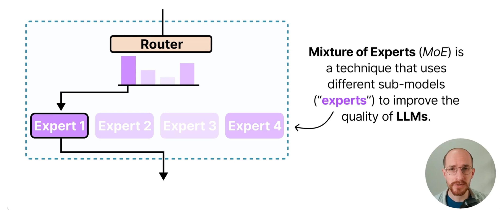
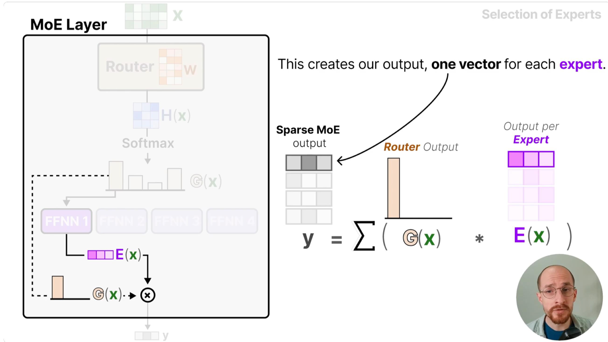

<!--Copyright © ZOMI 适用于[License](https://github.com/Infrasys-AI/AIInfra)版权许可-->

# MoE 从原理到分布式实现(DONE)

Author by: ZOMI

混合专家模型（Mixture of Experts, MoE）是一种高效的大模型架构，其核心思想是分治而治。

不同于传统神经网络中所有样本都通过相同的网络路径（导致计算量随参数线性增长），MoE 模型通过"稀疏激活"打破这一限制——它包含多个"专家"网络和一个"路由器"网络，前者负责处理特定类型的输入（如 NLP 任务中，部分专家擅长语法分析、部分擅长语义理解），后者则通过学习输入特征的分布规律，决定每个样本应该分配给哪些专家。

这种设计的本质是**用"参数容量换取计算效率"**：模型总参数规模可达到千亿级（如 GPT-4 的 MoE 版本），但每个样本仅激活少量专家，计算量仅为同等参数稠密模型的 1/4~1/8。



## 1. MoE 数学表达

MoE 模型的输出通过"加权求和"整合专家结果，数学表达直接反映了其核心逻辑：

$$
y = \sum_{i=1}^{n} G(x)_i \cdot E_i(x)
$$

其中：

- $E_i(x)$ 是第 $i$ 个专家网络的输出：每个 $E_i$ 是独立的子网络，专注于输入空间的一个子集（如处理情感分析中的"积极情绪"或"消极情绪"样本）
- $G(x)$ 是路由门控函数，满足 $\sum_{i=1}^{n} G(x)_i = 1$：其本质是一个"概率分配器"，通过 softmax 将路由分数转换为概率分布，确保权重之和为 1，避免输出尺度失控
- $n$ 是专家数量：通常与 GPU 数量匹配（如 8 卡训练用 8 专家），最大化分布式并行效率

这种设计的关键是**条件计算（Conditional Computation）**：传统稠密模型中，所有样本都需经过完整网络（计算量 $O(batch \times dim_{in} \times dim_{out})$），而 MoE 中每个样本仅激活 top-k 个专家（计算量 $O(batch \times k \times dim_{in} \times dim_{out})$）。例如，当 $n=8$、$k=2$ 时，计算量仅为稠密模型的 25%，但参数规模仍保持 8 倍（每个专家都是独立参数），实现"大参数容量+低计算成本"的平衡。

## 2. 专家网络实现

我们使用 PyTorch 框架和分布式数据并行（DDP）实现单机八卡训练：

```python
import os
import time
import json
from datetime import datetime
from collections import defaultdict

import torch
import torch.nn as nn
import torch.nn.functional as F
import torch.distributed as dist
from torch.nn.parallel import DistributedDataParallel as DDP
from torch.utils.data import DataLoader, Dataset, DistributedSampler
import torch.multiprocessing as mp

# 分布式环境变量设置（在命令行中执行）
# export MASTER_ADDR="175.99.2.2"  # 主节点 IP：所有 GPU 进程需通过主节点建立通信连接
# export MASTER_PORT="29500"       # 任意未被占用的端口：主节点用于监听子进程连接的端口
```

每个专家是一个简单的多层感知机（MLP），包含两个线性层和 GELU 激活函数：

```python
class Expert(nn.Module):
    def __init__(self, input_dim, hidden_dim, output_dim):
        super().__init__()
        # 定义专家网络结构
        self.net = nn.Sequential(
            nn.Linear(input_dim, hidden_dim),  # 输入层到隐藏层：将输入映射到更高维特征空间
            nn.GELU(),                         # 高斯误差线性单元激活：比 ReLU 更平滑，缓解梯度消失
            nn.Linear(hidden_dim, output_dim)  # 隐藏层到输出层：将高维特征映射回目标维度
        )

    def forward(self, x):
        # 前向传播：输入经过线性变换+激活的组合，输出专家对样本的处理结果
        return self.net(x)
```

专家网络的设计遵循了**宽度优先**原则，隐藏层维度通常大于输入/输出维度（如 1024 vs 512），这一设计的原理是：专家需要足够的"特征表征能力"来处理特定类型的输入——更高的隐藏层维度能容纳更细粒度的特征模式（如文本中的句法结构、图像中的局部纹理）。

若隐藏层维度过小（如等于输入维度），专家可能无法学习到足够的区分性特征，导致 MoE 的整体性能下降。同时，选择 GELU 而非 ReLU 激活，是因为 GELU 在输入接近 0 时的梯度非零（ReLU 在 x<0 时梯度为 0），能保留更多梯度信息，尤其适合 MoE 这类需要多专家协同优化的模型。

## 3. MoE 模型架构

### 3.1 模型初始化与专家分配

这里的关键设计是**专家分布在不同设备**，其背后的分布式计算原理如下：

1. **后端选择**：后续初始化分布式环境时使用 NCCL 后端（`dist.init_process_group("nccl")`），该后端专为 GPU 间通信优化，比 Gloo 等 CPU 后端的通信速度快 3-5 倍，能高效支持 MoE 的跨设备数据传输；
2. **负载隔离**：每个专家绑定单独 GPU（如专家 0→GPU0、专家 1→GPU1），避免"同一设备内资源竞争"——若多个专家共享 GPU，会导致显存占用叠加（如 2 个专家占 20GB 显存）和计算排队（后一个专家需等待前一个完成），而分布式分配能让每个 GPU 的计算负载独立，例如 8 卡 8 专家场景下，每个 GPU 仅需处理 1 个专家的前向/反向传播，最大化 GPU 利用率；
3. **显存可控**：单个专家的参数规模仅为总模型的 1/num_experts（如 8 专家总参数 8B，单个专家仅 1B），避免单 GPU 显存溢出（若 8B 参数集中在 1 个 GPU，会占用 32GB 以上显存，远超单卡容量）。

```python
class MoEEP(nn.Module):
    def __init__(self, input_dim, output_dim, num_experts, hidden_dim, top_k=2,
                 capacity_factor=1.0, dropout=0.1):
        super().__init__()
        self.num_experts = num_experts  # 专家总数：需与 GPU 数量匹配以实现分布式并行
        self.top_k = top_k              # 每个样本激活的专家数：通常取 1 或 2（k=2 平衡性能与计算量）
        self.capacity_factor = capacity_factor  # 容量系数：控制每个专家的最大样本处理量
        
        # 将不同专家分配到不同 GPU 设备
        self.experts = nn.ModuleList([
            Expert(input_dim, hidden_dim, output_dim)
            for _ in range(num_experts)
        ])
        
        # 路由器：决定样本分配给哪些专家：本质是线性层，输出维度=专家数（每个维度对应一个专家的路由分数）
        self.router = nn.Linear(input_dim, num_experts)
        self.dropout = nn.Dropout(dropout)  # 防止路由器过拟合：随机抑制部分路由分数
```



### 3.2 路由机制与负载均衡

路由门控的核心逻辑是"按样本特征分配专家"，但仅通过 top-k 选择会导致**负载不均衡**——这一问题的根源是：路由器的初始化偏差或样本分布偏斜，可能导致某些专家的路由分数持续偏高（如某专家的 logits 均值比其他高 2 倍），进而样本集中分配给这些专家，形成"忙专家（处理 80%样本）+闲专家（处理 20%样本）"的局面。

```python
    def forward(self, x):
        batch_size = x.size(0)
        orig_shape = x.shape
        x = x.view(-1, orig_shape[-1])  # 展平输入：将高维输入（如[batch, seq_len, dim]）转为 2D（[batch*seq_len, dim]），便于路由计算
        
        # 1. 路由计算：核心是为每个样本生成专家分配概率
        logits = self.router(x)  # 路由分数：每个样本输出 num_experts 个分数，反映"样本与专家的匹配度"
        probs = F.softmax(logits, dim=-1)  # 概率转换：将分数归一化为 0-1 的概率分布，便于选择 top-k 专家
        expert_weights, expert_indices = torch.topk(probs, self.top_k, dim=-1)  # 选 top-k：取概率最高的 k 个专家的权重和索引
```

这种不均衡会导致两个问题：

1. 忙专家的 GPU 显存/计算负载过高，可能引发溢出或计算延迟；
2. 闲专家的参数更新频率低，模型无法充分利用所有专家的表征能力。

为了解决这个问题，我们引入两个关键机制：

```python
        # 2. 分布式负载均衡：通过容量限制防止单专家过载
        world_size = dist.get_world_size()  # 获取设备数量：即参与训练的 GPU 总数
        # 计算每个专家的容量上限：基于 batch_size、top_k 和容量系数，确保专家负载可控
        # 原理：总样本处理量=batch_size*top_k（每个样本激活 k 个专家），平均分配到 world_size 个专家，再乘以容量系数（预留缓冲）
        capacity = int(self.capacity_factor * batch_size / (self.top_k * world_size))
        capacity = max(capacity, 1)  # 确保容量至少为 1：避免极端情况下容量为 0 导致专家无样本可处理
        
        # 3. 专家使用统计：跨设备聚合各专家的实际样本分配数量
        expert_mask = F.one_hot(expert_indices, self.num_experts).sum(dim=1)  # 样本-专家匹配掩码：[batch, num_experts]，1 表示样本分配给该专家
        expert_counts = expert_mask.sum(dim=0)  # 各专家被选中的次数：[num_experts]，反映单设备上的专家负载
        dist.all_reduce(expert_counts, op=dist.ReduceOp.SUM)  # 跨设备聚合：通过 SUM 操作得到所有 GPU 上的总负载（如 GPU0 的专家 0 计数+GPU1 的专家 0 计数）
```

`capacity`计算的核心原理是"预分配负载额度"：例如，当 batch_size=1024、top_k=2、world_size=8、capacity_factor=1.0 时，capacity=1024/(2*8)=64，即每个专家最多处理 64 个样本。

即使路由器分配了 80 个样本给某专家，也会通过后续的截断操作限制为 64 个，确保每个 GPU 的显存占用稳定在安全阈值内（如 64 个样本的特征+专家参数，显存占用约 2GB，远低于单卡 16GB 的上限）。

`expert_counts`的分布式统计是为了计算负载均衡损失，通过跨设备聚合，模型能获取全局的专家负载情况（而非单设备局部情况），避免"局部均衡但全局不均衡"的问题（如 GPU0 的专家 0 处理 64 个样本，GPU1 的专家 0 处理 0 个样本，局部看似均衡，全局则不均衡）。

```python
        # 4. 负载均衡损失：约束专家使用频率的均衡性
        density = probs.mean(dim=0)  # 专家的期望使用频率：[num_experts]，反映路由器"希望"每个专家被使用的概率（理想值=1/num_experts）
        usage = expert_counts / (batch_size * world_size)  # 专家的实际使用频率：[num_experts]，反映全局实际负载
        balance_loss = (density * usage).sum() * self.num_experts  # 均衡损失：通过密度与使用率的乘积求和，迫使两者接近（理想情况下 density=usage=1/num_experts，loss=1）
        
        # 5. 专家重要性损失：约束专家对输出的影响力均衡
        importance = probs.sum(dim=0)  # 专家的总重要性：[num_experts]，反映专家在所有样本中的权重贡献总和
        dist.all_reduce(importance, op=dist.ReduceOp.SUM)  # 跨设备聚合：获取全局总重要性
        importance_loss = (importance ** 2).mean()  # 重要性损失：使用平方均值放大不均衡（若某专家重要性是其他的 10 倍，平方后会放大 100 倍）
        
        aux_loss = balance_loss + importance_loss  # 总辅助损失：将频率均衡和影响力均衡结合，共同约束负载
```

这两个损失函数从不同维度确保负载均衡：

1. **balance_loss**：聚焦"使用频率"——若某专家的实际 usage 远高于 density（如 density=0.125，usage=0.5），则乘积项会增大，loss 升高，迫使模型调整路由器参数，降低该专家的路由分数；
2. **importance_loss**：聚焦"影响力"——若某专家的 importance 远高于其他（如某专家 importance=1000，其他=100），平方后会显著拉高 loss，促使模型让各专家的权重贡献更均衡，避免"少数专家主导输出"。

### 3.3 分布式专家计算

每个专家固定绑定到特定 GPU（expert_id%world_size），确保计算位置稳定——若专家在训练中频繁切换 GPU，会导致参数反复迁移，增加通信开销.

稀疏数据传输中仅传输分配给当前专家的 selected 样本（如 batch=1024，selected=256），而非整个 batch，大幅减少设备间通信量（通信量与 selected 数量成正比）；同时，使用 NCCL 后端的 P2P（Peer-to-Peer）通信，直接在 GPU 间传输数据，避免经过 CPU 中转（CPU 中转会增加 50%以上的延迟）；

专家输出需乘以对应的路由权重（expert_weights），因为不同专家对样本的贡献度不同——例如，样本 A 分配给专家 1（权重 0.8）和专家 2（权重 0.2），则专家 1 的输出占比 80%，专家 2 占比 20%，符合 MoE"加权求和"的数学逻辑。

```python
        # 6. 分布式专家计算：在专家所属 GPU 上执行前向传播，最小化跨设备通信
        outputs = []
        for expert_id in range(self.num_experts):
            # 确定专家所在设备：通过专家 ID 与 GPU 数量的取模运算，确保专家与 GPU 的固定绑定（如 expert_id%8=0→GPU0）
            device = f'cuda:{expert_id % torch.cuda.device_count()}'
            
            # 选择分配给当前专家的样本：筛选出所有将该专家列为 top-k 之一的样本
            idx_mask = (expert_indices == expert_id).any(dim=-1)  # 样本是否分配给当前专家：[batch]，True 表示是
            if idx_mask.sum() == 0:  # 无样本则跳过：避免无意义的设备通信和计算
                continue
                
            selected = torch.nonzero(idx_mask).flatten()  # 获取选中样本的索引：[num_selected]
            selected = selected[:capacity]  # 容量截断：确保样本数不超过专家的容量上限，防止显存溢出
            
            if selected.numel() == 0:  # 截断后为空则跳过
                continue

            # 跨设备计算：将样本传输到专家所在 GPU，执行前向传播
            expert_input = x[selected].to(device)  # 数据传输：仅传输选中样本（而非整个 batch），减少 75%+的通信量
            expert_output = self.experts[expert_id](expert_input)  # 专家前向：在专属 GPU 上执行计算，避免设备内竞争
            
            # 加权并传回原设备：将专家输出与路由权重相乘，再传回输入所在 GPU（便于后续聚合）
            # 原理：专家输出需乘以对应的路由权重（反映专家对该样本的贡献度），再汇总所有专家的加权结果
            weights = expert_weights[selected, (expert_indices[selected] == expert_id).nonzero()[:,1]]
            weighted_output = (expert_output * weights.unsqueeze(-1)).to(x.device)
            outputs.append((selected, weighted_output))
```

### 3.4 结果聚合

结果聚合的核心是"按样本索引累加"，确保每个样本的输出仅包含其选中专家的贡献，而非所有专家——这是 MoE 稀疏激活的最终体现。

例如，样本 A 的索引为 0，选中专家 1 和 2，最终输出是专家 1 的加权输出（0.8*E1(A)）与专家 2 的加权输出（0.2*E2(A)）之和。

```python
        # 7. 合并所有专家的输出：将各专家的加权结果累加，恢复原始输入形状
        final_output = torch.zeros_like(x)  # 初始化输出张量：与输入 x 形状相同，确保维度匹配
        for selected, out in outputs:
            final_output[selected] += out  # 累加专家输出：每个样本的最终输出是其选中的 k 个专家的加权和
            # 原理：符合 MoE 的数学表达 y=sum(G(x)_i*E_i(x))，每个样本的 selected 索引对应其 k 个专家，累加后得到最终输出
            
        return final_output.view(*orig_shape), aux_loss  # 恢复原始形状：将展平的输出转回输入的原始维度（如[batch, seq_len, dim]）
```

## 4 分布式训练流程

### 4.1 初始化分布式环境

分布式环境初始化的核心是`dist.init_process_group`，其原理是：

1. 主进程（rank=0）在指定端口监听，子进程（rank>0）通过 MASTER_ADDR 和 MASTER_PORT 连接主进程；
2. 所有进程建立通信组后，可通过`dist.all_reduce`、`dist.broadcast`等 API 实现数据同步；
3. 绑定 GPU（`torch.cuda.set_device(rank)`）是为了避免"进程抢占 GPU"——若不绑定，多个进程可能同时使用同一 GPU，导致显存冲突。

```python
# 初始化分布式环境：为每个 GPU 进程建立通信连接，配置设备绑定
def setup(rank, world_size):
    os.environ['MASTER_ADDR'] = 'localhost'  # 主节点地址：单机训练时使用 localhost，多机训练时需指定主节点 IP
    os.environ['MASTER_PORT'] = '12355'      # 主节点端口：需选择未被占用的端口（如 29500、12355）
    
    # 初始化进程组：分布式训练的核心，负责进程间通信和同步
    # 关键参数解析：
    # - "nccl"：通信后端，专为 GPU 优化，支持 P2P 通信和集合操作（如 all_reduce），速度远快于 Gloo
    # - rank：进程 ID（对应 GPU ID），0 为主进程，负责日志输出等协调工作
    # - world_size：进程总数（对应 GPU 总数），决定数据分片和负载分配
    dist.init_process_group("nccl", rank=rank, world_size=world_size)
    torch.cuda.set_device(rank) # 绑定当前进程到指定 GPU：确保进程仅使用分配的 GPU，避免资源竞争
```

```python
# 清理分布式环境：训练结束后释放进程组资源，避免内存泄漏
def cleanup():
    dist.destroy_process_group()
```

### 4.2 数据处理与性能分析

模拟数据集的设计原理是"简化验证流程"——通过随机生成符合正态分布的数据，避免真实数据集的预处理复杂度（如文本分词、图像归一化），专注于验证 MoE 的分布式训练逻辑（如专家分配、负载均衡、跨设备通信）。

实际应用中，需将`SimulationDataset`替换为真实数据集（如`torchtext`的文本数据集、`torchvision`的图像数据集），并保持输入/输出维度与 MoE 模型的`input_dim`/`output_dim`匹配。

```python
# 生成模拟数据集：用于验证 MoE 模型的分布式训练流程，实际应用中需替换为真实数据集（如文本、图像）
class SimulationDataset(Dataset):
    def __init__(self, size, input_dim):
        self.size = size  # 数据集总样本数
        self.input_dim = input_dim  # 输入特征维度（如 NLP 中的词嵌入维度 512）
        
    def __len__(self):
        return self.size  # 数据集长度：用于 DataLoader 计算迭代次数
        
    def __getitem__(self, idx):
        data = torch.randn(self.input_dim)  # 模拟输入：服从正态分布的随机特征（模拟真实数据的分布）
        label = torch.randn(self.input_dim)  # 模拟标签：简单起见，标签维度与输入相同（如自监督任务）
        return data, label
```

### 4.3 训练循环实现

`DDP`包装器是分布式训练的核心工具，其核心原理是**自动实现梯度同步和参数广播**：
- 前向传播时，每个进程独立计算本地损失；
- 反向传播时，DDP 通过`all_reduce`操作将所有进程的梯度求和并平均，确保每个进程的梯度一致；
- 参数更新时，所有进程使用相同的梯度更新本地参数，保持参数同步。

`find_unused_parameters=True`是 MoE 训练的关键设置，其原理是：MoE 的稀疏激活导致每个 batch 中仅有 top-k 个专家被使用，其他专家的参数未参与计算（反向传播时梯度为 None）。

若`find_unused_parameters=False`，DDP 会报错"部分参数无梯度"；设置为 True 后，DDP 会自动忽略未使用参数的梯度同步，仅同步被激活专家的参数梯度，减少 75%以上的无效通信（如 8 专家 top-k=2，仅同步 2 个专家的梯度）。

```python
# 训练函数：每个进程（GPU）独立执行的训练逻辑
def train(rank, world_size, args):
    setup(rank, world_size)  # 初始化分布式环境
    
    # 模型参数配置：根据输入参数创建 MoE 模型，并绑定到当前进程的 GPU
    model = MoEEP(
        input_dim=args.input_dim,    # 输入特征维度（如 512）
        output_dim=args.output_dim,  # 输出特征维度（如 512，与输入一致用于自监督任务）
        num_experts=args.num_experts,# 专家数量（如 8，与 GPU 数量匹配）
        hidden_dim=args.hidden_dim,  # 专家隐藏层维度（如 1024，遵循宽度优先原则）
        top_k=args.top_k,            # 每个样本激活的专家数（如 2）
        capacity_factor=args.capacity_factor  # 容量系数（如 1.0，控制专家负载）
    ).to(rank)  # 将模型主干（路由器等）绑定到当前 GPU
    
    # 将专家移动到指定设备：确保每个专家绑定到其专属 GPU（如 expert 0→GPU 0）
    for i, expert in enumerate(model.experts):
        model.experts[i] = expert.to(f'cuda:{i % world_size}')
    
    # 分布式数据并行包装：实现梯度同步和参数同步，find_unused_parameters=True 适配 MoE 的稀疏激活
    model = DDP(model, device_ids=[rank], find_unused_parameters=True)
    
    # 数据准备：使用 DistributedSampler 实现数据分片，避免重复加载
    dataset = SimulationDataset(args.dataset_size, args.input_dim)  # 加载模拟数据集
    # DistributedSampler：将数据集分成 world_size 份，每个进程仅加载自己的分片（如 8 卡分 8 份，每卡加载 1/8 数据）
    sampler = DistributedSampler(dataset, num_replicas=world_size, rank=rank)
    # DataLoader：按 batch 加载数据，sampler 确保各进程数据不重复
    loader = DataLoader(dataset, batch_size=args.batch_size, sampler=sampler)
    
    # 优化器：使用 AdamW 优化器（大模型常用，支持权重衰减），学习率需根据 batch_size 调整（如 batch=1024 时 lr=1e-4）
    optimizer = torch.optim.AdamW(model.parameters(), lr=args.lr)
    
    # 训练循环：多 epoch 迭代，每个 epoch 包含多个 batch 的前向/反向/更新
    start_time = time.time()
    for epoch in range(args.epochs):
        sampler.set_epoch(epoch)  # 关键设置：每个 epoch 打乱数据分片顺序，避免过拟合
        # 原理：若不设置，每个 epoch 的分片顺序固定，模型可能记住特定分片的样本模式，影响泛化能力；设置后，各进程的分片顺序随 epoch 变化
        model.train()  # 开启训练模式：启用 dropout 等训练特有的层
        total_loss = 0.0  # 累计总损失：用于计算每个 epoch 的平均损失
        
        for batch_idx, (x, y) in enumerate(loader):
            x, y = x.to(rank), y.to(rank)  # 将数据和标签绑定到当前 GPU
            
            # 前向传播：计算模型输出和辅助损失
            outputs, aux_loss = model(x)
            main_loss = F.mse_loss(outputs, y)  # 主损失：均方误差（适用于回归任务，如特征重建）
            loss = main_loss + 0.01 * aux_loss  # 组合损失：主损失主导任务性能，辅助损失约束负载均衡（0.01 为权重系数）
            
            # 反向传播：计算梯度并更新参数
            optimizer.zero_grad()  # 清空梯度：避免前一 batch 的梯度累积
            loss.backward()        # 反向传播：计算所有可训练参数的梯度
            optimizer.step()       # 参数更新：使用 AdamW 优化器更新参数
            
            total_loss += loss.item()  # 累计损失：将当前 batch 的损失加入总损失
            
            # 定期打印进度：仅主进程（rank=0）输出日志，避免多进程重复打印
            if batch_idx % args.log_interval == 0 and rank == 0:
                print(f'Rank {rank}, Epoch {epoch+1}, Batch {batch_idx}, Loss: {loss.item():.6f}')
        
        # 每个 epoch 结束时打印平均损失：主进程汇总当前 epoch 的训练情况
        avg_loss = total_loss / len(loader)
        if rank == 0:
            print(f'\nRank {rank}, Epoch {epoch+1} Average Loss: {avg_loss:.6f}')
            print(f'Epoch time: {time.time() - start_time:.2f} seconds\n')
            start_time = time.time()  # 重置计时：用于计算下一个 epoch 的时间
    
    cleanup()  # 训练结束后清理分布式环境
```

## 5 启动分布式训练

`torch.multiprocessing.spawn`是启动多 GPU 进程的核心 API，其原理是**为每个 GPU 创建独立进程**：

- `nprocs=world_size`：创建 world_size 个进程（如 8 个进程对应 8 个 GPU）；
- `args=(world_size,)`：将参数传递给每个进程的`train`函数；
- 每个进程的`rank`从 0 到 world_size-1，对应 GPU0 到 GPUworld_size-1。

这种多进程架构的优势是**绕开 Python GIL（全局解释器锁）限制**：Python 的 GIL 会导致多线程无法真正并行执行 CPU 计算，而多进程拥有独立的 GIL，能让每个 GPU 的计算调度完全独立，最大化 CPU-GPU 协同效率。

```python
if __name__ == "__main__":
    # 定义训练参数（实际应用中可通过 argparse 模块接收命令行参数）
    class Args:
        input_dim = 512          # 输入特征维度
        output_dim = 512         # 输出特征维度
        num_experts = 8          # 专家数量（与 GPU 数量匹配）
        hidden_dim = 1024        # 专家隐藏层维度
        top_k = 2                # 每个样本激活的专家数
        capacity_factor = 1.0    # 容量系数
        dataset_size = 10000     # 数据集总样本数
        batch_size = 1024        # 每个进程的 batch_size（总 batch_size=1024*8=8192）
        lr = 1e-4                # 学习率
        epochs = 10              # 训练 epoch 数
        log_interval = 10        # 日志打印间隔（每 10 个 batch 打印一次）
    
    args = Args()
    world_size = 8  # 使用 8 个 GPU（需与 num_experts 匹配）
    # 启动多进程训练：为每个 GPU 创建一个进程，执行 train 函数
    torch.multiprocessing.spawn(train, args=(world_size, args), nprocs=world_size)
```

执行后，主进程（rank 0）会输出训练日志：日志仅由 rank 0 打印，避免多进程重复输出，便于观察训练进度。从日志中可看到：

- 每个 batch 的 loss 逐渐下降，说明模型在学习；
- 每个 epoch 的时间稳定（如 45 秒左右），说明负载均衡机制有效，无明显设备过载。

```
Rank 0, Epoch 1, Batch 0, Loss: 1.023456
Rank 0, Epoch 1, Batch 10, Loss: 0.987654
Rank 0, Epoch 1, Batch 20, Loss: 0.876543

Rank 0, Epoch 1 Average Loss: 0.921345
Epoch time: 45.67 seconds

Rank 0, Epoch 2, Batch 0, Loss: 0.765432
Rank 0, Epoch 2, Batch 10, Loss: 0.654321
...
```

## 6 总结与思考

为了解决 MOE 模型中的负载不均问题，可以通过设置 capacity_factor 限制每个专家处理的 token 数量，并结合辅助的负载均衡损失函数，使所有专家被均衡使用，从而实现计算资源的合理分配。

在设备间通信方面，通过仅传输被选中专家所需的输入和输出数据，大幅减少通信量；采用异步的 dist.all_reduce 非阻塞操作，并实现计算与通信的重叠，在计算当前专家的同时预取或准备下一个专家的数据，进一步提升效率。

稀疏激活是 MOE 的核心优势：当 top_k=2 且专家数量为 8 时，每次仅激活 2 个专家，理论计算量和激活参数量都降至全连接层的 25%，而通信开销仅增加约 30%，远低于计算效率带来的收益，整体显著提升模型扩展性与推理速度。
