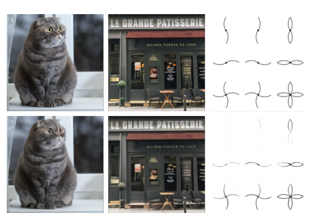

# DALLE: 零样本文本到图像生成

## 引言：AI 生成图像的里程碑

2021 年，OpenAI 推出的 DALL·E 彻底改变了“文本到图像生成”的规则，它不仅能根据简单的文字描述生成逼真的图像，还能创造超越人类想象力的奇思妙想。

DALL·E 的诞生并非偶然。它源于 OpenAI 对“通用人工智能”（AGI）的长期探索，试图通过多模态模型打破语言与视觉的壁垒。从 DALL·E 1 到 DALL·E 3，这一系列模型不断突破技术边界，如今已能生成高分辨率、风格多样的图像，并支持复杂的编辑功能。下面，就以 DALLE1 为例，讲解这个 AI 绘画的跨时代模型。

## DALL·E 的核心技术原理

### 模型架构

DALL·E 1 基于 Transformer 架构，结合了 CLIP（对比语言-图像预训练模型）的跨模态能力，能够将文本指令转化为图像。但真正让 DALL·E 2 和 3 脱颖而出的，是扩散模型（Diffusion Model）的应用。

### 训练过程

DALL·E 的训练分为两个关键阶段：

**阶段 1：训练离散变分自动编码器（dVAE）**

离散变分自动编码器是 DALL·E 架构中的核心创新之一。它的工作流程可以详细分解为：

1. 图像压缩与离散化：dVAE 将每个 $256×256$ 的 RGB 图像压缩为 $32×32$ 的图像令牌网格。这一压缩过程不是简单的下采样，而是通过学习到的表示来保留图像的语义信息。每个图像令牌可以取 $8192$ 个可能的离散值之一，这相当于将连续图像信号转换为离散符号表示。

2. 维度减少的巧妙计算：原始图像包含 $256×256×3=196,608$ 个数据点，而压缩后只有 $32×32=1,024$ 个令牌，减少了 192 倍。这一计算来源于：$(256/32)×(256/32)×3 = 8×8×3 = 192$。这种大幅压缩使得后续的 Transformer 处理成为可能，同时通过精心设计的重建损失函数确保视觉质量没有显著下降。

3. 跨模态对齐的关键作用：dVAE 的 encoder 输出是维度为 32×32×8192 的 logits，然后通过这些 logits 索引 codebook 中的特征进行组合。codebook 的 embedding 是可学习的，这使得图像特征空间能够有效地映射到文本特征空间。这一步骤是实现文本-图像对齐的基础，相当于在视觉和语言模态之间建立了共享的语义词典。

**阶段 2：训练自回归转换器**

第二阶段训练将文本和图像表示融合在一个统一的框架中：

1. 多模态序列构建：首先用 BPE（byte-pair encoding）将文本 tokenize，得到最多 256 个文本的 token，如果文本 token 数不足 256 则进行 padding。最终得到的 256 个文本 token 与 VQ-VAE 得到的 1024 个图像 token 拼接成一个长度为 1280 的序列，然后进行自回归训练。

> 推理分为两种情况：（1）纯文本生成图像；（2）文本+图像生成图像。这两种情况的区别就在于使不使用图像的 token，如果不使用图像的 token，那么 Transformer 的输入就是 256 个文本 token；如果使用图像的 token，那么 Transformer 的输入就是 256 个文本 token+1024 个图像 token。

2. 自回归建模：训练 Transformer 对文本和图像标记上的联合分布进行建模。在生成时，模型先处理全部文本 token，然后以自回归方式逐个生成图像 token，每个新 token 都基于之前生成的所有 token 和文本条件。

2. 条件生成机制：通过注意力机制，模型能够在生成图像的每个部分时关注最相关的文本描述片段。例如，当生成"一只戴帽子的狗"的图像时，在生成狗头部位时，模型会特别关注"帽子"这一文本描述。

下图是模型的整体流程。

## DALL·E 的应用场景

下图展示的是论文中的实验效果图。

