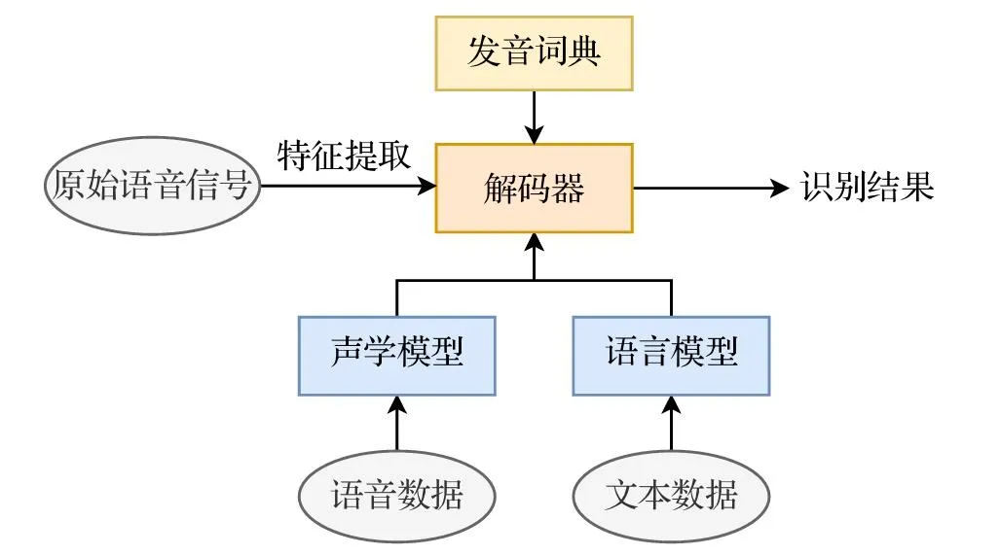
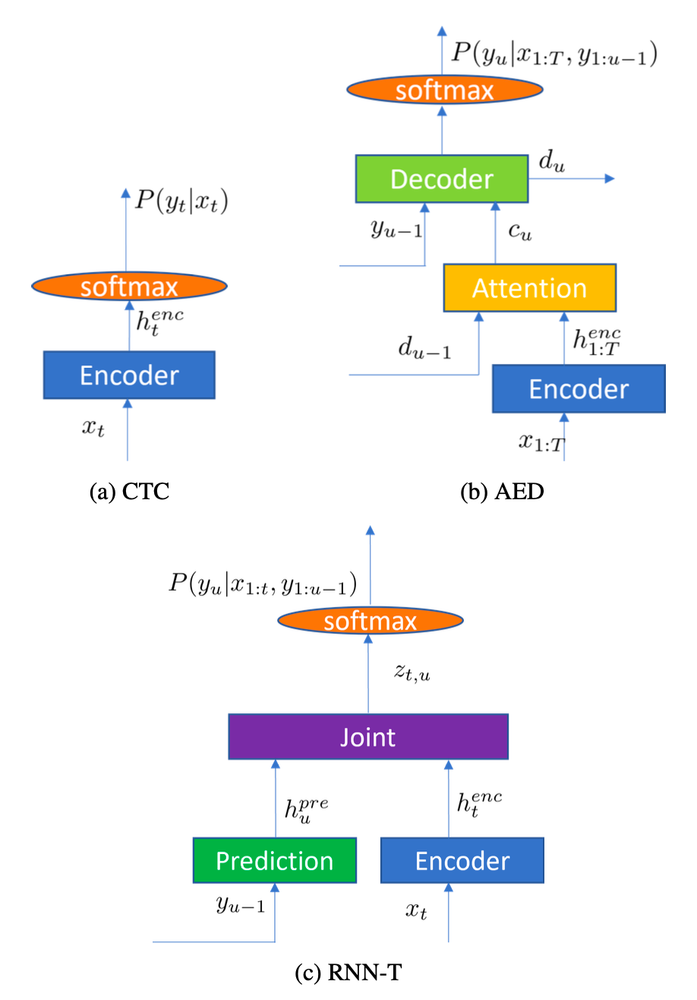

# 语音模型基础

> Author by: 李长康

## 引言：语音生成流程

人与机器之间的自然、流畅的交互，是人工智能领域长久以来的宏伟愿景。在这一愿景的实现路径上，自动语音识别（Automatic Speech Recognition, ASR）和语音合成（Text-to-Speech, TTS）构成了两大不可或缺的技术支柱，它们共同完成了人机语音交互的完整闭环。ASR 赋予机器“听”的能力，将人类口语这一复杂的声学信号转化为机器可理解、可处理的文本信息；而 TTS 则赋予机器“说”的能力，将文本信息还原为自然、富有表现力的语音输出。这两项技术的协同发展，不仅催生了 Siri、Alexa、小爱同学等智能助手，也深刻改变了实时字幕、无障碍通信、在线教育、有声读物乃至虚拟人等众多领域的面貌。

一个典型的、完整的语音交互流水线（Pipeline）可以被清晰地划分为两个核心阶段。第一阶段是**语音到文本**（Speech-to-Text）的转换，即 ASR 过程。当用户发出语音指令时，系统首先对原始的模拟声波信号进行数字化处理，通过采样和分帧将其转换为一系列声学特征向量。随后，ASR 模型利用声学模型理解语音的发音特征，并结合语言模型捕捉语言的语法规则，最终解码出最可能的文本序列。第二阶段是语义理解，即用 NLP 对文本输入进行理解得到对应的响应输出。最后阶段是**文本到语音**（Text-to-Speech）的转换，即 TTS 过程。在接收到 ASR 输出的文本或系统生成的回复文本后，TTS 系统开始工作。TTS 会进行文本分析，理解文本的语义、韵律和重音等信息，然后利用声学模型将这些信息转化为中间的声学特征（如梅尔频谱图），最后通过一个称为声码器（Vocoder）的模块，将这些特征“绘制”成可播放的数字语音波形，从而完成与用户的语音交互。

## 语音识别（ASR）

自动语音识别（Automatic Speech Recognition, ASR），又称语音到文本（Speech-to-Text, STT）技术，是人工智能领域中一个核心且富有挑战性的分支 。它的目标是让机器能够“听懂”人类的口语，并将其内容精准地转换为书面文字。这项技术不仅是构建智能助手、实时字幕、车载系统等现代应用的基石，更是未来人机交互方式变革的关键驱动力。对于初学者而言，理解 ASR 并非一蹴而就的任务，它融合了信号处理、概率统计、深度学习和语言学等多个学科的知识。

自动语音识别（Automatic Speech Recognition, ASR）的核心问题是如何让机器理解人类的口语。从数学和信息处理的角度来看，一段语音本质上是一个随时间变化的物理信号。我们的目标是将这个复杂的声波信号，最终转换成语音对应的文本序列。

为了实现这一目标，首先需要对原始的模拟语音信号（音频波形）进行数字化处理。这个过程通常包括**采样**和**分帧**。采样将连续的声波离散化，而分帧则是将连续的语音流切割成一系列短小的时间片段（通常为 20-25 毫秒），这些片段之间会有部分重叠以保证信息的连续性。

对每一帧语音，我们提取一组能够有效表征其声学特性的数值，这组数值被称为**声学特征向量**（Acoustic Feature Vector）。常见的特征提取方法包括梅尔频率倒谱系数（MFCC）或滤波器组（Filter Bank）特征。经过这一系列处理，一段原始的语音信号 $s(t)$ 就被转换成了一个离散的、由高维向量组成的序列：

$$
\mathbf{X} = [\mathbf{x}_1, \mathbf{x}_2, \mathbf{x}_3, ..., \mathbf{x}_T]
$$

其中， ${x}_t$ 表示第 t 帧的声学特征向量，$T$ 是语音序列的总帧数，与此同时，我们希望得到的输出是一个文本序列。这个序列可以由词（Word）、子词单元（如 BPE）或字符（Character）构成。我们将其表示为：

$$
\mathbf{W} = [w_1, w_2, w_3, ..., w_U]
$$

其中，$w_u$ 表示序列中的第 $u$ 个语言单元，$U$ 是文本序列的长度。

语音识别的根本任务，就是在给定声学特征序列 $\mathbf{X}$ 的条件下，从所有可能的文本序列中，找出最有可能的那个。用数学语言描述，就是求解以下最大后验概率（Maximum A Posteriori, MAP）问题：

$$
\mathbf{W}^* = \arg\max_{\mathbf{W}} P(\mathbf{W} | \mathbf{X})

$$

这个公式 $P(\mathbf{W} | \mathbf{X})$ 定义了在听到语音 $\mathbf{X}$ 后，说出文本 $\mathbf{W}$ 的概率。我们的目标就是找到使这个概率最大的文本 $\mathbf{W}^*$。

根据**贝叶斯公式**（Bayes' Theorem），我们可以将后验概率 $P(\mathbf{W} | \mathbf{X})$ 分解为声学模型和语言模型两个核心部分：

$$
P(\mathbf{W} | \mathbf{X}) = \frac{P(\mathbf{X} | \mathbf{W}) \cdot P(\mathbf{W})}{P(\mathbf{X})}
$$

这个公式将识别问题分解为两个关键部分：

1. **声学模型 (Acoustic Model, AM)**：$P(\mathbf{X} | \mathbf{W})$，它衡量的是“给定某个文本 $\mathbf{W}$，说出像 $\mathbf{X}$ 这样一段语音的概率”。它关注的是语音的声学特性，需要理解不同发音、口音、语速和环境噪声下的语音表现。
2. **语言模型 (Language Model, LM)**：$P(\mathbf{W})$，它衡量的是“文本序列 $\mathbf{W}$ 本身在语言中出现的概率”。它关注的是语言的语法和语义规律，确保生成的文本是符合人类语言习惯的。

分母 $P(\mathbf{X})$ 是一个归一化常数，表示观察到语音 $\mathbf{X}$ 的总概率。由于在对所有候选文本 $\mathbf{W}$ 进行比较时，$P(\mathbf{X})$ 对于每一个候选者都是相同的，因此它不会影响最终的排序结果。因此，我们可以在不改变最优解 $\mathbf{W}^*$ 的前提下，将其从优化目标中移除。于是，语音识别问题可以简化为 $\mathbf{W}^* = \arg\max_{\mathbf{W}} P(\mathbf{X} | \mathbf{W}) \cdot P(\mathbf{W})$ ，这个简洁的公式将复杂的语音识别问题分解为声学模型和语言模型两个相对独立的子问题，分别进行建模和优化，语音信号处理流程图如下图所示。

图源：https://zhuanlan.zhihu.com/p/1919812168435611576

### 传统统计模型（混合模型，Hybrid Modeling）

在深度学习普及之前，声学模型核心是**隐马尔可夫模型（HMM）**与**高斯混合模型（GMM）**的结合。

HMM 用于对语音的时序动态进行建模，将一个音素的发音过程视为一系列隐藏状态的转移。对于给定的状态序列 $S$ 和观测序列 $O$：

$$
P(O, S) = \pi_{s_1} \cdot \prod_{t=2}^T a_{s_{t-1}, s_t} \cdot \prod_{t=1}^T P(o_t \mid s_t)
$$

其中：

- $\pi_{s_1}$：初始状态概率；
- $a_{s_{t-1}, s_t}$：状态转移概率；
- $P(o_t \mid s_t)$：在状态 $s_t$ 下生成观测 $o_t$ 的概率（由 GMM 建模）。

GMM 则用于估计在某个 HMM 状态下生成特定声学特征（如 MFCC）的概率。这种模型虽然在当时取得了成功，但其性能受限于 GMM 对特征分布的简单假设。在某个 HMM 状态 $s$ 下，声学特征 $o$ 的分布由 GMM 来估计：

$$
P(o \mid s) = \sum_{m=1}^M c_{s,m} \, \mathcal{N}(o \mid \mu_{s,m}, \Sigma_{s,m})
$$

其中：

- $M$：高斯混合分量数；
- $c_{s,m}$：第 $m$ 个高斯分量的权重，满足 $\sum_{m=1}^M c_{s,m} = 1$；
- $\mathcal{N}(o \mid \mu_{s,m}, \Sigma_{s,m})$：均值为 $\mu_{s,m}$，协方差为 $\Sigma_{s,m}$ 的高斯分布：
    
    $$
    \mathcal{N}(o \mid \mu, \Sigma) = \frac{1}{(2\pi)^{d/2} |\Sigma|^{1/2}} \exp\left(-\tfrac{1}{2}(o - \mu)^T \Sigma^{-1} (o - \mu)\right)
    $$
    
语言模型通常采用**N-gram**模型，通过统计语料库中相邻 N 个词的共现频率来预测下一个词的概率。N-gram 模型简单高效，但存在严重的数据稀疏问题，且无法建模长距离的上下文依赖。

$$
P(w_t | w_{t-N+1}, ..., w_{t-1}) \approx \frac{C(w_{t-N+1}, ..., w_t)}{C(w_{t-N+1}, ..., w_{t-1})}
$$

### 深度学习与端到端（E2E）模型

然而，随着深度学习的兴起，一种新的范式——**端到端**（End-to-End）方法应运而生。端到端模型不再显式地分离 AM 和 LM，而是使用一个单一的神经网络，直接从输入的声学特征序列 $\mathbf{X}$ 学习映射到输出的文本序列 $\mathbf{W}$，即直接学习 $P(\mathbf{W} | \mathbf{X})$ 的函数。这种方法简化了系统架构，减少了模块间的误差累积，代表了当前 ASR 技术的主流发展方向。

深度神经网络（DNN）的引入彻底改变了 ASR 的面貌。DNN 强大的非线性拟合能力使其能够更精确地替代 GMM，从而诞生了**DNN-HMM**混合模型，显著提升了识别准确率。

随着技术的进一步发展，研究者们追求更简洁、更强大的架构，这催生了**端到端**（End-to-End, E2E）模型。E2E 模型摒弃了传统的解耦思想，使用一个单一的神经网络直接学习从 $ \mathbf{X} $ 到 $ \mathbf{W} $ 的映射。

- **连接时序分类（CTC）**：CTC 模型引入了一个特殊的“空白”标签，允许网络在不进行强制对齐的情况下，将输入的帧序列映射到输出的标签序列，相当于是一个**语音“帧”→“文本”的分类器**。它通过求和所有可能的对齐路径来计算总概率，非常适合离线识别任务。
- **基于注意力的序列到序列模型（Seq2Seq with Attention）**：这类模型通常由一个编码器（Encoder）和一个解码器（Decoder）组成。编码器将输入的声学序列编码为一个上下文向量，解码器在生成每个输出词时，通过注意力机制动态地关注编码器输出的不同部分，是把语音识别当做机器翻译任务，从而有效捕捉长距离依赖。
- **循环神经网络变换器（RNN-T）**：RNN-T 是目前工业界最主流的 E2E 模型，尤其适用于**流式识别**。它包含编码器（encoder）、预测网络（Predictor）、联合网络（Jointer）：编码器将当前语音进行声学编码；预测网络把输出的历史文本编码；联合网络把声学编码和文本历史编码合并进行下一个字的预测。其关键优势在于，输出不仅依赖于当前的音频输入，还依赖于已生成的文本历史，这使得它天然支持**因果推断**和**低延迟**处理。

## 语音合成 TTS

语音合成（Text-to-Speech, TTS），又称文语转换，旨在将书面文本转换为自然流畅、富有表现力的人类语音。随着人工智能技术的飞速发展，TTS 已从早期机械、呆板的“机器音”，演变为如今能够精准控制情感、音色和风格的高保真智能系统，其应用已渗透到智能助手、有声读物、影视配音、虚拟人交互等众多领域。TTS 也从传统的模块化方法演进到以深度学习驱动的现代端到端模型，并且结合大语言模型（LLM）和扩散模型使得输出可以在音质上更接近真人，可控性更高。

### 传统语音合成 pipeline

传统语音合成技术遵循“模块化流水线”的思路，即将语音生成过程拆分为若干相对独立的步骤。这一技术发展大体经历了三个阶段：

1. **基于规则的合成（Rule-Based Synthesis）**
    
    早期方法基于源–滤波器模型，将声带振动视为激励源，声道形状视为滤波器，通过调节共振峰参数来生成语音。代表性系统是**数字共振峰合成器 (Digital-formant synthesizer)**。其优点是实现简单、计算量小，但缺点是声音生硬、缺乏自然感。
    
2. **拼接合成（Concatenative Synthesis）**
    
    该方法利用预录的大规模语料库，从中挑选最合适的语音单元（如音素、半音节或词）进行拼接。借助动态规划算法优化拼接点，可生成较为自然的语音。但其局限在于语料库构建成本高，覆盖度有限，并容易在拼接处产生不连贯感。
    
3. **统计参数合成（Statistical Parametric Speech Synthesis, SPSS）**
    
    随着统计学习和深度神经网络（DNN）的发展，统计方法得到更广泛的使用，通过声学建模和波形生成两个阶段完成合成：
    
- **声学建模 (Acoustic Modeling)**：将文本特征映射为声学特征（如梅尔频谱、基频、时长）。早期使用 HMM/GMM，后来被 DNN 和 LSTM 等模型取代，提升了韵律与自然度。
- **波形生成 (Waveform Generation / Vocoder)**：利用声码器将声学特征还原为音频。早期的 Griffin-Lim 音质较差，WORLD 等声码器改进了自然度，但仍有限。

传统方法的系统架构是典型的模块化流水线：**文本前端 -> 声学模型 -> 声码器**。这种分步设计虽然逻辑清晰，但也带来了信息瓶颈和误差累积的问题，即前一个模块的输出误差会直接影响到后续模块的性能。

### 深度学习端到端 TTS 模型

#### 两阶段端到端模型 (Two-Stage End-to-End)

这是早期端到端 TTS 的主流架构，它将任务分解为两个由神经网络实现的阶段，但整个流程是端到端可训练的。

- **第一阶段：声学模型 (文本/指令 -> 声学特征)**
    - **Tacotron 系列 (2017-2018):** 由 Google 提出，是端到端 TTS 的奠基之作。它采用编码器-解码器（Encoder-Decoder）结构，并首次成功引入**注意力机制 (Attention Mechanism)**。编码器将输入的字符或音素序列编码为高维语义向量，解码器则通过注意力机制，动态地“聚焦”于编码器输出的相关部分，逐步生成对应的**梅尔频谱图 (Mel-spectrogram)** 帧。Tacotron 2 通过引入 WaveNet 作为声码器，实现了接近真人录音的音质。
    - **FastSpeech 系列 (2019-2020):** 为了解决 Tacotron 系列自回归生成速度慢的问题，FastSpeech 引入了**非自回归 (Non-Autoregressive)** 架构。其核心创新在于**时长预测器 (Duration Predictor)** 和**长度调节器 (Length Regulator)**。时长预测器预测每个音素的持续时间，长度调节器则根据预测的时长，将音素序列扩展为与梅尔频谱图帧数对齐的序列。这使得整个梅尔频谱图可以**一次性并行生成**，推理速度比自回归模型快数百倍。
- **第二阶段：神经声码器 (Neural Vocoder) (声学特征 -> 波形)**
这一阶段负责将第一阶段生成的梅尔频谱图转换为最终的音频波形。与传统的 Griffin-Lim 或 WORLD 声码器不同，神经声码器本身就是一个强大的深度学习模型。
    - **WaveNet (2016):** DeepMind 提出的里程碑式声码器。它使用**因果卷积 (Causal Convolution)** 直接在原始波形空间进行建模，通过自回归方式逐点生成音频采样。其生成的语音音质极高，但推理速度极慢。
    - **Parallel WaveGAN / HiFi-GAN (2019-2021):** 基于**生成对抗网络 (GAN)** 的声码器。生成器网络根据梅尔频谱图生成波形，判别器网络则负责判断生成的波形是真是假。通过这种对抗训练，HiFi-GAN 等模型能够生成高质量的语音，并且实现了**并行推理**，在音质和速度上取得了良好的平衡。

#### 单阶段端到端模型 (Single-Stage End-to-End)

单阶段模型旨在消除中间的梅尔频谱图，直接从文本生成波形，实现真正的“端到端”。

- **VITS (2021):** 这是一个极具影响力的单阶段模型。它巧妙地融合了多种先进技术：
    1. **变分自编码器 (VAE):** 用于学习一个包含内容、音色和韵律信息的潜在空间，解决了文本到语音的一对多映射问题。
    2. **对抗性训练 (Adversarial Training):** 引入判别器来提升生成语音的真实感。
    3. **归一化流 (Normalizing Flow):** 用于精确建模潜变量的复杂分布。
    4. **随机时长预测器 (Stochastic Duration Predictor):** 通过随机采样来增加生成语音的韵律多样性。
    VITS 通过一个统一的框架，实现了高速、高质量的并行语音合成，代表了单阶段模型的先进水平。

#### 基于大模型和新范式的前沿端到端方法

当前，TTS 技术正与大语言模型（LLM）和扩散模型深度融合，开启了以**可控性**和**通用性**为核心的新篇章。

- **基于大语言模型（LLM）的方法 (e.g., VALL-E, 2023):**
这类方法将语音视为一种“语言”，利用大规模语音数据训练的 LLM 来进行语音合成。
    - **核心技术：** 使用**神经编解码器 (如 EnCodec)** 将连续的语音波形离散化为一系列**语音 token**。TTS 任务被重新定义为一个**条件语言建模任务**，即根据输入的文本或指令，预测下一个语音 token。
    - **核心能力：** **上下文学习 (In-context Learning)**。通过在输入中提供几秒钟的参考语音（作为上下文），模型就能克隆出该说话人的音色、口音和情感，实现强大的**零样本语音合成**。这突破了传统 TTS 对固定说话人数量的限制。
    - **代表模型：** **VALL-E** 是这一领域的开创者，它采用**Decoder-only Transformer**架构，证明了 LLM 在 TTS 任务上的巨大潜力。
- **基于扩散模型（Diffusion-based）的方法 (e.g., SeedTTS, 2024):**
扩散模型通过一个逐步去噪的过程来生成数据，为高质量语音合成提供了新思路。
    - **核心技术：** 模型从一个纯噪声信号开始，通过学习一个“去噪”网络，逐步将其转化为目标语音的声学特征或 token 序列。
    - **优势与挑战：** 能够生成非常自然和多样化的语音，但标准的扩散过程需要数百甚至上千步迭代，推理速度很慢。
    - **加速技术：** 为了提升效率，研究者们提出了多种加速方案，如**一致性蒸馏 (Consistency Distillation)** 和**流匹配 (Flow Matching)**，可以将耗时的扩散过程蒸馏为高效的单步或两步生成，从而实现高质量与高效率的平衡。
- **混合架构 (Hybrid Architecture) (e.g., CosyVoice, 2024):**
为了结合不同范式的优点，混合架构成为新的趋势。例如，**CosyVoice** 结合了 LLM 和流匹配模型。它利用 LLM 来生成语义和风格信息丰富的**语义 token**，然后使用一个**流匹配 (Flow Matching)** 模型将这些语义 token 转换为最终的声学 token 并合成波形。这种架构既保留了 LLM 带来的**直观的指令控制能力**（用户可以用自然语言描述情感、风格），又通过流匹配模型保证了**高保真的音质**。

深度学习端到端 TTS 的发展，清晰地展现了一条从“分步生成”到“一体化生成”，再到“可控化生成”的演进路径。从 Tacotron 的注意力机制，到 FastSpeech 的并行化，再到 VITS 的统一框架，不断追求更高的效率和音质。如今，以 VALL-E 和 SeedTTS 为代表的前沿模型，正将 TTS 推向一个新的时代——用户可以通过简单的自然语言指令，创造出无限可能的个性化声音。