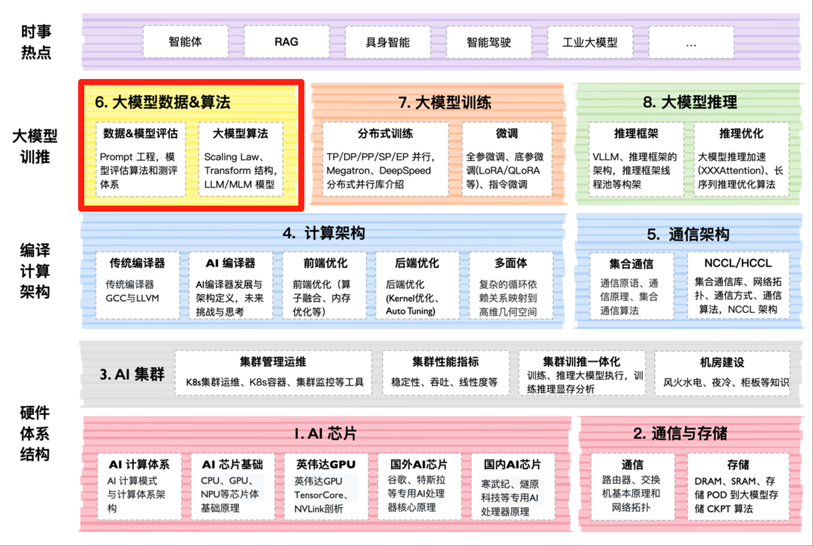

<!--Copyright © ZOMI 适用于[License](https://github.com/Infrasys-AI/AIInfra)版权许可-->

# 大模型算法与数据概述

大模型作为生成式人工智能技术如 ChatGPT 的核心基础，正迅速改变产业布局，并开始塑造一种全新的用户互动模式，形成舆论引导、社会治理、信息服务等方面的不对称优势。自 2020 年 GPT-3 推出到 2022 年 ChatGPT、2023 年 GPT-4 及 2024 年 Google Gemini 和 Claude 3 的快速迭代，目前大模型方向已沉淀出关键算法与重要技术，如 Transformer 算法及改进架构、Scaling Laws、超大规模预训练、模型对齐、原生多模态、超长文本等。因此在本节将会重点讨论大模型相关的算法和对应的数据工程！

## 课程位置

## 课程简介

### 01. Transformer 架构

[**01. Transformer 架构**](./01Basic/)：Transformer 作为自注意力机制的 AI 架构，广泛应用于 NLP 任务。摒弃了传统的循环神经网络（RNN）和卷积神经网络（CNN），完全依赖注意力机制来捕捉输入序列中的全局依赖关系。Transformer 由编码器和解码器组成，每层包含多头自注意力机制和前馈神经网络。本节重点打开自注意力机制通过计算序列中每个元素与其他元素的相关性，动态分配权重，从而捕捉长距离依赖。

| 大纲 | 小节 | 链接 |
|:--- |:---- |:-------------------- |
| Transformer 架构 | 01 Transformer 基础结构 | [PPT](./01Basic/01Transformer.pdf), [视频](https://www.bilibili.com/video/BV1rt421476q/), [文章](./01Basic/01Transformer.md) |
| Transformer 架构 | 02 大模型 Tokenizer 算法 | [PPT](./01Basic/02Tokenizer.pdf), [视频](https://www.bilibili.com/video/BV16pTJz9EV4), [文章](./01Basic/02Tokenizer.md) |
| Transformer 架构 | 03 大模型 Embedding 算法 | [PPT](./01Basic/03Embeding.pdf), [视频](https://www.bilibili.com/video/BV1SSTgzLEzf), [文章](./01Basic/03Embeding.md) |
| Transformer 架构 | 04 Attention 注意力机制 | [PPT](./01Basic/04Attention.pdf), [视频](https://www.bilibili.com/video/BV11AMHzuEet), [文章](./01Basic/04Attention.md) |
| Transformer 架构 | 05 Attention 变种算法 | [PPT](./01Basic/05GQAMLA.pdf), [视频](https://www.bilibili.com/video/BV1GzMUz8Eav), [文章](./01Basic/05GQAMLA.md) |
| Transformer 架构 | 06 Transformer 长序列架构 | [PPT](./01Basic/06LongSeq.pdf), [视频](https://www.bilibili.com/video/BV16PN6z6ELg), [文章](./01Basic/06LongSeq.md) |
| Transformer 架构 | 07 大模型参数设置 | [PPT](./01Basic/07Parameter.pdf), [视频](https://www.bilibili.com/video/BV1nTNkzjE3J), [文章](./01Basic/07Parameter.md) |
|---|----|--------------------|
| 代码实践 | 01 搭建迷你 Transformer | [Markdown](./01Basic/Practice01MiniTranformer.md), [Jupyter](./01Basic/notebook/Practice01MiniTranformer.ipynb) |
| 代码实践 | 02 从零实现 Transformer 训练 | [Markdown](./01Basic/Practice02TransformerTrain.md), [Jupyter](./01Basic/notebook/Practice02TransformerTrain.ipynb) |
| 代码实践 | 03 实战 Transformer 机器翻译 | [Markdown](./01Basic/Practice03MachineTrans.md), [Jupyter](./01Basic/notebook/Practice03MachineTrans.ipynb) |
| 代码实践 | 04 手把手实现核心机制 Sinusoidal 编码 | [Markdown](./01Basic/Practice04Sinusoidal.md), [Jupyter](./01Basic/notebook/Practice04Sinusoidal.ipynb) |
| 代码实践 | 05 手把手实现核心机制 BPE 分词算法 | [Markdown](./01Basic/Practice05BPE.md), [Jupyter](.01Basic/notebook/Practice05BPE.ipynb) |
| 代码实践 | 06 手把手实现核心机制 Embedding 词嵌入 | [Markdown](./01Basic/Practice06Embedding.md), [Jupyter](./01Basic/notebook/Practice06Embedding.ipynb) |
| 代码实践 | 07 深入注意力机制 MHA、MQA、GQA、MLA | [Markdown](./01Basic/Practice07Attention.md), [Jupyter](./01Basic/notebook/Practice07Attention.ipynb) |

- [**02. MoE 算法架构**](./02MoE/)：MoE（Mixture of Experts）架构，即专家混合架构，是一种通过多个专家模块并行处理不同子任务，由门控网络依据输入数据动态分配，决定各专家模块参与度，以实现更高效、灵活处理复杂任务，提升模型表现与泛化能力的技术。

| 大纲 | 小节 | 链接 |
|:--- |:---- |:-------------------- |
| MOE 基本介绍 | 01 MOE 架构剖析  | [PPT](./02MoE/01MOEIntroducion.pdf), [视频](https://www.bilibili.com/video/BV17PNtekE3Y/), [文章](./02MoE/01MOEIntroducion.md) |
| MOE 前世今生 | 02 MOE 前世今生  | [PPT](./02MoE/02MOEHistory.pdf), [视频](https://www.bilibili.com/video/BV1y7wZeeE96/), [文章](./02MoE/02MOEHistory.md) |
| MOE 核心论文 | 03 MOE 奠基论文  | [PPT](./02MoE/03MOECreate.pdf), [视频](https://www.bilibili.com/video/BV1MiAYeuETj/), [文章](./02MoE/03MOECreate.md) |
| MOE 核心论文 | 04 MOE 初遇 RNN  | [PPT](./02MoE/04MOERNN.pdf), [视频](https://www.bilibili.com/video/BV1RYAjeKE3o/), [文章](./02MoE/04MOERNN.md) |
| MOE 核心论文 | 05 GSard 解读  | [PPT](./02MoE/05MOEGshard.pdf), [视频](https://www.bilibili.com/video/BV1r8ApeaEyW/), [文章](./02MoE/05MOEGshard.md) |
| MOE 核心论文 | 06 Switch Trans 解读  | [PPT](./02MoE/06MOESwitch.pdf), [视频](https://www.bilibili.com/video/BV1UsPceJEEQ/), [文章](./02MoE/06MOESwitch.md) |
| MOE 核心论文 | 07 GLaM & ST-MOE 解读  | [PPT](./02MoE/07MOEGLaM_STMOE.pdf), [视频](https://www.bilibili.com/video/BV1L59qYqEVw/), [文章](./02MoE/07GLaM_STMOE.md) |
| MOE 核心论文 | 08 DeepSeek MOE 解读  | [PPT](./02MoE/08DeepSeekMoE.pdf), [视频](https://www.bilibili.com/video/BV1tE9HYUEdz/), [文章](./02MoE/08DeepSeekMoE.md) |
| MOE 架构原理 | 09 MOE 模型可视化  | [PPT](./02MoE/09MoECore.pdf), [视频](https://www.bilibili.com/video/BV1Gj9ZYdE4N/), [文章](./02MoE/09MoECore.md) |
| 大模型遇 MOE | 10 MoE 参数与专家  | [PPT](./02MoE/10MOELLM.pdf), [视频](https://www.bilibili.com/video/BV1UERNYqEwU/), [文章](./02MoE/10MOELLM.md) |
| 手撕 MOE 代码 | 11 单机单卡 MoE  | [PPT](./02MoE/11MOECode.pdf), [视频](https://www.bilibili.com/video/BV1UTRYYUE5o) |
| 手撕 MOE 代码 | 12 单机多卡 MoE  | [PPT](./02MoE/11MOECode.pdf), [视频](https://www.bilibili.com/video/BV1JaR5YSEMN) |
| 视觉 MoE | 13 视觉 MoE 模型  | [PPT](./02MoE/12MOEFuture.pdf), [视频](https://www.bilibili.com/video/BV1JNQVYBEq7), [文章](./02MoE/12MOEFuture.md) |
|:sparkling_heart:|:star2:|:sparkling_heart:|
| MOE 实践 :computer: | 01 基于 Huggingface 实现 MOE 推理任务 | [Markdown](./02MoE/Practice01MOEInfer.md), [Jupyter](./02MoE/notebook/Practice01MOEInfer.ipynb) |
| MOE 实践 :computer: | 02 从零开始手撕 MoE | [Markdown](./02MoE/Practice02SignalMOE.md), [Jupyter](./02MoE/notebook/Practice02SignalMOE.ipynb) |
| MOE 实践 :computer: | 03 MoE 从原理到分布式实现 | [Markdown](./02MoE/Practice03IntrtaMOE.md), [Jupyter](./02MoE/notebook/Practice03IntrtaMOE.ipynb) |
| MOE 实践 :computer: | 04 MoE 分布式性能分析 | [Markdown](./02MoE/Practice04MOEAnalysize.md), [Jupyter](./02MoE/notebook/Practice04MOEAnalysize.ipynb) |

- [**03 大模型创新架构**](./03NewArch/)：大模型新架构如 SSM、MMAMA、Linear Transformer、RKWV 在多个方面进行了创新与优化。它通过更高效的并行计算策略，提升了模型训练和推理的速度；采用新的网络结构设计，增强了模型对复杂数据的理解能力；同时引入了更灵活的参数共享机制，在不降低性能的前提下降低了计算资源消耗。此外，新架构还注重与实际应用场景的结合，能够更好地适应不同任务需求，为 AI 的广泛应用提供了更强大的技术支撑。

- [**04. 向量数据库**](./04VectorDB/)：向量数据库 Vector DB 是一种专为存储和检索高维向量数据而设计的数据库系统。通过高效的索引技术，如倒排索引、树结构或近似最近邻搜索算法，快速处理大规模向量数据的相似性查询，能够快速找到与目标向量最接近的其他向量。这种数据库广泛应用于机器学习、计算机视觉、自然语言处理等领域，例如在图像检索中快速找到相似图片，在文本处理中快速检索语义相似的文本，极大地提升了数据检索效率和应用性能，为智能应用的高效运行提供了关键支持。

- [**05. 数据工程**](./05DataEngine/)：大模型的数据工程 Data Engine 是大模型训练和应用的关键环节，主要涉及数据的收集、清洗、存储、优化和管理。其核心目标是为大模型提供高质量、高效率的数据支持，确保模型训练的高效性和推理的准确性。数据工程通过高效的数据接入与预处理机制，优化数据存储和传输效率。同时，通过数据治理减少偏差和偏见，保障模型的公平性和合规性。此外，数据工程还注重优化数据生命周期管理，提升数据利用效率，降低存储和计算成本。

- [**06. ChatGPT 解读**](./06ChatGPT/)：ChatGPT 是由 OpenAI 开发的一种基于 GPT（生成式预训练变换器）架构的大型语言模型，，通过大规模数据预训练和微调，能够理解和生成连贯、上下文相关的文本，广泛应用于问答、内容创作、代码生成等场景。其的核心优势在于其强大的上下文理解能力和生成多样性，同时支持多轮对话和复杂任务处理。尽管在准确性和逻辑一致性上仍有改进空间，但它代表了当前对话式 AI 的前沿水平，推动了人机交互的智能化发展。

- [**07. DeepSeek**](./07DeepSeek/)：解读幻方量化最新的技术，幻方以基础模型研究为核心，LLM 、多模态模型全部开源，旨在推动 AI 技术的普惠和生态发展，而不是单纯以商业盈利为首要目标。从 2023 年建立以来发布了 DeepSeek V1/V2/V3/R1 基础大模型，还有 Janus/Janus-Flow/Janus-Pro 多模态大模型等。

- [**08. 新算法解读**](./08NewModel/)：解读最新不同创业公司和互联网大厂发布的大模型算法。例如重点解读以 Meta 的 Llama 系列，Llama-3 在架构上进行的多项优化。因为，多模态融合成为重要趋势，语言塔与视觉塔的协同架构在图文理解任务中表现突出，因此也会重点进行算法解读。同时，强化学习被引入模型训练，如 OpenAI 的 o1 模型通过强化学习和思维链技术提升了逻辑推理能力。

## 课程知识

## 备注

系列视频托管[B 站](https://space.bilibili.com/517221395)和[油管](https://www.youtube.com/@ZOMI666/playlists)，PPT 开源在[github](https://github.com/Infrasys-AI/AIInfra)，欢迎引用！

> 非常希望您也参与到这个开源课程中，B 站给 ZOMI 留言哦！
>
> 欢迎发现 bug 或者勘误直接提交代码 PR 到社区哦！
